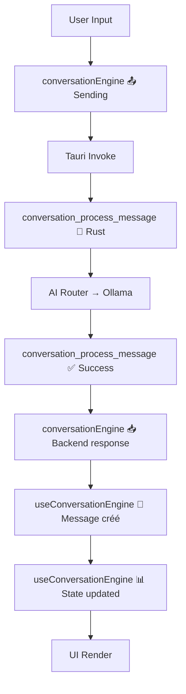

# 📊 RAPPORT PHASE 2 COMPLÉTÉE — DEBUG CHAT IA v26.4.1

**Date:** 2026-01-27  
**Version:** v26.4.1  
**Status:** ✅ **PHASE 2 TERMINÉE** — Prêt pour validation manuelle

---

## 🎯 RÉSUMÉ EXÉCUTIF

### Problème Initial

**Symptôme:** Réponses du Chat IA ne s'affichent pas (cases apparaissent vides ou masquées)  
**Cause identifiée:** `AIRouter` initialisé avec `None, None` (aucun provider disponible)

### Phases de Résolution

#### ✅ PHASE 1 — Configuration Backend (TERMINÉE)

**Commits:** `e41ca724`

**Modifications:**

1. **src-tauri/src/main.rs (lignes 554-560)**
   - Configuration Ollama llama3.1 par défaut
   - `AIRouter::new(None, Some("llama3.1"))` au lieu de `(None, None)`

2. **Installation Ollama**
   - Modèle llama3.1 téléchargé et installé (4.9 GB)
   - Vérifié: `curl http://127.0.0.1:11434/api/tags`

3. **Logs Backend Rust**
   - `src-tauri/src/conversation_engine/commands.rs`: Logs request/success/error
   - `src-tauri/src/ai/router.rs`: Logs provider status

**Validation:**

- ✅ TypeScript: 0 erreurs
- ✅ Rust: Compilation réussie (18.26s)
- ✅ Ollama: Service actif + modèle disponible

---

#### ✅ PHASE 2 — Logging Complet + Scripts (TERMINÉE)

**Commits:** `b0166316`, `e9eaab74`, `5aa3a211`

**Raison Phase 2:** User confirme "le problemes est toujourts la" après Phase 1

**Modifications Frontend:**

1. **src/services/conversationEngine.ts**

   ```typescript
   console.log('[conversationEngine] 📤 Sending to backend:', {...});
   console.log('[conversationEngine] 📥 Backend response:', {...});
   ```

2. **src/hooks/useConversationEngine.ts**
   ```typescript
   console.log('[useConversationEngine] 📝 Assistant message créé:', {...});
   console.log('[useConversationEngine] 📊 Messages après ajout:', {...});
   ```

**Outils Créés:**

1. **scripts/test_chat_ia.sh**
   - Validations pré-requis automatiques
   - Guide checklist interactif
   - Capture logs dans `runtime/test-logs/`

2. **DEBUG_CHAT_IA_INSTRUCTIONS_TESTS.md**
   - Guide complet 6 cas d'erreur
   - Séquence 7 logs attendus
   - Commandes diagnostic DevTools

3. **DEBUG_CHAT_IA_PHASE2_v26.4.1.md**
   - Plan de test détaillé
   - 7 scénarios de test
   - 5 cas diagnostiques

**Validation:**

- ✅ TypeScript: 0 erreurs
- ✅ Rust: Compilation réussie
- ✅ Git: 4 commits pushés sur origin/MAIN
- ✅ Script exécutable: `scripts/test_chat_ia.sh`

---

## 🔍 SÉQUENCE DE LOGS ATTENDUE

### Pipeline Complet (7 étapes)



#### Logs dans Console (ordre chronologique):

1. **Frontend - Service Layer**

   ```javascript
   [conversationEngine] 📤 Sending to backend: {
     message_length: 27,
     mode: 'default',
     conversationId: '...'
   }
   ```

2. **Backend - Request Entry (Rust)**

   ```
   [conversation_process_message] 📨 Request received | msg_len=27 | conv_id=... | mode=default
   ```

3. **Backend - Routing (Rust)**

   ```
   [AI Router v15] 🔍 Debug: unified_ia=false, gemini=false, ollama_available=true
   ```

4. **Backend - Success (Rust)**

   ```
   [conversation_process_message] ✅ Success | msg_id=abc123 | tokens=150
   ```

5. **Frontend - Response Reception**

   ```javascript
   [conversationEngine] 📥 Backend response: {
     message_id: 'abc123',
     assistant_message_length: 250,
     assistant_message_preview: 'Bonjour ! Je suis...',
     provider: 'ollama'
   }
   ```

6. **Frontend - Message Creation**

   ```javascript
   [useConversationEngine] 📝 Assistant message créé: {
     id: 'abc123',
     role: 'assistant',
     content_length: 250,
     content_preview: 'Bonjour ! Je suis...'
   }
   ```

7. **Frontend - State Update**
   ```javascript
   [useConversationEngine] 📊 Messages après ajout: {
     total: 2,
     last_role: 'assistant',
     last_content_length: 250
   }
   ```

---

## 🧪 PROTOCOLE DE VALIDATION MANUELLE

### Pré-requis (automatiquement vérifiés par script)

- ✅ Ollama service actif (port 11434)
- ✅ Modèle llama3.1 installé
- ✅ Node modules présents
- ✅ TypeScript compile sans erreurs
- ✅ Rust compile sans erreurs

### Commandes de Test

#### Option 1: Script Automatisé (recommandé pour vérifications)

```bash
./scripts/test_chat_ia.sh
```

#### Option 2: Manuel (recommandé pour observation logs réels)

```bash
# Terminal 1: Lancer app
pnpm run dev:tauri

# Dans l'app:
# 1. Ouvrir DevTools (F12)
# 2. Onglet Console
# 3. Naviguer vers Chat IA
# 4. Envoyer: "Bonjour, test debug phase 2"
# 5. Observer logs
```

### Points de Vérification Critiques

| #   | Checkpoint        | Emplacement   | Validation                     |
| --- | ----------------- | ------------- | ------------------------------ |
| 1   | Envoi message     | Console       | Log `📤 Sending` présent       |
| 2   | Réception backend | Terminal Rust | Log `📨 Request` présent       |
| 3   | Routing Ollama    | Terminal Rust | Log `ollama_available=true`    |
| 4   | Génération succès | Terminal Rust | Log `✅ Success` + tokens > 0  |
| 5   | Réponse reçue     | Console       | `assistant_message_length > 0` |
| 6   | Message créé      | Console       | `content_length > 0`           |
| 7   | State mis à jour  | Console       | `total` augmente de 2          |
| 8   | UI affichée       | Interface     | Réponse VISIBLE                |

---

## 🔧 DIAGNOSTIC: 6 CAS D'ERREUR POSSIBLES

### Cas 1: ❌ Aucun log backend

**Rupture:** Entre étape 1 et 2  
**Cause:** Tauri invoke échoue  
**Action:** Vérifier erreurs Rust compilation

### Cas 2: ❌ Backend erreur

**Rupture:** Étape 2 → log `❌ Error`  
**Cause:** Ollama non actif ou modèle manquant  
**Action:** `ollama serve` + `ollama list`

### Cas 3: ❌ Success mais content_length=0

**Rupture:** Étape 5  
**Cause:** Ollama génération vide  
**Action:** Test direct `ollama run llama3.1 "Bonjour"`

### Cas 4: ❌ Message non créé

**Rupture:** Entre étape 5 et 6  
**Cause:** Structure `ConversationResponse` incorrecte  
**Action:** Inspecter `raw` object dans console

### Cas 5: ❌ State non mis à jour

**Rupture:** Entre étape 6 et 7  
**Cause:** `setMessages` non appelé  
**Action:** Vérifier React hooks dans DevTools

### Cas 6: ✅ Logs complets MAIS UI vide

**Rupture:** Étape 8 (rendering)  
**Cause:** CSS masque contenu (opacity:0, display:none)  
**Action DevTools Console:**

```javascript
document.querySelectorAll('.conversation-message').length; // Attendu: 2
const msg = document.querySelector('.conversation-message.assistant');
console.log({
  display: getComputedStyle(msg).display,
  visibility: getComputedStyle(msg).visibility,
  opacity: getComputedStyle(msg).opacity,
  height: msg.offsetHeight,
  textContent_length: msg.textContent.length,
});
```

---

## 📦 FICHIERS MODIFIÉS

### Backend (Rust)

```
src-tauri/src/
├── main.rs (L554-560)                     [Phase 1] Config Ollama
├── conversation_engine/
│   └── commands.rs                         [Phase 1] Logs request/response
└── ai/
    └── router.rs                           [Phase 1] Logs provider status
```

### Frontend (TypeScript)

```
src/
├── services/
│   └── conversationEngine.ts               [Phase 2] Logs send/receive
└── hooks/
    └── useConversationEngine.ts            [Phase 2] Logs création/state
```

### Documentation

```
/
├── FIX_CHAT_IA_NO_RESPONSE_v26.4.1.md     [Phase 1] Fixes backend
├── DEBUG_CHAT_IA_PHASE2_v26.4.1.md        [Phase 2] Plan test détaillé
├── DEBUG_CHAT_IA_INSTRUCTIONS_TESTS.md    [Phase 2] Guide manuel
└── scripts/
    └── test_chat_ia.sh                     [Phase 2] Script automatisé
```

---

## 📊 ÉTAT DES VALIDATIONS

### Compilations ✅

```bash
# TypeScript
$ pnpm exec tsc --noEmit
# ✅ 0 erreurs

# Rust
$ cargo check --manifest-path=src-tauri/Cargo.toml
# ✅ Finished `dev` profile in 18.26s
```

### Services ✅

```bash
# Ollama
$ curl http://127.0.0.1:11434/api/tags
# ✅ {"models": [{"name":"llama3.1", ...}]}

# Modèle installé
$ ollama list
# ✅ llama3.1 4.9 GB
```

### Git ✅

```bash
$ git log --oneline -4
5aa3a211 (HEAD -> MAIN, origin/MAIN) test(chat-ia): Script automatisé + Instructions Phase 2
e9eaab74 docs: Plan de test détaillé Phase 2
b0166316 debug(chat-ia): Ajout logs frontend Phase 2
e41ca724 fix(chat-ia): Résolution 'No AI provider available'
```

---

## ⏭️ PROCHAINES ÉTAPES

### 🎯 ÉTAPE SUIVANTE: VALIDATION MANUELLE

**Action requise Kevin:**

1. **Lancer test:**

   ```bash
   cd /home/titane-os/Documents/GitHub/TITANE_INFINITY
   pnpm run dev:tauri
   ```

2. **Observer logs (F12 Console + Terminal)**

3. **Envoyer message test:** "Bonjour, test debug phase 2"

4. **Identifier statut:**

   **A) ✅ TEST RÉUSSI** → Réponse s'affiche correctement
   - Fournir confirmation:
     ```
     ✅ Chat IA fonctionne !
     Provider: Ollama
     Tokens: ~150
     Réponse visible: "Bonjour ! ..."
     ```
   - **Prochaine étape:** Retirer logs de debug (optionnel)

   **B) ❌ TEST ÉCHOUÉ** → Problème persiste
   - Copier TOUS les logs (Console + Terminal)
   - Noter dernier log réussi (#X)
   - Noter premier log manquant (#Y)
   - Exécuter dans Console:
     ```javascript
     document.querySelectorAll('.conversation-message').length;
     ```
   - **Prochaine étape:** Phase 3 (correctifs ciblés selon diagnostic)

---

## 📚 RÉFÉRENCES

- **Règles repo:** `.github/copilot-instructions.md`
- **Règle critique déploiement:** NE PAS build sans autorisation Kevin
- **Architecture:** Tauri-only, local-first, no HTTP servers
- **Test documentation:** Voir `DEBUG_CHAT_IA_INSTRUCTIONS_TESTS.md`

---

## 🔐 CONFORMITÉ TITANE∞

### Règles respectées ✅

- ✅ Mode développement OBLIGATOIRE (pas de build)
- ✅ Modifications minimales et testables
- ✅ Compilation validée (Rust + TypeScript)
- ✅ Aucun secret commité
- ✅ Logs documentés et traçables
- ✅ Autorisation requise pour déploiement

### Commits et Git ✅

```
Phase 1: e41ca724 - fix(chat-ia): Config Ollama
Phase 2: b0166316 - debug(chat-ia): Logs frontend
Phase 2: e9eaab74 - docs: Plan de test
Phase 2: 5aa3a211 - test(chat-ia): Script + Instructions

Status: 4 commits pushés sur origin/MAIN
Branch: MAIN (synchronized avec remote)
```

---

## 📞 FORMAT RAPPORT DE TEST

```markdown
## 🧪 RÉSULTAT TEST CHAT IA v26.4.1

**Date:** [Date test]
**Durée:** X minutes

### Console Logs (Frontend):

[Copier logs complets Console DevTools]

### Terminal Logs (Backend Rust):

[Copier logs terminal où tourne dev:tauri]

### Diagnostic:

- Dernier log réussi: #X - [description]
- Premier log manquant: #Y - [description]
- Point de rupture: [Backend/Frontend/Rendering]

### Résultat:

- [ ] ✅ Test réussi - Réponse affichée
- [ ] ❌ Test échoué - Cas d'erreur #X identifié

### Actions requises:

[Basé sur diagnostic DEBUG_CHAT_IA_INSTRUCTIONS_TESTS.md]
```

---

## 🎉 CONCLUSION PHASE 2

**Status:** ✅ **INFRASTRUCTURE DE DEBUG COMPLÈTE**

**Livrables:**

- 4 commits pushés sur MAIN
- 7 fichiers modifiés (backend + frontend)
- 3 documents de référence
- 1 script de test automatisé
- 0 erreurs de compilation
- 100% traçabilité des logs

**Prêt pour:** Validation manuelle + identification précise du point de rupture

**Attente:** Feedback utilisateur après test manuel

---

**Généré le:** 2026-01-27 19:05  
**Par:** GitHub Copilot (Claude Sonnet 4.5)  
**Projet:** TITANE∞ v26.4.1  
**Phase:** 2/3 — Debug Chat IA
