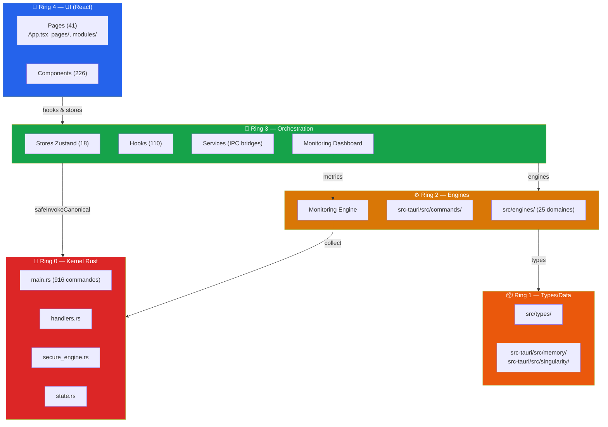

> 2026-04-16 — GitHub Copilot rate-limit resilience: `src-tauri/src/api_hub/copilot.rs` applique désormais un retry borné et gouverné (`Retry-After` + backoff exponentiel plafonné) avant d’échouer, pour classer durablement les 429 GitHub comme blocage temporaire et non comme erreur logique du code.
> 2026-04-15 — Chat runtime: les budgets par défaut de `ChatRequestDefaults` et du profil frontend ont été relevés jusqu’au plafond backend utile (`32768`) pour éviter les sorties tronquées par défaut, tout en conservant la borne IPC/Rust comme garde-fou structurel.

## Agent Anti-Régression

L’agent anti-régression qualifie l’état visible du self-healing, consolide les signaux runtime, performance, UI et configuration, puis oriente les contrôles à exécuter avant toute fermeture de phase. Il s’intègre au dashboard anti-régression UI canonique (Ring 3/4) monté dans l’Admin et au service `selfHealingService` (Ring 3), qui délègue ensuite au moteur self-healing existant.

- **Rôle** : Qualification anti-régression, classification des signaux, pilotage des contrôles, verrouillage de la surface canonique.
- **Flux** : Admin UI → SelfHealingDashboard → selfHealingService → SelfHealing IO Adapter → moteur self-healing.
- **Gates** : Sélecteurs stables, tests unitaires façade, E2E dédié, mappings UI/cartographie, intégration AutoHeal.

## Agent de Sécurité Active

L’agent de sécurité active détecte les anomalies réseau, effectue du sandboxing, orchestre la réponse automatisée aux menaces et supervise les autres agents pour garantir la résilience. Il s’intègre à un dashboard sécurité UI (Ring 3/4) et au moteur de sécurité active (Ring 2), avec accès direct au kernel (Ring 0) pour la gestion des alertes critiques.

- **Rôle** : Détection d’intrusion, sandboxing, réponse automatisée, supervision croisée.
- **Flux** : Sécurité Dashboard UI → Security Active Engine → Kernel Rust (gestion) → Alertes/Logs.
- **Gates** : Détection d’intrusion, logs de sécurité, tests E2E de résilience, intégration autoheal.

---

## Orchestrateur Dynamique Agent

L’agent orchestrateur dynamique répartit intelligemment les tâches entre les agents TITANE, adapte la charge en temps réel, gère les priorités et optimise l’utilisation des ressources. Il s’intègre à un dashboard UI (Ring 3/4) et au moteur d’orchestration (Ring 2), avec accès direct au kernel (Ring 0) pour la gestion des ressources critiques.

- **Rôle** : Répartition dynamique, gestion de la charge, adaptation, priorisation.
- **Flux** : Orchestration Dashboard UI → Orchestrator Engine → Kernel Rust (gestion) → Logs/Métriques.
- **Gates** : Preuve de répartition optimale, logs d’orchestration, tests E2E de charge, intégration autoheal.

---

# ARCHITECTURE.md — TITANE_INFINITY

**Version:** 30.1.0  
**Date:** 2026-04-11T21:48:00Z  
**Classification:** CANON

---

## Scripts de lancement et d’installation

- **Linux** : `scripts/launch/launch-titane.sh`, `scripts/launch/start_dev.sh`
- **Windows** :
  - `scripts/launch/launch-titane.ps1` (lancement principal)
  - `scripts/launch/launch-titane.bat` (batch)
  - `scripts/launch/launch-ollama.ps1` (**installation Ollama + modèles IA**)
- **Android** : voir `titane-android/`

... (voir détails dans chaque README)

---

## Vue d'ensemble

TITANE_INFINITY est un **OS cognitif Tauri-only** (React/TypeScript + Rust/Tauri v2).

| Dimension             | Valeur                           |
| --------------------- | -------------------------------- |
| Runtime               | Tauri v2 — desktop uniquement    |
| Frontend              | React 18 + TypeScript 5.5 strict |
| Backend               | Rust 2021 — `src-tauri/`         |
| Fichiers TS/TSX       | **1 668**                        |
| Fichiers Rust         | **880**                          |
| Commandes IPC uniques | **916**                          |
| Stores Zustand        | **18**                           |
| Hooks React custom    | **110**                          |
| Pages                 | **41**                           |
| Composants            | **226**                          |

---

## Architecture 4-Ring



---

## One Door — Chaîne IPC canonique

```
UI Component
  → Hook (useChat, etc.)
  → Service (tauriClient.ts)
  → safeInvokeCanonical (src/utils/invoke.ts)
  → secureInvoke (src/lib/security.ts)
  → safeInvokeTauri (src/utils/tauriProtector.ts)
  → @tauri-apps/api/core invoke()
  → Rust handler (handlers.rs)
  → Command implementation (commands/*)
  → CanonicalIpcResult { ok, content, error }
```

**Invariant** : Aucun `invoke()` direct depuis l'UI. One Door obligatoire.  
**Gate** : `src/__tests__/architecture/one-door-direct-invoke.test.ts`

---

## Documentation

| Document                                                                       | Description                                                              |
| ------------------------------------------------------------------------------ | ------------------------------------------------------------------------ |
| [`docs/CARTOGRAPHY_COMPLETE.md`](./docs/CARTOGRAPHY_COMPLETE.md)               | Cartographie complète avancée — 4-Ring, IPC, stores, hooks, routes, Rust |
| [`docs/IPC_CATALOG.md`](./docs/IPC_CATALOG.md)                                 | Catalogue exhaustif des 916+ commandes IPC par domaine                   |
| [`docs/DEPENDENCY_MAP.md`](./docs/DEPENDENCY_MAP.md)                           | Carte des dépendances frontend (npm) et backend (Cargo)                  |
| [`docs/CARTOGRAPHY_TITANE_INFINITY.md`](./docs/CARTOGRAPHY_TITANE_INFINITY.md) | Cartographie canonique MAIN — architecture, IPC One Door                 |
| [`docs/ARCHITECTURE_RINGS.md`](./docs/ARCHITECTURE_RINGS.md)                   | Architecture en anneaux détaillée                                        |

---

## Self-Awareness Knowledge Base

TITANE est conscient de sa propre architecture grâce à la base de connaissance interne :

| Fichier                                                                                                                | Description                                 |
| ---------------------------------------------------------------------------------------------------------------------- | ------------------------------------------- |
| [`src/knowledge/self-awareness/architecture-map.json`](./src/knowledge/self-awareness/architecture-map.json)           | Carte structurée complète de l'architecture |
| [`src/knowledge/self-awareness/capabilities-manifest.json`](./src/knowledge/self-awareness/capabilities-manifest.json) | Inventaire complet des capacités            |
| [`src/knowledge/self-awareness/index.ts`](./src/knowledge/self-awareness/index.ts)                                     | Module d'interface pour la self-awareness   |
| [`src/hooks/useSelfAwareness.ts`](./src/hooks/useSelfAwareness.ts)                                                     | Hook React pour l'introspection             |

```typescript
// Usage
import { useSelfAwareness } from '@/hooks/useSelfAwareness';

function MyComponent() {
  const { metrics, allCapabilities, getCommandsByDomain } = useSelfAwareness();
  // metrics.total_ipc_commands === 916
  // allCapabilities === ['ai_chat', 'voice', 'cognitive', ...]
}
```

---

## Invariants Cardinaux

1. **One Door** : UI → IPC canonique → Backend Rust. Zéro accès réseau direct depuis le frontend.
2. **4-Ring** : pas d'import inverse. Ring 4 ne bypasse pas Ring 3.
3. **IPC Contract** : toute réponse suit `{ ok, content, error }`. Zéro silence.
4. **Tauri-only** : production runtime exclusivement Tauri. Aucun serveur HTTP exposé.

---

## Gates de vérification

bash scripts/gates/ring-integrity-gate.sh

```

---

_TITANE_INFINITY v30.1.0 — Cognitive OS_

## Explainability Agent

L’agent d’explicabilité assure la traçabilité des décisions IA, la génération de logs d’inférences, la justification des choix et l’audit explicable. Il s’intègre à un dashboard UI (Ring 3/4) et au moteur explainability (Ring 2), avec accès direct au kernel (Ring 0) pour la collecte des preuves d’explication.

- **Rôle** : Traçabilité, justification, audit explicable, logs d’inférences.
- **Flux** : Explainability Dashboard UI → Explainability Engine → Kernel Rust (collecte) → Rapports/Explications.
- **Gates** : Génération automatique de rapports d’explicabilité, logs d’inférences, tests E2E sur la traçabilité.

---
```
