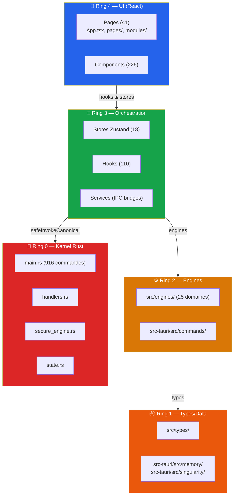

# ARCHITECTURE.md — TITANE_INFINITY

**Version:** 30.1.0  
**Date:** 2026-04-11T21:48:00Z  
**Classification:** CANON

---

## Vue d'ensemble

TITANE_INFINITY est un **OS cognitif Tauri-only** (React/TypeScript + Rust/Tauri v2).

| Dimension             | Valeur                           |
| --------------------- | -------------------------------- |
| Runtime               | Tauri v2 — desktop uniquement    |
| Frontend              | React 18 + TypeScript 5.5 strict |
| Backend               | Rust 2021 — `src-tauri/`         |
| Fichiers TS/TSX       | **1 668**                        |
| Fichiers Rust         | **880**                          |
| Commandes IPC uniques | **916**                          |
| Stores Zustand        | **18**                           |
| Hooks React custom    | **110**                          |
| Pages                 | **41**                           |
| Composants            | **226**                          |

---

## Architecture 4-Ring



---

## One Door — Chaîne IPC canonique

```
UI Component
  → Hook (useChat, etc.)
  → Service (tauriClient.ts)
  → safeInvokeCanonical (src/utils/invoke.ts)
  → secureInvoke (src/lib/security.ts)
  → safeInvokeTauri (src/utils/tauriProtector.ts)
  → @tauri-apps/api/core invoke()
  → Rust handler (handlers.rs)
  → Command implementation (commands/*)
  → CanonicalIpcResult { ok, content, error }
```

**Invariant** : Aucun `invoke()` direct depuis l'UI. One Door obligatoire.  
**Gate** : `src/__tests__/architecture/one-door-direct-invoke.test.ts`

---

## Documentation

| Document                                                                       | Description                                                              |
| ------------------------------------------------------------------------------ | ------------------------------------------------------------------------ |
| [`docs/CARTOGRAPHY_COMPLETE.md`](./docs/CARTOGRAPHY_COMPLETE.md)               | Cartographie complète avancée — 4-Ring, IPC, stores, hooks, routes, Rust |
| [`docs/IPC_CATALOG.md`](./docs/IPC_CATALOG.md)                                 | Catalogue exhaustif des 916+ commandes IPC par domaine                   |
| [`docs/DEPENDENCY_MAP.md`](./docs/DEPENDENCY_MAP.md)                           | Carte des dépendances frontend (npm) et backend (Cargo)                  |
| [`docs/CARTOGRAPHY_TITANE_INFINITY.md`](./docs/CARTOGRAPHY_TITANE_INFINITY.md) | Cartographie canonique MAIN — architecture, IPC One Door                 |
| [`docs/ARCHITECTURE_RINGS.md`](./docs/ARCHITECTURE_RINGS.md)                   | Architecture en anneaux détaillée                                        |

---

## Self-Awareness Knowledge Base

TITANE est conscient de sa propre architecture grâce à la base de connaissance interne :

| Fichier                                                                                                                | Description                                 |
| ---------------------------------------------------------------------------------------------------------------------- | ------------------------------------------- |
| [`src/knowledge/self-awareness/architecture-map.json`](./src/knowledge/self-awareness/architecture-map.json)           | Carte structurée complète de l'architecture |
| [`src/knowledge/self-awareness/capabilities-manifest.json`](./src/knowledge/self-awareness/capabilities-manifest.json) | Inventaire complet des capacités            |
| [`src/knowledge/self-awareness/index.ts`](./src/knowledge/self-awareness/index.ts)                                     | Module d'interface pour la self-awareness   |
| [`src/hooks/useSelfAwareness.ts`](./src/hooks/useSelfAwareness.ts)                                                     | Hook React pour l'introspection             |

```typescript
// Usage
import { useSelfAwareness } from '@/hooks/useSelfAwareness';

function MyComponent() {
  const { metrics, allCapabilities, getCommandsByDomain } = useSelfAwareness();
  // metrics.total_ipc_commands === 916
  // allCapabilities === ['ai_chat', 'voice', 'cognitive', ...]
}
```

---

## Invariants Cardinaux

1. **One Door** : UI → IPC canonique → Backend Rust. Zéro accès réseau direct depuis le frontend.
2. **4-Ring** : pas d'import inverse. Ring 4 ne bypasse pas Ring 3.
3. **IPC Contract** : toute réponse suit `{ ok, content, error }`. Zéro silence.
4. **Tauri-only** : production runtime exclusivement Tauri. Aucun serveur HTTP exposé.
5. **Online-first gouverné** : cloud providers via backend uniquement, fallback local obligatoire.

---

## Gates de vérification

```bash
bash scripts/verify_instructions.sh
bash scripts/autoheal/detect_recurrence.sh
bash scripts/gates/ring-integrity-gate.sh
pnpm run check
```

---

_TITANE_INFINITY v30.1.0 — Cognitive OS_
