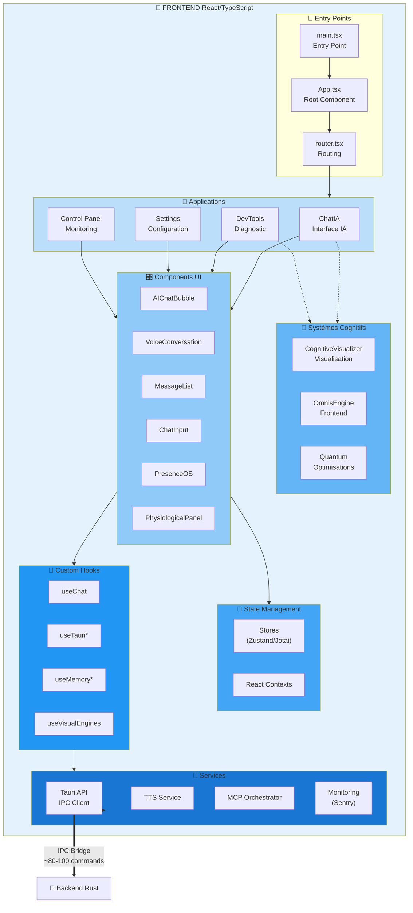
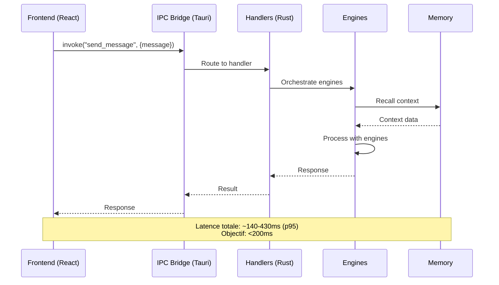
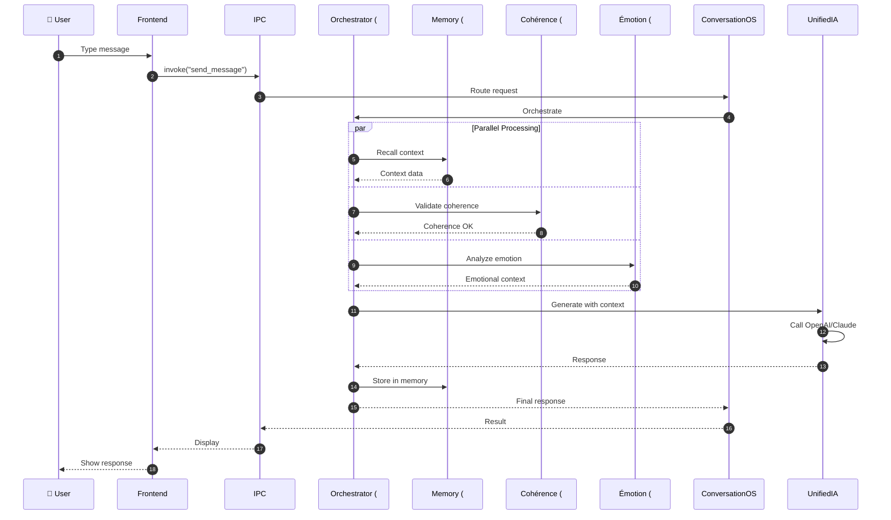

```mermaid
graph TB
    subgraph Backend["🦀 BACKEND Rust/Tauri"]
        subgraph Core["🚀 Core System"]
            MainRS["main.rs<br/>Entry Point"]
            LibRS["lib.rs<br/>Module Root"]
            Handlers["handlers.rs<br/>Request Router"]
        end
        
        subgraph Engines["🧠 MOTEURS COGNITIFS (10)"]
            Engine0["Moteur #0<br/>Orchestrator"]
            Engine1["Moteur #1<br/>Style"]
            Engine2["Moteur #2<br/>Cohérence"]
            Engine3["Moteur #3<br/>Réflexion"]
            Engine4["Moteur #4<br/>Émotion"]
            Engine5["Moteur #5<br/>Mémoire"]
            Engine6["Moteur #6<br/>Comportement"]
            Engine7["Moteur #7<br/>Adaptation"]
            EngineInf["Moteur #∞<br/>ConversationOS"]
            SingularityOS["Singularity<br/>Memory OS"]
        end
        
        subgraph Modules["🔄 MODULES AUTONOMES (5)"]
            Helios["Helios Core<br/>Monitoring"]
            Nexus["Nexus Engine<br/>Coordination"]
            Harmonia["Harmonia Core<br/>Audio/TTS"]
            Sentinel["Sentinel Core<br/>Security"]
            MemoryCore["Memory Core<br/>STM/MTM/LTM"]
        end
        
        subgraph IA["🤖 IA Systems"]
            UnifiedIA["UnifiedIAEngine<br/>OpenAI+Claude+Local"]
            ChatEngine["ChatEngine<br/>High-Perf v∞"]
            ConvEngine["ConversationEngine<br/>Pipeline Unified"]
            MultiAgents["Multi-Agents<br/>Permissions"]
            IAContext["IAContext<br/>Phase 8"]
        end
        
        subgraph Memory["💾 Memory System"]
            STM["STM<br/>Short-Term"]
            MTM["MTM<br/>Medium-Term"]
            LTM["LTM<br/>Long-Term (Disk)"]
            MemPersist["memory_persistence.rs"]
            MemCompact["memory_compactor.rs"]
        end
        
        subgraph Health["🛡️ System Health"]
            SelfHeal["self_repair/<br/>Auto-Healing"]
            Watchdog["watchdog/<br/>Monitoring"]
            BackendTest["backend_selftest.rs"]
            SystemCenter["system_center/<br/>Observability"]
        end
        
        subgraph Advanced["🌌 Advanced Systems"]
            HyperIA["hyper_intelligence/<br/>14 commands"]
            HyperVision["hypervision/"]
            NeuroSymbolic["neuro_symbolic/<br/>6 commands"]
            Adaptive["adaptive/<br/>v21"]
            Evolution["evolution/"]
            Introspection["introspection/"]
        end
        
        subgraph Creation["🎨 Creation & Generation"]
            DocEngine["doc_engine/<br/>Documents"]
            Narrative["narrative/<br/>v22"]
            RealityRender["reality_renderer/<br/>3D"]
            DesignCenter["design_center/"]
        end
        
        subgraph Infrastructure["⚙️ Infrastructure"]
            Profiling["profiling/<br/>IPC Profiler v19.5.0"]
            QA["qa/<br/>v19.8"]
            Persistence["persistence/<br/>v∞.MPE"]
            Cluster["cluster/<br/>Node-Cluster"]
            Knowledge["knowledge/<br/>KB Fusion"]
            Security["security/<br/>Crypto"]
        end
        
        MainRS --> LibRS
        MainRS --> Handlers
        
        Handlers --> Engines
        Handlers --> Modules
        Handlers --> IA
        
        Engine0 -.->|"Orchestre"| Engine1
        Engine0 -.->|"Orchestre"| Engine2
        Engine0 -.->|"Orchestre"| Engine3
        Engine0 -.->|"Orchestre"| Engine4
        Engine0 -.->|"Orchestre"| Engine5
        Engine0 -.->|"Orchestre"| Engine6
        Engine0 -.->|"Orchestre"| Engine7
        Engine0 -.->|"Orchestre"| EngineInf
        
        Nexus -.->|"Coordonne"| Engines
        
        Engine5 --> Memory
        MemoryCore --> Memory
        
        Helios --> SystemCenter
        Sentinel --> Security
        
        IA --> Engines
        ChatEngine --> ConvEngine
        ConvEngine --> EngineInf
        
        Modules --> Health
        Health --> BackendTest
        
        Profiling -.->|"Mesure"| Handlers
    end
    
    FrontendIPC["🎨 Frontend"] ==>|"~80-100 commands"| Handlers
    
    style Backend fill:#fff3e0
    style Core fill:#ffe0b2
    style Engines fill:#ffcc80
    style Modules fill:#ffb74d
    style IA fill:#ffa726
    style Memory fill:#ff9800
    style Health fill:#fb8c00
    style Advanced fill:#f57c00
    style Creation fill:#ef6c00
    style Infrastructure fill:#e65100
```

# 🏗️ ARCHITECTURE DÉTAILLÉE TITANE_INFINITY v19.5.2
**Date :** 6 Décembre 2025  
**Phase :** Phase 1 - Étape 1.3  
**Version :** Architecture v∞.19.5.2Ω

---

## 📊 VUE D'ENSEMBLE

### Architecture Globale : Desktop App Hybride (Tauri)

```
┌─────────────────────────────────────────────────────────────┐
│  TITANE INFINITY v19.5.2 — Application Desktop             │
│  Tauri 2.0 (Rust + React/TypeScript)                       │
│  Local-First AI | Privacy | Cognitive Architecture         │
└─────────────────────────────────────────────────────────────┘
         │
         ├─── Frontend (React/TS) ────> 1074 fichiers
         │    ├─── Apps (Chat, DevTools, Settings)
         │    ├─── Components (~100-200)
         │    ├─── Hooks (~30-50)
         │    └─── State Management
         │
         ├─── IPC Bridge (Tauri) ────> ~80-100 commands
         │    ├─── Request/Response
         │    ├─── Events (streaming potentiel)
         │    └─── Performance Profiler v19.5.0
         │
         └─── Backend (Rust) ────> 502 fichiers
              ├─── 30+ Modules
              ├─── 10 Moteurs Cognitifs
              ├─── 5 Modules Autonomes
              └─── Système Auto-Heal
```

---

## 🎨 FRONTEND — React/TypeScript

### Diagramme Complet



### Apps Frontend Détaillées

#### 1. ChatIA (Interface Conversationnelle)

**Localisation :** `src/app/`, `src/features/chat/`, `src/pages/ChatPage.tsx`

**Composants principaux :**
- `AIChatBubble.tsx` — Bulle de chat animée
- `ChatInput.tsx` — Input avec voice mode
- `MessageList.tsx` — Liste des messages optimisée
- `VoiceConversation.tsx` — Mode vocal

**State :**
- Messages (historique)
- Current conversation
- Voice mode status
- AI provider (OpenAI/Claude/Local)

**Hooks :**
- `useChat` — Gestion conversation
- `useChatCore` — Logique métier
- `useChatMemory` — Mémoire contextuelle

**IPC Commands utilisées :**
- `send_message`
- `stream_response` (potentiel)
- `get_conversation_history`
- `recall_memory`

---

#### 2. DevTools (Outils Développement)

**Localisation :** `src/app/DevTools/`, `src/components/devtools/`

**Panneaux identifiés :**
- **Performance Monitor** — IPC Profiler v19.5.0
- **System Health** — CPU, RAM, Disk
- **Memory Inspector** — STM/MTM/LTM
- **Cognitive Visualizer** — Moteurs cognitifs
- **Self-Healing Dashboard** — Auto-repair status
- **Logs Viewer** — System logs

**IPC Commands utilisées :**
- `get_profiling_data`
- `get_system_metrics`
- `get_memory_stats`
- `run_diagnostics`
- `get_logs`

---

#### 3. Settings (Configuration)

**Localisation :** `src/app/Settings/`, `src/pages/SettingsPage.tsx`

**Sections :**
- General (language, theme)
- AI Providers (API keys)
- Audio/TTS
- Memory (STM/MTM/LTM limits)
- Security

**IPC Commands utilisées :**
- `get_runtime_config`
- `set_runtime_config`
- `validate_api_key`

---

#### 4. Control Panel (Tableau de Bord)

**Localisation :** `src/components/ControlPanel/`

**Widgets :**
- System status
- Active engines
- Performance graphs
- Memory usage
- IPC latency

---

### State Management

**Bibliothèques détectées :**
- Zustand (probable) ou Jotai
- React Context API (contexts/)

**Stores principaux :**
- `chatStore` — Messages, conversations
- `systemStore` — System state
- `settingsStore` — User preferences
- `memoryStore` — Memory context

---

### Custom Hooks

**Localisation :** `src/hooks/`

**Hooks identifiés :**
- `useChat.ts` — Gestion chat (ESLint warnings détectées)
- `useVisualEngines` — Visualisation engines
- `useChatCore` — Core chat logic
- `useChatMemory` — Memory recall
- Probablement : `useTauri`, `useInvoke`, `useListen`

---

## 🦀 BACKEND — Rust/Tauri

### Diagramme Complet



---

## 🔄 ARCHITECTURE DES COMPOSANTS

### 1. Moteurs Cognitifs (10 composants)

#### Moteur #0 — Orchestrator (Meta-Orchestrator)

**Localisation :** `src-tauri/src/meta_orchestrator/`

**Responsabilité :**
- Coordination des 9 autres moteurs
- Stratégie d'exécution (séquentiel/parallèle)
- Load balancing

**Connexions :**
- → Tous les autres moteurs (1→8)
- ← Frontend (via IPC)

---

#### Moteur #1 — Style

**Localisation :** `src-tauri/src/engines/` (hypothèse)

**Responsabilité :**
- Adaptation du style de réponse
- Ton, formalité, personnalité

---

#### Moteur #2 — Cohérence

**Localisation :** `src-tauri/src/engines/`

**Responsabilité :**
- Validation cohérence logique
- Détection contradictions
- Suggestions corrections

**⚠️ FUSION RECOMMANDÉE (Phase 2) :**
- **Fusionner avec Nexus Engine** → `CoherenceEngine`

---

#### Moteur #3 — Réflexion

**Localisation :** `src-tauri/src/cognitive/`

**Responsabilité :**
- Analyse réflexive
- Meta-cognition

---

#### Moteur #4 — Émotion

**Localisation :** `src-tauri/src/emotion/`

**Responsabilité :**
- Détection état émotionnel
- Adaptation empathique

---

#### Moteur #5 — Mémoire

**Localisation :** `src-tauri/src/memory/`

**Responsabilité :**
- Gestion STM/MTM/LTM
- Recall contextuel

**⚠️ FUSION RECOMMANDÉE (Phase 2) :**
- **Fusionner avec Memory Core + Singularity** → `UnifiedMemory`

---

#### Moteur #6 — Comportement

**Localisation :** `src-tauri/src/adaptive/` (hypothèse)

**Responsabilité :**
- Adaptation comportementale
- Patterns d'interaction

---

#### Moteur #7 — Adaptation

**Localisation :** `src-tauri/src/evolution/`

**Responsabilité :**
- Évolution adaptative
- Apprentissage

---

#### Moteur #∞ — ConversationOS

**Localisation :** `src-tauri/src/conversation_engine/`

**Responsabilité :**
- Pipeline unifié de conversation
- Memory map integration
- Self-healing conversationnel

---

#### Singularity Memory OS

**Localisation :** `src-tauri/src/singularity/`, `src-tauri/src/singularity_state/`

**Responsabilité :**
- OS mémoire avancé
- Compression intelligente
- Promotion automatique (STM→MTM→LTM)

---

### 2. Modules Autonomes (5 composants)

#### Helios Core — Monitoring

**Localisation :** `src-tauri/src/modules/` (hypothèse) ou `src-tauri/src/system/`

**Responsabilité :**
- CPU, RAM, Disk monitoring
- Métriques système
- Alertes performance

**Connexions :**
- → System Center
- → DevTools (frontend)

**⚠️ FUSION RECOMMANDÉE (Phase 2) :**
- **Fusionner avec Sentinel** → `SystemHealth`

---

#### Nexus Engine — Coordination

**Localisation :** `src-tauri/src/modules/` ou `src-tauri/src/meta_orchestrator/`

**Responsabilité :**
- Coordination inter-moteurs
- Optimisation execution plans
- Parallel scheduling

**Connexions :**
- ← Moteur #0 (Orchestrator)
- → Tous les moteurs

**⚠️ FUSION RECOMMANDÉE (Phase 2) :**
- **Fusionner avec Moteur #2** → `CoherenceEngine`

---

#### Harmonia Core — Audio/TTS

**Localisation :** `src-tauri/src/harmonia_engine.rs`, `src-tauri/src/audio/`, `src-tauri/src/tts/`

**Responsabilité :**
- Audio processing
- Text-to-Speech
- Voice synthesis
- Wakeword detection

**Commands :**
- `synthesize_speech`
- `play_audio`
- `start_recording`
- `stop_recording`

**Connexions :**
- ← Voice Conversation (frontend)
- → Audio devices

---

#### Sentinel Core — Security

**Localisation :** `src-tauri/src/security/`, `src-tauri/src/secure_engine.rs`, `src-tauri/src/secure_commands.rs`

**Responsabilité :**
- Input validation
- Encryption (AES-GCM)
- Hashing (SHA-2)
- Signatures (Ed25519)
- Password hashing (Argon2)
- Audit logs

**Connexions :**
- → Tous les commands (validation)
- → Audit logs

**⚠️ FUSION RECOMMANDÉE (Phase 2) :**
- **Fusionner avec Helios** → `SystemHealth`

---

#### Memory Core — STM/MTM/LTM

**Localisation :** `src-tauri/src/memory/`, `src-tauri/src/memory_persistence.rs`, `src-tauri/src/memory_compactor.rs`

**Responsabilité :**
- Short-Term Memory (in-memory)
- Medium-Term Memory (in-memory with limits)
- Long-Term Memory (disk-based, sled DB)
- Compaction
- Persistence

**Structure :**
```rust
STM  → HashMap<String, MemoryEntry>  (limit: 100 entries)
MTM  → HashMap<String, MemoryEntry>  (limit: 1000 entries)
LTM  → sled::Db (unlimited, on-disk)
```

**Commands :**
- `store_memory`
- `recall_memory`
- `search_memory`
- `promote_memory` (STM→MTM→LTM)
- `compact_memory`

**⚠️ FUSION RECOMMANDÉE (Phase 2) :**
- **Fusionner avec Moteur #5 + Singularity** → `UnifiedMemory`

---

### 3. IA Systems

#### UnifiedIAEngine (v19.3Ω)

**Localisation :** `src-tauri/src/ia/`

**Responsabilité :**
- Multiplexing AI providers :
  - OpenAI GPT-4
  - Anthropic Claude
  - Google Gemini
  - Local Ollama
- Fallback automatique
- Load balancing

**Commands :**
- `send_ia_message`
- `select_ia_provider`
- `get_ia_status`

---

#### ChatEngine (High-Perf v∞)

**Localisation :** `src-tauri/src/chat_engine/`

**Responsabilité :**
- High-performance chat processing
- Streaming responses
- Message queue

---

#### ConversationEngine (Pipeline Unified)

**Localisation :** `src-tauri/src/conversation_engine/`

**Responsabilité :**
- Pipeline unifié :
  1. Parse message
  2. Recall memory
  3. Route to engines
  4. Generate response
  5. Store in memory
- Self-healing conversationnel

---

#### Multi-Agents (v19.3Ω)

**Localisation :** `src-tauri/src/multi_agents/`

**Responsabilité :**
- Gestion agents IA multiples
- Permissions granulaires
- Coordination agents

**Commands :**
- `create_agent`
- `set_agent_permissions`
- `list_agents`

---

### 4. Advanced Systems

#### HyperIntelligence

**Localisation :** `src-tauri/src/hyper_intelligence/`

**Commands (14 détectées) :**
- Commands dans `commands.rs`

---

#### NeuroSymbolic

**Localisation :** `src-tauri/src/neuro_symbolic/`

**Commands (6 détectées) :**
- `cognitive_adapter.rs`
- `context_mapper.rs`
- `fusion_core.rs`
- `reasoning_bridge.rs`
- `symbolic_adapter.rs`
- `neuro_symbolic_state.rs`

---

### 5. Self-Healing & Health

#### Self-Repair System

**Localisation :** `src-tauri/src/self_repair/`, `src-tauri/src/selfheal/`, `src-tauri/src/auto_heal.rs`

**Commands (6 détectées) :**
- `detector.rs` — Détection problèmes
- `regeneration.rs` — Régénération composants
- `integrity_map.rs` — Carte d'intégrité
- `fallback_recovery.rs` — Récupération fallback
- `repair_core.rs` — Core réparation
- `deep_rebuild.rs` — Rebuild profond

**Responsabilité :**
- Détection corruptions
- Auto-réparation
- Fallback automatique
- Rebuild si nécessaire

---

#### Watchdog Engine (v17)

**Localisation :** `src-tauri/src/watchdog/`

**Responsabilité :**
- Surveillance processes
- Détection deadlocks
- Auto-restart

---

#### System Center (Unified Observability)

**Localisation :** `src-tauri/src/system_center/`

**Commands détectées :**
- `logs.rs` (4 commands)
- `introspection.rs` (4 commands)
- `cluster.rs` (3 commands)

**Panneaux :**
- Logs centralisés
- Introspection système
- Cluster monitoring

---

## 🔌 IPC ARCHITECTURE

### Flux de Communication



### Tauri Commands Catégorisés

**Total : ~80-100 commands**

**Catégories :**

1. **Chat & IA (15 commands)**
   - `send_message`
   - `stream_response`
   - `send_ia_message`
   - `get_conversation_history`
   - etc.

2. **Memory (10 commands)**
   - `store_memory`
   - `recall_memory`
   - `search_memory`
   - `promote_memory`
   - `compact_memory`
   - etc.

3. **System & Monitoring (12 commands)**
   - `get_system_metrics`
   - `get_profiling_data`
   - `run_diagnostics`
   - `get_logs`
   - etc.

4. **Self-Healing (6 commands)**
   - `run_health_check`
   - `auto_repair`
   - `detect_issues`
   - `regenerate_component`
   - etc.

5. **HyperIntelligence (14 commands)**
   - Commands dans `hyper_intelligence/commands.rs`

6. **NeuroSymbolic (6 commands)**
   - Commands répartis dans 6 fichiers

7. **Numeric Twin (8 commands)**
   - Commands dans `numeric_twin/twin_commands.rs`

8. **Audio/TTS (5 commands)**
   - `synthesize_speech`
   - `play_audio`
   - `start_recording`
   - etc.

9. **Multi-Agents (5 commands)**
   - `create_agent`
   - `set_agent_permissions`
   - etc.

10. **Misc (15+ commands)**
    - Configuration
    - Runtime
    - Time-travel
    - etc.

---

### IPC Performance

**Profiler intégré :** ✅ `profiling/` (v19.5.0)

**Métrique actuelle (documentée) :**
- **p95 latency :** ~140ms (v19.5.2 documentation)
- **Objectif :** <200ms

**⚠️ Overhead potentiel :**
- 80-100 commands synchrones
- Request/Response bloquant
- Pas de streaming natif (à confirmer)

**Recommandation Phase 2.5 :**
- Implémenter **Streaming IPC** via Tauri Events
- Réduire Time-to-First-Byte (TTFB)
- Objectif : TTFB <50ms

---

## 🎯 ANALYSE CRITIQUE

### Redondances Identifiées

#### 1. Mémoire Fragmentée (3 composants)

**Composants :**
- Moteur #5 (Mémoire)
- Memory Core
- Singularity Memory OS

**Recommandation :** ✅ **FUSION → UnifiedMemory**

**Architecture cible :**
```rust
UnifiedMemory {
    STM: HashMap<String, MemoryEntry>,
    MTM: HashMap<String, MemoryEntry>,
    LTM: sled::Db,
    promotion_engine: PromotionEngine,
    compaction_engine: CompactionEngine,
}
```

---

#### 2. Cohérence + Coordination (2 composants)

**Composants :**
- Moteur #2 (Cohérence)
- Nexus Engine (Coordination)

**Recommandation :** ✅ **FUSION → CoherenceEngine**

**Responsabilités fusionnées :**
- Validation cohérence
- Coordination moteurs
- Optimisation plans d'exécution

---

#### 3. Santé Système (2+ composants)

**Composants :**
- Helios Core (Monitoring)
- Sentinel Core (Security)
- Self-Heal System (Auto-réparation)

**Recommandation :** ✅ **FUSION → SystemHealth**

**Responsabilités fusionnées :**
- Monitoring système
- Security validation
- Auto-healing
- Watchdog

---

### Charge Cognitive

**Loi de Miller (7±2) :**
- **Composants actuels :** 14+ (10 moteurs + 5 modules)
- **Optimal :** 5-9 composants
- **Surcharge :** +56%

**Après fusions (Phase 2) :**
- **Composants cibles :** 9
  - Orchestrator
  - Style
  - CoherenceEngine (fusion Cohérence + Nexus)
  - Réflexion
  - Émotion
  - UnifiedMemory (fusion Mémoire + Memory Core + Singularity)
  - Comportement
  - Adaptation
  - SystemHealth (fusion Helios + Sentinel + SelfHeal)

---

## 📊 FLUX DE DONNÉES

### Exemple : Requête Utilisateur



---

## 🏁 CONCLUSION ARCHITECTURE

### Points Forts ✅

1. **Modularité claire** — 30+ modules bien séparés
2. **Séparation Frontend/Backend** — Tauri IPC bien structuré
3. **Profiling intégré** — IPC Profiler v19.5.0
4. **Self-Healing** — System de réparation automatique
5. **Multi-AI** — Support OpenAI, Claude, Local
6. **Memory avancée** — STM/MTM/LTM avec promotion

### Points d'Amélioration ⚠️

1. **Sur-modularité** — 14 composants vs 9 optimal
2. **Redondances** — 3 systèmes mémoire, 2 coordination
3. **IPC overhead** — 80-100 commands synchrones
4. **Pas de streaming** — Request/response bloquant
5. **Charge cognitive** — +56% au-dessus de l'optimal

### Actions Phase 2 🚀

1. **Fusion CoherenceEngine** — Cohérence + Nexus
2. **Fusion UnifiedMemory** — Mémoire + MemoryCore + Singularity
3. **Fusion SystemHealth** — Helios + Sentinel + SelfHeal
4. **Streaming IPC** — Réduire latence perçue
5. **Optimisation commands** — Réduire de 80-100 à 50-60

**Résultat attendu :**
- 9 composants cohérents
- Latence IPC <200ms
- Charge cognitive optimale
- Architecture maintenable

---

**✅ ÉTAPE 1.3 COMPLÈTE**

**Livrable :** `ARCHITECTURE_CURRENT_DETAILED.md` créé  
**Durée :** 1 heure  
**Next :** PROMPT #4 — Baseline Performance

---

*Architecture analysée le 6 Décembre 2025*  
*TITANE_INFINITY v19.5.2 — Phase 1*
