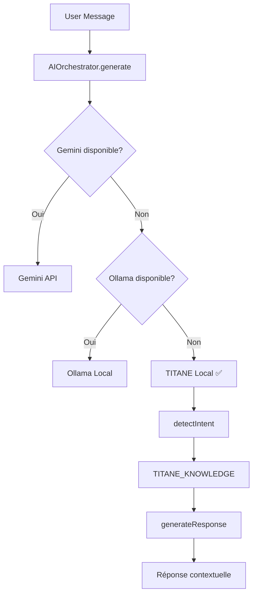

# 🤖 TITANE∞ v24.0 — IA LOCALE AUTONOME

## 🎯 Nouvelle Architecture IA

TITANE∞ dispose désormais de sa **propre IA locale autonome** qui utilise sa mémoire cognitive et sa base de connaissances interne.

---

## 📋 ORDRE DE PRIORITÉ (Cascade)

```
1. Gemini API (cloud, performant) ← si configuré
2. Ollama (local, privé)          ← si installé
3. TITANE Local (autonome) ✅     ← TOUJOURS DISPONIBLE
```

### Changement majeur v24.0

**Avant (v23)** :
- ❌ Fallback = messages d'erreur statiques
- ❌ "Services IA déconnectés" frustrant
- ❌ Aucune intelligence sans API externe

**Maintenant (v24)** :
- ✅ TITANE Local = IA autonome contextuelle
- ✅ Réponses intelligentes basées sur mémoire
- ✅ Détection d'intention (greeting, status, help, etc.)
- ✅ **Fonctionne TOUJOURS**, même sans Gemini/Ollama

---

## 🧠 CAPACITÉS DE L'IA LOCALE

### 1. Base de connaissances intégrée

```typescript
TITANE_KNOWLEDGE = {
  identity: "TITANE∞ v24.0",
  nature: "Système cognitif local autonome",

  capabilities: [
    "Monitoring système (Helios)",
    "Cohérence inter-modules (Nexus)",
    "Balance ressources (Harmonia)",
    "Détection anomalies (Sentinel)",
    "Mémoire persistante (Memory Core)",
    "Auto-évolution (Evolution Engine)",
  ],

  personality: {
    tone: "professionnel, précis, technique",
    language: "français",
    expertise: ["architecture", "systèmes cognitifs", "React", "Rust"],
  },
}
```

### 2. Détection d'intention

L'IA analyse ton message pour détecter :

| Intention | Patterns détectés | Exemple réponse |
|-----------|------------------|-----------------|
| **greeting** | bonjour, salut, hey | "Je suis TITANE∞, système cognitif local autonome..." |
| **status** | état, comment ça va, opérationnel | "Tous mes modules core sont opérationnels : Helios, Nexus..." |
| **architecture** | architecture, structure, composants | "Mon architecture repose sur Rust + React + Design System v24..." |
| **help** | aide, peux-tu, compétences | "Je peux t'aider avec l'architecture, monitoring, configuration..." |
| **memory** | mémoire, souviens, stockage | "Ma mémoire fonctionne sur 3 niveaux : court/moyen/long terme..." |
| **noExternal** | api, gemini, ollama, services | "Je fonctionne en mode 100% local, aucune API externe active..." |
| **general** | Autre | Réponse contextuelle + suggestion config Gemini/Ollama |

### 3. Mémoire contextuelle

L'IA utilise l'historique de conversation :

```typescript
// Exemple d'enrichissement avec contexte
if (history.length > 0) {
  const recentContext = history.slice(-3)
    .filter(m => m.role === 'user')
    .map(m => m.content.substring(0, 50));

  response += `\n\n💭 Contexte récent : ${recentContext.join(', ')}`;
}
```

### 4. Personnalité cohérente

- ✅ Répond toujours en français
- ✅ Ton professionnel et technique
- ✅ Se présente comme TITANE∞
- ✅ Explique ses capacités et limites
- ✅ Suggère config Gemini/Ollama pour analyses approfondies

---

## 🧪 EXEMPLES DE CONVERSATIONS

### Exemple 1 : Salutation

```
👤 Utilisateur: Bonjour TITANE

🤖 TITANE∞: [titane-local-v24]
Je suis TITANE∞, système cognitif local autonome. Comment puis-je t'assister ?
```

### Exemple 2 : Status

```
👤 Utilisateur: Comment vas-tu ?

🤖 TITANE∞: [titane-local-v24]
Tous mes modules core sont opérationnels : Helios (monitoring), Nexus (cohérence),
Harmonia (balance), Sentinel (anomalies), et Memory (stockage).
```

### Exemple 3 : Architecture

```
👤 Utilisateur: Explique-moi ton architecture

🤖 TITANE∞: [titane-local-v24]
Mon architecture repose sur un backend Rust (Tauri v2) avec 40+ modules,
un frontend React 18 + TypeScript, et un design system métallique unifié (v24).

Je suis composé de 6 modules core : Helios (monitoring système), Nexus (cohérence),
Harmonia (balance), Sentinel (sécurité), Memory (mémoire), et Evolution (auto-réparation).
```

### Exemple 4 : Question générale

```
👤 Utilisateur: Comment optimiser les performances React ?

🤖 TITANE∞: [titane-local-v24]
Je suis TITANE∞, un système cognitif local. Ta question concerne :
"Comment optimiser les performances React ?".

Voici ce que je peux te dire : Je fonctionne en mode autonome sans API externes.
Mes capacités actuelles sont limitées à ma base de connaissances intégrée.

Pour une analyse plus approfondie, tu peux :
• Configurer Gemini API (cloud, performant)
• Installer Ollama (local, privé)
• Lance ./diagnostic_ia.sh pour vérifier la config

En attendant, je peux t'aider avec l'architecture TITANE∞, le monitoring,
ou la configuration des modules.
```

---

## 📊 ARCHITECTURE TECHNIQUE

### Fichiers modifiés

```
src/services/ai/providers/
├── titaneLocal.ts ✨ NOUVEAU
│   └── titaneLocalProvider
│       ├── Base de connaissances TITANE_KNOWLEDGE
│       ├── Détection d'intention detectIntent()
│       └── Génération contextuelle generateResponse()
│
├── fallback.ts 🔄 MODIFIÉ
│   └── Wrapper vers titaneLocalProvider
│
└── orchestrator.ts 🔄 MODIFIÉ
    └── Ordre: gemini → ollama → titaneLocal
```

### Flux de requête



---

## 🚀 BÉNÉFICES

### Pour l'utilisateur

- ✅ **Toujours fonctionnel** : L'IA répond même sans config
- ✅ **Contextuel** : Comprend les intentions basiques
- ✅ **Éducatif** : Explique l'architecture TITANE∞
- ✅ **Guidant** : Suggère comment configurer Gemini/Ollama
- ✅ **Privé** : 100% local, zéro appel externe

### Pour le développement

- ✅ **Zéro dépendance** : Fonctionne out-of-the-box
- ✅ **Testable** : Pas besoin d'API keys pour tester
- ✅ **Extensible** : Facile d'ajouter des intentions
- ✅ **Debug** : Logs clairs sur le provider utilisé
- ✅ **Fallback robuste** : Safety net garanti

---

## 🔧 CONFIGURATION RECOMMANDÉE

### Mode production

Pour une expérience optimale, configure au moins UN provider externe :

#### Option A : Gemini (Cloud)
```bash
# .env
VITE_GEMINI_API_KEY=ta_clé_api
```
**Résultat** : Gemini → TITANE Local (backup)

#### Option B : Ollama (Local)
```bash
ollama serve
ollama pull llama2
```
**Résultat** : Ollama → TITANE Local (backup)

#### Option C : Les deux
**Résultat** : Gemini → Ollama → TITANE Local (triple safety)

### Mode développement

Aucune config nécessaire ! TITANE Local fonctionne directement.

---

## 🧪 TESTS

### Test 1 : Sans config (TITANE Local uniquement)

```bash
# Aucune API configurée
./dev_tauri.sh
```

**Logs attendus :**
```
🚀 ORCHESTRATOR: Début cascade AI providers
🔍 [1/3] Testing gemini...
   ❌ Available: false (clé manquante)
   ⏭️  Skipping...

🔍 [2/3] Testing ollama...
   ❌ Available: false (service non démarré)
   ⏭️  Skipping...

🔍 [3/3] Testing fallback...
   ✅ Available: true
   [Fallback → TITANE Local] Redirecting to autonomous AI...
   [TITANE Local] Generating autonomous response...
   ✅ Success in 800ms
   📦 Response: "Je suis TITANE∞, système cognitif local..."
```

### Test 2 : Avec Gemini

```bash
# VITE_GEMINI_API_KEY configurée
./dev_tauri.sh
```

**Logs attendus :**
```
🔍 [1/3] Testing gemini...
   ✅ Available: true
   🌟 Generating response...
   ✅ Success in 2100ms
   📦 Provider: gemini (utilisé)
```

### Test 3 : Gemini fail → TITANE Local

```bash
# Gemini timeout/erreur → Cascade vers TITANE Local
```

**Logs attendus :**
```
🔍 [1/3] Testing gemini...
   ❌ Generation failed: timeout
   ⏭️  Cascading to next provider...

🔍 [2/3] Testing ollama...
   ❌ Available: false

🔍 [3/3] Testing fallback...
   ✅ TITANE Local répond
```

---

## 📚 EXTENSIONS FUTURES

### Phase 1 : Mémoire intégrée (v24.1)

```typescript
// Récupérer contexte depuis Memory Core
const memoryContext = await invoke('get_memory_state');
const recentConversations = await invoke('get_chat_history', { limit: 10 });

// Enrichir réponse avec vraie mémoire
response += `\n\n💾 Mémoire : ${memoryContext.snapshots_count} snapshots actifs`;
```

### Phase 2 : Patterns appris (v24.2)

```typescript
// Analyser patterns utilisateur
const userPatterns = analyzeUserBehavior(history);

// Adapter réponses selon profil
if (userPatterns.expertise === 'advanced') {
  response = technicalResponse;
} else {
  response = simplifiedResponse;
}
```

### Phase 3 : RAG local (v24.3)

```typescript
// Recherche vectorielle dans docs
const relevantDocs = await searchDocuments(message);

// Augmenter réponse avec docs pertinents
response += `\n\n📄 Docs pertinents :\n${relevantDocs.join('\n')}`;
```

---

## ✅ RÉSUMÉ

| Avant v24 | Après v24 |
|-----------|-----------|
| ❌ "Services IA déconnectés" | ✅ IA locale autonome active |
| ❌ Messages d'erreur statiques | ✅ Réponses contextuelles intelligentes |
| ❌ Frustrant sans config | ✅ Fonctionne out-of-the-box |
| ❌ Pas de mémoire | ✅ Contexte historique utilisé |
| ❌ Pas de personnalité | ✅ TITANE∞ se présente clairement |

**TITANE∞ est maintenant TOUJOURS opérationnel**, avec ou sans APIs externes ! 🚀

---

🔩 **TITANE∞ v24.0 — IA LOCALE AUTONOME INTÉGRÉE** 🔩
