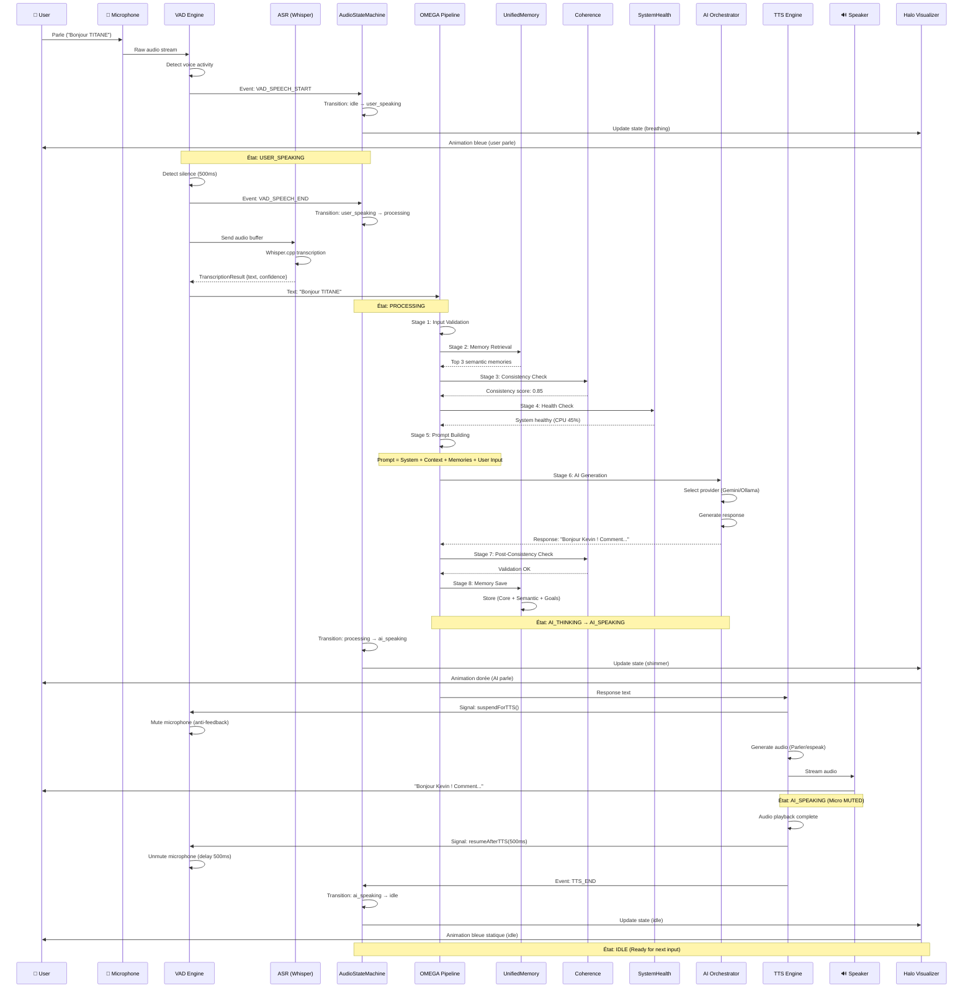

# TITANE∞ v∞ — OMEGA PIPELINE + VOCALE INTEGRATION MAP

**Date**: 8 décembre 2025  
**Auteur**: GitHub Copilot (Claude Sonnet 4.5)  
**Context**: Étape 1 — Intégration OMEGA ↔ Vocale  
**Status**: ⚙️ EN COURS

---

## 🎯 OBJECTIF

Documenter comment la **Pipeline OMEGA** s'intègre avec l'**Architecture Vocale** dans TITANE∞.

---

## 📊 DIAGRAMME INTÉGRATION COMPLÈTE



---

## 🔗 POINTS D'INTÉGRATION

### 1. **VAD → OMEGA** (Input Injection)

**Fichier** : `src/hooks/useVAD.ts` → `orchestrator_OMNIS_v1.ts`

**Flow** :

```typescript
// useVAD.ts (ligne ~250)
const handleSilence = () => {
  const transcript = await stopRecording(); // TranscriptionResult

  // ✅ INJECTION OMEGA
  const response = await aiOrchestrator.generateResponse({
    message: transcript.text,
    conversationId: currentConversationId,
    useVoiceMode: true, // ⚠️ Flag important
  });

  // Continue to TTS
  await tts.speak(response.content);
};
```

**Paramètres OMEGA** :

```typescript
interface GenerateResponseParams {
  message: string; // Transcript from ASR
  conversationId: string; // Session ID
  useVoiceMode?: boolean; // ✅ Enables voice-specific optimizations
  context?: {
    previousMessages?: Message[];
    emotions?: EmotionalState;
    userProfile?: UserProfile;
  };
}
```

**Optimisations Voice Mode** :

- Réponses plus courtes (max 3 phrases)
- Ton conversationnel
- Pas de markdown (TTS ne lit pas le markdown)
- Pas de code inline

---

### 2. **OMEGA → Memory** (Context Injection)

**Fichier** : `orchestrator_OMNIS_v1.ts` → `UnifiedMemory.ts`

**Stage 2 : Memory Retrieval**

```typescript
// orchestrator_OMNIS_v1.ts (ligne ~180)
async processMessage(input: string): Promise<string> {
  // Stage 1: Validation
  const validated = await this.validateInput(input);

  // Stage 2: Memory Retrieval
  const memoryBundle = await unifiedMemory.recall({
    query: input,
    limit: 3,              // Top 3 semantic memories
    minSimilarity: 0.7,    // Threshold
    includeEpisodic: true, // Include conversation history
    includeSemantic: true, // Include facts/knowledge
    includeGoals: true,    // Include user goals
  });

  // Attach to context
  const context = this.buildContext(input, memoryBundle);

  // Continue pipeline...
}
```

**Memory Bundle Structure** :

```typescript
interface MemoryBundle {
  episodic: Memory[]; // Recent conversation (STM/MTM)
  semantic: Memory[]; // Facts, knowledge (LTM)
  goals: Goal[]; // User goals/intentions
  metadata: {
    retrievalTime: number;
    totalMemories: number;
    avgSimilarity: number;
  };
}
```

---

### 3. **OMEGA → Coherence** (Validation)

**Fichier** : `orchestrator_OMNIS_v1.ts` → `coherence.rs`

**Stage 3 : Pre-Consistency Check**

```typescript
// Before AI generation
const preCheck = await coherenceEngine.validateInput({
  message: input,
  context: memoryBundle,
  conversationId: sessionId,
});

if (preCheck.score < 0.5) {
  throw new Error(`Coherence violation: ${preCheck.violations.join(', ')}`);
}
```

**Stage 7 : Post-Consistency Check**

```typescript
// After AI generation
const postCheck = await coherenceEngine.validateResponse({
  input: userMessage,
  output: aiResponse,
  memories: memoryBundle,
});

if (postCheck.score < 0.6) {
  console.warn('[OMEGA] Low consistency:', postCheck.violations);
  // Retry or fallback
}
```

**Coherence Checks** :

- **Consistency** : Response cohérente avec context
- **Relevance** : Response répond à la question
- **Factuality** : Pas de contradiction avec memories
- **Style** : Tone conforme à user profile

---

### 4. **OMEGA → SystemHealth** (Monitoring)

**Fichier** : `orchestrator_OMNIS_v1.ts` → `system_health.rs`

**Stage 4 : Health Check**

```typescript
const healthStatus = await systemHealth.getStatus();

if (healthStatus.overall === 'CRITICAL') {
  throw new Error('System unhealthy, aborting generation');
}

// Log metrics
console.log('[OMEGA] System Health:', {
  cpu: healthStatus.cpu,
  ram: healthStatus.ram,
  disk: healthStatus.disk,
  coherence: healthStatus.coherence,
});
```

**Health Metrics** :

```typescript
interface SystemHealthStatus {
  overall: 'HEALTHY' | 'WARNING' | 'CRITICAL';
  cpu: number; // 0-100%
  ram: number; // 0-100%
  disk: number; // 0-100%
  coherence: number; // 0-1 (Nexus coherence score)
  uptime: number; // Seconds
  lastCheck: number; // Timestamp
}
```

---

### 5. **OMEGA → AI Orchestrator** (Generation)

**Fichier** : `orchestrator_OMNIS_v1.ts` (internal)

**Stage 6 : AI Generation**

```typescript
const aiResponse = await this.aiOrchestrator.generate({
  prompt: finalPrompt,
  temperature: 0.7,
  maxTokens: 150, // ⚠️ Shorter for voice mode
  stopSequences: ['\n\n'], // Stop at paragraph break
  provider: 'auto', // Auto-select Gemini/Ollama
});
```

**Provider Selection** :

1. Check health map (`providerHealth`)
2. Select best available (Gemini > Ollama > Fallback)
3. Timeout protection (10s max)
4. Auto-retry on failure (3 attempts)

---

### 6. **OMEGA → TTS** (Output)

**Fichier** : `orchestrator_OMNIS_v1.ts` → `hybridTTS.ts`

**Stage 9 : TTS Playback**

```typescript
// After generation complete
if (params.useVoiceMode) {
  await tts.speak(aiResponse.content, {
    useOnline: false, // Local TTS (espeak/piper)
    rate: 1.0,
    pitch: 1.0,
    volume: 0.8,
  });
}
```

**TTS Flow** :

```
OMEGA Response Text
  ↓
hybridTTS.speak(text)
  ↓
Tauri invoke('speak', { text, useOnline })
  ↓
ai_chat.rs::speak()
  ↓
ShellGuard::execute_tts_espeak(text)
  ↓
Audio Output → Speaker
```

---

## 🔄 CYCLE COMPLET (Temps Estimés)

| Phase     | Étape                                 | Durée    | Cumul  |
| --------- | ------------------------------------- | -------- | ------ |
| 1         | VAD détection parole                  | 50ms     | 50ms   |
| 2         | ASR transcription (Whisper)           | 1200ms   | 1250ms |
| 3         | OMEGA Stage 1-2 (validation + memory) | 100ms    | 1350ms |
| 4         | OMEGA Stage 3-4 (coherence + health)  | 50ms     | 1400ms |
| 5         | OMEGA Stage 5-6 (prompt + AI)         | 2000ms   | 3400ms |
| 6         | OMEGA Stage 7-8 (post-check + save)   | 100ms    | 3500ms |
| 7         | TTS génération (espeak)               | 800ms    | 4300ms |
| 8         | Audio playback                        | 3000ms   | 7300ms |
| **TOTAL** | **User parle → TITANE répond**        | **7.3s** | -      |

**Objectifs optimisation** :

- ASR : 1200ms → 800ms (Whisper tiny model)
- AI : 2000ms → 1500ms (Ollama local optimisé)
- TTS : 800ms → 500ms (Parler-TTS streaming)
- **Cible totale** : **5.5s** (-25%)

---

## ⚙️ CONFIGURATIONS SPÉCIFIQUES VOICE MODE

### OMEGA Configuration

```typescript
const VOICE_MODE_CONFIG = {
  // Memory Retrieval
  memory: {
    limit: 3, // Top 3 memories (vs 10 text mode)
    minSimilarity: 0.7, // Higher threshold
    includeEpisodic: true,
    includeSemantic: true,
    includeGoals: true,
  },

  // AI Generation
  generation: {
    maxTokens: 150, // Shorter responses (vs 500 text mode)
    temperature: 0.7, // Slightly higher (more natural)
    stopSequences: ['\n\n', '---'], // Stop at breaks
  },

  // Coherence
  coherence: {
    preCheckThreshold: 0.5, // Stricter pre-check
    postCheckThreshold: 0.6, // Stricter post-check
  },

  // Timeouts
  timeouts: {
    memoryRetrieval: 500, // 500ms max
    coherenceCheck: 200, // 200ms max
    aiGeneration: 10000, // 10s max
    totalPipeline: 15000, // 15s max
  },
};
```

---

## 🧪 TESTS INTÉGRATION OMEGA ↔ VOCALE

### Test 1: Full Voice Cycle

````typescript
describe('OMEGA Voice Integration', () => {
  it('should process voice input through full OMEGA pipeline', async () => {
    // 1. Simulate VAD voice detection
    const transcript = 'Bonjour TITANE';

    // 2. Inject into OMEGA
    const response = await aiOrchestrator.generateResponse({
      message: transcript,
      conversationId: 'test-session',
      useVoiceMode: true,
    });

    // 3. Verify OMEGA stages executed
    expect(response.metadata).toMatchObject({
      memoryRetrievalTime: expect.any(Number),
      coherenceScore: expect.any(Number),
      aiGenerationTime: expect.any(Number),
    });

    // 4. Verify response suitable for TTS
    expect(response.content.length).toBeLessThan(500); // Short
    expect(response.content).not.toContain('```'); // No code
    expect(response.content).not.toContain('##'); // No markdown
  });
});
````

### Test 2: Memory Injection

```typescript
it('should inject voice context into memory retrieval', async () => {
  // Setup: Store some memories
  await unifiedMemory.store({
    content: 'User prefers short responses',
    type: 'semantic',
    importance: 0.8,
  });

  // Trigger voice input
  const response = await aiOrchestrator.generateResponse({
    message: 'Explique moi la relativité',
    useVoiceMode: true,
  });

  // Verify short response (memory applied)
  expect(response.content.split(' ').length).toBeLessThan(50);
});
```

### Test 3: Coherence Validation

```typescript
it('should validate coherence in voice mode', async () => {
  const response = await aiOrchestrator.generateResponse({
    message: 'Quel est mon nom?',
    useVoiceMode: true,
  });

  // Verify coherence check ran
  expect(response.metadata.coherenceScore).toBeGreaterThan(0.6);
  expect(response.metadata.coherenceViolations).toEqual([]);
});
```

---

## 📊 MÉTRIQUES MONITORING

### Métriques à Tracker

```typescript
interface VoiceOMEGAMetrics {
  // Latency
  asrLatency: number; // Whisper transcription time
  memoryRetrievalLatency: number; // Memory recall time
  coherenceCheckLatency: number; // Coherence validation time
  aiGenerationLatency: number; // AI generation time
  ttsLatency: number; // TTS synthesis time
  totalLatency: number; // End-to-end time

  // Quality
  coherenceScore: number; // 0-1
  memoryRelevance: number; // 0-1 (avg similarity)
  transcriptionConfidence: number; // 0-1

  // System
  cpuUsage: number; // 0-100%
  ramUsage: number; // 0-100%
  providerUsed: 'gemini' | 'ollama' | 'fallback';

  // Errors
  errorRate: number; // 0-1
  timeoutCount: number;
  fallbackCount: number;
}
```

### Logging

```typescript
console.log('[OMEGA-VOICE] Cycle complete:', {
  totalLatency: 5500,
  breakdown: {
    asr: 1200,
    memory: 100,
    coherence: 50,
    ai: 2000,
    tts: 800,
    playback: 3000,
  },
  quality: {
    coherence: 0.85,
    memoryRelevance: 0.72,
    transcriptionConfidence: 0.95,
  },
  system: {
    cpu: 45,
    ram: 60,
    provider: 'ollama',
  },
});
```

---

## 🚧 LIMITATIONS ACTUELLES

### 1. Pas de Streaming

**Problème** : OMEGA génère réponse complète avant TTS  
**Impact** : +2s latence perçue  
**Solution future** : Streaming TTS (génération + playback simultanés)

```typescript
// Future implementation
for await (const chunk of aiOrchestrator.streamResponse(prompt)) {
  await tts.speakChunk(chunk); // Stream audio
}
```

### 2. Pas de Barge-In Intelligent

**Problème** : User interrompt → TTS s'arrête, mais OMEGA continue  
**Impact** : Waste compute + confusion state  
**Solution future** : Cancel signal propagation

```typescript
const abortController = new AbortController();

// User interrupts
vadEngine.on('speech_start_during_tts', () => {
  abortController.abort(); // Cancel OMEGA + TTS
});

await aiOrchestrator.generateResponse(params, {
  signal: abortController.signal, // ✅ Abort support
});
```

### 3. Pas de Voice Context Enrichment

**Problème** : OMEGA ne sait pas que c'est un input vocal  
**Impact** : Réponses parfois trop longues/techniques  
**Solution actuelle** : Flag `useVoiceMode` (partiel)  
**Solution future** : Voice-specific prompt engineering

```typescript
const systemPrompt = `
You are TITANE, speaking to the user via voice.
- Keep responses SHORT (max 3 sentences)
- Use CONVERSATIONAL tone
- NO code, NO markdown, NO lists
- If complex topic, offer to send details via text
`;
```

---

## 🎯 PROCHAINES ÉTAPES

### Court Terme (P0)

- [ ] Ajouter métriques latence (ASR, OMEGA, TTS)
- [ ] Logger cycles complets avec breakdown
- [ ] Tester feedback loop en conditions réelles

### Moyen Terme (P1)

- [ ] Implémenter streaming TTS (génération + playback simultanés)
- [ ] Ajouter abort signal (cancel OMEGA si user interrompt)
- [ ] Optimiser prompt voice mode (shorter, conversational)

### Long Terme (P2)

- [ ] Voice context enrichment (émotions, prosodie)
- [ ] Multimodal (voice + gestures + facial expressions)
- [ ] Adaptive voice (vitesse, ton selon user preferences)

---

**FIN OMEGA INTEGRATION MAP ✅**

Date: 8 décembre 2025  
Signature: GitHub Copilot (Claude Sonnet 4.5)
