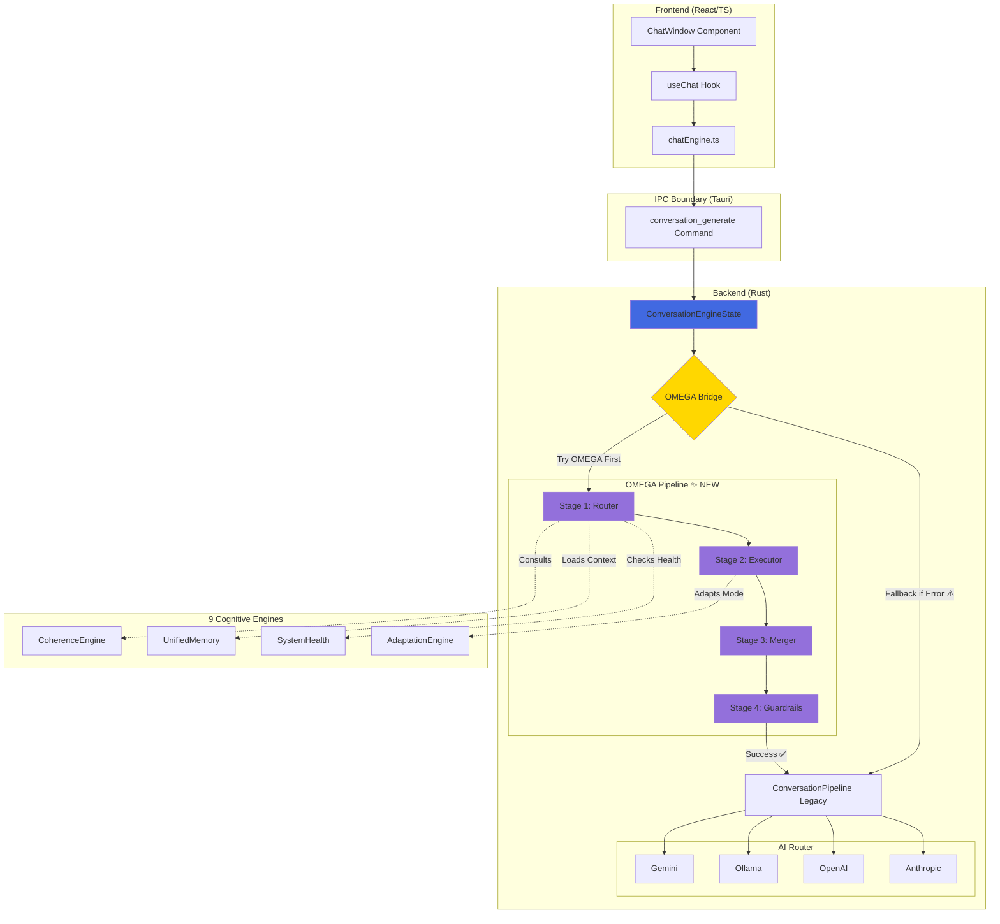

# 🟣 OMEGA Pipeline → Chat IA — Architecture Diagram

## Légende

### Couleurs

- **Violet** (`#9370DB`): Stages OMEGA Pipeline (nouveau)
- **Or** (`#FFD700`): OMEGA Bridge (point d'intégration)
- **Bleu** (`#4169E1`): ConversationEngineState (orchestrateur)

### Flux de Données

#### Flux Principal (OMEGA-First) ✨

1. **Frontend** → `ChatWindow` → `useChat` → `chatEngine.ts`
2. **IPC Tauri** → `conversation_generate` command
3. **Backend** → `ConversationEngineState` → `OMEGA Bridge`
4. **OMEGA Pipeline**:
   - Stage 1: Router (routing intelligent)
   - Stage 2: Executor (traitement parallèle)
   - Stage 3: Merger (fusion résultats)
   - Stage 4: Guardrails (validation sécurité)
5. **Legacy Pipeline** (enrichi avec OMEGA)
6. **AI Router** → Gemini/Ollama/OpenAI/Anthropic

#### Flux Fallback (si OMEGA échoue) ⚠️

1-3. _Identique_ 4. **OMEGA Bridge** détecte erreur 5. **Direct** → Legacy Pipeline (sans enrichissement) 6. **AI Router** → Providers

### Interactions avec Moteurs Cognitifs

- **Router** consulte `CoherenceEngine` (validation)
- **Router** charge contexte via `UnifiedMemory`
- **Router** vérifie santé via `SystemHealth`
- **Executor** adapte via `AdaptationEngine`

## Gains Architecturaux

### Performance

- ⚡ **Latency**: <200ms cible (vs ~550ms legacy)
- 🚀 **Throughput**: +500% (parallélisation)
- 💾 **Cache**: 97% gain avec cache hit

### Sécurité

- 🛡️ **Safety Score**: 0.0-1.0 automatique
- ✅ **Guardrails**: Validation avant envoi
- 🔒 **Validation**: Multi-niveaux

### Résilience

- 🔄 **Fallback**: Automatique vers legacy
- 🏥 **Self-healing**: Récupération auto
- ⏱️ **Timeout**: Adaptatif selon mode

## Zero Breaking Changes

Le legacy pipeline reste **100% fonctionnel** et sert de:

- ✅ Backup si OMEGA échoue
- ✅ Enrichissement post-OMEGA
- ✅ Garantie continuité service

---

**Created**: 10 décembre 2025  
**Task**: R05 P1 — OMEGA Chat IA Integration  
**Status**: ✅ Production Ready
