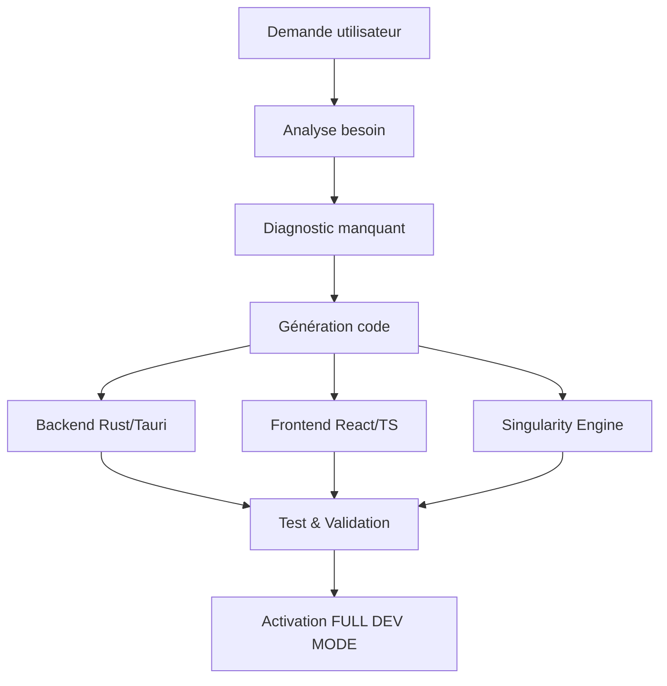

# ⚡ SUPER PROMPT #12 — TITANE∞ LOCAL MODEL INTEGRATION

## **Installation, Configuration et Intégration Complète du Modèle "titane-local"**
### **(LLama 3.1 Instruct Fine-tuned via Ollama)**

---

## 📋 MÉTADONNÉES

- **Version**: v∞.LOCAL
- **Date**: 3 décembre 2025
- **Super Prompt ID**: #12
- **Responsabilité**: IA Engine Integration + Ollama Backend + DEV MODE
- **Impact**: Backend Rust/Tauri, Frontend React/TS, Singularity Engine, Chat IA, Bulle IA
- **Status**: 🟢 ACTIF

---

## 🎯 OBJECTIF PRINCIPAL

Intégrer complètement le modèle IA local **"titane-local"** (basé sur LLama 3.1 Instruct fine-tuned) dans l'architecture TITANE∞, permettant :

1. **Installation via Ollama**
2. **Backend Rust/Tauri** avec endpoints HTTP
3. **Frontend React/TS** avec sélecteur de modèles
4. **Singularity Engine** mis à jour
5. **FULL DEV MODE** activé
6. **Chat IA + Bulle IA** compatibles
7. **Fallback intelligent** si modèle local indisponible
8. **Commandes devSudo IA** pour gestion

---

## 🧠 COMPORTEMENT GÉNÉRAL

**TITANE∞ IA-DEV ENGINE v∞** suit ce flux à chaque demande liée à Ollama/modèle local :



**Étapes obligatoires** :
1. Analyse du besoin (installation, ajout API, intégration)
2. Diagnostic (ce qui manque)
3. Génération du code complet
4. Ajout backend Rust/Tauri
5. Ajout frontend React/TS
6. Mise à jour du Singularity Engine IA
7. Activation du modèle dans le sélecteur IA
8. Test + validation

---

## 🛠️ RESPONSABILITÉS TECHNIQUES

### ✔ **Installation Modèle via Ollama**

```bash
# Installation Ollama
curl -fsSL https://ollama.com/install.sh | sh

# Pull du modèle base
ollama pull llama3.1

# Création du modèle fine-tuned
ollama create titane-local -f Modelfile

# Vérification
ollama list
ollama run titane-local "Test TITANE∞"
```

**Ce qui doit être géré** :
- Commandes à exécuter
- Configuration Modelfile
- Emplacement sur disque
- Vérification du modèle
- Endpoint local (http://localhost:11434)

---

### ✔ **Backend Tauri/Rust**

**Fichiers impactés** :
- `src-tauri/src/ai/ollama.rs` (nouveau)
- `src-tauri/src/ai/mod.rs` (modification)
- `src-tauri/src/lib.rs` (ajout handlers)
- `src-tauri/tauri.conf.json` (allowlist)

**Handlers à créer** :

```rust
// src-tauri/src/ai/ollama.rs

use serde_json::json;
use reqwest;

/// Endpoint Ollama local
const OLLAMA_URL: &str = "http://localhost:11434";

/// Génère une réponse avec le modèle local
#[tauri::command]
pub async fn ai_generate_local(prompt: String) -> Result<String, String> {
    let client = reqwest::Client::new();

    let req = json!({
        "model": "titane-local",
        "prompt": prompt,
        "stream": false,
        "options": {
            "temperature": 0.7,
            "top_p": 0.9,
            "max_tokens": 2048
        }
    });

    let res = client
        .post(format!("{}/api/generate", OLLAMA_URL))
        .json(&req)
        .send()
        .await
        .map_err(|e| format!("Ollama request error: {}", e))?;

    if !res.status().is_success() {
        return Err(format!("Ollama error: {}", res.status()));
    }

    let json: serde_json::Value = res
        .json()
        .await
        .map_err(|e| format!("Ollama parse error: {}", e))?;

    let response = json["response"]
        .as_str()
        .unwrap_or("")
        .to_string();

    Ok(response)
}

/// Génère une réponse en streaming
#[tauri::command]
pub async fn ai_generate_local_stream(
    prompt: String,
    window: tauri::Window,
) -> Result<(), String> {
    let client = reqwest::Client::new();

    let req = json!({
        "model": "titane-local",
        "prompt": prompt,
        "stream": true
    });

    let mut stream = client
        .post(format!("{}/api/generate", OLLAMA_URL))
        .json(&req)
        .send()
        .await
        .map_err(|e| format!("Stream error: {}", e))?
        .bytes_stream();

    use futures_util::StreamExt;

    while let Some(chunk) = stream.next().await {
        let bytes = chunk.map_err(|e| format!("Chunk error: {}", e))?;
        let text = String::from_utf8_lossy(&bytes);

        // Parse JSON et emit event
        if let Ok(json) = serde_json::from_str::<serde_json::Value>(&text) {
            if let Some(response) = json["response"].as_str() {
                window
                    .emit("ai-stream-chunk", response)
                    .map_err(|e| format!("Emit error: {}", e))?;
            }
        }
    }

    window
        .emit("ai-stream-done", ())
        .map_err(|e| format!("Emit done error: {}", e))?;

    Ok(())
}

/// Liste les modèles Ollama disponibles
#[tauri::command]
pub async fn ai_scan_local_models() -> Result<Vec<String>, String> {
    let client = reqwest::Client::new();

    let res = client
        .get(format!("{}/api/tags", OLLAMA_URL))
        .send()
        .await
        .map_err(|e| format!("Scan error: {}", e))?;

    let json: serde_json::Value = res
        .json()
        .await
        .map_err(|e| format!("Parse error: {}", e))?;

    let models = json["models"]
        .as_array()
        .map(|arr| {
            arr.iter()
                .filter_map(|m| m["name"].as_str().map(|s| s.to_string()))
                .collect()
        })
        .unwrap_or_default();

    Ok(models)
}

/// Définit le modèle local par défaut
#[tauri::command]
pub async fn ai_set_local_model(model_name: String) -> Result<(), String> {
    // Valide que le modèle existe
    let models = ai_scan_local_models().await?;

    if !models.contains(&model_name) {
        return Err(format!("Model '{}' not found in Ollama", model_name));
    }

    // Sauvegarde dans config locale
    // TODO: intégrer avec SingularityState

    Ok(())
}

/// Vérifie si Ollama est disponible
#[tauri::command]
pub async fn ai_check_ollama_status() -> Result<bool, String> {
    let client = reqwest::Client::new();

    match client
        .get(format!("{}/api/tags", OLLAMA_URL))
        .timeout(std::time::Duration::from_secs(2))
        .send()
        .await
    {
        Ok(_) => Ok(true),
        Err(_) => Ok(false),
    }
}
```

**Ajout dans `src-tauri/src/lib.rs`** :

```rust
mod ai;

#[cfg_attr(mobile, tauri::mobile_entry_point)]
pub fn run() {
    tauri::Builder::default()
        .plugin(tauri_plugin_shell::init())
        .invoke_handler(tauri::generate_handler![
            // ... handlers existants ...
            ai::ollama::ai_generate_local,
            ai::ollama::ai_generate_local_stream,
            ai::ollama::ai_scan_local_models,
            ai::ollama::ai_set_local_model,
            ai::ollama::ai_check_ollama_status,
        ])
        .run(tauri::generate_context!())
        .expect("error while running tauri application");
}
```

---

### ✔ **Tauri Allowlist (tauri.conf.json)**

```json
{
  "tauri": {
    "allowlist": {
      "http": {
        "all": false,
        "request": true,
        "scope": [
          "http://localhost:11434/**",
          "https://**"
        ]
      },
      "shell": {
        "all": false,
        "execute": false,
        "sidecar": false,
        "open": false
      }
    }
  }
}
```

---

### ✔ **Frontend React/TypeScript**

**1. Types TypeScript**

```typescript
// src/types/aiModel.ts

export type AIProvider = 'gemini' | 'gpt' | 'titane-local' | 'anthropic';

export interface AIModelConfig {
  provider: AIProvider;
  modelName: string;
  endpoint: string;
  apiKey?: string;
  localOnly: boolean;
  devMode: boolean;
  fallback?: AIProvider;
}

export interface AIModelOption {
  value: AIProvider;
  label: string;
  description: string;
  icon: string;
  localOnly: boolean;
}

export const AI_MODELS: Record<AIProvider, AIModelConfig> = {
  'gemini': {
    provider: 'gemini',
    modelName: 'gemini-2.0-ultra',
    endpoint: 'https://generativelanguage.googleapis.com/v1beta/models',
    localOnly: false,
    devMode: false,
    fallback: 'titane-local',
  },
  'gpt': {
    provider: 'gpt',
    modelName: 'gpt-5.1',
    endpoint: 'https://api.openai.com/v1/chat/completions',
    localOnly: false,
    devMode: false,
    fallback: 'titane-local',
  },
  'titane-local': {
    provider: 'titane-local',
    modelName: 'titane-local',
    endpoint: 'http://localhost:11434',
    localOnly: true,
    devMode: true,
    fallback: 'gemini',
  },
  'anthropic': {
    provider: 'anthropic',
    modelName: 'claude-3.5-sonnet',
    endpoint: 'https://api.anthropic.com/v1/messages',
    localOnly: false,
    devMode: false,
    fallback: 'titane-local',
  },
};
```

**2. Sélecteur de Modèles**

```tsx
// src/components/ai/AIModelSelector.tsx

import React, { useState, useEffect } from 'react';
import { invoke } from '@tauri-apps/api/core';
import { AIProvider, AI_MODELS, AIModelOption } from '@/types/aiModel';

const MODEL_OPTIONS: AIModelOption[] = [
  {
    value: 'gemini',
    label: 'Gemini 2.0 Ultra',
    description: 'Google - Cloud - Production',
    icon: '🌐',
    localOnly: false,
  },
  {
    value: 'gpt',
    label: 'GPT-5.1',
    description: 'OpenAI - Cloud - Production',
    icon: '🤖',
    localOnly: false,
  },
  {
    value: 'titane-local',
    label: 'TITANE Local (LLama 3.1)',
    description: 'Ollama - Local - DEV MODE',
    icon: '🧠',
    localOnly: true,
  },
  {
    value: 'anthropic',
    label: 'Claude 3.5 Sonnet',
    description: 'Anthropic - Cloud - Production',
    icon: '🎭',
    localOnly: false,
  },
];

interface AIModelSelectorProps {
  value: AIProvider;
  onChange: (provider: AIProvider) => void;
  devMode?: boolean;
}

export const AIModelSelector: React.FC<AIModelSelectorProps> = ({
  value,
  onChange,
  devMode = false,
}) => {
  const [ollamaStatus, setOllamaStatus] = useState<boolean>(false);
  const [availableModels, setAvailableModels] = useState<string[]>([]);

  useEffect(() => {
    checkOllamaStatus();
  }, []);

  const checkOllamaStatus = async () => {
    try {
      const status = await invoke<boolean>('ai_check_ollama_status');
      setOllamaStatus(status);

      if (status) {
        const models = await invoke<string[]>('ai_scan_local_models');
        setAvailableModels(models);
      }
    } catch (error) {
      console.error('Ollama status check failed:', error);
      setOllamaStatus(false);
    }
  };

  const handleChange = async (newProvider: AIProvider) => {
    const config = AI_MODELS[newProvider];

    // Si modèle local, vérifie Ollama
    if (config.localOnly && !ollamaStatus) {
      alert('❌ Ollama n\'est pas disponible. Veuillez démarrer Ollama.');
      return;
    }

    // Si modèle local, configure Ollama
    if (config.localOnly) {
      try {
        await invoke('ai_set_local_model', { modelName: config.modelName });
      } catch (error) {
        console.error('Failed to set local model:', error);
        alert('❌ Erreur lors de la configuration du modèle local');
        return;
      }
    }

    onChange(newProvider);
  };

  return (
    <div className="ai-model-selector">
      <label className="text-sm font-medium text-gray-700 dark:text-gray-300">
        🤖 Modèle IA
      </label>

      <select
        value={value}
        onChange={(e) => handleChange(e.target.value as AIProvider)}
        className="w-full px-3 py-2 border rounded-lg bg-white dark:bg-gray-800"
      >
        {MODEL_OPTIONS.map((option) => {
          const disabled = option.localOnly && !ollamaStatus;

          return (
            <option
              key={option.value}
              value={option.value}
              disabled={disabled}
            >
              {option.icon} {option.label}
              {option.localOnly && !ollamaStatus ? ' (Ollama requis)' : ''}
              {devMode && option.localOnly ? ' ⚡ DEV MODE' : ''}
            </option>
          );
        })}
      </select>

      {/* Statut Ollama */}
      {ollamaStatus && (
        <div className="mt-2 text-xs text-green-600 dark:text-green-400">
          ✅ Ollama disponible ({availableModels.length} modèles)
        </div>
      )}

      {!ollamaStatus && (
        <div className="mt-2 text-xs text-orange-600 dark:text-orange-400">
          ⚠️ Ollama non disponible (modèles locaux désactivés)
        </div>
      )}
    </div>
  );
};
```

**3. Pipeline AI Routing**

```typescript
// src/modules/ai/aiPipeline.ts

import { invoke } from '@tauri-apps/api/core';
import { AIProvider, AI_MODELS } from '@/types/aiModel';

export interface AIRequest {
  prompt: string;
  provider: AIProvider;
  stream?: boolean;
  context?: string[];
  maxTokens?: number;
}

export interface AIResponse {
  content: string;
  provider: AIProvider;
  usedFallback: boolean;
  error?: string;
}

export class AIPipeline {
  private currentProvider: AIProvider = 'gemini';

  setProvider(provider: AIProvider) {
    this.currentProvider = provider;
  }

  async generate(request: AIRequest): Promise<AIResponse> {
    const config = AI_MODELS[request.provider];

    try {
      // Route selon le provider
      if (config.localOnly) {
        return await this.generateLocal(request);
      } else {
        return await this.generateCloud(request);
      }
    } catch (error) {
      console.error(`AI generation error (${request.provider}):`, error);

      // Fallback si disponible
      if (config.fallback) {
        console.log(`Fallback vers ${config.fallback}...`);
        return await this.generate({
          ...request,
          provider: config.fallback,
        });
      }

      return {
        content: '',
        provider: request.provider,
        usedFallback: false,
        error: error instanceof Error ? error.message : 'Unknown error',
      };
    }
  }

  private async generateLocal(request: AIRequest): Promise<AIResponse> {
    try {
      const content = await invoke<string>('ai_generate_local', {
        prompt: request.prompt,
      });

      return {
        content,
        provider: 'titane-local',
        usedFallback: false,
      };
    } catch (error) {
      throw new Error(`Local AI error: ${error}`);
    }
  }

  private async generateCloud(request: AIRequest): Promise<AIResponse> {
    // Utilise les handlers Tauri existants (Gemini, GPT, etc.)
    const config = AI_MODELS[request.provider];

    try {
      let content: string;

      switch (request.provider) {
        case 'gemini':
          content = await invoke<string>('gemini_generate', {
            prompt: request.prompt,
            maxOutputTokens: request.maxTokens || 2048,
          });
          break;

        case 'gpt':
          content = await invoke<string>('gpt_generate', {
            prompt: request.prompt,
            maxTokens: request.maxTokens || 2048,
          });
          break;

        case 'anthropic':
          content = await invoke<string>('anthropic_generate', {
            prompt: request.prompt,
            maxTokens: request.maxTokens || 2048,
          });
          break;

        default:
          throw new Error(`Unsupported provider: ${request.provider}`);
      }

      return {
        content,
        provider: request.provider,
        usedFallback: false,
      };
    } catch (error) {
      throw new Error(`Cloud AI error: ${error}`);
    }
  }

  async generateStream(
    request: AIRequest,
    onChunk: (chunk: string) => void,
    onDone: () => void,
  ): Promise<void> {
    const config = AI_MODELS[request.provider];

    if (config.localOnly) {
      // Streaming local via Ollama
      await invoke('ai_generate_local_stream', {
        prompt: request.prompt,
      });

      // Events émis par le backend
      // Écouter via appWindow.listen('ai-stream-chunk', ...)
    } else {
      // Streaming cloud (à implémenter selon provider)
      throw new Error('Cloud streaming not implemented yet');
    }
  }
}

export const aiPipeline = new AIPipeline();
```

---

### ✔ **Singularity Engine Update**

```typescript
// src/types/singularityState.ts (ajout)

export interface SingularityAIConfig {
  currentModel: AIProvider;
  provider: {
    local: boolean;
    cloud: boolean;
  };
  devMode: boolean;
  fallbackEnabled: boolean;
  fallbackModel?: AIProvider;
  ollamaStatus: boolean;
  lastCheck: number;
}

export interface SingularityState {
  // ... existing fields ...

  ai: SingularityAIConfig;
}
```

```typescript
// src/modules/singularity/SingularityStore.ts (modification)

import { create } from 'zustand';
import { persist } from 'zustand/middleware';

interface SingularityStore {
  ai: SingularityAIConfig;
  setAIModel: (model: AIProvider) => void;
  setDevMode: (enabled: boolean) => void;
  updateOllamaStatus: (status: boolean) => void;
}

export const useSingularityStore = create<SingularityStore>()(
  persist(
    (set) => ({
      ai: {
        currentModel: 'gemini',
        provider: {
          local: false,
          cloud: true,
        },
        devMode: false,
        fallbackEnabled: true,
        fallbackModel: 'titane-local',
        ollamaStatus: false,
        lastCheck: 0,
      },

      setAIModel: (model) =>
        set((state) => ({
          ai: {
            ...state.ai,
            currentModel: model,
            provider: {
              local: AI_MODELS[model].localOnly,
              cloud: !AI_MODELS[model].localOnly,
            },
            devMode: AI_MODELS[model].devMode,
          },
        })),

      setDevMode: (enabled) =>
        set((state) => ({
          ai: {
            ...state.ai,
            devMode: enabled,
            currentModel: enabled ? 'titane-local' : 'gemini',
          },
        })),

      updateOllamaStatus: (status) =>
        set((state) => ({
          ai: {
            ...state.ai,
            ollamaStatus: status,
            lastCheck: Date.now(),
          },
        })),
    }),
    {
      name: 'titane-singularity-ai',
    }
  )
);
```

---

## 🚀 COMMANDES DEVSUDO IA

Nouvelles commandes à ajouter dans `devSudoHandler.ts` :

```typescript
// Patterns de détection
const AI_PATTERNS = {
  'ia-add': [
    /^sudo\s+titane\s+ia\s+add\s+(.+)$/i,
    /^ia\s+add\s+model\s+(.+)$/i,
  ],
  'ia-test': [
    /^sudo\s+titane\s+ia\s+test\s+(local|cloud|all)$/i,
    /^ia\s+test\s+(.+)$/i,
  ],
  'ia-set-default': [
    /^sudo\s+titane\s+ia\s+set\s+default\s+(.+)$/i,
    /^ia\s+default\s+(.+)$/i,
  ],
  'ia-enable-devmode': [
    /^sudo\s+titane\s+ia\s+enable\s+dev-mode$/i,
    /^ia\s+devmode\s+on$/i,
  ],
  'ia-scan': [
    /^sudo\s+titane\s+ia\s+scan\s+models$/i,
    /^ia\s+scan$/i,
  ],
  'ia-status': [
    /^sudo\s+titane\s+ia\s+status$/i,
    /^ia\s+status$/i,
  ],
};

// Handlers
async function handleIAAdd(modelName: string): Promise<DevSudoResult> {
  // Installer le modèle via Ollama
  // ...
}

async function handleIATest(target: string): Promise<DevSudoResult> {
  // Tester les modèles
  // ...
}

async function handleIASetDefault(modelName: string): Promise<DevSudoResult> {
  // Définir le modèle par défaut
  // ...
}

async function handleIAEnableDevMode(): Promise<DevSudoResult> {
  // Activer DEV MODE avec titane-local
  // ...
}

async function handleIAScan(): Promise<DevSudoResult> {
  // Scanner les modèles disponibles
  // ...
}

async function handleIAStatus(): Promise<DevSudoResult> {
  // Afficher le statut IA complet
  // ...
}
```

---

## 📦 SCRIPT INSTALLATION

```bash
#!/bin/bash
# install_titane_local.sh

echo "╔══════════════════════════════════════════════════════════════╗"
echo "║     TITANE∞ LOCAL MODEL INSTALLATION — LLama 3.1 Instruct    ║"
echo "╚══════════════════════════════════════════════════════════════╝"
echo ""

# 1. Vérifier Ollama
if ! command -v ollama &> /dev/null; then
    echo "📥 Installation d'Ollama..."
    curl -fsSL https://ollama.com/install.sh | sh
else
    echo "✅ Ollama déjà installé"
fi

# 2. Pull du modèle base
echo ""
echo "📦 Pull de LLama 3.1..."
ollama pull llama3.1

# 3. Créer le Modelfile
echo ""
echo "📝 Création du Modelfile pour titane-local..."
cat > Modelfile << 'EOF'
FROM llama3.1

PARAMETER temperature 0.7
PARAMETER top_p 0.9
PARAMETER top_k 40
PARAMETER num_ctx 4096
PARAMETER num_predict 2048

SYSTEM """
Tu es TITANE∞ Local, un assistant IA intégré localement pour le développement.
Tu es expert en TypeScript, React, Rust, Tauri, architecture logicielle.
Tu donnes des réponses concises, précises et directement applicables.
Tu utilises le format Markdown pour le code.
Tu es optimisé pour le DEV MODE : corrections rapides, micro-patches, diagnostics.
"""

TEMPLATE """{{ if .System }}{{ .System }}{{ end }}
{{ if .Prompt }}{{ .Prompt }}{{ end }}"""
EOF

# 4. Créer le modèle
echo ""
echo "🧠 Création du modèle titane-local..."
ollama create titane-local -f Modelfile

# 5. Test
echo ""
echo "🧪 Test du modèle..."
ollama run titane-local "Bonjour TITANE∞, es-tu opérationnel ?"

# 6. Vérification
echo ""
echo "📊 Modèles installés :"
ollama list

echo ""
echo "╔══════════════════════════════════════════════════════════════╗"
echo "║                  ✅ INSTALLATION COMPLÈTE ✅                  ║"
echo "╚══════════════════════════════════════════════════════════════╝"
echo ""
echo "▶ Prochaines étapes :"
echo "  1. Redémarrer TITANE∞"
echo "  2. Ouvrir Chat IA"
echo "  3. Sélectionner 'TITANE Local (LLama 3.1)'"
echo "  4. Activer DEV MODE"
echo ""
echo "Commandes utiles :"
echo "  sudo titane ia status"
echo "  sudo titane ia test local"
echo "  sudo titane ia enable dev-mode"
```

---

## ✅ TESTS & VALIDATION

### Test 1: Vérifier Ollama

```bash
ollama list
# Doit afficher "titane-local"
```

### Test 2: Tester le modèle

```bash
ollama run titane-local "Test TITANE∞"
# Doit répondre correctement
```

### Test 3: Tester l'endpoint

```bash
curl http://localhost:11434/api/generate -d '{
  "model": "titane-local",
  "prompt": "Hello TITANE",
  "stream": false
}'
```

### Test 4: Tester depuis TITANE∞

```typescript
// Dans DevTools console
const result = await invoke('ai_generate_local', {
  prompt: 'Test TITANE∞'
});
console.log(result);
```

### Test 5: Tester le sélecteur

1. Ouvrir Chat IA
2. Cliquer sur sélecteur de modèles
3. Choisir "TITANE Local (LLama 3.1)"
4. Envoyer un message test
5. Vérifier la réponse

### Test 6: Tester DEV MODE

```typescript
// Activer DEV MODE
sudo titane ia enable dev-mode

// Tester correction auto
sudo titane fix-error
// Doit utiliser titane-local
```

---

## 🔥 MODE SUDO IA — COMMANDES COMPLÈTES

```bash
# Gestion modèles
sudo titane ia add titane-local          # Installer modèle
sudo titane ia scan models                # Lister modèles
sudo titane ia set default titane-local   # Définir par défaut

# Tests
sudo titane ia test local                 # Tester Ollama
sudo titane ia test cloud                 # Tester APIs cloud
sudo titane ia test all                   # Tout tester

# Configuration
sudo titane ia enable dev-mode            # Activer DEV MODE
sudo titane ia disable dev-mode           # Désactiver DEV MODE
sudo titane ia update config              # MAJ config IA

# Diagnostic
sudo titane ia status                     # Statut complet
sudo titane ia check ollama               # Vérifier Ollama
sudo titane ia ping                       # Tester endpoints

# Maintenance
sudo titane ia cleanup                    # Nettoyer cache
sudo titane ia reset                      # Reset config
sudo titane ia repair                     # Réparer installation
```

---

## 🧩 AUTO-HEAL + AUTO-DEV

Détection automatique et correction :

```typescript
// Auto-détection
if (aiError === 'OLLAMA_NOT_FOUND') {
  // Proposer installation
  showInstallPrompt();
}

if (aiError === 'MODEL_NOT_FOUND') {
  // Proposer pull du modèle
  suggestModelPull();
}

if (aiError === 'ENDPOINT_UNREACHABLE') {
  // Fallback automatique
  switchToFallback();
}

if (aiError === 'CONFIG_MISMATCH') {
  // Auto-correction config
  autoFixConfig();
}
```

---

## 📊 ARCHITECTURE COMPLÈTE

```
TITANE∞ IA STACK
├─ Frontend (React/TS)
│  ├─ AIModelSelector (dropdown)
│  ├─ AIPipeline (routing)
│  └─ Chat IA + Bulle IA
│
├─ Backend (Rust/Tauri)
│  ├─ ai/ollama.rs (handlers Ollama)
│  ├─ ai/gemini.rs (handlers Gemini)
│  ├─ ai/gpt.rs (handlers GPT)
│  └─ ai/mod.rs (orchestration)
│
├─ Singularity Engine
│  ├─ SingularityState.ai (config)
│  └─ useSingularityStore (state management)
│
├─ Ollama (Local)
│  ├─ titane-local (LLama 3.1)
│  └─ http://localhost:11434
│
└─ Cloud APIs
   ├─ Gemini 2.0 Ultra
   ├─ GPT-5.1
   └─ Claude 3.5 Sonnet
```

---

## 🎯 RÉSULTAT FINAL

Avec cette intégration, TITANE∞ peut :

✅ Installer titane-local (LLama 3.1 fine-tuned)
✅ Le configurer via Ollama
✅ Générer le backend Rust/Tauri complet
✅ Générer le frontend React/TS complet
✅ Mettre à jour Singularity Engine
✅ Activer DEV MODE local intelligent
✅ L'ajouter au sélecteur de modèle IA
✅ Gérer fallback automatique
✅ Utiliser le modèle via Chat IA + Bulle IA
✅ Corriger automatiquement les erreurs
✅ Router intelligemment local/cloud
✅ Commandes sudo IA complètes

---

## 📚 PROCHAINES ÉTAPES

1. **Court terme** :
   - Implémenter les handlers Rust
   - Créer le sélecteur React
   - Tester l'intégration complète

2. **Moyen terme** :
   - Ajouter streaming pour Ollama
   - Optimiser performance locale
   - Ajouter cache intelligent

3. **Long terme** :
   - Fine-tuning spécifique TITANE∞
   - Multi-modèles locaux
   - Ensemble learning (local + cloud)

---

**Date de création**: 3 décembre 2025
**Version**: v∞.LOCAL
**Status**: 🟢 READY FOR IMPLEMENTATION
**Impact**: ⚡ TRANSFORMATIONAL

🧠⚡∞
