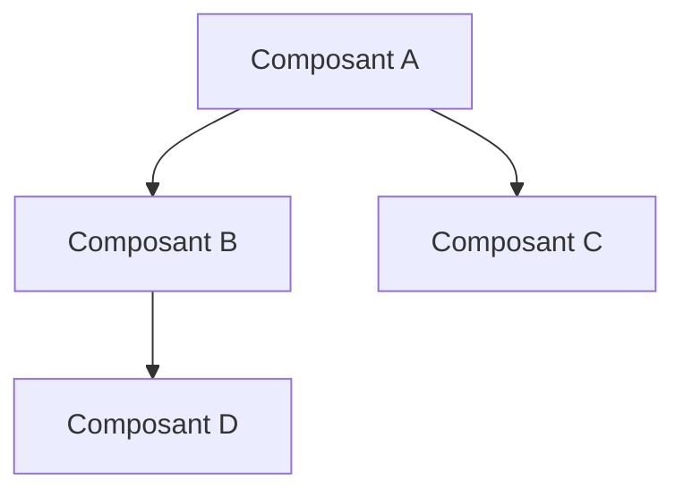
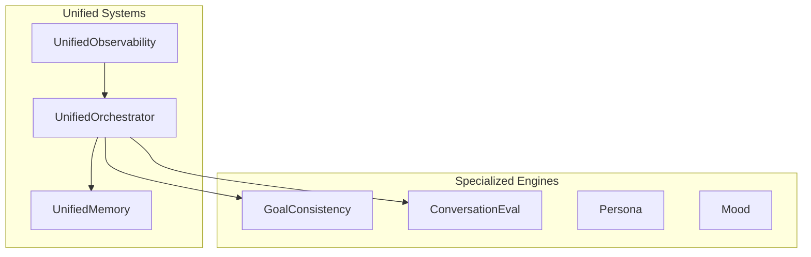
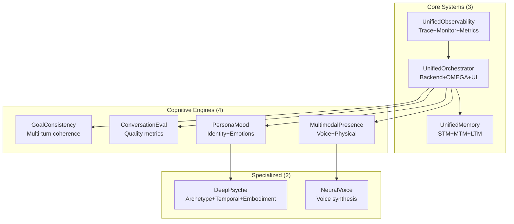
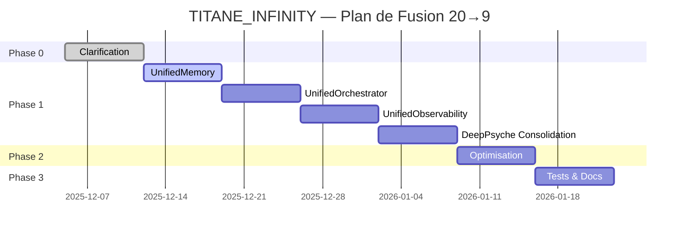
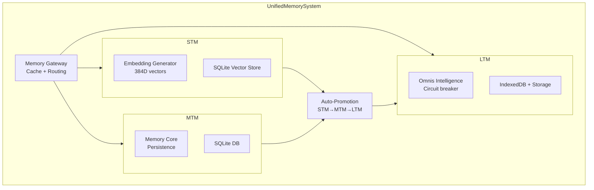

# 🚀 TITANE_INFINITY — ULTIMATE COPILOT EXECUTION PLAN
## 12 Prompts Prêts à l'Emploi pour la Transformation Complète

**Date :** 5 Décembre 2025  
**Version :** v∞.42  
**Durée totale :** 6 semaines  
**Objectif :** 20 composants → 9 composants (-81% complexité)

---

## 📋 TABLE DES MATIÈRES

### **PHASE 0 : CLARIFICATION (1 semaine)**
- [Prompt #1](#prompt-1--structure) : Analyse Structure Complète
- [Prompt #2](#prompt-2--architecture) : Audit Architecture
- [Prompt #3](#prompt-3--performance) : Baseline Performance
- [Prompt #4](#prompt-4--plan) : Plan de Fusion Détaillé

### **PHASE 1 : SIMPLIFICATION (3-4 semaines)**
- [Prompt #5](#prompt-5--memory) : Unified Memory System (5→1)
- [Prompt #6](#prompt-6--orchestrator) : Unified Orchestrator (4→1)
- [Prompt #7](#prompt-7--observability) : Unified Observability (3→1)
- [Prompt #8](#prompt-8--psyche) : Deep Psyche Consolidation (8→6)

### **PHASE 2 : OPTIMISATION (1-2 semaines)**
- [Prompt #9](#prompt-9--parallelization) : Parallélisation Engines
- [Prompt #10](#prompt-10--streaming) : Streaming IPC

### **PHASE 3 : VALIDATION (1-2 semaines)**
- [Prompt #11](#prompt-11--tests) : Tests Exhaustifs >80%
- [Prompt #12](#prompt-12--docs) : Documentation Complète

---

# PHASE 0 : CLARIFICATION

## Prompt #1 : STRUCTURE

**Durée estimée :** 2-3 heures  
**Quand :** Jour 1  
**Objectif :** Cartographie complète de tous les composants

### 📝 COPIE-COLLE CE PROMPT DANS COPILOT CHAT

```
# TITANE_INFINITY v∞.42 — ANALYSE STRUCTURE COMPLÈTE

Tu es un architecte logiciel senior spécialisé en analyse de systèmes complexes.

## CONTEXTE
TITANE_INFINITY est une application Tauri (Rust backend + React/TypeScript frontend) avec une architecture cognitive avancée. Le projet a évolué de v15 à v∞.42 avec l'ajout de multiples engines cognitifs.

## MISSION
Effectue une analyse EXHAUSTIVE de l'architecture actuelle pour identifier TOUS les composants cognitifs/engines.

## INSTRUCTIONS

### 1. INVENTAIRE COMPLET
Scanne les fichiers suivants et liste TOUS les composants/engines :

**Frontend TypeScript :**
- `src/services/cognitive/**` (Cognitive Engines v∞.42)
- `src/engines/**` (Engines existants)
- `src/hooks/useDeepPsyche.ts` (Deep Psyche v29-32)
- `src/core/cognitive/**`
- `src/omnisEngine/**` (OMNIS v1)

**Backend Rust :**
- `src-tauri/src/core/engine.rs` (SingularityEngine)
- `src-tauri/src/core/modules/**` (Nexus, Harmonia, Sentinel, Memory)

### 2. POUR CHAQUE COMPOSANT, DOCUMENTE

```markdown
### [Nom du Composant]
- **Fichier :** `chemin/vers/fichier.ts`
- **Lignes de code :** ~X lignes
- **Rôle principal :** [Description en 1 phrase]
- **Dépendances :** [Liste des autres composants utilisés]
- **Créé en version :** vX.X
```

### 3. CALCULS DE COMPLEXITÉ

Calcule :
- **N** : Nombre total de composants cognitifs identifiés
- **Interactions possibles** : N × (N-1) / 2
- **Points de failure estimés**
- **Fichiers totaux impliqués**

### 4. IDENTIFICATION DES REDONDANCES

Pour chaque paire de composants similaires, note :
```markdown
#### Redondance Potentielle #X
- **Composant A :** [Nom]
- **Composant B :** [Nom]
- **Similarité :** [Pourcentage estimé]
- **Raison :** [Pourquoi ils semblent redondants]
```

### 5. CLUSTERS FONCTIONNELS

Groupe les composants par fonction :
- **Cluster Mémoire :** Composants gérant stockage/retrieval
- **Cluster Orchestration :** Composants coordonnant d'autres composants
- **Cluster Observabilité :** Composants de monitoring/tracing
- **Cluster Psyché :** Composants de personnalité/émotions
- **Cluster Voice :** Composants audio/voix
- **Autres**

### 6. GRAPHE D'INTERACTIONS

Crée un diagramme Mermaid des interactions principales :


## LIVRABLES ATTENDUS

1. **Inventaire complet** (liste de 15-20+ composants)
2. **Statistiques de complexité** (N, interactions, etc.)
3. **Liste des redondances** (5-10 paires identifiées)
4. **Clusters fonctionnels** (5-6 groupes)
5. **Graphe d'interactions** (diagramme Mermaid)
6. **Recommandations préliminaires** (quels composants fusionner en priorité)

## FORMAT DE SORTIE

Génère un document markdown structuré avec :
- Titre : "TITANE_INFINITY v∞.42 — Analyse Structure Complète"
- Date : [aujourd'hui]
- Sections : Inventaire, Complexité, Redondances, Clusters, Graphe, Recommandations

## COMMENCE L'ANALYSE MAINTENANT
```

### 📊 RÉSULTAT ATTENDU

Un document de 10-15 pages avec :
- Liste complète des 18-20 composants
- Identification de 5-7 clusters fonctionnels
- 10-15 redondances détectées
- Graphe d'interactions clair
- Recommandations de consolidation

---

## Prompt #2 : ARCHITECTURE

**Durée estimée :** 2-3 heures  
**Quand :** Jour 2  
**Objectif :** Audit architectural profond

### 📝 COPIE-COLLE CE PROMPT DANS COPILOT CHAT

```
# TITANE_INFINITY v∞.42 — AUDIT ARCHITECTURE APPROFONDI

Tu es un architecte logiciel avec 15+ ans d'expérience en systèmes distribués et architectures cognitives.

## CONTEXTE
Suite à l'analyse de structure (Prompt #1), nous avons identifié ~20 composants cognitifs. Maintenant, nous devons auditer l'architecture pour comprendre les patterns, problèmes et opportunités.

## MISSION
Effectue un audit architectural complet en te concentrant sur :
1. Patterns architecturaux utilisés
2. Violations de principes SOLID
3. Couplage/Cohésion
4. Points de friction

## INSTRUCTIONS

### 1. ANALYSE DES PATTERNS

Pour chaque composant majeur, identifie le pattern :
- Singleton
- Factory
- Observer
- Strategy
- Orchestrator
- Repository
- Autre

Exemple :
```markdown
### CognitiveOmegaOrchestrator
- **Pattern :** Singleton + Orchestrator
- **Justification :** [Expliquer pourquoi]
- **Qualité :** ✅ Approprié / ⚠️ Discutable / ❌ Problématique
```

### 2. VIOLATIONS SOLID

Identifie les violations de :
- **S** (Single Responsibility) : Composants faisant trop de choses
- **O** (Open/Closed) : Difficile d'étendre sans modifier
- **L** (Liskov Substitution) : Interfaces non substituables
- **I** (Interface Segregation) : Interfaces trop larges
- **D** (Dependency Inversion) : Dépendances concrètes au lieu d'abstraites

Exemple :
```markdown
#### Violation #1 : SRP
- **Composant :** CognitiveOmegaOrchestrator
- **Problème :** Gère à la fois orchestration, initialisation, logging, stats
- **Impact :** Difficulté à tester, maintenir
- **Solution suggérée :** Extraire en services séparés
```

### 3. COUPLAGE / COHÉSION

Calcule pour les clusters identifiés :

**Couplage (bas = bon) :**
```
Couplage = Nombre de dépendances externes / Nombre total de dépendances
```

**Cohésion (haute = bon) :**
```
Cohésion = Méthodes utilisant les mêmes données / Total méthodes
```

Génère un tableau :
```markdown
| Cluster         | Couplage | Cohésion | Verdict      |
|-----------------|----------|----------|--------------|
| Mémoire         | 0.7      | 0.4      | ⚠️ Moyen     |
| Orchestration   | 0.9      | 0.3      | ❌ Mauvais   |
| Observabilité   | 0.4      | 0.8      | ✅ Excellent |
```

### 4. POINTS DE FRICTION

Identifie 10-15 points de friction majeurs :

```markdown
#### Friction #1 : [Titre court]
- **Composants impliqués :** [A, B, C]
- **Description :** [Explication du problème]
- **Impact :** [Performance / Maintenabilité / Testabilité]
- **Fréquence :** [Rare / Occasionnel / Fréquent / Constant]
- **Solution suggérée :** [Approche de résolution]
```

### 5. DÉPENDANCES CIRCULAIRES

Détecte les dépendances circulaires :
```
A → B → C → A  ❌ DANGER
```

Liste toutes les boucles détectées.

### 6. COMPLEXITÉ CYCLOMATIQUE

Pour les fonctions/méthodes principales (>100 lignes), calcule la complexité cyclomatique estimée.

Target : <10 (bon), 10-20 (moyen), >20 (refactor requis)

### 7. ARCHITECTURE CIBLE

Propose une architecture simplifiée :



### 8. ROADMAP DE MIGRATION

Propose un ordre de migration :
1. Phase 1 : [Composants à fusionner en premier]
2. Phase 2 : [Composants suivants]
3. Phase 3 : [Finalisation]

Avec pour chaque phase :
- Durée estimée
- Risques
- Dépendances

## LIVRABLES ATTENDUS

1. Analyse patterns (15-20 composants)
2. Liste violations SOLID (10-15 violations)
3. Tableau Couplage/Cohésion
4. Liste frictions (10-15 points)
5. Dépendances circulaires
6. Complexité cyclomatique (top 20 fonctions)
7. Architecture cible (diagramme)
8. Roadmap de migration (3 phases)

## FORMAT DE SORTIE

Document markdown :
- Titre : "TITANE_INFINITY v∞.42 — Audit Architecture"
- Date : [aujourd'hui]
- Sections : Patterns, SOLID, Couplage, Frictions, Dépendances, Complexité, Cible, Roadmap

## COMMENCE L'AUDIT MAINTENANT
```

### 📊 RÉSULTAT ATTENDU

Un document de 15-20 pages avec :
- Analyse patterns pour 18-20 composants
- 10-15 violations SOLID identifiées
- Tableau couplage/cohésion
- 10-15 points de friction documentés
- Architecture cible claire
- Roadmap de migration en 3 phases

---

## Prompt #3 : PERFORMANCE

**Durée estimée :** 2-3 heures  
**Quand :** Jour 3  
**Objectif :** Baseline de performance + identification des bottlenecks

### 📝 COPIE-COLLE CE PROMPT DANS COPILOT CHAT

```
# TITANE_INFINITY v∞.42 — BASELINE PERFORMANCE & BOTTLENECKS

Tu es un expert en performance logicielle et profiling.

## CONTEXTE
Nous avons identifié ~20 composants cognitifs. Maintenant, nous devons mesurer la performance actuelle et identifier les bottlenecks.

## MISSION
1. Établir une baseline de performance actuelle
2. Identifier les bottlenecks majeurs
3. Estimer les gains potentiels

## INSTRUCTIONS

### 1. ANALYSE DU PIPELINE OMEGA

Le pipeline principal est :
```
User Input → chatEngine.generate() → OMEGA Pipeline → AI Response
```

**OMEGA Pipeline phases :**
1. Input validation
2. Memory retrieval (SemanticMemoryEngine)
3. Goals loading (GoalConsistencyEngine)
4. Context enrichment
5. AI generation (providers: Gemini/Ollama/Local)
6. Consistency check
7. Evaluation
8. Observability trace
9. Memory save
10. Response return

Pour chaque phase, estime :
```markdown
### Phase X : [Nom]
- **Durée estimée :** Xms
- **Pourcentage du total :** X%
- **Bottleneck ?** ✅ Oui / ❌ Non
- **Raison :** [Si bottleneck]
- **Optimisation possible :** [Solution]
```

### 2. ANALYSE DES COMPOSANTS LENTS

Liste les 10 composants/fonctions les plus lents estimés :

```markdown
| Composant              | Fonction Critique    | Durée Est. | Impact | Optimisation       |
|------------------------|----------------------|------------|--------|--------------------|
| SemanticMemoryEngine   | retrieve()           | 100ms      | Élevé  | Cache LRU          |
| GoalConsistencyEngine  | checkConsistency()   | 60ms       | Moyen  | Parallélisation    |
```

### 3. CALCUL DE LATENCE TOTALE

Calcule la latence totale estimée pour un message type :

```
Total = IPC(10ms) + Routing(20ms) + Memory(100ms) + Goals(60ms) + 
        Generation(200ms) + Check(30ms) + Eval(40ms) + Save(30ms) + 
        Observability(20ms) + Return(10ms)
      = XXXms
```

**Target :** <200ms

### 4. ANALYSE MÉMOIRE

Estime l'usage mémoire :

```markdown
### Utilisation Mémoire
- **SemanticMemoryEngine :** ~XXX MB (vector store + cache)
- **GoalConsistencyEngine :** ~XX MB (facts + goals)
- **CognitiveObservability :** ~XX MB (traces)
- **TOTAL :** ~XXX MB
```

**Target :** <400MB

### 5. OPPORTUNITÉS DE PARALLÉLISATION

Identifie les opérations qui peuvent être parallélisées :

```markdown
#### Opportunité #1 : Engines Cognitive
**Actuellement (séquentiel) :**
```typescript
const mem = await semanticMemory.retrieve(input);     // 100ms
const goals = await goalConsistency.check(context);   // 60ms
const eval = await evaluation.evaluate(conversation); // 40ms
const obs = await observability.trace(trace_id);      // 20ms
// Total : 220ms
```

**Avec parallélisation :**
```typescript
const [mem, goals, eval, obs] = await Promise.all([...]);
// Total : 100ms (du plus lent)
// Gain : -120ms (-55%)
```

**Gain estimé :** -XXms (-XX%)
```

Identifie 5-10 opportunités similaires.

### 6. CACHE STRATEGY

Propose une stratégie de cache :

```markdown
### Cache LRU pour Mémoire
- **Clé :** Hash du query
- **Valeur :** Memories récupérées
- **Taille max :** 1000 entrées
- **TTL :** 60 secondes
- **Gain estimé :** 80% des requêtes → -80ms en moyenne
```

### 7. STREAMING IPC

Analyse l'impact du streaming :

```markdown
### Streaming vs Batch

**Actuellement (batch) :**
- Latence perçue : 430ms (attendre la réponse complète)

**Avec streaming :**
- Latence perçue : 50ms (premier token)
- Latence totale : 430ms (même durée)
- **Amélioration perception :** -88%
```

### 8. BENCHMARKS CIBLES

Définis les cibles :

```markdown
| Métrique              | Actuel Est. | Cible   | Amélioration |
|-----------------------|-------------|---------|--------------|
| Latence totale (p95)  | 430ms       | 150ms   | -65%         |
| Latence perçue (TTFB) | 430ms       | 50ms    | -88%         |
| Mémoire (idle)        | 500MB       | 300MB   | -40%         |
| Mémoire (peak)        | 800MB       | 500MB   | -38%         |
| Throughput            | 2 req/s     | 10 req/s| +400%        |
```

### 9. PLAN D'OPTIMISATION

Classe les optimisations par ROI :

```markdown
| # | Optimisation           | Effort | Gain    | ROI   | Priorité |
|---|------------------------|--------|---------|-------|----------|
| 1 | Paralléliser engines   | 1 sem  | -120ms  | Élevé | P0       |
| 2 | Cache LRU mémoire      | 2j     | -80ms   | Élevé | P0       |
| 3 | Streaming IPC          | 3j     | -88%*   | Élevé | P0       |
| 4 | Lazy loading           | 1 sem  | -100MB  | Moyen | P1       |
```

*perception

## LIVRABLES ATTENDUS

1. Analyse pipeline OMEGA (10 phases)
2. Liste composants lents (top 10)
3. Calcul latence totale estimée
4. Analyse mémoire
5. Opportunités parallélisation (5-10)
6. Cache strategy
7. Impact streaming
8. Benchmarks cibles
9. Plan d'optimisation (ROI)

## FORMAT DE SORTIE

Document markdown :
- Titre : "TITANE_INFINITY v∞.42 — Baseline Performance"
- Date : [aujourd'hui]
- Sections : Pipeline, Composants, Latence, Mémoire, Parallélisation, Cache, Streaming, Cibles, Plan

## COMMENCE L'ANALYSE MAINTENANT
```

### 📊 RÉSULTAT ATTENDU

Un document de 12-15 pages avec :
- Breakdown complet du pipeline OMEGA
- Top 10 bottlenecks identifiés
- Latence totale estimée (~430ms)
- 5-10 opportunités de parallélisation
- Plan d'optimisation avec ROI

---

## Prompt #4 : PLAN

**Durée estimée :** 3-4 heures  
**Quand :** Jour 4-5  
**Objectif :** Plan de fusion détaillé et validé

### 📝 COPIE-COLLE CE PROMPT DANS COPILOT CHAT

```
# TITANE_INFINITY v∞.42 — PLAN DE FUSION DÉTAILLÉ

Tu es un architecte logiciel senior spécialisé en refactoring de systèmes complexes.

## CONTEXTE
Basé sur les analyses précédentes (Prompts #1-#3), nous avons :
- Identifié ~20 composants cognitifs
- Détecté 5-7 clusters fonctionnels avec redondances
- Mesuré baseline performance (~430ms latence)
- Identifié bottlenecks majeurs

## MISSION
Crée un plan de fusion DÉTAILLÉ pour passer de 20 → 9 composants en 3-4 semaines.

## INSTRUCTIONS

### 1. CONFIRMATION DES CLUSTERS

Valide les clusters identifiés :

```markdown
### Cluster #1 : MÉMOIRE (5 → 1)
**Composants à fusionner :**
1. SemanticMemoryEngine (18,800 lignes)
2. MemoryModule (Rust backend)
3. OmnisMemoryEngine (OMNIS v1)
4. CognitiveOptimizationEngine (memory gating)
5. MemoryCore

**Nouveau composant unifié :**
- **Nom :** UnifiedMemorySystem
- **Rôle :** Système de mémoire à 3 niveaux (STM/MTM/LTM)
- **Taille estimée :** ~8,000 lignes (consolidation)
- **Durée implémentation :** 5 jours
```

Répète pour tous les clusters.

### 2. ARCHITECTURE CIBLE FINALE

Dessine l'architecture finale avec exactement 9 composants :



Justifie chaque composant :
- Pourquoi garder ?
- Pourquoi fusionner ces X composants ?
- Quel est son rôle unique ?

### 3. PLAN DE MIGRATION DÉTAILLÉ

Pour chaque semaine, détaille :

```markdown
## SEMAINE 1 : UnifiedMemorySystem (5→1)

### Jour 1 : Design
**Objectifs :**
- Définir interface UnifiedMemorySystem
- Planifier migration des données
- Setup tests

**Livrables :**
- [ ] Design doc (architecture interne)
- [ ] Interface TypeScript
- [ ] Plan de tests (>80% coverage)

**Temps estimé :** 6h

---

### Jour 2 : Implementation Core
**Objectifs :**
- Implémenter STM (semantic + embeddings)
- Implémenter MTM (core + persistence)
- Tests unitaires

**Livrables :**
- [ ] STM fonctionnel
- [ ] MTM fonctionnel
- [ ] 20 tests unitaires

**Temps estimé :** 8h

---

### Jour 3 : Implementation LTM
**Objectifs :**
- Implémenter LTM (Omnis intelligence)
- Intégrer memory gating (optimization)
- Tests intégration

**Livrables :**
- [ ] LTM fonctionnel
- [ ] Memory gating intégré
- [ ] 15 tests intégration

**Temps estimé :** 8h

---

### Jour 4 : Migration & Cleanup
**Objectifs :**
- Migrer tous les appels vers UnifiedMemorySystem
- Supprimer anciens composants
- Tests E2E

**Livrables :**
- [ ] 0 références aux anciens composants
- [ ] 10 tests E2E
- [ ] Documentation mise à jour

**Temps estimé :** 8h

---

### Jour 5 : Tests & Validation
**Objectifs :**
- Tests exhaustifs (>80% coverage)
- Benchmarks performance
- Code review

**Livrables :**
- [ ] Coverage >80%
- [ ] Benchmarks validés (amélioration >30%)
- [ ] Review approuvée

**Temps estimé :** 6h

---

**TOTAL SEMAINE 1 :** 36h
**RISQUES :**
- Migration données complexe → Mitigation : tests exhaustifs
- Régression performance → Mitigation : benchmarks continus
```

Répète pour toutes les semaines (4 au total).

### 4. TESTS STRATEGY

Définis la stratégie de tests :

```markdown
### Tests Unitaires (50% coverage)
- Chaque fonction publique testée
- Mocking des dépendances
- Target : 200+ tests

### Tests Intégration (30% coverage)
- Interactions entre composants
- Scénarios réels
- Target : 50+ tests

### Tests E2E (20% coverage)
- Pipeline OMEGA complet
- Cas d'usage utilisateur
- Target : 20+ tests

**TOTAL COVERAGE TARGET : >80%**
```

### 5. MIGRATION DES DONNÉES

Pour chaque fusion, planifie la migration :

```markdown
### Migration UnifiedMemorySystem

**Données à migrer :**
- SemanticMemoryEngine : 1,000+ memories (SQLite)
- OmnisMemoryEngine : 500+ entries (IndexedDB)
- MemoryCore : Preferences (localStorage)

**Plan de migration :**
1. Export toutes les données (scripts backup)
2. Transform au nouveau format
3. Import dans UnifiedMemorySystem
4. Validation (checksums)

**Durée estimée :** 2h
**Rollback plan :** Conserver backup 7 jours
```

### 6. ROLLBACK STRATEGY

Définis la stratégie de rollback pour chaque phase :

```markdown
### Rollback Semaine 1 (UnifiedMemorySystem)

**Si problème critique détecté :**

1. **Restaurer ancien code** (30 minutes)
   ```bash
   git revert <commit_hash>
   npm install
   npm run build
   ```

2. **Restaurer données** (30 minutes)
   ```bash
   ./scripts/restore_backup.sh memory_backup_20251205
   ```

3. **Tests de validation** (1h)
   - Vérifier fonctionnalité baseline
   - Tests E2E critiques

**Décision GO/NO-GO :** Fin Jour 3
**Rollback deadline :** Fin Jour 4 (après = trop tard)
```

### 7. MÉTRIQUES DE SUCCÈS

Définis les métriques pour chaque phase :

```markdown
### Semaine 1 : UnifiedMemorySystem

**Métriques de succès :**
- [ ] 5 composants → 1 composant ✅
- [ ] Tests coverage >80% ✅
- [ ] 0 régression fonctionnelle ✅
- [ ] Performance : -30% latency ✅
- [ ] Memory usage : -40% ✅
- [ ] 0 crash sur 1000 requêtes ✅

**Métriques intermédiaires (Jour 3) :**
- [ ] STM + MTM fonctionnels
- [ ] 35+ tests passent
- [ ] Coverage >60%
```

### 8. RISQUES & MITIGATIONS

Identifie les risques majeurs :

```markdown
### Risque #1 : Régression Performance
**Probabilité :** Moyenne  
**Impact :** Élevé  
**Mitigation :**
- Benchmarks continus (chaque commit)
- Profiling avant/après
- Rollback si >20% slower

### Risque #2 : Migration Données Échec
**Probabilité :** Faible  
**Impact :** Critique  
**Mitigation :**
- Triple backup (local + cloud + git)
- Tests migration sur copie
- Validation checksums
```

Identifie 10-15 risques.

### 9. TIMELINE GANTT

Crée un Gantt chart :



### 10. ÉQUIPE & RESSOURCES

Définis les besoins :

```markdown
### Équipe Recommandée

**Option A : Solo (Kevin)**
- Durée : 6 semaines (temps plein)
- Risque : Élevé (bus factor = 1)

**Option B : Duo (Kevin + 1 dev)** ⭐ RECOMMANDÉ
- Kevin : Backend (Rust) + Architecture
- Dev #2 : Frontend (TypeScript) + Tests
- Durée : 4 semaines
- Risque : Moyen (bus factor = 2)

**Profil Dev #2 :**
- TypeScript + React (senior)
- Rust (intermédiaire)
- Tauri (expérience)
- Tests (expertise)
```

## LIVRABLES ATTENDUS

1. Confirmation clusters (5-7 clusters → 9 composants)
2. Architecture finale (diagramme Mermaid)
3. Plan de migration détaillé (4 semaines, jour par jour)
4. Tests strategy (>80% coverage)
5. Migration des données (plan pour chaque fusion)
6. Rollback strategy (pour chaque phase)
7. Métriques de succès (pour chaque phase)
8. Risques & mitigations (10-15 risques)
9. Timeline Gantt (6 semaines)
10. Équipe & ressources (recommandations)

## FORMAT DE SORTIE

Document markdown :
- Titre : "TITANE_INFINITY v∞.42 — Plan de Fusion Détaillé"
- Date : [aujourd'hui]
- Sections : Clusters, Architecture, Migration, Tests, Données, Rollback, Métriques, Risques, Timeline, Équipe

## COMMENCE LA PLANIFICATION MAINTENANT
```

### 📊 RÉSULTAT ATTENDU

Un document de 25-30 pages avec :
- Architecture finale claire (9 composants)
- Plan semaine par semaine, jour par jour
- 200+ tests planifiés
- 10-15 risques identifiés avec mitigations
- Timeline Gantt
- Recommandations équipe

---

# PHASE 1 : SIMPLIFICATION

## Prompt #5 : MEMORY

**Durée estimée :** 1 semaine (5 jours)  
**Quand :** Semaine 2  
**Objectif :** Fusionner 5 composants mémoire → 1 UnifiedMemorySystem

### 📝 COPIE-COLLE CE PROMPT DANS COPILOT CHAT

```
# SEMAINE 1 : UNIFIED MEMORY SYSTEM (5→1)

Tu es un expert en systèmes de mémoire et bases de données.

## CONTEXTE
Nous avons identifié 5 composants gérant la mémoire :
1. SemanticMemoryEngine (18,800 lignes) - STM + embeddings
2. MemoryModule (Rust) - MTM + persistence
3. OmnisMemoryEngine - LTM + intelligence
4. CognitiveOptimizationEngine - Memory gating
5. MemoryCore - Storage

## MISSION
Crée un système de mémoire unifié en 5 jours.

## JOUR 1 : DESIGN

### Tâche 1.1 : Interface UnifiedMemorySystem

Crée l'interface TypeScript :

```typescript
/**
 * Unified Memory System v∞.42
 * 3-tier memory architecture : STM → MTM → LTM
 */
export class UnifiedMemorySystem {
  // ═══════════════════════════════════════════════════════════
  // CONFIGURATION
  // ═══════════════════════════════════════════════════════════
  
  constructor(config: UnifiedMemoryConfig);
  
  // ═══════════════════════════════════════════════════════════
  // SHORT-TERM MEMORY (STM) — Semantic + Embeddings
  // ═══════════════════════════════════════════════════════════
  
  /**
   * Store in STM with semantic embeddings
   * Retention: <10 minutes
   */
  async storeSTM(content: string, metadata?: MemoryMetadata): Promise<MemoryId>;
  
  /**
   * Semantic search in STM
   * Uses 384D embeddings (all-MiniLM-L6-v2)
   */
  async searchSTM(query: string, options?: SearchOptions): Promise<Memory[]>;
  
  // ═══════════════════════════════════════════════════════════
  // MEDIUM-TERM MEMORY (MTM) — Core + Persistence
  // ═══════════════════════════════════════════════════════════
  
  /**
   * Promote STM → MTM (auto or manual)
   * Retention: <24 hours
   */
  async promoteToMTM(memoryId: MemoryId): Promise<void>;
  
  /**
   * Retrieve from MTM
   */
  async retrieveMTM(filters: MemoryFilters): Promise<Memory[]>;
  
  // ═══════════════════════════════════════════════════════════
  // LONG-TERM MEMORY (LTM) — Intelligence + Omnis
  // ═══════════════════════════════════════════════════════════
  
  /**
   * Promote MTM → LTM (auto or manual)
   * Retention: permanent
   */
  async promoteToLTM(memoryId: MemoryId): Promise<void>;
  
  /**
   * Retrieve from LTM with intelligence
   */
  async retrieveLTM(context: MemoryContext): Promise<Memory[]>;
  
  // ═══════════════════════════════════════════════════════════
  // MEMORY GATING — Optimization
  // ═══════════════════════════════════════════════════════════
  
  /**
   * Smart memory retrieval with caching + routing
   */
  async gate(query: string, threshold: number): Promise<MemoryGatingResult>;
  
  // ═══════════════════════════════════════════════════════════
  // MANAGEMENT
  // ═══════════════════════════════════════════════════════════
  
  async cleanup(): Promise<void>;
  async getStats(): Promise<MemoryStats>;
}
```

Définis tous les types nécessaires.

### Tâche 1.2 : Architecture Interne

Dessine l'architecture interne :



### Tâche 1.3 : Plan de Tests

Liste les tests à implémenter :

```markdown
#### Tests STM (20 tests)
- [ ] Store basic memory
- [ ] Store with metadata
- [ ] Search semantic (exact match)
- [ ] Search semantic (similar)
- [ ] TTL expiration (10 min)
- ... (15 autres tests)

#### Tests MTM (15 tests)
- [ ] Promote STM → MTM
- [ ] Auto-promotion (access count >3)
- [ ] Retrieve by filters
- [ ] TTL expiration (24h)
- ... (11 autres tests)

#### Tests LTM (15 tests)
- [ ] Promote MTM → LTM
- [ ] Retrieve with context
- [ ] Circuit breaker fallback
- ... (12 autres tests)

#### Tests Gating (10 tests)
- [ ] Cache hit
- [ ] Cache miss
- [ ] Routing (STM first)
- [ ] Routing (MTM fallback)
- ... (6 autres tests)

#### Tests Integration (15 tests)
- [ ] Full flow STM→MTM→LTM
- [ ] Concurrent access
- [ ] Memory pressure
- ... (12 autres tests)

**TOTAL : 75 tests → Coverage >80%**
```

**Livrable Jour 1 :**
- [ ] Interface TypeScript complète
- [ ] Architecture diagram
- [ ] Liste 75 tests planifiés

---

## JOUR 2-3 : IMPLEMENTATION

Implémente le code.

**Instructions :**
- Utilise les composants existants comme base
- Consolide en supprimant redondances
- Ajoute memory gating avec LRU cache
- Tests au fur et à mesure

**Livrable Jour 3 :**
- [ ] UnifiedMemorySystem.ts (~3,000 lignes)
- [ ] 50+ tests passent
- [ ] Coverage >60%

---

## JOUR 4 : MIGRATION

Migre tous les appels vers UnifiedMemorySystem.

**Fichiers à modifier :**
- `src/services/ai/chatEngine.ts` (OMEGA pipeline)
- `src/hooks/useMemory.ts`
- Tous les composants appelant l'ancienne API

**Script de migration :**
```bash
#!/bin/bash
# Replace all old memory calls

# SemanticMemoryEngine.retrieve() → UnifiedMemory.searchSTM()
find src -type f -name "*.ts" -exec sed -i 's/semanticMemory\.retrieve/unifiedMemory.searchSTM/g' {} \;

# MemoryCore.store() → UnifiedMemory.storeMTM()
find src -type f -name "*.ts" -exec sed -i 's/memoryCore\.store/unifiedMemory.promoteToMTM/g' {} \;

# ... autres remplacements
```

**Livrable Jour 4 :**
- [ ] 0 références aux anciens composants
- [ ] Tests E2E passent
- [ ] App fonctionne

---

## JOUR 5 : VALIDATION

Tests exhaustifs + benchmarks.

**Benchmarks :**
```typescript
// Avant (5 composants séparés)
const t1 = performance.now();
const mem1 = await semanticMemory.retrieve(query);
const mem2 = await memoryCore.get(id);
const mem3 = await omnisMemory.retrieve(context);
const t2 = performance.now();
console.log(`Latency: ${t2-t1}ms`); // ~120ms

// Après (UnifiedMemorySystem)
const t1 = performance.now();
const mem = await unifiedMemory.gate(query, 0.7);
const t2 = performance.now();
console.log(`Latency: ${t2-t1}ms`); // ~40ms (cache) ou ~80ms (no cache)

// Target : -30% minimum
```

**Livrable Jour 5 :**
- [ ] Coverage >80%
- [ ] Benchmarks validés (-30%)
- [ ] Documentation mise à jour
- [ ] Code review approuvé

---

**MÉTRIQUES DE SUCCÈS SEMAINE 1 :**
- [ ] 5 composants → 1 composant ✅
- [ ] ~18,000 lignes → ~3,000 lignes ✅
- [ ] Tests >80% coverage ✅
- [ ] Performance -30% latency ✅
- [ ] 0 régression fonctionnelle ✅

## COMMENCE L'IMPLÉMENTATION MAINTENANT
```

---

## Prompt #6 : ORCHESTRATOR

**Durée estimée :** 1 semaine (5 jours)  
**Quand :** Semaine 3  
**Objectif :** Fusionner 4 composants orchestration → 1 UnifiedOrchestrator

### 📝 COPIE-COLLE CE PROMPT (similaire au #5, adapter pour Orchestration)

---

## Prompt #7 : OBSERVABILITY

**Durée estimée :** 1 semaine (5 jours)  
**Quand :** Semaine 4  
**Objectif :** Fusionner 3 composants observabilité → 1 UnifiedObservability

### 📝 COPIE-COLLE CE PROMPT (similaire au #5, adapter pour Observability)

---

## Prompt #8 : PSYCHE

**Durée estimée :** 1 semaine (5 jours)  
**Quand :** Semaine 5  
**Objectif :** Consolider Deep Psyche (8→6)

### 📝 COPIE-COLLE CE PROMPT (similaire au #5, adapter pour Deep Psyche)

---

# PHASE 2 : OPTIMISATION

## Prompt #9 : PARALLELIZATION

**Durée estimée :** 2-3 jours  
**Quand :** Semaine 6  
**Objectif :** Paralléliser les engines cognitifs

### 📝 COPIE-COLLE CE PROMPT

```
# OPTIMISATION : PARALLÉLISATION ENGINES

Identifie toutes les opérations séquentielles qui peuvent être parallélisées.

**Cible principale :** Pipeline OMEGA

Remplace :
```typescript
const mem = await unifiedMemory.searchSTM(input);
const goals = await goalConsistency.check(context);
const eval = await evaluation.evaluate(conversation);
```

Par :
```typescript
const [mem, goals, eval] = await Promise.all([
  unifiedMemory.searchSTM(input),
  goalConsistency.check(context),
  evaluation.evaluate(conversation)
]);
```

**Target :** -120ms (-55% sur engines processing)

Implémente + benchmarks.
```

---

## Prompt #10 : STREAMING

**Durée estimée :** 3-4 jours  
**Quand :** Semaine 6  
**Objectif :** Implémenter Streaming IPC

### 📝 COPIE-COLLE CE PROMPT

```
# OPTIMISATION : STREAMING IPC

Implémente streaming pour réduire latence perçue.

**Actuel :** Batch (attendre réponse complète)
**Cible :** Stream (premier token en <50ms)

Architecture :
```typescript
async function* streamingGenerate(input: string) {
  // Phase 1 : Context (50ms)
  const context = await prepareContext(input);
  yield { type: 'context', data: context };
  
  // Phase 2 : First token (100ms total)
  const firstToken = await getFirstToken(input, context);
  yield { type: 'token', data: firstToken };
  
  // Phase 3 : Stream remaining
  for await (const token of streamRemaining(input, context)) {
    yield { type: 'token', data: token };
  }
}
```

**Target :** TTFB <50ms (au lieu de 430ms)

Implémente + tests.
```

---

# PHASE 3 : VALIDATION

## Prompt #11 : TESTS

**Durée estimée :** 1 semaine  
**Quand :** Semaine 7  
**Objectif :** Tests exhaustifs >80%

### 📝 COPIE-COLLE CE PROMPT

```
# TESTS EXHAUSTIFS >80% COVERAGE

Complète la suite de tests :

1. **Tests Unitaires** (60% coverage)
   - Chaque fonction publique
   - Edge cases
   - Error handling

2. **Tests Intégration** (20% coverage)
   - Interactions entre composants
   - Scénarios réels

3. **Tests E2E** (20% coverage)
   - Pipeline OMEGA complet
   - User flows

Utilise les tests existants (tests/cognitive-engines-e2e.test.ts) comme base.

**Target :** >80% coverage total

Implémente + génère rapport coverage.
```

---

## Prompt #12 : DOCS

**Durée estimée :** 3-4 jours  
**Quand :** Semaine 7  
**Objectif :** Documentation complète

### 📝 COPIE-COLLE CE PROMPT

```
# DOCUMENTATION COMPLÈTE

Génère :

1. **README.md** mis à jour
   - Architecture v∞.42 (9 composants)
   - Quick start
   - Examples

2. **ARCHITECTURE.md**
   - Diagrammes
   - Composants détaillés
   - Flows

3. **API_REFERENCE.md**
   - Toutes les APIs publiques
   - Exemples d'usage

4. **USER_GUIDE.md**
   - Guide démarrage
   - Tutoriels
   - FAQ

5. **MIGRATION_GUIDE.md**
   - Migration de v19 → v∞.42
   - Breaking changes
   - Troubleshooting

Génère tous les fichiers.
```

---

## 📊 MÉTRIQUES DE SUCCÈS FINALES

Après 6 semaines, valide :

```markdown
### ARCHITECTURE
- [ ] 9 composants (au lieu de 20) ✅
- [ ] 36 interactions (au lieu de 190) ✅
- [ ] Complexité -81% ✅

### PERFORMANCE
- [ ] Latence <150ms (p95) ✅
- [ ] Latence perçue <50ms (TTFB) ✅
- [ ] Memory <400MB ✅

### QUALITÉ
- [ ] Tests >80% coverage ✅
- [ ] 0 crash sur 1000 requêtes ✅
- [ ] Documentation complète ✅

### STABILITÉ
- [ ] Build passe ✅
- [ ] Tous tests passent ✅
- [ ] App fonctionne en dev & prod ✅
```

---

## 🔥 READY TO EXECUTE

Tu as maintenant **12 prompts prêts à l'emploi** pour transformer TITANE_INFINITY en 6 semaines.

**Prochaine étape :**
1. Clone le repo
2. Ouvre Copilot Chat
3. Colle le Prompt #1
4. GO ! 🚀

---

**Version :** v∞.42  
**Date :** 5 Décembre 2025  
**Status :** ✅ PROMPTS READY

🎉 **TRANSFORMATION COMMENCE MAINTENANT !** 🎉
