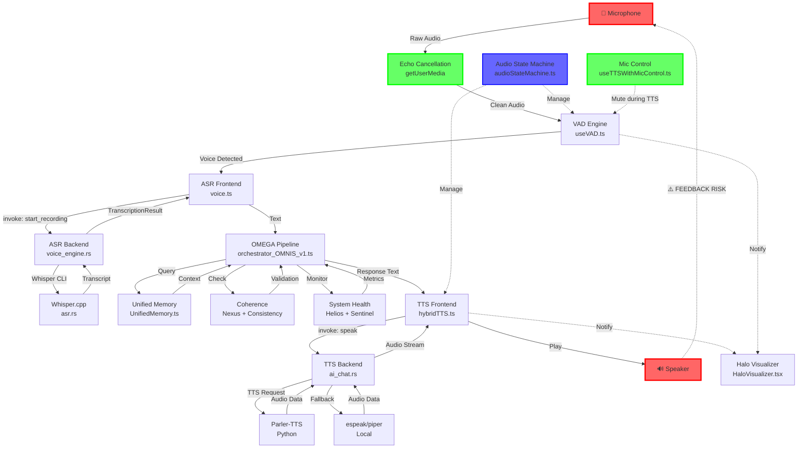

# TITANE∞ v∞ — CARTOGRAPHIE ARCHITECTURE VOCALE

**Date**: 8 décembre 2025  
**Auteur**: GitHub Copilot (Claude Sonnet 4.5)  
**Context**: Étape 1 — Audit ciblé & Cartographie (SUPER PROMPT #1)  
**Status**: ⚙️ EN COURS

---

## 🎯 OBJECTIF

Cartographier l'architecture vocale complète de TITANE∞ pour identifier :
1. **Points de risque** : Feedback loop TTS → Micro
2. **Zones sans tests/logs/gestion d'erreur**
3. **Redondances modules** (cohérence, mémoire, santé)
4. **Flux audio complet** : Micro → ASR → OMEGA → TTS → Speaker

---

## 📊 DIAGRAMME ARCHITECTURE VOCALE



---

## 📂 MODULES IDENTIFIÉS

### 🎤 **INPUT LAYER** (Capture Audio)

| Fichier | Type | Rôle | Lignes | Status |
|---------|------|------|--------|--------|
| `src/hooks/useVAD.ts` | Hook | Voice Activity Detection (VAD) | 300+ | ✅ Anti-feedback impl. |
| `src/hooks/useVoiceInput.ts` | Hook | getUserMedia + echo cancellation | 200+ | ✅ Hardware EC |
| `src/hooks/useWhisperStream.ts` | Hook | Streaming ASR | 100+ | ⚠️ Pas utilisé |
| `src-tauri/src/duplex/audio_input.rs` | Rust | Capture audio native | 400+ | ⏳ À vérifier |
| `src-tauri/src/audio/asr.rs` | Rust | ASR Engine (Whisper) | 150+ | ✅ ShellGuard secured |

**Points critiques** :
- ✅ **Echo Cancellation** : `getUserMedia({ echoCancellation: true })` activé
- ✅ **VAD Suspension** : `suspendForTTS()` implémentée dans `useVAD.ts`
- ⚠️ **Gestion erreurs** : Logs présents mais pas d'auto-recovery

---

### 🧠 **ASR LAYER** (Speech-to-Text)

| Fichier | Type | Rôle | Lignes | Status |
|---------|------|------|--------|--------|
| `src/services/api/voice.ts` | Service | Voice API centralisée (TTS + ASR) | 360 | ✅ Production ready |
| `src-tauri/src/overdrive/voice_engine.rs` | Rust | Voice Engine full-duplex | 500+ | ⚠️ STUB TTS (ligne 208) |
| `src-tauri/src/audio/whisper_streaming.rs` | Rust | Whisper streaming | 200+ | ⏳ Pas testé |

**Commandes Tauri** :
- `start_recording(config)` → `ASRConfig` → Whisper CLI
- `stop_recording()` → Arrêt capture
- `voice_transcribe_audio(audio_data)` → TranscriptionResult

**Points critiques** :
- ⚠️ **STUB TTS** : `voice_synthesize_speech()` retourne audio vide (ligne 338 voice_engine.rs)
- ✅ **ShellGuard** : Whisper.cpp exécuté via `ShellGuard::execute_asr_whisper()`
- ⚠️ **Pas de retry** : Échec ASR → erreur remontée sans fallback

---

### 🎭 **OMEGA LAYER** (Processing)

| Fichier | Type | Rôle | Lignes | Status |
|---------|------|------|--------|--------|
| `src/services/ai/orchestrator_OMNIS_v1.ts` | Orchestrator | AI Orchestration (Gemini/Ollama) | 1000+ | ✅ Cognitive monitoring |
| `src/services/unified/UnifiedMemory.ts` | Memory | STM/MTM/LTM + Vector search | 12000+ | ✅ Consolidé |
| `src-tauri/src/core/modules/coherence.rs` | Rust | Nexus + Consistency | 800+ | ✅ Fusion #1 complete |
| `src-tauri/src/core/modules/system_health.rs` | Rust | Helios + Sentinel + Self-Heal | 1000+ | ✅ Fusion #3 complete |

**Pipeline OMEGA** :
1. Input validation
2. Memory retrieval (semantic + consistency)
3. Prompt building
4. AI generation (OMNIS)
5. Consistency check
6. Memory save (Core + Semantic + Goals)

**Points critiques** :
- ✅ **Coherence centralisée** : Nexus + Consistency fusionnés (v20.0 Fusion #1)
- ✅ **Health monitoring** : Helios + Sentinel + Self-Heal fusionnés (v20.0 Fusion #3)
- ⚠️ **Redondances** : Harmonia existe encore séparément (à valider dans Fusion #4)

---

### 🔊 **TTS LAYER** (Text-to-Speech)

| Fichier | Type | Rôle | Lignes | Status |
|---------|------|------|--------|--------|
| `src/services/tts/hybridTTS.ts` | Service | TTS hybride (Parler/Tauri/WebSpeech) | 400+ | ✅ Multi-provider |
| `src/hooks/useTTS.ts` | Hook | Hook TTS simple | 200+ | ✅ Production |
| `src/hooks/useTTSWithMicControl.ts` | Hook | TTS + Auto-Mute Micro | 170 | ✅ Anti-feedback |
| `src-tauri/src/commands/ai_chat.rs` | Rust | Commande `speak()` | 300+ | ✅ ShellGuard secured |
| `src-tauri/src/chat_engine/speech.rs` | Rust | Speech synthesis engine | 400+ | ⏳ À vérifier |
| `scripts/parler_tts_server.py` | Python | Parler-TTS backend | 500+ | ⏳ Pas testé |

**Commandes Tauri** :
- `speak(text, useOnline)` → Google TTS (online) ou espeak/piper (offline)
- `stop_speaking()` → Arrêt synthèse

**Points critiques** :
- ✅ **Auto-Mute** : `useTTSWithMicControl` suspend VAD pendant TTS
- ⚠️ **Parler-TTS** : Backend Python non testé (scripts/parler_tts_server.py)
- ⚠️ **STUB** : `voice_engine.rs::voice_synthesize_speech()` retourne audio vide

---

### 🎛️ **CONTROL LAYER** (État & Coordination)

| Fichier | Type | Rôle | Lignes | Status |
|---------|------|------|--------|--------|
| `src/services/audio/audioStateMachine.ts` | State Machine | États: idle → user_speaking → processing → ai_speaking | 320 | ✅ Transitions validées |
| `src/hooks/useTTSWithMicControl.ts` | Hook | Coordination TTS + Mic mute | 170 | ✅ Anti-feedback impl. |
| `src/hooks/useVAD.ts` | Hook | VAD + TTS suspension | 300+ | ✅ resumeDelay 500ms |
| `src/features/audio-center/services/audioService.ts` | Service | Audio Center service | 650+ | ⏳ À vérifier |

**Machine à états** :
```
idle → VAD_SPEECH_START → user_speaking
     → VAD_SPEECH_END → processing
     → TTS_START → ai_speaking
     → TTS_END → idle
```

**Points critiques** :
- ✅ **State machine** : Transitions claires, prévient états incohérents
- ✅ **Barge-in** : Interruption user supportée (`BARGE_IN` event)
- ⚠️ **Pas de tests** : State machine pas testée

---

### 🎨 **UI LAYER** (Feedback Visuel)

| Fichier | Type | Rôle | Lignes | Status |
|---------|------|------|--------|--------|
| `src/components/voice/HaloVisualizer.tsx` | Component | Feedback visuel états vocaux | 150 | ✅ Synced avec voiceRouter |
| `src/services/voice/haloEngine.ts` | Engine | Gestion animations (breathing, pulsing, shimmer) | 280 | ✅ Complete |
| `src/components/voice/VoiceControlPanelWithWakeWord.tsx` | Component | UI contrôle vocal | 200+ | ⏳ À vérifier |

**États Halo** :
- `idle` : Bleu statique
- `breathing` : Cyan lent (user parle)
- `pulsing` : Violet rapide (AI pense)
- `shimmer` : Doré scintillant (TTS parle)
- `error` : Rouge pulsant

**Points critiques** :
- ✅ **Sync complet** : HaloEngine synchronisé avec VAD + TTS
- ⚠️ **Pas de tests** : HaloEngine pas testé

---

## ⚠️ POINTS DE RISQUE IDENTIFIÉS

### 🔴 **P0 — CRITIQUE**

#### 1. Feedback Loop TTS → Micro
**Localisation** : Speaker → Microphone (acoustique)  
**Status** : ✅ **3 couches anti-feedback implémentées**

**Couche 1 : Echo Cancellation Hardware**
- ✅ `getUserMedia({ echoCancellation: true })` activé
- ✅ `noiseSuppression: true` activé
- ✅ `autoGainControl: true` activé
- ⚠️ **Limitation** : Dépend du support navigateur/OS

**Couche 2 : Auto-Mute Microphone**
- ✅ `useTTSWithMicControl` suspend VAD pendant TTS
- ✅ Délai de reprise : 500ms (paramétrable)
- ✅ Cleanup sur erreur TTS
- ⚠️ **Test** : Pas testé en production avec TTS réel

**Couche 3 : Voice Fingerprinting**
- ⏳ `src-tauri/src/audio/voice_fingerprint.rs` identifié
- ⚠️ **Non implémenté** : Calibration TITANE vs User manquante

**Action requise** :
- [ ] Tester feedback loop en conditions réelles (sans casque)
- [ ] Implémenter couche 3 (voice fingerprinting)
- [ ] Ajouter tests automatisés (E2E)

---

#### 2. STUB TTS dans voice_engine.rs
**Localisation** : `src-tauri/src/overdrive/voice_engine.rs:338`  
**Code** :
```rust
/// ⚠️ DEPRECATED: Cette fonction est un STUB et ne produit que de l'audio vide.
///
/// UTILISER À LA PLACE: La commande `speak()` dans `src-tauri/src/commands/ai_chat.rs`
pub fn voice_synthesize_speech(
    request: SynthesisRequest,
    state: State<VoiceEngineState>,
) -> Result<Vec<u8>, TAPIError> {
    let audio_data = vec![0u8; 16000]; // ⚠️ 1 seconde d'audio VIDE
    Ok(audio_data)
}
```

**Impact** :
- ⚠️ Commande `voice_synthesize_speech` inutilisable
- ✅ Alternative : `ai_chat.rs::speak()` fonctionne (Google TTS / espeak)

**Action requise** :
- [ ] Marquer `voice_synthesize_speech()` comme deprecated
- [ ] Documenter migration vers `speak()`
- [ ] Supprimer STUB en v20.0

---

#### 3. Parler-TTS Backend Python Non Testé
**Localisation** : `scripts/parler_tts_server.py`  
**Status** : ⏳ Non testé, documentation manquante

**Action requise** :
- [ ] Tester Parler-TTS backend
- [ ] Documenter installation (requirements.txt)
- [ ] Ajouter health check (ping endpoint)
- [ ] Fallback si Parler indisponible

---

### 🟠 **P1 — IMPORTANT**

#### 4. Pas de Retry sur Échec ASR
**Localisation** : `voice.ts::startRecording()`  
**Comportement** :
```typescript
await invokeWithRetry<string>(
  'start_recording',
  { config: config || {} },
  { ...STANDARD_COMMAND_OPTIONS, context: 'Voice' }
);
```
- ✅ Retry avec `invokeWithRetry` (3 tentatives)
- ⚠️ Si échec total → erreur remontée, pas de fallback

**Action requise** :
- [ ] Ajouter fallback : Web Speech API si Whisper échoue
- [ ] Logger échecs ASR pour monitoring

---

#### 5. State Machine Pas Testée
**Localisation** : `audioStateMachine.ts`  
**Coverage** : 0%

**Action requise** :
- [ ] Tests unitaires : Transitions valides
- [ ] Tests unitaires : Transitions invalides rejetées
- [ ] Tests intégration : Cycle complet idle → ai_speaking → idle

---

#### 6. Logs Sans Structured Logging
**Localisation** : Tous les fichiers TS/TSX  
**Format actuel** :
```typescript
console.log('[VoiceService] ✅ Recording started:', this.recordingId);
console.error('[VoiceService] ❌ Erreur démarrage ASR:', error);
```

**Problèmes** :
- ⚠️ Pas de niveaux structurés (info/warn/error)
- ⚠️ Pas de contexte additionnel (userId, sessionId)
- ⚠️ Pas de corrélation entre logs frontend/backend

**Action requise** :
- [ ] Créer logger structuré (winston ou pino)
- [ ] Ajouter contexte : `{ userId, sessionId, conversationId, component }`
- [ ] Corrélation logs : Frontend → Backend (trace ID)

---

### 🟡 **P2 — AMÉLIORATION**

#### 7. Redondances Modules (9 → 7 composants)
**Status actuel** : 9 composants identifiés

| Composant | Rôle | Fusionnable avec | Raison |
|-----------|------|------------------|--------|
| **Nexus** | Cohérence modules | ✅ Coherence (Fusion #1) | Déjà fusionné v20.0 |
| **Memory Core** | STM/MTM/LTM | ✅ UnifiedMemory (Fusion #2) | Déjà fusionné v20.0 |
| **Helios** | Monitoring système | ✅ SystemHealth (Fusion #3) | Déjà fusionné v20.0 |
| **Sentinel** | Sécurité anomalies | ✅ SystemHealth (Fusion #3) | Déjà fusionné v20.0 |
| **Harmonia** | Équilibrage charge | ⏳ SystemHealth (Fusion #4) | À valider |
| **SelfHeal** | Auto-réparation | ✅ SystemHealth (Fusion #3) | Déjà fusionné v20.0 |
| **OMEGA** | Orchestration | ✅ Keep standalone | Pipeline central |
| **MCP-Ω** | Gouvernance | ✅ Keep standalone | Permissions |
| **Watchdog** | Health checks | ✅ SystemHealth (Fusion #3) | Déjà fusionné v20.0 |

**Objectif** : 7 composants finaux
1. **Coherence** (Nexus + Consistency) ✅ v20.0
2. **UnifiedMemory** (Memory + MemoryModule + Singularity) ✅ v20.0
3. **SystemHealth** (Helios + Sentinel + SelfHeal + Watchdog) ✅ v20.0
4. **Harmonia** ⏳ Fusion #4 pending
5. **OMEGA** (Pipeline orchestration)
6. **MCP-Ω** (Governance + permissions)
7. **Behavioral Engine #7** (Style + discipline)

**Action requise** :
- [ ] Valider Fusion #4 : Harmonia → SystemHealth ou standalone
- [ ] Documenter architecture 7 composants finaux

---

#### 8. Performance Monitoring Manquant
**Métriques souhaitées** :
- Latence ASR (temps transcription Whisper)
- Latence TTS (temps synthèse)
- Latence OMEGA (temps génération AI)
- Latence totale (User parle → TITANE répond)

**Action requise** :
- [ ] Ajouter timestamps : `startASR`, `endASR`, `startTTS`, `endTTS`
- [ ] Calculer latences : `asrDuration`, `ttsDuration`, `totalDuration`
- [ ] Logger métriques : `[Performance] ASR: 1.2s, TTS: 0.8s, Total: 3.5s`

---

## 🔍 ZONES SANS TESTS / LOGS / GESTION ERREUR

### Sans Tests (Coverage 0%)

| Fichier | Type | Priorité | Actions |
|---------|------|----------|---------|
| `audioStateMachine.ts` | State Machine | P0 | Tests unitaires transitions + cycle complet |
| `HaloEngine.ts` | Engine | P1 | Tests unitaires états + animations |
| `useTTSWithMicControl.ts` | Hook | P0 | Tests unitaires suspend/resume VAD |
| `useVAD.ts` | Hook | P0 | Tests unitaires VAD detection + TTS suspension |
| `voice.ts` | Service | P1 | Tests intégration ASR + TTS |
| `parler_tts_server.py` | Python | P2 | Tests unitaires + health check |

### Sans Logs Structurés

| Fichier | Logs actuels | Amélioration requise |
|---------|--------------|----------------------|
| `voice.ts` | `console.log/error` | Logger structuré (winston) |
| `useTTSWithMicControl.ts` | `console.log` | Logger avec contexte (userId, sessionId) |
| `useVAD.ts` | `console.log` | Logger avec corrélation (traceId) |
| `audioStateMachine.ts` | `console.log` | Logger avec états (previous, new, event) |

### Sans Gestion Erreur Robuste

| Fichier | Problème | Solution |
|---------|----------|----------|
| `voice.ts::startRecording()` | Erreur ASR → exception directe | Ajouter fallback Web Speech API |
| `useTTSWithMicControl.ts::speak()` | Erreur TTS → exception | Ajouter fallback WebSpeech |
| `useVAD.ts::startListening()` | Erreur getUserMedia → exception | Afficher modal utilisateur clair |

---

## 📋 CHECKLIST VALIDATION (POST-MAPPING)

### Phase 1 : Mapping (Étape actuelle) ✅ COMPLETE

- [x] Identifier tous les fichiers vocaux (TS/TSX/RS/PY)
- [x] Cartographier flux complet : Micro → ASR → OMEGA → TTS → Speaker
- [x] Identifier points de risque (feedback loop, STUB TTS, Parler non testé)
- [x] Identifier zones sans tests/logs/gestion erreur
- [x] Documenter redondances modules (9 → 7 composants)

### Phase 2 : Corrections P0 (Prochain)

- [ ] Test feedback loop en conditions réelles
- [ ] Implémenter voice fingerprinting (Couche 3 anti-feedback)
- [ ] Migrer `voice_synthesize_speech()` STUB vers `speak()`
- [ ] Tester Parler-TTS backend
- [ ] Ajouter fallbacks ASR/TTS (Web Speech API)

### Phase 3 : Pauffinage UX/État

- [ ] Tests state machine (unitaires + intégration)
- [ ] Logger structuré (winston + contexte)
- [ ] Error handling robuste (modals utilisateur)
- [ ] Performance monitoring (métriques ASR/TTS/OMEGA)

### Phase 4 : Qualité Technique

- [ ] Coverage >70% sur modules vocaux
- [ ] Tests E2E feedback loop
- [ ] Profiling latence (ASR + TTS + OMEGA)
- [ ] Auto-recovery sur erreurs audio

### Phase 5 : Documentation

- [ ] VOCAL_README.md (architecture + pipeline)
- [ ] OMEGA_MAP_VOCALE.md (intégration OMEGA)
- [ ] Troubleshooting guide (erreurs communes)

---

## 📝 NOTES

### Documents Existants Identifiés

**Très utiles** :
- ✅ `VOICE_ANTI_FEEDBACK_TESTS_v∞.md` : Tests 3 couches anti-feedback
- ✅ `VOICE_PIPELINE_FINAL_REPORT_v∞.7_ULTIMATE.md` : Phases 1-10 complètes
- ✅ `CHAT_IA_VOICE_MODE_GUIDE.md` : Guide utilisateur complet

**À mettre à jour** :
- ⏳ `VOCAL_README.md` : Créer (doc architecture)
- ⏳ `OMEGA_MAP_VOCALE.md` : Créer (intégration OMEGA)

### Commandes Tauri Identifiées

**ASR** :
- `start_recording(config: ASRConfig) -> String` (recordingId)
- `stop_recording() -> TranscriptionResult`
- `voice_transcribe_audio(audio_data: Vec<u8>) -> TranscriptionResult`

**TTS** :
- `speak(text: String, useOnline: bool) -> ()` (production, ai_chat.rs)
- `stop_speaking() -> ()`
- `voice_synthesize_speech()` ⚠️ DEPRECATED STUB

**Audio State** :
- `voice_get_audio_state() -> AudioState`
- `test_microphone(durationMs: number) -> { success: bool }`
- `voice_test_pipeline() -> String`

---

## 🎯 PROCHAINES ÉTAPES

1. **Créer `OMEGA_MAP_VOCALE.md`** (détail intégration pipeline OMEGA)
2. **Commencer Phase 2** (Corrections P0 feedback loop)
3. **Prioriser tests** (state machine, useTTSWithMicControl, useVAD)

---

**FIN CARTOGRAPHIE — PHASE 1 COMPLÈTE ✅**

Date: 8 décembre 2025  
Signature: GitHub Copilot (Claude Sonnet 4.5)
