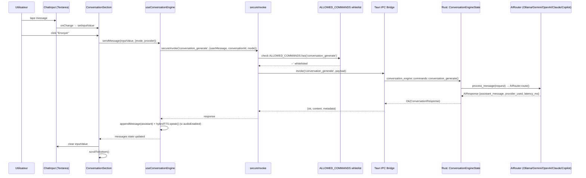
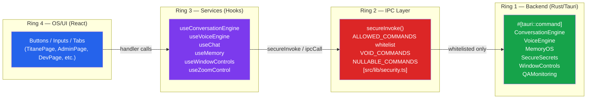
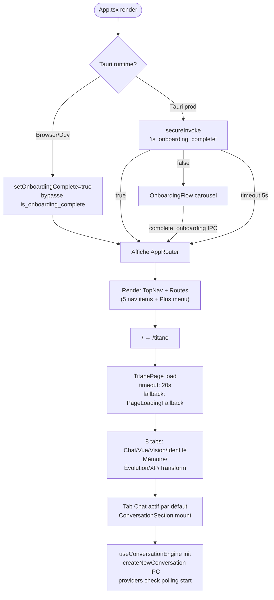

# Diagrammes UI Interactive Map
**Version:** 27.2.0 | **Date:** 2026-03-03T19:50:39Z

---

## 1. Navigation Graph

```mermaid
graph TD
    TOPNAV[TopNav — Navigation principale] --> TITANE["/titane ⭐ TitanePage"]
    TOPNAV --> TIME["/time — TimePage"]
    TOPNAV --> STATS["/stats — Stats"]
    TOPNAV --> ADMIN["/admin — AdminPage"]
    TOPNAV --> DEV["/dev — DevPage"]
    TOPNAV --> PLUS["Plus Menu ▼"]
    PLUS --> FUSION["/fusion — PerfectFusionDashboard"]
    PLUS --> OPTIMIZE["/optimization — UltimateOptimizationDashboard"]

    ROOT["/"] -->|redirect| TITANE
    CHAT["/chat"] -->|redirect| TITANE
    CAMERA["/camera"] -->|redirect| TITANE
    EVO["/evo"] -->|redirect| TITANE
    COGNITIVE["/cognitive"] -->|redirect| STATS
    SETTINGS_R["/settings"] -->|redirect| ADMIN
    TEMPORAL["/temporal-center, /agenda, /time-navigator"] -->|redirect| TIME
    DEVMODES["/developer-mode, /qa-monitoring, /ia-dev, etc."] -->|redirect| DEV

    TITANE --> T_CHAT["Tab 💬 Chat → ConversationSection"]
    TITANE --> T_VUE["Tab 📊 Vue → OverviewSection"]
    TITANE --> T_VISION["Tab 📷 Vision → VisionSection"]
    TITANE --> T_ID["Tab 🧬 Identité → IdentitySection"]
    TITANE --> T_MEM["Tab 💾 Mémoire → MemorySection"]
    TITANE --> T_EVO["Tab 🔄 Évolution → MemoryEvolutionSection"]
    TITANE --> T_XP["Tab ⚡ XP → ProgressionSection"]
    TITANE --> T_TRANS["Tab 🌱 Transform → TransformationSection"]

    HIDDEN["Routes moteurs\n(URL directe uniquement)"]
    HIDDEN --> OI["/orchestration-intelligence"]
    HIDDEN --> RC["/reality-center"]
    HIDDEN --> QC["/quantum-center"]
    HIDDEN --> IC["/identity-center"]
    HIDDEN --> ME["/memory-evolution"]
    HIDDEN --> CL["/cloud"]
    HIDDEN --> SN["/singularity"]
    HIDDEN --> WD["/watchdog"]

    style TITANE fill:#1e40af,color:#fff
    style TOPNAV fill:#0f172a,color:#00d4ff
    style HIDDEN fill:#4b5563,color:#d1d5db
```

---

## 2. Flux d'Action — Envoi Message Chat

---

## 3. Architecture 4-Ring (Sécurité IPC)

---

## 4. Onboarding Boot Flow

