# TITANE∞ — API & Function Map

> Version: 30.1.5 · IPC Contract: `{ ok, content, error }` · Architecture: 4-Ring, One-Door

Ce document cartographie l'intégralité des commandes Tauri IPC exposées par TITANE∞, regroupées par domaine fonctionnel. Chaque commande est invoquée côté frontend via `secureInvoke()` / `safeInvokeCanonical()` (cf. `src/lib/security.ts`).

---

## Vue d'ensemble — Architecture One-Door

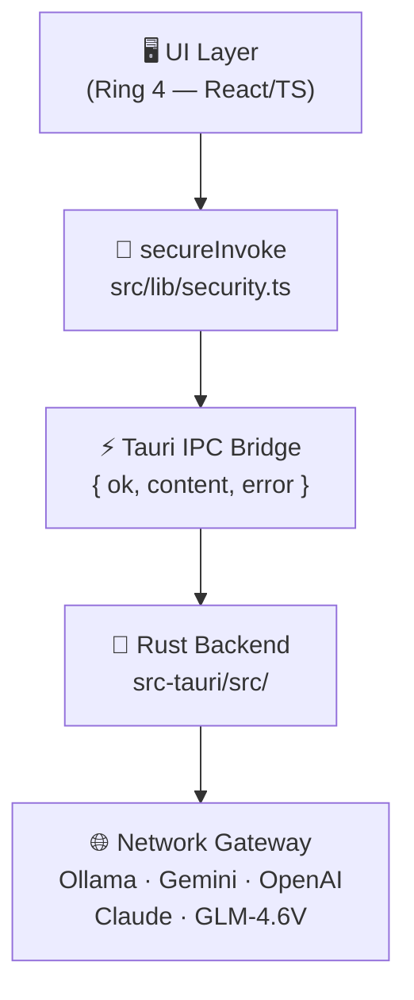

---

## 1. Chat & Génération IA

### 1.1 Commandes IPC — Chat principal

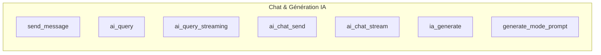

| Commande | Fichier source | Description |
|----------|---------------|-------------|
| `send_message` | `commands/chat.rs` | Envoi de message canonique (One-Door) |
| `ai_query` | `commands/ai_chat.rs` | Requête IA synchrone |
| `ai_query_streaming` | `commands/ai_chat.rs` | Requête IA avec streaming SSE |
| `ai_chat_send` | `commands/ai_chat.rs` | Chat IA avec gestion de session |
| `ai_chat_stream` | `commands/ai_chat.rs` | Chat IA en streaming |
| `ia_generate` | `commands/ia_commands.rs` | Génération via moteur IA actif |
| `generate_mode_prompt` | `commands/ai_prompt_generator.rs` | Génération de prompt selon le mode actif |

### 1.2 Commandes IPC — Providers cloud

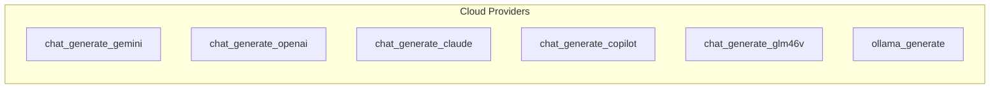

| Commande | Provider | Fichier source |
|----------|----------|---------------|
| `chat_generate_gemini` | Google Gemini | `commands/chat_generate_commands.rs` |
| `chat_generate_openai` | OpenAI GPT | `commands/chat_generate_commands.rs` |
| `chat_generate_claude` | Anthropic Claude | `commands/chat_generate_commands.rs` |
| `chat_generate_copilot` | GitHub Copilot | `commands/copilot_commands.rs` |
| `chat_generate_glm46v` | GLM-4.6V | `commands/glm46v_commands.rs` |
| `ollama_generate` | Ollama (local) | `commands/ollama_command.rs` |

---

## 2. Gestion des conversations

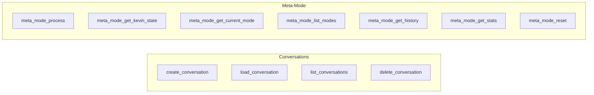

| Commande | Fichier source | Description |
|----------|---------------|-------------|
| `create_conversation` | `commands/ai_chat.rs` | Créer une nouvelle conversation |
| `load_conversation` | `commands/ai_chat.rs` | Charger une conversation existante |
| `list_conversations` | `commands/ai_chat.rs` | Lister toutes les conversations |
| `delete_conversation` | `commands/ai_chat.rs` | Supprimer une conversation |
| `meta_mode_process` | `commands/meta_mode.rs` | Traiter un message selon le méta-mode |
| `meta_mode_get_kevin_state` | `commands/meta_mode.rs` | État Kevin (mode personnalisé) |
| `meta_mode_get_current_mode` | `commands/meta_mode.rs` | Mode actif courant |
| `meta_mode_list_modes` | `commands/meta_mode.rs` | Lister tous les modes disponibles |
| `meta_mode_get_history` | `commands/meta_mode.rs` | Historique des modes utilisés |
| `meta_mode_get_stats` | `commands/meta_mode.rs` | Statistiques du méta-mode |
| `meta_mode_reset` | `commands/meta_mode.rs` | Réinitialiser le méta-mode |

---

## 3. Voix & Audio

```mermaid
flowchart TD
    subgraph Voice["Voice Pipeline"]
        start["voice_start_listening"] --> wakeword["voice_detect_wake_word"]
        wakeword --> transcribe["voice_transcribe_audio"]
        transcribe --> synth["voice_synthesize_speech"]
        synth --> stop["voice_stop_speaking"]
    end
    subgraph Whisper["Whisper Streaming"]
        ws_start["start_whisper_streaming"] --> chunk["send_audio_chunk"]
        chunk --> ws_stop["stop_whisper_streaming"]
    end
    subgraph TTS["TTS"]
        tts_speak["tts_speak"]
        tts_stop["tts_stop"]
    end
    subgraph AudioCapture["Audio Capture"]
        ac_start["audio_capture_start"] --> ac_status["audio_capture_status"]
        ac_status --> ac_stop["audio_capture_stop"]
        ac_stop --> ac_export["audio_capture_export_wav"]
    end
```

| Commande | Fichier source | Description |
|----------|---------------|-------------|
| `voice_start_listening` | `commands/` | Démarrer l'écoute microphone |
| `voice_stop_listening` | `commands/` | Arrêter l'écoute |
| `voice_transcribe_audio` | `commands/` | Transcrire un buffer audio |
| `voice_synthesize_speech` | `commands/` | Synthétiser un texte en audio |
| `voice_detect_wake_word` | `commands/` | Détection du mot de réveil |
| `voice_stop_speaking` | `commands/` | Arrêter la synthèse vocale |
| `voice_get_status` | `commands/` | État du pipeline voix |
| `voice_get_config` | `commands/` | Configuration voix actuelle |
| `voice_update_config` | `commands/` | Mettre à jour la configuration voix |
| `voice_calibrate_microphone` | `commands/` | Calibrer le microphone |
| `voice_is_recording` | `commands/` | Vérifier si enregistrement en cours |
| `voice_play_audio` | `commands/` | Jouer un buffer audio |
| `voice_test_pipeline` | `commands/` | Test complet du pipeline voix |
| `start_whisper_streaming` | `commands/whisper_commands.rs` | Démarrer le streaming Whisper |
| `stop_whisper_streaming` | `commands/whisper_commands.rs` | Arrêter le streaming Whisper |
| `send_audio_chunk` | `commands/whisper_commands.rs` | Envoyer un chunk audio au moteur Whisper |
| `transcribe_audio` | (overdrive) | Transcription via Overdrive |
| `tts_speak` | (tts module) | Synthèse vocale TTS |
| `tts_stop` | (tts module) | Arrêter TTS |
| `tts_generate_test_buffer` | (tts module) | Générer un buffer TTS de test |
| `audio_capture_start` | `audio/commands.rs` | Démarrer la capture audio |
| `audio_capture_stop` | `audio/commands.rs` | Arrêter la capture |
| `audio_capture_status` | `audio/commands.rs` | État de la capture |
| `audio_capture_get_chunk` | `audio/commands.rs` | Lire un chunk capturé |
| `audio_capture_export_wav` | `audio/commands.rs` | Exporter la capture en WAV |
| `audio_list_devices` | `audio/commands.rs` | Lister les périphériques audio |
| `analyze_audio` | (multimodal) | Analyser un fichier audio |
| `voice_extract_mfcc` | `commands/voice_dsp_commands.rs` | Extraire les MFCC d'un buffer audio |

---

## 4. Mémoire

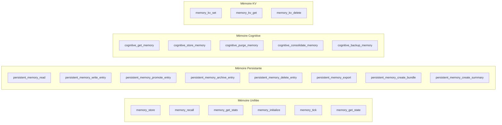

| Domaine | Commande | Description |
|---------|----------|-------------|
| Unifiée | `memory_store` | Stocker une entrée mémoire |
| Unifiée | `memory_recall` | Rappeler des entrées mémoire |
| Unifiée | `memory_get_stats` | Statistiques mémoire |
| Unifiée | `memory_initialize` | Initialiser le moteur mémoire |
| Unifiée | `memory_tick` | Tick de maintenance mémoire |
| Unifiée | `memory_get_state` | État global de la mémoire |
| Persistante | `persistent_memory_read` | Lire entrées persistantes |
| Persistante | `persistent_memory_write_entry` | Écrire une entrée persistante |
| Persistante | `persistent_memory_promote_entry` | Promouvoir une entrée |
| Persistante | `persistent_memory_archive_entry` | Archiver une entrée |
| Persistante | `persistent_memory_delete_entry` | Supprimer une entrée |
| Persistante | `persistent_memory_export` | Exporter la mémoire persistante |
| Persistante | `persistent_memory_create_bundle` | Créer un bundle mémoire |
| Persistante | `persistent_memory_create_summary` | Créer un résumé de mémoire |
| Persistante | `persistent_memory_get_context` | Récupérer le contexte mémoire |
| Cognitive | `cognitive_get_memory` | Lire la mémoire cognitive |
| Cognitive | `cognitive_store_memory` | Stocker en mémoire cognitive |
| Cognitive | `cognitive_purge_memory` | Purger la mémoire cognitive |
| Cognitive | `cognitive_consolidate_memory` | Consolider la mémoire |
| Cognitive | `cognitive_backup_memory` | Sauvegarder la mémoire |
| KV | `memory_kv_set` | Écrire une valeur clé-valeur |
| KV | `memory_kv_get` | Lire une valeur clé-valeur |
| KV | `memory_kv_delete` | Supprimer une valeur KV |
| Compact | `compact_memory_file` | Compacter un fichier mémoire |
| Compact | `compact_memory_directory` | Compacter un répertoire mémoire |
| Compact | `auto_compact_memory` | Compaction automatique |
| Compact | `validate_memory_file` | Valider un fichier mémoire |
| OS | `memory_clear` | Vider la mémoire OS |
| OS | `memory_promote` | Promouvoir une entrée OS |
| OS | `memory_demote` | Dégrader une entrée OS |
| OS | `memory_delete` | Supprimer une entrée OS |
| OS | `memory_prune` | Élaguer la mémoire OS |
| Neurale | `selfheal_rebuild_memory` | Reconstruire la mémoire via selfheal |
| Vecteur | `vector_store_init` | Initialiser le vector store |
| Vecteur | `vector_store_insert` | Insérer un vecteur |
| Vecteur | `vector_store_get` | Récupérer un vecteur |
| Vecteur | `vector_store_update` | Mettre à jour un vecteur |
| Vecteur | `vector_store_delete` | Supprimer un vecteur |
| Vecteur | `vector_store_get_stats` | Statistiques du vector store |
| Vecteur | `vector_search` | Recherche vectorielle |
| RAG | `rag_generate_embedding` | Générer un embedding unique |
| RAG | `rag_generate_embeddings` | Générer des embeddings en batch |

---

## 5. Orchestration & Gouvernance IA

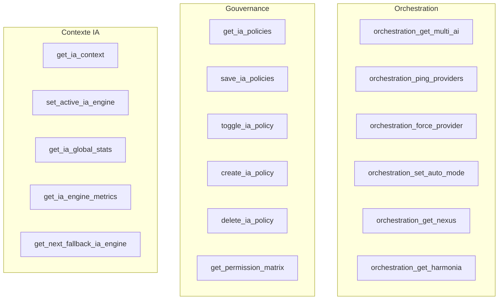

| Domaine | Commande | Description |
|---------|----------|-------------|
| Orchestration | `orchestration_get_multi_ai` | État multi-IA |
| Orchestration | `orchestration_ping_providers` | Tester les providers disponibles |
| Orchestration | `orchestration_force_provider` | Forcer un provider spécifique |
| Orchestration | `orchestration_set_auto_mode` | Mode sélection automatique |
| Orchestration | `orchestration_get_nexus` | État du Nexus cognitif |
| Orchestration | `orchestration_update_nexus_node` | Mettre à jour un nœud Nexus |
| Orchestration | `orchestration_get_harmonia` | État Harmonia |
| Orchestration | `orchestration_throttle_flow` | Limiter le débit de flux |
| Orchestration | `orchestration_get_unified_state` | État unifié de l'orchestration |
| Gouvernance | `get_ia_policies` | Lire les politiques IA |
| Gouvernance | `save_ia_policies` | Sauvegarder les politiques |
| Gouvernance | `toggle_ia_policy` | Activer/désactiver une politique |
| Gouvernance | `create_ia_policy` | Créer une politique |
| Gouvernance | `delete_ia_policy` | Supprimer une politique |
| Gouvernance | `get_permission_matrix` | Matrice de permissions |
| Contexte IA | `get_ia_context` | Contexte IA global |
| Contexte IA | `get_ia_global_stats` | Statistiques globales IA |
| Contexte IA | `set_active_ia_engine` | Définir le moteur IA actif |
| Contexte IA | `update_available_ia_engines` | Mettre à jour les moteurs disponibles |
| Contexte IA | `update_ia_engine_status` | Statut d'un moteur IA |
| Contexte IA | `record_ia_request` | Enregistrer une requête IA |
| Contexte IA | `get_ia_engine_metrics` | Métriques d'un moteur IA |
| Contexte IA | `get_ia_request_history` | Historique des requêtes IA |
| Contexte IA | `get_next_fallback_ia_engine` | Prochain moteur de fallback |
| Contexte IA | `set_ia_auto_fallback` | Activer le fallback automatique |
| Contexte IA | `set_ia_fallback_order` | Définir l'ordre de fallback |

---

## 6. Santé système & Auto-heal

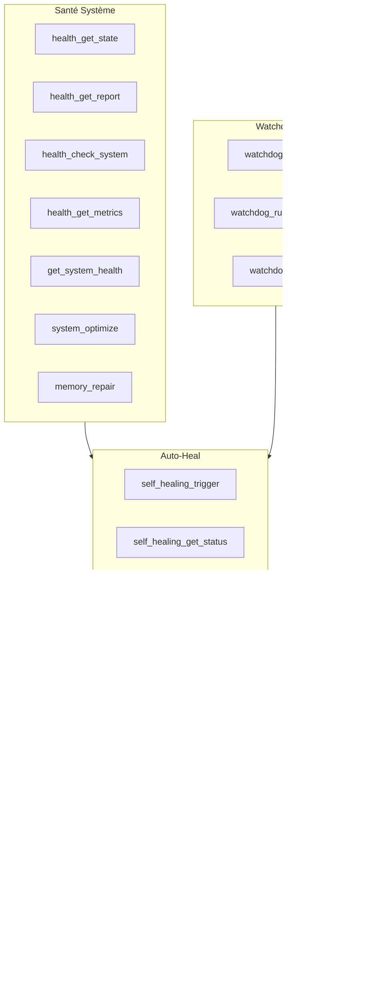

| Domaine | Commande | Description |
|---------|----------|-------------|
| Santé | `health_get_state` | État de santé global |
| Santé | `health_get_report` | Rapport de santé détaillé |
| Santé | `health_check_system` | Vérification complète du système |
| Santé | `health_check` | Vérification rapide |
| Santé | `health_initialize` | Initialiser le module santé |
| Santé | `health_set_auto_heal` | Activer l'auto-heal |
| Santé | `health_get_metrics` | Métriques de santé |
| Santé | `get_system_health` | État de santé système |
| Santé | `system_optimize` | Optimiser le système |
| Santé | `memory_repair` | Réparer la mémoire |
| Santé | `check_core_health` | Santé du Core |
| Watchdog | `watchdog_scan` | Scan complet watchdog |
| Watchdog | `watchdog_run_selftest` | Auto-test watchdog |
| Watchdog | `watchdog_fix` | Correction automatique watchdog |
| Auto-Heal | `self_healing_trigger` | Déclencher le self-healing |
| Auto-Heal | `self_healing_get_status` | Statut self-healing |
| Auto-Heal | `self_healing_enable` | Activer self-healing |
| Auto-Heal | `self_healing_disable` | Désactiver self-healing |
| Auto-Heal | `selfheal_get_vitals` | Signes vitaux du système |
| Auto-Heal | `selfheal_load_profile` | Charger un profil de guérison |
| Auto-Heal | `selfheal_save_profile` | Sauvegarder un profil |
| Auto-Heal | `selfheal_restart_module` | Redémarrer un module |
| Auto-Heal | `selfheal_clear_cache` | Vider le cache |
| Auto-Heal | `selfheal_regenerate_config` | Régénérer la configuration |
| Auto-Heal | `selfheal_repair_json` | Réparer un fichier JSON corrompu |
| Auto-Heal | `selfheal_rebuild_memory` | Reconstruire la mémoire |
| Auto-Heal | `selfheal_switch_provider` | Changer de provider |
| Auto-Heal | `selfheal_reset_state` | Réinitialiser l'état |
| Auto-Heal | `auto_heal_scan` | Scan auto-heal |
| Auto-Heal | `auto_heal_repair` | Réparation auto-heal |
| Auto-Heal | `auto_heal_get_logs` | Logs auto-heal |

---

## 7. Sécurité & Authentification

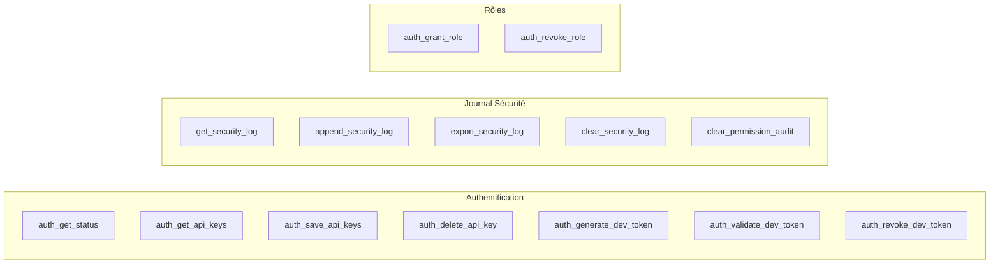

| Domaine | Commande | Description |
|---------|----------|-------------|
| Auth | `auth_get_status` | Statut d'authentification |
| Auth | `auth_get_api_keys` | Lire les clés API stockées |
| Auth | `auth_save_api_keys` | Sauvegarder les clés API |
| Auth | `auth_delete_api_key` | Supprimer une clé API |
| Auth | `auth_generate_dev_token` | Générer un token développeur |
| Auth | `auth_validate_dev_token` | Valider un token développeur |
| Auth | `auth_revoke_dev_token` | Révoquer un token développeur |
| Auth | `auth_grant_role` | Attribuer un rôle |
| Auth | `auth_revoke_role` | Révoquer un rôle |
| Auth | `set_api_key` | Définir une clé API provider |
| Auth | `delete_api_key` | Supprimer une clé API provider |
| Auth | `test_api_key` | Tester une clé API |
| Auth | `list_ai_providers` | Lister les providers IA disponibles |
| Journal | `get_security_log` | Lire le journal de sécurité |
| Journal | `append_security_log` | Ajouter une entrée au journal |
| Journal | `export_security_log` | Exporter le journal |
| Journal | `clear_security_log` | Effacer le journal |
| Journal | `clear_permission_audit` | Effacer l'audit de permissions |

---

## 8. Moteurs cognitifs & Evolution

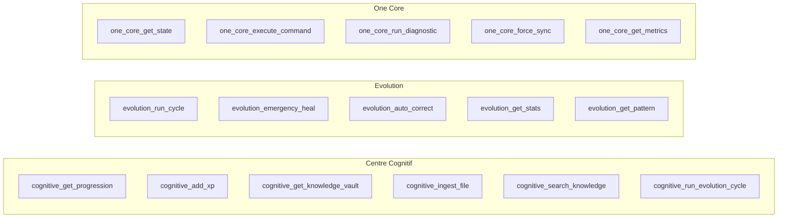

| Domaine | Commande | Description |
|---------|----------|-------------|
| Cognitif | `cognitive_analyze` | Analyser un message cognitif |
| Cognitif | `cognitive_integrate` | Intégrer une donnée cognitive |
| Cognitif | `cognitive_learn` | Apprentissage cognitif |
| Cognitif | `cognitive_get_status` | Statut cognitif |
| Cognitif | `cognitive_optimize` | Optimiser le moteur cognitif |
| Cognitif | `cognitive_get_progression` | Progression cognitive |
| Cognitif | `cognitive_add_xp` | Ajouter des points d'expérience |
| Cognitif | `cognitive_reset_progression` | Réinitialiser la progression |
| Cognitif | `cognitive_get_knowledge_vault` | Vault de connaissances |
| Cognitif | `cognitive_ingest_file` | Ingérer un fichier de connaissance |
| Cognitif | `cognitive_search_knowledge` | Rechercher dans la base de connaissance |
| Cognitif | `cognitive_delete_knowledge` | Supprimer une connaissance |
| Cognitif | `cognitive_get_evolution` | État d'évolution cognitive |
| Cognitif | `cognitive_run_evolution_cycle` | Lancer un cycle d'évolution |
| Cognitif | `cognitive_add_changelog` | Ajouter une entrée changelog |
| Cognitif | `cognitive_get_unified_state` | État cognitif unifié |
| Cohérence | `coherence_get_state` | État de cohérence |
| Cohérence | `coherence_check_system` | Vérifier la cohérence système |
| Cohérence | `coherence_validate_connections` | Valider les connexions |
| Cohérence | `coherence_get_score` | Score de cohérence |
| Cohérence | `coherence_initialize` | Initialiser le module cohérence |
| Evolution | `evolution_run_cycle` | Lancer un cycle d'évolution |
| Evolution | `evolution_safe_reset` | Réinitialisation sécurisée |
| Evolution | `evolution_emergency_heal` | Guérison d'urgence |
| Evolution | `evolution_auto_correct` | Correction automatique |
| Evolution | `evolution_store_memory` | Stocker en mémoire évolutive |
| Evolution | `evolution_recall_memory` | Rappeler depuis mémoire évolutive |
| Evolution | `evolution_get_stats` | Statistiques d'évolution |
| Evolution | `evolution_get_pattern` | Obtenir un pattern évolutif |
| Evolution | `evolution_detect_inconsistencies` | Détecter des incohérences |
| Evolution | `evolution_record_prediction` | Enregistrer une prédiction |
| One Core | `one_core_get_state` | État du One Core |
| One Core | `one_core_get_engine_status` | Statut des moteurs |
| One Core | `one_core_list_commands` | Lister les commandes disponibles |
| One Core | `one_core_execute_command` | Exécuter une commande core |
| One Core | `one_core_run_diagnostic` | Diagnostic complet |
| One Core | `one_core_get_metrics` | Métriques du core |
| One Core | `one_core_force_sync` | Forcer la synchronisation |
| One Core | `one_core_cleanup` | Nettoyage du core |
| One Core | `one_core_set_mode` | Définir le mode du core |
| One Core | `one_core_verify_integrity` | Vérifier l'intégrité |

---

## 9. Système & Diagnostic

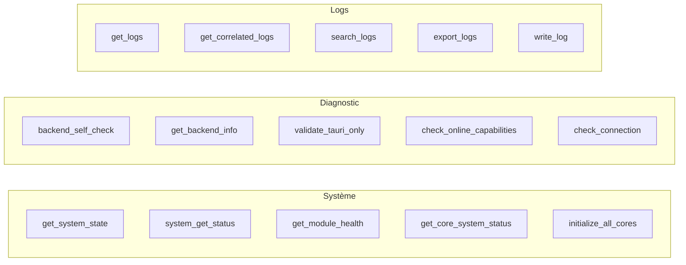

| Domaine | Commande | Description |
|---------|----------|-------------|
| Système | `get_system_state` | État global du système |
| Système | `system_get_status` | Statut du système |
| Système | `get_module_health` | Santé d'un module |
| Système | `get_core_system_status` | Statut du core système |
| Système | `initialize_all_cores` | Initialiser tous les cores |
| Système | `shutdown_all_cores` | Arrêter tous les cores |
| Système | `ping` | Ping du bridge |
| Diagnostic | `backend_self_check` | Auto-vérification backend |
| Diagnostic | `get_backend_info` | Informations backend |
| Diagnostic | `validate_tauri_only` | Valider le mode Tauri-only |
| Diagnostic | `check_online_capabilities` | Vérifier les capacités online |
| Diagnostic | `check_connection` | Vérifier la connectivité |
| Logs | `get_logs` | Lire les logs |
| Logs | `get_correlated_logs` | Logs corrélés |
| Logs | `search_logs` | Rechercher dans les logs |
| Logs | `export_logs` | Exporter les logs |
| Logs | `write_log` | Écrire une entrée de log |
| Logs | `write_snapshot` | Écrire un snapshot |

---

## 10. Réseau & Web

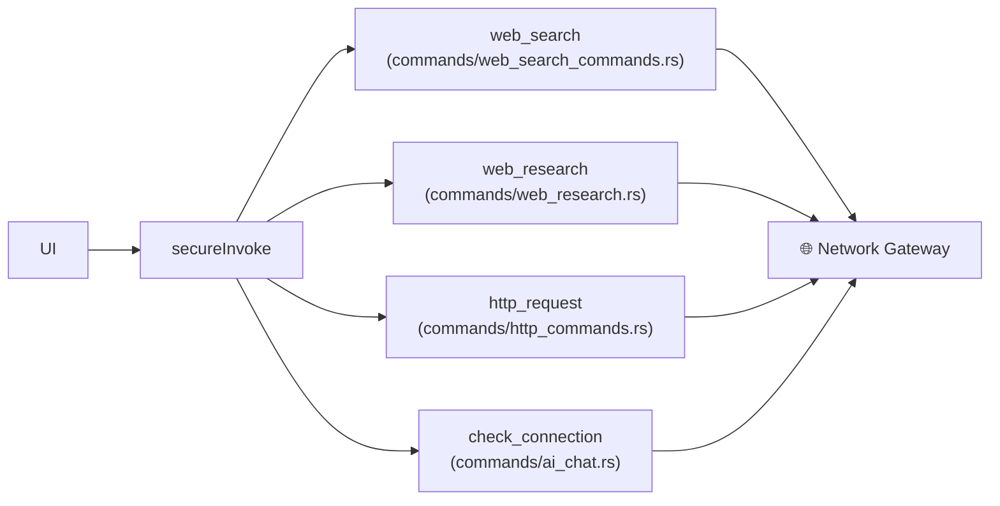

| Commande | Fichier source | Description |
|----------|---------------|-------------|
| `web_search` | `commands/web_search_commands.rs` | Recherche web |
| `web_research` | `commands/web_research.rs` | Recherche documentaire avancée |
| `http_request` | `commands/http_commands.rs` | Requête HTTP générique |
| `check_connection` | `commands/ai_chat.rs` | Vérifier la connectivité réseau |
| `ping_gemini` | `commands/orchestration_center.rs` | Ping du service Gemini |
| `ping_ollama` | `commands/orchestration_center.rs` | Ping du service Ollama |
| `test_gemini_services` | `commands/orchestration_center.rs` | Test des services Gemini |
| `test_copilot_connection` | `commands/copilot_commands.rs` | Test connexion Copilot |
| `api_test_connection` | (api module) | Test de connexion API |
| `api_request` | (api module) | Requête API générique |

---

## 11. Opérateurs (IDE, Desktop, Browser, Job)

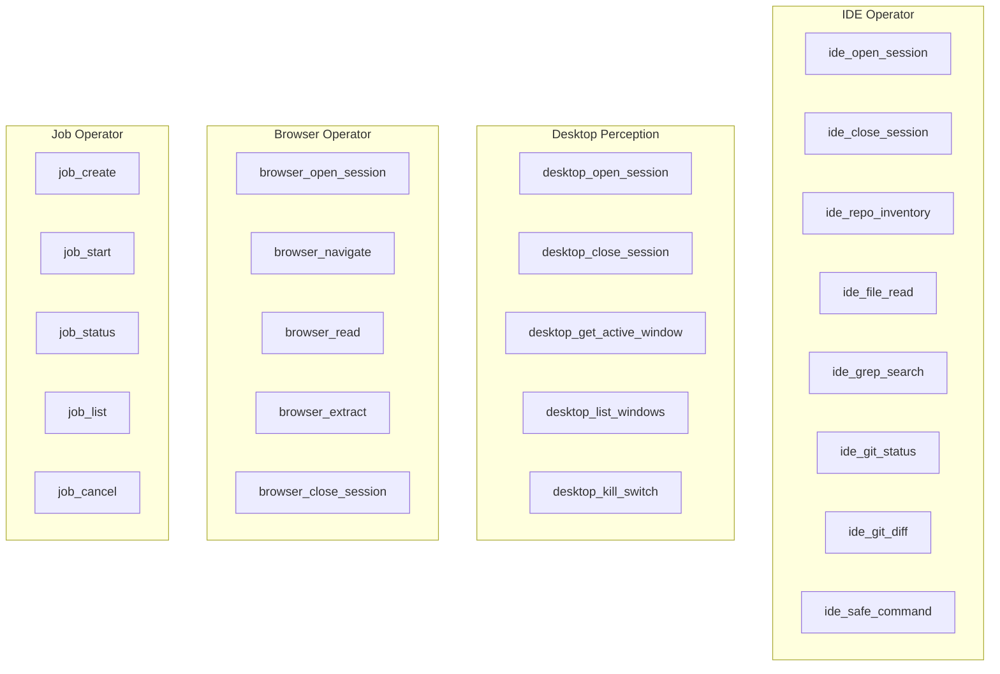

---

## 12. XP / EXP Fusion & Identité

| Commande | Fichier source | Description |
|----------|---------------|-------------|
| `exp_get_global_state` | `commands/exp_fusion.rs` | État global EXP/XP |
| `exp_get_categories` | `commands/exp_fusion.rs` | Catégories EXP |
| `exp_get_projects` | `commands/exp_fusion.rs` | Projets EXP |
| `exp_get_project_stats` | `commands/exp_fusion.rs` | Statistiques projet EXP |
| `exp_get_talents` | `commands/exp_fusion.rs` | Talents débloqués |
| `exp_get_timeline` | `commands/exp_fusion.rs` | Timeline EXP |
| `exp_get_timeline_stats` | `commands/exp_fusion.rs` | Statistiques timeline |
| `exp_add_knowledge` | `commands/exp_fusion.rs` | Ajouter une connaissance EXP |
| `xp_get_state` | (xp module) | État XP courant |
| `xp_sync_state` | (xp module) | Synchroniser l'état XP |
| `twin_get_identity` | (digital twin) | Identité du jumeau numérique |
| `twin_get_state` | (digital twin) | État du jumeau numérique |
| `twin_get_fusion_index` | (digital twin) | Index de fusion |
| `twin_submit_observation` | (digital twin) | Soumettre une observation |
| `twin_validate_sync` | (digital twin) | Valider la synchronisation |
| `twin_apply_evolution` | (digital twin) | Appliquer une évolution |
| `training_enable` | (training) | Activer le mode training |
| `training_start_session` | (training) | Démarrer une session d'apprentissage |
| `training_learn_pattern` | (training) | Apprendre un pattern |
| `training_record_feedback` | (training) | Enregistrer un feedback |
| `training_export_patterns` | (training) | Exporter les patterns appris |
| `training_verify_kevin` | (training) | Vérifier l'identité Kevin |

---

## Flux IPC canonique

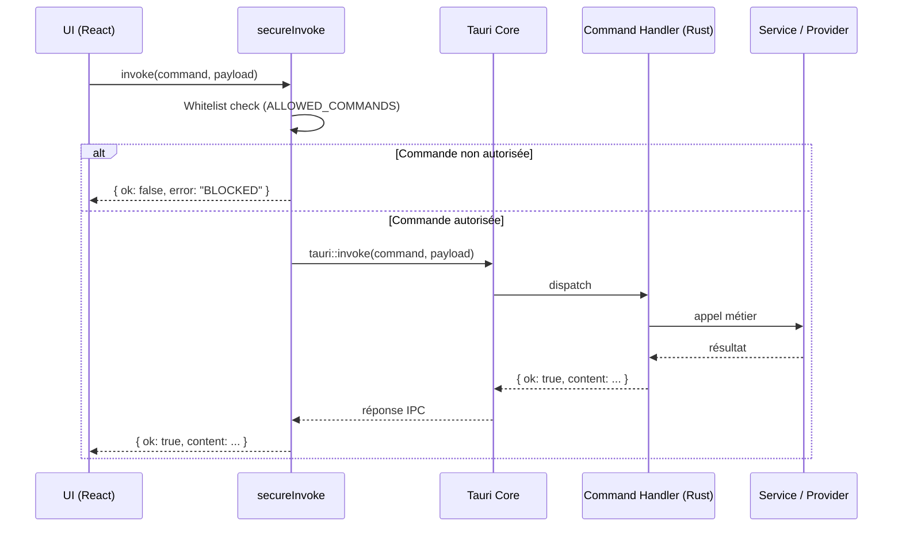

---

## Contrat IPC

Toutes les commandes retournent le format canonique :

```typescript
interface IPCResponse<T = unknown> {
  ok: boolean;
  content?: T;
  error?: string;
}
```

Les appels se font via `safeInvokeCanonical()` qui **ne lève jamais d'exception** :
- En cas d'échec Tauri : `{ ok: false, error: "<message>" }`
- En cas de succès : `{ ok: true, content: <payload> }`

---

*Généré automatiquement · TITANE∞ v30.1.5 · 2026-04-13*
