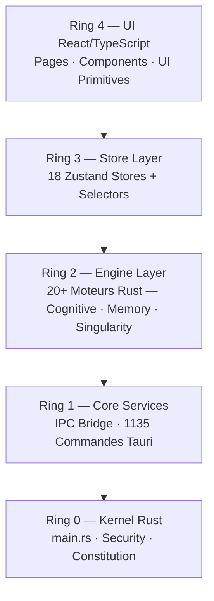

# Architecture TITANE∞ v30.1.0

> **Cartographie complète mise à jour le 2026-04-11**
>
> Voir les documents de cartographie complète :
> - 📊 [Cartographie Complète Avancée](./CARTOGRAPHY_COMPLETE.md)
> - 🔗 [Catalogue IPC Exhaustif](./IPC_CATALOG.md)
> - 📦 [Carte des Dépendances](./DEPENDENCY_MAP.md)

## 📊 Métriques du Projet v30.1.0

| Métrique | Valeur |
|---------|--------|
| Fichiers TypeScript/TSX | 1 668 |
| Fichiers Rust (.rs) | 880 |
| Commandes IPC Tauri | 1 135 |
| Stores Zustand | 18 |
| Hooks custom | 96 |
| Pages React | 45+ |
| Lignes TS/TSX total | 530 579 |
| Lignes Rust total | 294 556 |

## 🏛️ Architecture 4-Ring



---

# Architecture TITANE∞ v8.0

## 📐 Vue d'Ensemble

TITANE∞ est construit sur une architecture **modulaire, décentralisée et adaptative** qui permet une évolution continue et une résilience maximale.

## Diagrams

- Mermaid canon: [docs/diagrams/README.md](../README.md)
- Anneaux: [architecture_4_ring](diagrams/rendered/architecture_4_ring.md)
- Flux: [data_flow_chat](diagrams/rendered/data_flow_chat.md)

## 🏛️ Architecture Globale

```
┌─────────────────────────────────────────────────────────┐
│                   INTERFACE UTILISATEUR                  │
│                    (React + TypeScript)                  │
├─────────────────────────────────────────────────────────┤
│                      DEVTOOLS PANEL                      │
│     Helios | Nexus | Logs | Watchdog | Monitoring       │
├─────────────────────────────────────────────────────────┤
│                    TAURI BRIDGE (IPC)                    │
├─────────────────────────────────────────────────────────┤
│                      CORE BACKEND (Rust)                 │
│  ┌────────┬────────┬─────────┬─────────┬──────────┐    │
│  │ Helios │ Nexus  │Harmonia │Sentinel │ Watchdog │    │
│  └────────┴────────┴─────────┴─────────┴──────────┘    │
│  ┌──────────┬───────────────┬─────────────────────┐    │
│  │SelfHeal  │AdaptiveEngine │      Memory         │    │
│  └──────────┴───────────────┴─────────────────────┘    │
└─────────────────────────────────────────────────────────┘
```

## 🧩 Couches Architecturales

### 1. Couche Présentation (Frontend)
- **Framework** : React 18
- **Langage** : TypeScript 5.5 (strict mode)
- **Build** : Vite 6+
- **État** : Hooks + Context API
- **Communication** : Tauri IPC

**Responsabilités** :
- Affichage de l'interface utilisateur
- DevTools intégrés
- Visualisation des métriques
- Interaction utilisateur

### 2. Couche Communication (Tauri Bridge)
- **IPC** : Communication asynchrone
- **Sérialisation** : JSON via serde
- **Sécurité** : Allowlist stricte
- **Commandes** : Type-safe Rust → TypeScript

**Commandes Exposées** :
```rust
- get_system_status()
- helios_get_metrics()
- nexus_get_graph()
- watchdog_get_logs()
```

### 3. Couche Métier (Core Backend)
- **Langage** : Rust (edition 2021)
- **Paradigme** : Modulaire + Event-driven
- **Concurrence** : Arc<Mutex<T>>
- **Erreurs** : Result<T, E>

**Structure** :
```rust
TitaneCore {
    helios: Arc<Mutex<HeliosModule>>,
    nexus: Arc<Mutex<NexusModule>>,
    harmonia: Arc<Mutex<HarmoniaModule>>,
    sentinel: Arc<Mutex<SentinelModule>>,
    watchdog: Arc<Mutex<WatchdogModule>>,
    self_heal: Arc<Mutex<SelfHealModule>>,
    adaptive_engine: Arc<Mutex<AdaptiveEngineModule>>,
    memory: Arc<Mutex<MemoryModule>>,
}
```

## 🔄 Flux de Données

### Initialisation
```
1. main.rs → TitaneCore::new()
2. Pour chaque module : Module::init()
3. TitaneCore::start() → Tous modules démarrés
4. Tauri::Builder → Enregistrement des commandes
5. Frontend → Connexion WebSocket/IPC
```

### Runtime
```
Frontend                Backend
   │                       │
   ├─invoke("get_status")→ │
   │                       ├─Lock TitaneCore
   │                       ├─Pour chaque module
   │                       │  ├─Lock module
   │                       │  ├─module.health()
   │                       │  └─Unlock module
   │                       ├─Agrégation résultats
   │                       └─Return SystemStatus
   │←─────SystemStatus──── │
   │                       │
   ├─Render UI             │
   └─────────────────────  │
```

## 🧠 Modules du Système

### ☀️ Helios - System Monitor
**Rôle** : Surveillance des ressources système

**État** :
```rust
struct HeliosState {
    cpu_usage: f32,
    memory_usage: f32,
    disk_usage: f32,
    active: bool,
}
```

**Cycle** :
- `init()` : Initialisation capteurs
- `tick()` : Collecte métriques (toutes les 2s)
- `health()` : État du module

### 🔗 Nexus - Cognitive Graph
**Rôle** : Gestion du graphe cognitif

**État** :
```rust
struct NexusState {
    nodes: HashMap<String, CognitiveNode>,
    active: bool,
}
```

**Cycle** :
- `init()` : Création graphe initial
- `tick()` : Mise à jour connexions
- `get_graph()` : Export du graphe

### 🎼 Harmonia - Orchestrator
**Rôle** : Synchronisation et orchestration

**État** :
```rust
struct HarmoniaState {
    active_processes: usize,
    sync_rate: f32,
    active: bool,
}
```

### 🛡️ Sentinel - Security
**Rôle** : Sécurité et contrôle d'accès

**État** :
```rust
struct SentinelState {
    threats_detected: usize,
    security_level: SecurityLevel,
    active: bool,
}
```

### 🐕 Watchdog - System Health
**Rôle** : Logging et surveillance

**État** :
```rust
struct WatchdogState {
    logs: VecDeque<LogEntry>,
    active: bool,
}
```

**Capacité** : 1000 logs max (FIFO)

### 🔧 SelfHeal - Auto-Recovery
**Rôle** : Détection et réparation automatique

**État** :
```rust
struct SelfHealState {
    repairs_performed: usize,
    last_repair: Option<u64>,
    active: bool,
}
```

### 🧠 AdaptiveEngine - Machine Learning
**Rôle** : Apprentissage et adaptation

**État** :
```rust
struct AdaptiveState {
    learning_rate: f32,
    adaptations: usize,
    active: bool,
}
```

### 💾 Memory - Persistent Storage
**Rôle** : Stockage long-terme

**État** :
```rust
struct MemoryState {
    storage: HashMap<String, String>,
    capacity: usize,
    active: bool,
}
```

## 🔐 Sécurité

### Principes
1. **Zero Trust** : Pas de confiance implicite
2. **Least Privilege** : Permissions minimales
3. **Defense in Depth** : Multiples couches
4. **Secure by Default** : Sécurisé dès l'origine

### Implémentation
- ✅ Sandbox Tauri activé
- ✅ CSP stricte
- ✅ Pas d'eval()
- ✅ Pas d'accès réseau par défaut
- ✅ Filesystem isolé
- ✅ Arc<Mutex<T>> pour concurrence safe

## 📊 Performances

### Optimisations Backend
- **LTO** : Link-Time Optimization
- **Codegen** : 1 unité (max optimization)
- **Opt-level** : "z" (taille + vitesse)
- **Strip** : Symboles debug retirés

### Optimisations Frontend
- **Tree Shaking** : Code mort éliminé
- **Code Splitting** : Chunks optimisés
- **Lazy Loading** : Composants à la demande
- **Memoization** : React.memo pour composants lourds

## 🔮 Évolutivité

### Ajout de Modules
```rust
// 1. Créer module dans system/
pub mod nouveau_module;

// 2. Implémenter ModuleState trait
impl ModuleState for NouveauModule { ... }

// 3. Ajouter à TitaneCore
pub struct TitaneCore {
    // ...existing modules...
    nouveau: Arc<Mutex<NouveauModule>>,
}

// 4. Init dans TitaneCore::new()
let nouveau = Arc::new(Mutex::new(NouveauModule::init()?));
```

### Extension API Tauri
```rust
#[tauri::command]
fn nouveau_command(state: State<Arc<Mutex<TitaneCore>>>) -> Result<Data, String> {
    let core = state.lock()?;
    let module = core.nouveau.lock()?;
    Ok(module.get_data())
}
```

## 📁 Structure des Fichiers

```
core/backend/
├── main.rs              # Point d'entrée
├── system/
│   ├── mod.rs          # Export modules
│   ├── helios/
│   │   └── mod.rs
│   ├── nexus/
│   │   └── mod.rs
│   └── ...
└── shared/
    ├── types.rs        # Types communs
    ├── utils.rs        # Utilitaires
    └── macros.rs       # Macros
```

## 🧪 Tests (Futur)

```rust
#[cfg(test)]
mod tests {
    #[test]
    fn test_module_init() { ... }
    
    #[test]
    fn test_module_health() { ... }
}
```

---

**TITANE∞ v8.0** - Architecture Modulaire Cognitive
