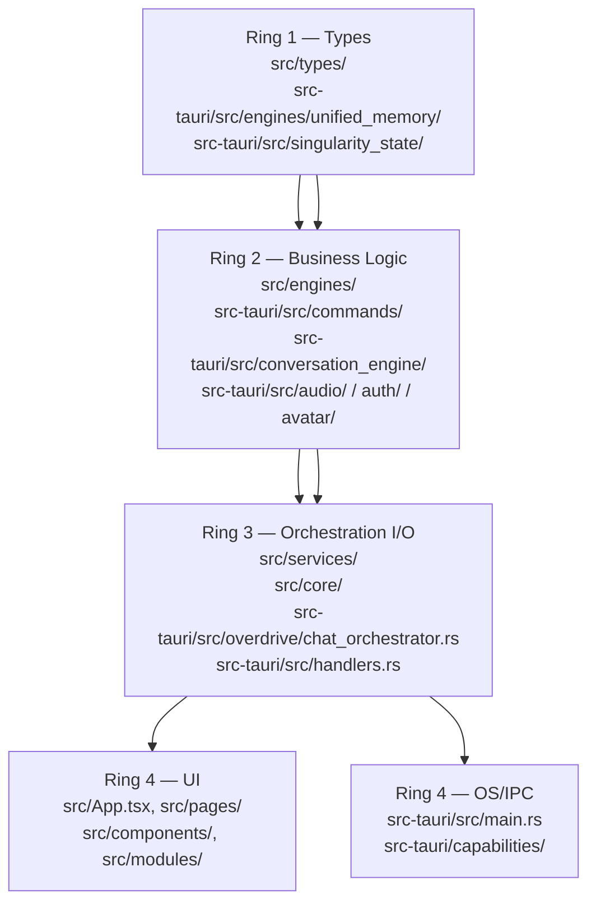
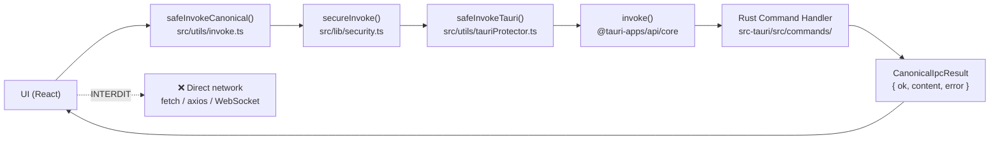
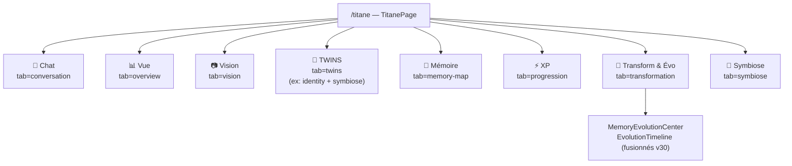
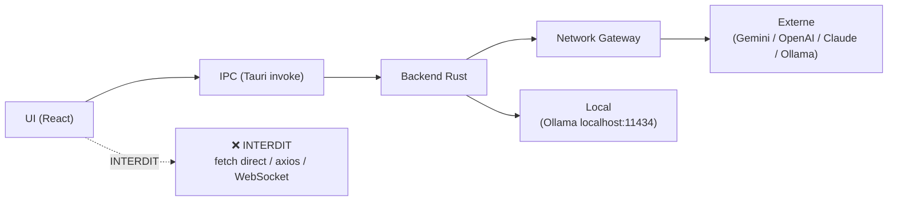
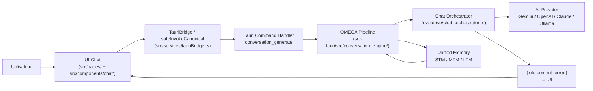

# CARTOGRAPHY_TITANE_INFINITY.md — Cartographie Ultra-Complète

**Version:** 30.0.0
**Date:** 2026-04-11T15:39:00Z
**Réf branch:** MAIN
**Classification:** CANON — Evidence-based

> Cartographie complète de l'architecture, des frontières de modules (4-Ring),
> de la gouvernance IPC One Door, du contrat canonique `{ ok, content, error }`,
> des services/moteurs, des commandes Rust et call sites frontend,
> et de l'alignement gates/tests/docs.

---

## 0. Résumé Exécutif

TITANE_INFINITY est un **OS cognitif Tauri-only** (React/TypeScript + Rust/Tauri v2).

| Dimension | Valeur |
|---|---|
| Runtime | Tauri v2 — desktop uniquement |
| Frontend | React 18 + TypeScript 5.5 strict |
| Backend | Rust 2021 — `src-tauri/` |
| Commandes Tauri exposées | **~401** (SHA c59e9b5b3 — `src-tauri/src/main.rs`) |
| IPC contract | `CanonicalIpcResult<T> { ok, content, error }` |
| One Door | `src/utils/invoke.ts` → `src/lib/security.ts` → `src/utils/tauriProtector.ts` |
| Moteur cognitif principal | OMEGA Conversation Engine v19.5.2 |
| Gates de vérification | ~20 scripts `scripts/verify/` + ~19 scripts `scripts/gates/` |
| Tests E2E | WebdriverIO (`wdio.desktop.conf.cjs`) |
| Test One Door gate | `src/__tests__/architecture/one-door-direct-invoke.test.ts` |
| AutoHeal | `scripts/autoheal/autoheal_rules.jsonl` (~847 entrées) |

### Invariants cardinaux

1. **One Door** : UI → IPC canonique → Backend Rust → Réseau externe. Zéro accès réseau direct depuis le frontend.
2. **4-Ring** : pas d'import inverse entre rings. Ring 4 ne peut pas importer directement de Ring 2.
3. **IPC Contract** : toute réponse IPC suit `{ ok, content, error }`. Zéro silence, zéro panic non capturé.
4. **Tauri-only** : production runtime exclusivement Tauri. Aucun serveur HTTP/Node.js exposé en production.
5. **Online-first gouverné** : cloud providers via backend uniquement, avec fallback local obligatoire.

---

## 1. Architecture 4-Ring

```
┌─────────────────────────────────────────────────────────────────┐
│  RING 4 — UI / Entry Point / OS Bridge                         │
│  src/App.tsx, src/main.tsx, src/pages/                         │
│  src/components/, src/modules/                                  │
│  src-tauri/src/main.rs (invoke_handler — ~401 commandes)       │
├─────────────────────────────────────────────────────────────────┤
│  RING 3 — Orchestration / Governed I/O                         │
│  src/core/                                                      │
│  src/services/                                                  │
│  src-tauri/src/handlers.rs                                      │
│  src-tauri/src/overdrive/chat_orchestrator.rs                  │
├─────────────────────────────────────────────────────────────────┤
│  RING 2 — Business Logic / Moteurs                             │
│  src/engines/                                                   │
│  src-tauri/src/commands/ (tous les modules de commandes)       │
│  src-tauri/src/conversation_engine/                            │
│  src-tauri/src/overdrive/ (voice_engine)                       │
│  src-tauri/src/auth/                                            │
│  src-tauri/src/audio/                                           │
│  src-tauri/src/avatar/                                          │
│  src-tauri/src/secure_commands.rs                              │
├─────────────────────────────────────────────────────────────────┤
│  RING 1 — Types / Data / Models                                │
│  src/types/                                                     │
│  src-tauri/src/engines/unified_memory/                         │
│  src-tauri/src/singularity_state/                              │
│  src-tauri/src/memory/                                          │
└─────────────────────────────────────────────────────────────────┘
```

### Règles d'import

| Ring | Peut importer de |
|------|-----------------|
| Ring 1 | aucune dépendance externe |
| Ring 2 | Ring 1 uniquement |
| Ring 3 | Ring 1 et Ring 2 |
| Ring 4 | tous les rings |

**Violation interdite** : Ring 4 ne peut pas bypasser Ring 3 pour appeler Ring 2 directement.  
**Gate** : `scripts/gates/ring-integrity-gate.sh`  
**Preuve** : `scripts/verify/validate-architecture.sh`

### Diagramme Mermaid — Architecture 4-Ring Étendue



---

## 2. IPC One Door — Gouvernance et Contrat Canonique

### 2.1 Chaîne One Door

```
[UI React] → safeInvokeCanonical() → secureInvoke() → safeInvokeTauri() → invoke()
               (src/utils/invoke.ts)   (src/lib/security.ts) (src/utils/tauriProtector.ts) (@tauri-apps/api/core)
```

**Fichiers autorisés** à importer `@tauri-apps/api/core` directement :

| Fichier | Rôle | Evidence |
|---------|------|----------|
| `src/utils/invoke.ts` | Entrée publique canonique IPC | L70–L90 : `safeInvokeCanonical` |
| `src/lib/security.ts` | Primitive `secureInvoke` | L11 : `import { invoke } from '@tauri-apps/api/core'` |
| `src/utils/tauriProtector.ts` | Guard runtime environnement | L9 : `import { invoke } from '@tauri-apps/api/core'` |
| `src/test/setup.ts` | Mock global vitest | setup-only |

**Gate architectural** : `src/__tests__/architecture/one-door-direct-invoke.test.ts`  
→ Scanne tous les `.ts/.tsx` sous `src/`, lève une erreur si un fichier hors liste importe `@tauri-apps/api/core`.

### 2.2 Contrat IPC Canonique

```typescript
// src/utils/invoke.ts — CanonicalIpcResult<T>
interface CanonicalIpcResult<T> {
  ok: boolean;         // true = succès
  content: T | null;   // payload de réponse
  error: IpcErrorPayload | null; // { code, message, details? }
}
```

**Règles** :
- `ok: false` sur toute erreur — jamais silencieux
- `content = null` quand `ok = false`
- `error = null` quand `ok = true`
- Timeout UI par défaut : 10 000 ms (configurable)

### 2.3 Wrappers disponibles

| Wrapper | Fichier | Usage |
|---------|---------|-------|
| `safeInvokeCanonical<T>()` | `src/utils/invoke.ts` | **Canonique** — retourne `CanonicalIpcResult<T>` |
| `safeInvoke<T>()` | `src/utils/invoke.ts` | Simplifié — retourne `T \| null` |
| `safeInvokeWithRetry<T>()` | `src/utils/invoke.ts` | 3 tentatives avec délai |
| `safeInvokeWithTimeout<T>()` | `src/utils/invoke.ts` | Timeout configurable |
| `invokeTauriCommandCanonical<T>()` | `src/services/tauriBridge.ts` | Wrapper service |
| `invokeTauriCommandCanonical<T>()` | `src/services/tauriCommands.ts` | Wrapper commands |
| `TauriBridge.invokeCanonical<R>()` | `src/os/bridge/TauriBridge.ts` | Classe bridge OS |

### 2.4 Diagramme Mermaid — IPC One Door Flow



### 2.5 Legacy vs Canonique — État de migration

| Wrapper | Type | Usage (hors tests) | Statut |
|---------|------|-------------------|--------|
| `safeInvokeCanonical` | canonique | ~32 call sites | ✅ ACTIF |
| `invokeTauriCommand` (legacy) | `CoreResponse<T>` | ~58 call sites | ⚠️ LEGACY |
| `invokeTauriCommandCanonical` | canonique | ajouté wave2 | ✅ NOUVEAU |

> **Migration wave2 (PR #250)** : `invokeTauriCommandCanonical` ajouté dans `tauriBridge.ts` et `tauriCommands.ts`. `ragService.ts` migré vers `safeInvokeCanonical`. Migration des ~58 call sites legacy restants = **dette technique active**.

---

## 3. Backend Rust — Commandes par Domaine

Source : `src-tauri/src/main.rs` — bloc `invoke_handler` (SHA c59e9b5b3)  
Total : **~401 commandes exposées** (+ ~7 patches AUDIO non commités à la date du doc source)

| Domaine | Nb cmds | Module Rust | Exemples |
|---------|---------|-------------|---------|
| Boot / State Bridge | 7 | `state_bridge_commands` | `ping`, `get_system_state`, `set_state`, `delete_state` |
| Base de données (Option1/libSQL) | 8 | `commands::db_commands` | `db_put_event`, `db_kv_set`, `db_sync_now` |
| Core Messaging | 2 | `main.rs` | `send_message`, `ollama_query` |
| Ollama | 1 | `commands::ollama_command` | `ollama_generate` |
| OMEGA Conversation Engine | 6 | `conversation_engine::commands` | `create_new_conversation`, `conversation_generate`, `conversation_health_check`, `conversation_memory_stats` |
| Chat Orchestrator | 10 | `overdrive::chat_orchestrator` | `chat_stream_message`, `chat_get_providers_status`, `chat_create_conversation`, `chat_memory_backup` |
| Diagnostic | 1 | `diagnostic_commands` | `check_online_capabilities` |
| Web Research (stub) | 1 | `web_research_commands` | `web_research` (no network) |
| Télémétrie | 1 | `api::telemetry_api` | `read_production_week1_csv` |
| Voice Engine | 17 | `overdrive::voice_engine` | `voice_start_listening`, `voice_transcribe_audio`, `voice_enable_duplex`, `voice_calibrate_microphone` |
| Avatar Engine | 10 | `avatar::avatar_commands` | `avatar_prepare_speech`, `avatar_get_state`, `avatar_run_selftest` |
| Avatar Appearance | 5+ | `avatar::appearance_commands` | `avatar_get_appearance`, `avatar_set_appearance`, `avatar_apply_style_preset` |
| Avatar Floating | 15+ | `avatar::floating_commands` | window positioning, desktop cfg |
| Avatar FullBody | 12 | `avatar::fullbody_commands` | full-body engine |
| Singularity Fusion | ~66 | `singularity_commands::*` | state sync, cortex, fusion layers |
| Singularity State | 18 | `singularity_commands` | `singularity_get_state`, `singularity_sync_state` |
| System Center | 23 | `system_center_commands` | metrics, health, modules |
| Orchestration Center | 2 | `orchestration_center` | multi-IA orchestration |
| QA Monitoring | 6 | `qa_monitoring` | quality assurance |
| One Core | 8 | `one_core` | unified core commands |
| EXP Fusion Engine | 8 | `exp_fusion` | experience/XP system |
| Security (AES-256-GCM) | 13 | `secure_commands` / `commands::security` | vault, secrets, encryption |
| Runtime Config | 2 | runtime config | runtime configuration |
| Chat Generate Providers | 3 | `commands::chat_generate_commands` | `chat_generate_gemini`, `chat_generate_openai`, `chat_generate_claude` |
| Copilot (GitHub) | 4 | `commands::copilot_commands` | Copilot provider integration |
| AI Prompt Generator + Ollama | 2 | `commands::ai_prompt_generator` | prompt generation |
| Auth OS | 9 | `auth` | OS-level authentication |
| Audio / TTS / VAD / Capture | 19 | `audio::commands` | TTS, VAD, microphone capture |
| Audio speak/recording | 4 | audio sub-commands | `speak`, recording |
| Memory API + Helios | 9 | memory / helios | `memory_get_recent_memories`, Helios metrics |
| Gouvernance | 11 | `commands::governance_commands` | governance enforcement |
| Memory OS | 5 | `commands::memory_os` | `rag_store_chunks`, `rag_delete_chunks`, vector DB |
| Coherence Engine | 5 | coherence | coherence checks |
| Unified Memory | 6 | `engines::unified_memory` | STM/MTM/LTM operations |
| System Health | 10 | `commands::system_health` | health checks |
| DevTools | 3+ | `devtools` | `devtools_get_logs`, `devtools_clear_logs` |
| Whisper Streaming | 3 | `commands::whisper_commands` | speech-to-text streaming |
| Persistent Memory v19.2Ω | 12 | `commands::persistent_memory` | persistent memory CRUD |
| UI Theme / Design Center | 4 | `commands::ui_theme_commands` | theme management |
| Self-Healing | 18 | `commands::self_healing_commands` | auto-repair |
| Window Controls | 8 | `commands::window_controls_commands` | minimize, maximize, close |
| Config Hub | 14 | config hub | configuration management |
| Titan Persistence | 27 | titan persistence | titanDB CRUD operations |
| Onboarding | 3 | onboarding | user onboarding flow |
| Fusion Commands | 8 | fusion | multi-modal fusion |
| Control Panel | 7 | control panel | admin/debug panel |
| Identity Engine | 12 | `commands::identity_commands` | TWINS/identity management |
| Legacy AI Bridge | 19 | `ai_chat` | compatibility layer v27- |

**TOTAL estimé : ~401 commandes** (source : `docs/canon/COMMANDS_SOURCE_OF_TRUTH.md`)

> **Note** : `commands/mod.rs` désactive plusieurs modules via `// disabled:` pour éviter les doublons
> (ex: `coherence_commands`, `meta_mode`, `ai_chat`, plusieurs modules audio redondants).

---

## 4. Inventaire Services et Moteurs Frontend

### 4.1 Ring 3 — Services Gouvernés (`src/services/`)

| Service | Fichier | Rôle | IPC |
|---------|---------|------|-----|
| TauriBridge centralisé | `src/services/tauriBridge.ts` | Couche d'abstraction principale Tauri | `invokeTauriCommand` + `invokeTauriCommandCanonical` |
| TauriCommands | `src/services/tauriCommands.ts` | Commandes Tauri directes | `invokeTauriCommandCanonical` |
| RAG Service | `src/services/ragService.ts` | Retrieval-Augmented Generation | `safeInvokeCanonical` (migré wave2) |
| Conversation Engine | `src/services/conversationEngine.ts` | Wrapper moteur OMEGA | `invokeTauriCommand` |
| Self-Healing Observer | `src/services/selfHealing/selfHealingObserver.ts` | Surveillance auto-réparation | `safeInvokeCanonical` |
| Desktop Perception | `src/services/operator/desktopPerception.ts` | Perception desktop OS | `safeInvokeCanonical` |
| Audio Services | `src/services/audio/` | TTS, VAD, capture audio | IPC audio |
| AI Chat Client | `src/services/aiChatClient.ts` | Client chat IA legacy | `invokeTauriCommand` |
| Evolution Engine | `src/services/evolutionEngine/` | XP + évolution cognitive | IPC |
| Experience Service | `src/services/experienceService.ts` | Gestion XP | IPC |
| Agenda Service | `src/services/agendaService.ts` | Planning intégré | IPC |
| Governance | `src/services/governance/` | Gouvernance IPC/arch | scripts verify |
| Cache Services | `src/services/cache/` | Cache multi-niveaux | local |
| Adaptive Bridge v21 | `src/services/adaptiveBridgeV21.ts` | Bridge adaptatif | IPC |

### 4.2 Ring 3 — Core (`src/core/`)

| Module | Fichier | Rôle |
|--------|---------|------|
| Architecture Types | `src/core/ARCHITECTURE_TYPES_v∞.ts` | Types d'interface Ring 3/4 |
| TAURI_COMMANDS registry | `src/core/commands/TAURI_COMMANDS.ts` | Registre commandes autorisées |
| Default Identity Matrix | `src/core/identity/defaultIdentityMatrix.ts` | Matrice identité TWINS |
| Singularity State | `src/core/state/SingularityState.ts` | État cognitif global |
| Tauri Environment | `src/core/tauri/environment.ts` | Détection environnement |

### 4.3 Ring 2 — Moteurs Frontend (`src/engines/`)

| Moteur | Répertoire | Rôle |
|--------|------------|------|
| Voice | `src/engines/voice/` | Pipeline vocal |
| Cognitive | `src/engines/cognitive/` | Couche cognitive |
| Emotion | `src/engines/emotion/` | Gestion émotionnelle |
| Identity | `src/engines/identity/` | Identité TWINS |
| Narrative | `src/engines/narrative/` | Narratif IA |
| Self-Healing | `src/engines/selfHealing/` | Auto-réparation frontend |
| Presence | `src/engines/presence/` | Présence utilisateur |
| Predictive | `src/engines/predictive/` | Prédiction comportementale |
| Expression | `src/engines/expression/` | Expression avatar |

### 4.4 Ring 2 — Moteurs Backend Rust (`src-tauri/src/`)

| Moteur | Emplacement | Rôle |
|--------|-------------|------|
| Conversation Engine OMEGA | `src-tauri/src/conversation_engine/` | Moteur conversationnel v19.5.2 |
| Chat Orchestrator | `src-tauri/src/overdrive/chat_orchestrator.rs` | Orchestration multi-IA v21+R04 |
| Voice Engine | `src-tauri/src/overdrive/voice_engine.rs` | Voice pipeline v21 REPAIR |
| Avatar Engine | `src-tauri/src/avatar/` | Moteur avatar v23 + FullBody |
| Auth OS | `src-tauri/src/auth/` | Authentification OS |
| Audio Engine | `src-tauri/src/audio/` | TTS + VAD + Capture |
| Secure Commands | `src-tauri/src/secure_commands.rs` | Chiffrement AES-256-GCM |
| Unified Memory | `src-tauri/src/engines/unified_memory/` | Mémoire STM/MTM/LTM |
| Singularity State | `src-tauri/src/singularity_state/` | État cognitif Rust |
| Memory Core | `src-tauri/core/legacy.rs → MemoryCore` | Mémoire persistante |
| Helios Core | `src-tauri/core/legacy.rs → HeliosCore` | Métriques système |

---

## 5. États Gérés — Tauri `.manage()`

Enregistrés au démarrage dans `src-tauri/src/main.rs` :

| State | Rôle |
|-------|------|
| `AppState` (SecurityManager) | Sécurité applicative |
| `SingularityCortexState` | Cortex cognitif |
| `OrchestratorState` (Multi-IA) | Orchestrateur multi-IA |
| `SecureSecretsEngine` | Vault secrets AES |
| `CopilotState` | GitHub Copilot provider |
| `ChatOrchestratorState` | État orchestrateur chat |
| `HeliosCore`, `MemoryCore` | Métriques + mémoire legacy |
| `AvatarEngineGlobal` | Moteur avatar global |
| `AutoFixState`, `AutoHealState` | Auto-réparation |
| `CrashGuardState` | Protection crash |
| `PerformanceState` | Monitoring performance |
| `FrontendStateStore` | Store d'état frontend |
| `IdentityEngineState` | Moteur identité TWINS |
| `AIChatState` | Bridge IA legacy |
| `ExpFusionState` | Fusion expérience/XP |
| `SingularityEngine` | Moteur singularité |
| `ConversationEngineState` (OMEGA) | Moteur OMEGA |
| `PersistentMemoryState` | Mémoire persistante |

---

## 6. Pages et Navigation (Ring 4 — UI)

### TitanePage (`/titane`) — 8 onglets v30.0.0



### Routes legacy → canoniques (v30)

| Ancienne route | Redirige vers |
|---------------|---------------|
| `/memory-evolution` | `/titane?tab=transformation` |
| `/memory-evo` | `/titane?tab=transformation` |
| `/identity*` | `/titane?tab=twins` |
| `/persona` | `/titane?tab=twins` |
| `/twins` | `/titane?tab=twins` |
| `?tab=identity` | `?tab=twins` |
| `?tab=symbiose` | `?tab=twins` |

---

## 7. Politique Réseau One Door



| Fournisseur | Accès réseau | Chemin Rust |
|------------|-------------|------------|
| Ollama (local) | Backend seulement | `commands::ollama_command::ollama_generate` |
| Gemini | Backend seulement | `commands::chat_generate_commands::chat_generate_gemini` |
| OpenAI | Backend seulement | `commands::chat_generate_commands::chat_generate_openai` |
| Claude | Backend seulement | `commands::chat_generate_commands::chat_generate_claude` |
| GitHub Copilot | Backend seulement | `commands::copilot_commands::*` |
| Web Research | Backend — STUB | `web_research_commands::web_research` (pas de réseau) |
| Frontend (React) | **INTERDIT** | — |

---

## 8. Gates de Vérification / Tests / Docs

### 8.1 Scripts de vérification (`scripts/verify/`)

| Script | Invariant vérifié |
|--------|------------------|
| `validate-architecture.sh` | Frontières 4-Ring + imports inverse |
| `enforce-online-first.sh` | Politique online-first gouvernée |
| `enforce-tauri-only.sh` | Runtime Tauri exclusif |
| `guard-no-frontend-ollama-direct.sh` | Pas d'accès Ollama direct depuis UI |
| `network-one-door.sh` | One Door réseau |
| `verify_import_hygiene.sh` | Hygiène des imports |
| `verify_typescript_strict.sh` | TypeScript strict |
| `verify_instruction_layers.sh` | Cohérence layers instructions |
| `verify_no_doctrine_duplication.sh` | Absence de duplication doctrine |
| `verify_kernel_budget.sh` | Budget kernel instructions |
| `verify_agents_index.sh` | Index agents |
| `verify_status_vocabulary.sh` | Vocabulaire statut unique |

### 8.2 Gates CI (`scripts/gates/`)

| Gate | Invariant |
|------|-----------|
| `ring-integrity-gate.sh` | 4-Ring — pas d'import inverse Ring4→Ring2 |
| `g_network_one_door.sh` | One Door réseau |
| `g_frontend_no_web.sh` | Pas de fetch direct UI |
| `g7-tauri-allowlist-lock.sh` | Allowlist Tauri verrouillée |
| `g8-provider-api-only.sh` | Providers via API seulement |
| `g9-release-seal.sh` | Scellement release |
| `g_no_test_skips.sh` | Pas de skips de tests |
| `autopr-v2-policy-gate.js` | Politique auto-PR |
| `csp-baseline-gate.js` | CSP baseline |
| `forbidden-scripts-gate.js` | Scripts interdits |

### 8.3 Tests architecture (`src/__tests__/architecture/`)

| Test | Invariant | Fichier |
|------|-----------|---------|
| One Door gate | Pas d'import `@tauri-apps/api/core` hors portes autorisées | `one-door-direct-invoke.test.ts` |

### 8.4 Alignement docs canoniques

| Document | Contenu | Statut |
|---------|---------|--------|
| `docs/canon/ARCHITECTURE_TRUTH.md` | Architecture 4-Ring v30 | CANON |
| `docs/canon/COMMANDS_SOURCE_OF_TRUTH.md` | 401 commandes Tauri | CANON |
| `docs/canon/TITANE_BRAIN_CANON.md` | Cerveau cognitif | CANON |
| `docs/IPC_CONTRACT.md` | Contrat IPC | PROVEN |
| `docs/MAP_ARCHITECTURE_4RING.md` | Mapping 4-Ring | QUALIFIED |
| `docs/MAP_IPC_COMMANDS.md` | Mapping commandes IPC | QUALIFIED |
| `docs/MAP_SURFACES_NETWORK.md` | Surface réseau | QUALIFIED |
| `docs/MAP_TESTS_GATES.md` | Gates tests | STABLE |
| `docs/MAP_MERMAID_OVERVIEW.md` | Overview Mermaid | STABLE |
| `docs/diagrams/rendered/architecture_4_ring.md` | Diagramme 4-Ring | CANON |
| `docs/diagrams/rendered/data_flow_chat.md` | Flux Chat | CANON |
| `docs/diagrams/rendered/certification_gates.md` | Gates certification | CANON |
| `docs/diagrams/rendered/network_surface_online_first.md` | Surface réseau | CANON |
| `docs/diagrams/rendered/omega_pipeline_v2.md` | Pipeline OMEGA | CANON |
| `docs/dev/en/architecture.md` | Architecture EN | QUALIFIED |
| `docs/dev/fr/architecture.md` | Architecture FR | QUALIFIED |

---

## 9. Flux de Données Chat — OMEGA Pipeline



---

## 10. Auto-Heal et Proof Discipline

| Composant | Emplacement | Rôle |
|-----------|-------------|------|
| AutoHeal rules | `scripts/autoheal/autoheal_rules.jsonl` | Règles de détection et prévention (~847 entrées) |
| Détection récurrence | `scripts/autoheal/detect_recurrence.sh` | Détecte les régressions connues |
| Verify instructions | `scripts/verify_instructions.sh` | PASS=23 FAIL=0 baseline |
| Proof packs | `proof_packs/` | Packs de preuves par session |
| Reports | `reports/` | Rapports de validation |

**Règle** : chaque fix doit appender une entrée dans `autoheal_rules.jsonl` puis exécuter
`detect_recurrence.sh` + `verify_instructions.sh`.

---

## 11. Gaps et Dettes Techniques Identifiés

| Gap | Criticité | Evidence | Action recommandée |
|-----|-----------|----------|-------------------|
| ~58 call sites `invokeTauriCommand` (legacy `CoreResponse<T>`) | MOYEN | `grep -rn "invokeTauriCommand\b" src/ \| grep -v tests \| wc -l → 58` | Migrer progressivement vers `invokeTauriCommandCanonical` |
| `handlers.rs` — blocs `invoke_handler` multiples (C003 OPEN) | HAUT | `docs/canon/COMMANDS_SOURCE_OF_TRUTH.md § "Handlers Multiples"` | `cargo check --workspace` pour confirmer lequel est actif |
| Fallback local partiellement implémenté | MOYEN | `docs/dev/en/architecture.md § Network policy → "PARTIAL"` | Compléter l'implémentation du fallback local |
| Web Research = STUB (pas de réseau) | BAS | `docs/canon/ARCHITECTURE_TRUTH.md § One Door` | Implémenter ou documenter explicitly comme non-implémenté |
| `tauri.conf.json` `beforeBuildCommand="true"` (dev override) | MOYEN | `docs/canon/COMMANDS_SOURCE_OF_TRUTH.md § Dirty state` | Restaurer avant build production |

---

## 12. Commandes de Vérification Canoniques

```bash
# Hygiène One Door — vérifier pas d'import direct hors portes autorisées
grep -rn "from \"@tauri-apps/api/core\"\|from '@tauri-apps/api/core'" src/ \
  --include="*.ts" --include="*.tsx" \
  | grep -v "src/utils/invoke.ts\|src/lib/security.ts\|src/utils/tauriProtector.ts\|src/test/\|src/__tests__/"

# Compter les commandes Tauri exposées
grep -c "^pub async fn\|^pub fn" src-tauri/src/commands/*.rs

# Vérifier la conformité architecture
bash scripts/verify/validate-architecture.sh
bash scripts/gates/ring-integrity-gate.sh
bash scripts/verify/network-one-door.sh

# Gates globales
pnpm run check
bash scripts/verify_instructions.sh
bash scripts/autoheal/detect_recurrence.sh
```

---

*Autorité : Kevin Thibault — TITANE Team*  
*Généré : 2026-04-11T15:39:00Z — MAIN (post-wave2 IPC unification)*  
*Source primaire : `docs/canon/ARCHITECTURE_TRUTH.md`, `src/utils/invoke.ts`, `src-tauri/src/main.rs`*
