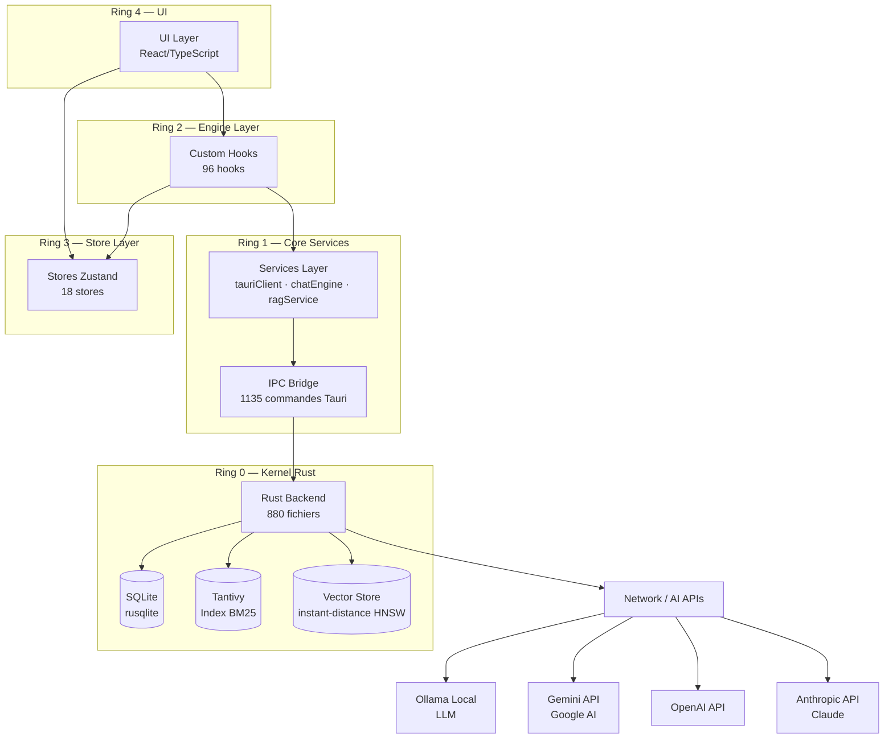

# TITANE_INFINITY — Carte des Dépendances v30.1.0

> **Mise à jour le 2026-04-11**
> Référence complète des dépendances frontend (npm/pnpm) et backend (Cargo)

---

## A. Dépendances Frontend (`package.json`)

### Dépendances de production

| Package | Version | Rôle | Criticité |
|---------|---------|------|-----------|
| `@tanstack/react-query` | ^5.91.3 | Server state management | Critique |
| `@tauri-apps/api` | ^2.10.1 | Tauri IPC bridge | Critique |
| `@tauri-apps/plugin-dialog` | ^2.6.0 | Dialogues natifs | Critique |
| `@tauri-apps/plugin-fs` | ^2.4.5 | Accès filesystem | Critique |
| `@tauri-apps/plugin-http` | ^2.5.7 | Requêtes HTTP | Critique |
| `@tauri-apps/plugin-shell` | ^2.3.5 | Exécution shell | Critique |
| `@types/three` | ^0.183.1 | Types Three.js | Optionnel |
| `@xenova/transformers` | ^2.17.2 | ML local (embeddings, ASR) | Critique |
| `better-sqlite3` | ^12.6.2 | SQLite (mémoire locale) | Critique |
| `clsx` | ^2.1.1 | Utility CSS classes | Utilitaire |
| `date-fns` | ^4.1.0 | Manipulation dates | Utilitaire |
| `dompurify` | ^3.3.3 | Sanitisation HTML (sécurité XSS) | Sécurité |
| `eventemitter3` | ^5.0.4 | Event bus interne | Utilitaire |
| `framer-motion` | ^12.34.3 | Animations UI fluides | UI |
| `i18next` | ^25.8.13 | Internationalisation (i18n) | Optionnel |
| `i18next-browser-languagedetector` | ^8.2.1 | Détection langue navigateur | Optionnel |
| `lucide-react` | ^0.577.0 | Icônes UI (SVG) | UI |
| `react-chrono` | ^3.3.3 | Composant timeline | UI |
| `react-d3-tree` | ^3.6.6 | Arbre D3 (visualisation) | UI |
| `react-i18next` | ^16.5.8 | Bindings i18n React | Optionnel |
| `react-is` | ^19.2.4 | Type checks React | Utilitaire |
| `react-markdown` | ^10.1.0 | Rendu Markdown dans React | UI |
| `react-router` | ^7.13.1 | Routage SPA | Critique |
| `react-router-dom` | ^7.13.1 | Routage DOM | Critique |
| `recharts` | 3.8.1 | Graphiques/charts | UI |
| `remark-gfm` | ^4.0.1 | Extension Markdown GFM | UI |
| `sonner` | ^2.0.7 | Notifications toast | UI |
| `three` | ^0.183.2 | 3D graphics (avatar, aura) | Optionnel |
| `web-vitals` | ^5.1.0 | Métriques de performance web | Optionnel |
| `zod` | ^4.3.6 | Validation de schémas TypeScript | Critique |
| `zustand` | ^5.0.12 | State management (18 stores) | Critique |

### Dépendances de développement (condensées)

| Catégorie | Packages clés | Versions |
|-----------|--------------|---------|
| **TypeScript** | `typescript` | 5.9 |
| **Build** | `vite`, `@vitejs/plugin-react-swc` | 7.x |
| **Tests unitaires** | `vitest`, `@testing-library/react` | 4.x |
| **Tests E2E** | `playwright`, `@playwright/test` | 1.58 |
| **Tests Desktop** | `webdriverio`, `@wdio/cli` | 9.x |
| **Linting** | `eslint`, `@eslint/js` | 9.x |
| **CSS** | `tailwindcss`, `@tailwindcss/vite` | 4.x |
| **Storybook** | `storybook`, `@storybook/react-vite` | 10.x |
| **Formatting** | `prettier` | 3.x |
| **Git hooks** | `husky`, `lint-staged` | 9.x |
| **Types React** | `@types/react`, `@types/react-dom` | 19.x |
| **Tauri CLI** | `@tauri-apps/cli` | 2.x |
| **PostCSS** | `postcss`, `autoprefixer` | latest |

---

## B. Dépendances Backend (`Cargo.toml`)

### Dépendances principales

| Crate | Version | Rôle | Features |
|-------|---------|------|---------|
| `tauri` | 2.0 | Framework Tauri — runtime natif | `tray-icon`, `protocol-asset` |
| `tauri-plugin-dialog` | 2.7 | Dialogues natifs (file picker) | — |
| `tauri-plugin-fs` | 2 | Accès filesystem sécurisé | — |
| `serde` | 1.0 | Sérialisation/désérialisation | `derive` |
| `serde_json` | 1.0 | JSON encoding/decoding | — |
| `tokio` | 1.51 | Runtime async Rust | `full` |
| `reqwest` | 0.12 | Client HTTP async | `json`, `stream`, `rustls-tls` |
| `rusqlite` | 0.37.0 | SQLite embarqué (LTM) | `bundled` |
| `tantivy` | 0.26 | Index lexical BM25 (recherche) | — |
| `uuid` | 1.23 | Génération d'UUID | `v4`, `serde` |
| `chrono` | 0.4 | Manipulation dates/temps | `serde` |
| `dashmap` | 6.0 | HashMap concurrent lock-free | — |
| `parking_lot` | 0.12 | Mutex/RwLock haute performance | — |
| `lru` | 0.16 | Cache LRU | — |

### Sécurité & Cryptographie

| Crate | Version | Rôle | Features |
|-------|---------|------|---------|
| `aes-gcm` | 0.10 | Chiffrement AES-256-GCM | — |
| `sha2` | 0.10 | Hachage SHA-256/512 | — |
| `argon2` | 0.5 | Hachage mots de passe (KDF) | — |
| `ed25519-dalek` | 2.1 | Signatures numériques Ed25519 | — |
| `zeroize` | 1.7 | Effacement sécurisé de secrets | — |

### ML / Intelligence Artificielle

| Crate | Version | Rôle | Features |
|-------|---------|------|---------|
| `instant-distance` | 0.6.1 | HNSW — recherche vectorielle | — |
| `ndarray` | 0.17.1 | Arrays N-dimensionnels (ML) | — |
| `rustfft` | 6.2 | FFT (analyse vocale/signal) | — |
| `image` | 0.24.9 | Traitement d'images | `bmp`, `jpeg`, `png`, `gif`, `webp` |
| `cpal` | 0.15 | Capture audio (microphone) | **optionnel** (`audio-capture`) |
| `ort` | 2.0.0-rc.10 | ONNX Runtime (inférence vision) | **optionnel** (`onnx`) |
| `hound` | 3.5 | Lecture/écriture fichiers WAV | — |

### Observabilité & Système

| Crate | Version | Rôle | Features |
|-------|---------|------|---------|
| `tracing` | 0.1.43 | Logging structuré async | — |
| `sysinfo` | 0.37 | Informations système (CPU, RAM) | — |
| `rand` | 0.8 | Génération aléatoire | — |
| `thiserror` | 2.0 | Gestion d'erreurs ergonomique | — |
| `walkdir` | 2.4 | Traversée récursive filesystem | — |

### Utilitaires

| Crate | Version | Rôle | Features |
|-------|---------|------|---------|
| `smallvec` | 1.13 | Vec optimisé petits tableaux | `serde` |
| `async-trait` | 0.1 | Traits avec méthodes async | — |
| `flate2` | 1.0 | Compression GZIP/DEFLATE | — |
| `base64` | 0.22 | Encodage/décodage Base64 | — |
| `regex` | 1.10 | Expressions régulières | — |
| `url` | 2.4 | Parsing et validation URL | — |
| `urlencoding` | 2.1 | Encodage URL | — |
| `dirs` | 6.0 | Répertoires système (home, config) | — |
| `futures-util` | 0.3 | Utilitaires futures/streams | — |
| `once_cell` | 1.19 | Initialisation lazy thread-safe | — |
| `lazy_static` | 1.4 | Statics lazy | — |
| `md5` | 0.8.0 | Hash MD5 (legacy compat) | — |
| `tokio-stream` | 0.1.17 | Streams compatibles tokio | — |
| `async-stream` | 0.3.6 | Macro async stream | — |

### Features optionnelles

| Feature | Crates activées | Usage |
|---------|----------------|-------|
| `audio-capture` | `cpal` | Nécessite `libasound2-dev` sur Linux |
| `onnx` | `ort` | ONNX Runtime pour inférence vision locale |
| `mock` | — | Mode backend mock (dev frontend sans Rust) |
| `ollama` | — | Intégration Ollama (LLM local) |

---

## C. Diagramme des dépendances

---

## D. Matrice de criticité

| Composant | Dépendances critiques | Impact si absent |
|-----------|-----------------------|-----------------|
| IPC Bridge (`@tauri-apps/api`) | Tauri runtime | App non fonctionnelle |
| State (`zustand`) | 18 stores | App non fonctionnelle |
| Router (`react-router`) | Toutes les pages | Navigation impossible |
| Validation (`zod`) | IPC payloads, forms | Données non validées |
| SQLite (`rusqlite`) | LTM, mémoire | Perte persistance |
| Async runtime (`tokio`) | Tous les services Rust | Backend non fonctionnel |
| HTTP client (`reqwest`) | Providers AI online | AI online impossible |
| ML local (`@xenova/transformers`) | RAG, embeddings | Recherche sémantique impossible |
| Sécurité (`aes-gcm`, `argon2`) | Vault, secrets | Sécurité compromise |
| Vector search (`instant-distance`) | Knowledge base | Recherche vectorielle impossible |

---

## E. Politique de mise à jour

| Criticité | Politique |
|-----------|-----------|
| **Critique** | Mise à jour avec audit de sécurité obligatoire |
| **Sécurité** | Mise à jour immédiate dès CVE publiée |
| **UI** | Mise à jour mineure libre, majeure avec test E2E |
| **Utilitaire** | Mise à jour libre |
| **Optionnel** | Mise à jour discrétionnaire |

> **Règle IPC** : Toute mise à jour de `@tauri-apps/api` ou `tauri` (Rust) nécessite une revue
> complète de la compatibilité des 1135 commandes IPC et un test E2E complet.
