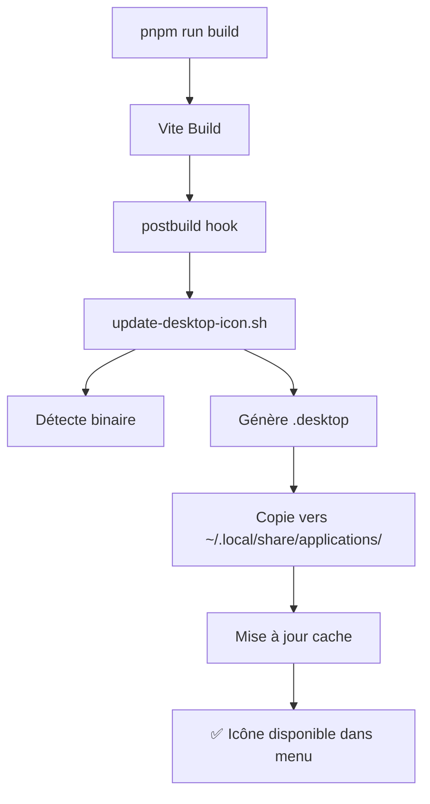

# 🎨 TITANE∞ - Système de Mise à Jour Automatique de l'Icône

## 📋 Vue d'ensemble

Le système de mise à jour automatique de l'icône permet à l'application TITANE∞ d'apparaître automatiquement dans le menu des applications Linux avec la bonne icône, et de se mettre à jour automatiquement après chaque build.

## ✨ Fonctionnalités

- ✅ **Détection automatique** du binaire (release ou debug)
- ✅ **Mise à jour automatique** après `pnpm run build`
- ✅ **Mise à jour manuelle** possible à tout moment
- ✅ **Actions du menu contextuel** (Dev Mode, Logs, Config)
- ✅ **Cache des icônes** automatiquement rafraîchi
- ✅ **Compatibilité** GNOME, KDE, XFCE, et autres environnements

## 🚀 Utilisation

### Mise à Jour Automatique

L'icône se met automatiquement à jour après chaque build:

```bash
# Build frontend (déclenche automatiquement la mise à jour)
pnpm run build

# Build production complet (met à jour l'icône à la fin)
pnpm run build:production
```

### Mise à Jour Manuelle

Pour mettre à jour l'icône manuellement à tout moment:

```bash
# Script direct
bash scripts/update-desktop-icon.sh

# Ou via npm
pnpm run postbuild
```

### Première Installation

Après avoir cloné le projet ou compilé pour la première fois:

```bash
# 1. Build le projet
pnpm run build
cargo build --manifest-path src-tauri/Cargo.toml --release

# 2. L'icône est automatiquement installée
# (ou lancez manuellement le script si nécessaire)
bash scripts/update-desktop-icon.sh
```

## 📁 Fichiers du Système

### Scripts

| Fichier | Description |
|---------|-------------|
| `scripts/update-desktop-icon.sh` | Script principal de mise à jour de l'icône |
| `scripts/post-build.sh` | Hook post-build appelé automatiquement |
| `titane-infinity.desktop` | Fichier desktop source |

### Icônes

| Fichier | Résolution | Usage |
|---------|-----------|-------|
| `src-tauri/icons/128x128.png` | 128x128 | Icône principale (menu applications) |
| `src-tauri/icons/icon.png` | Variable | Icône de fallback |
| `src-tauri/icons/icon.ico` | Multi-res | Windows |
| `src-tauri/icons/icon.icns` | Multi-res | macOS |

### Emplacement d'Installation

```
~/.local/share/applications/titane-infinity.desktop
```

## 🔧 Configuration

### Fichier .desktop

Le fichier `.desktop` est généré dynamiquement avec les chemins actuels du projet. Il inclut:

**Informations de base:**
- Nom: TITANE∞ v24.3.0
- Catégories: Development, Utility, AI
- Icône: 128x128.png
- Terminal: Non

**Actions du menu contextuel:**

1. **🔧 Developer Mode**
   ```bash
   titane-infinity --dev
   ```

2. **📋 View Logs**
   ```bash
   gnome-terminal -- tail -f ~/.titane/logs/titane.log
   ```

3. **⚙️ Configuration**
   ```bash
   xdg-open ~/.titane/
   ```

### Personnalisation

Pour personnaliser l'icône ou les actions, éditez:

```bash
# Éditer le template du fichier .desktop
nano scripts/update-desktop-icon.sh

# Puis relancer
bash scripts/update-desktop-icon.sh
```

## 🎯 Actions Disponibles dans le Menu

Après installation, clic droit sur l'icône TITANE∞ dans le menu des applications pour accéder à:

1. **Lancer normalement** - Lance l'application en mode production
2. **🔧 Developer Mode** - Lance avec DevTools et mode debug
3. **📋 View Logs** - Ouvre les logs en temps réel dans un terminal
4. **⚙️ Configuration** - Ouvre le dossier de configuration

## 🔍 Vérification

### Vérifier l'Installation

```bash
# Vérifier que le fichier .desktop existe
ls -la ~/.local/share/applications/titane-infinity.desktop

# Vérifier le contenu
cat ~/.local/share/applications/titane-infinity.desktop

# Tester le lancement
gtk-launch titane-infinity
```

### Déboguer

Si l'icône n'apparaît pas:

```bash
# 1. Vérifier les permissions
chmod +x ~/.local/share/applications/titane-infinity.desktop

# 2. Forcer la mise à jour du cache
update-desktop-database ~/.local/share/applications/
gtk-update-icon-cache -f -t ~/.local/share/icons/hicolor

# 3. Relancer le script
bash scripts/update-desktop-icon.sh

# 4. Redémarrer la session (ou recharger le shell)
gnome-shell --replace &  # Pour GNOME
kquitapp5 plasmashell && kstart5 plasmashell  # Pour KDE
```

## 📊 Workflow Automatique



## 🎨 Mise à Jour de l'Icône

Pour changer l'icône de l'application:

1. **Remplacer les fichiers dans** `src-tauri/icons/`
   ```bash
   # Utiliser le script de création d'icônes
   cd src-tauri/icons
   python3 create_titane_icons.py
   ```

2. **Relancer la mise à jour**
   ```bash
   bash scripts/update-desktop-icon.sh
   ```

3. **L'icône sera automatiquement mise à jour** au prochain build

## 🚀 Intégration CI/CD

Pour une intégration dans un pipeline CI/CD:

```yaml
# .github/workflows/build.yml
- name: Update Desktop Icon
  run: |
    bash scripts/update-desktop-icon.sh
    
- name: Verify Installation
  run: |
    test -f ~/.local/share/applications/titane-infinity.desktop
```

## ❓ FAQ

### L'icône n'apparaît pas dans le menu

**Solution**: Relancez le script manuellement et redémarrez votre environnement de bureau:
```bash
bash scripts/update-desktop-icon.sh
gnome-shell --replace &  # ou équivalent pour votre DE
```

### Le binaire n'est pas trouvé

**Cause**: Vous n'avez pas encore compilé le projet.

**Solution**: Compilez d'abord:
```bash
cargo build --manifest-path src-tauri/Cargo.toml --release
bash scripts/update-desktop-icon.sh
```

### L'icône est l'ancienne version

**Cause**: Le cache des icônes n'est pas mis à jour.

**Solution**: Forcez la mise à jour:
```bash
gtk-update-icon-cache -f -t ~/.local/share/icons/hicolor
```

## 📝 Exemple de Sortie

```
╔═══════════════════════════════════════════════════════════════╗
║        TITANE∞ - Desktop Icon Auto-Update                    ║
╚═══════════════════════════════════════════════════════════════╝

[1/4] Mise à jour du fichier .desktop avec chemins actuels...
      ✓ Binaire Release trouvé
[2/4] Copie du fichier .desktop dans les applications...
      ✓ Fichier copié vers: ~/.local/share/applications/titane-infinity.desktop
[3/4] Mise à jour du cache des icônes...
      ✓ Cache des applications mis à jour
      ✓ Cache des icônes GTK mis à jour
[4/4] Vérification de l'installation...
✓ Installation réussie!

Détails de l'installation:
  • Fichier .desktop: ~/.local/share/applications/titane-infinity.desktop
  • Binaire: /path/to/TITANE_INFINITY/src-tauri/target/release/titane-infinity
  • Icône: /path/to/TITANE_INFINITY/src-tauri/icons/128x128.png

ℹ L'application TITANE∞ est maintenant disponible dans votre menu d'applications
ℹ Vous pouvez la lancer en cherchant 'TITANE' dans le lanceur d'applications

Note: L'icône se mettra automatiquement à jour à chaque build.
```

## 🛠️ Maintenance

Le système nécessite **zéro maintenance** une fois configuré. Il s'exécute automatiquement à chaque build et détecte automatiquement:

- ✅ Le binaire (debug ou release)
- ✅ L'icône disponible
- ✅ Les chemins du projet
- ✅ L'environnement de bureau

---

**Version**: 1.0  
**Date**: 16 Décembre 2025  
**Auteur**: TITANE∞ Team  
**License**: Voir LICENSE.md
