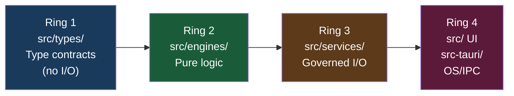
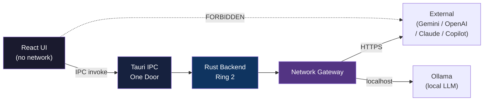
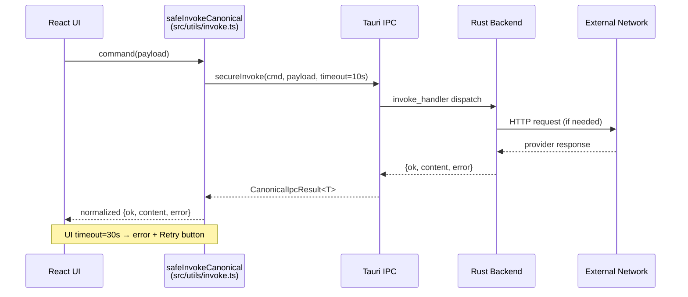
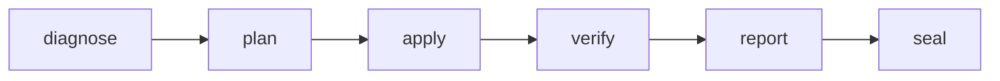
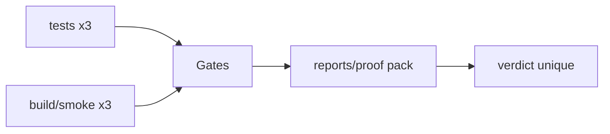
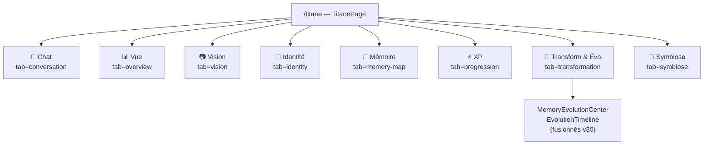
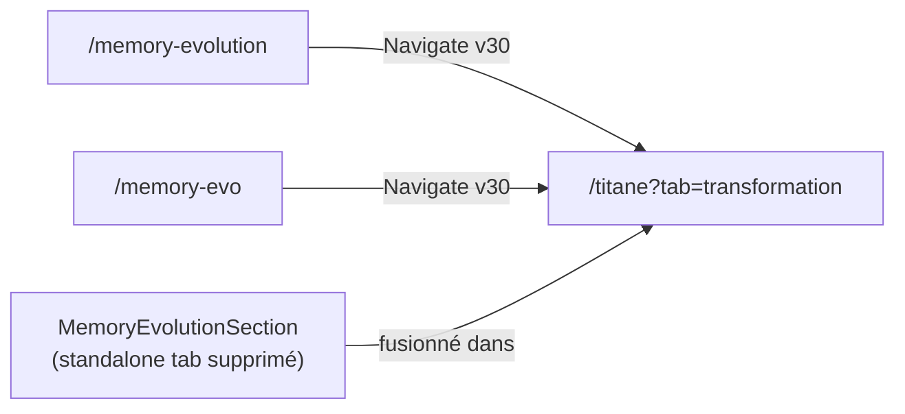
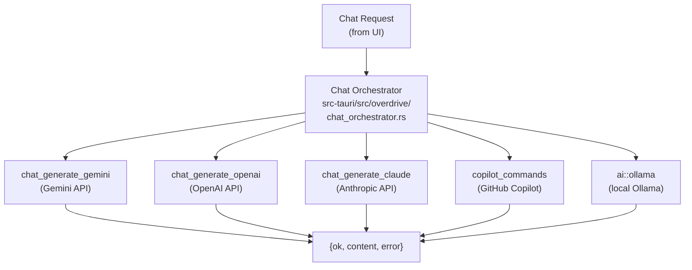
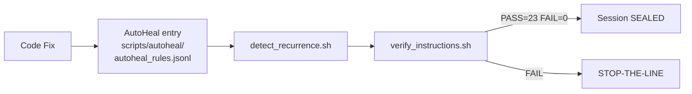

# MAP_MERMAID_OVERVIEW

**Version:** 30.0.0  
**Date:** 2026-04-11  
**Source canonique:** `docs/canon/ARCHITECTURE_TRUTH.md`

---

## 1) Vue 4-Ring

## 2) One Door Network

## 3) IPC Canonical Contract Flow

## 4) Pipeline gouverné

## 5) Gates & Proof Pack

## 6) Structure TitanePage — Onglets v30.0.0

## 7) Fusion v30 — Évolution → Transform

## 8) Provider Routing (Chat Orchestrator v21+R04)

## 9) AutoHeal / Gouvernance

