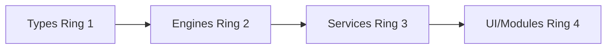
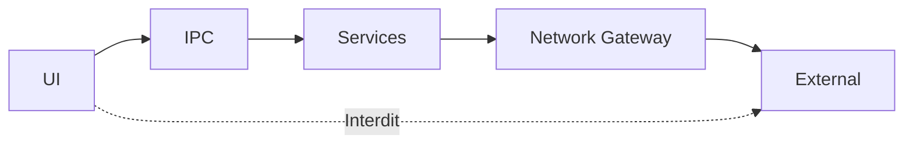
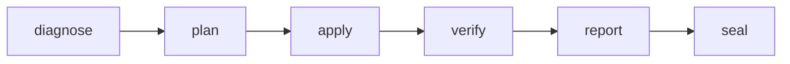
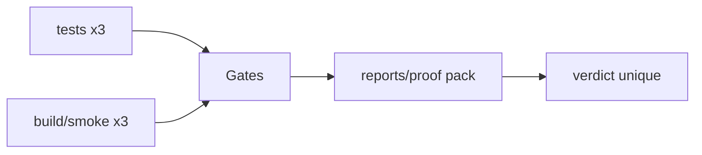

# MAP_MERMAID_OVERVIEW

## 1) Vue 4-Ring

```mermaid
flowchart LR
  T[Types Ring 1] --> E[Engines Ring 2]
  E --> S[Services Ring 3]
  S --> U[UI/Modules Ring 4]
```

## 2) One Door Network

```mermaid
flowchart LR
  UI[UI] --> IPC[IPC]
  IPC --> SVC[Services]
  SVC --> GW[Network Gateway]
  GW --> EXT[External]
  UI -. Interdit .-> EXT
```

## 3) Pipeline gouverné

```mermaid
flowchart LR
  D[diagnose] --> P[plan]
  P --> A[apply]
  A --> V[verify]
  V --> R[report]
  R --> S[seal]
```

## 4) Gates & Proof Pack

```mermaid
flowchart LR
  TX3[tests x3] --> G[Gates]
  BX3[build/smoke x3] --> G
  G --> RP[reports/proof pack]
  RP --> VD[verdict unique]
```
