# TITANE∞ — Technical R&D Handoff

**Date:** 2026-03-22  
**Version:** 28.x  
**Status:** QUALIFIED  
**Scope:** Full endpoint & workflow documentation — all IPC surfaces

---

## Table of Contents

1. [Executive Summary](#1-executive-summary)
2. [4-Ring Architecture](#2-4-ring-architecture)
3. [IPC Contract Fundamentals](#3-ipc-contract-fundamentals)
4. [Global System Data Flow](#4-global-system-data-flow)
5. [Endpoint Workflows](#5-endpoint-workflows)
   - 5.1 [Chat / Conversation](#51-chat--conversation)
   - 5.2 [Memory & State](#52-memory--state)
   - 5.3 [AutoHeal / SelfHeal](#53-autoheal--selfheal)
   - 5.4 [CrashGuard & Emergency](#54-crashguard--emergency)
   - 5.5 [Audio / Voice / TTS](#55-audio--voice--tts)
   - 5.6 [Cloud & Configuration](#56-cloud--configuration)
   - 5.7 [Engines & Monitoring](#57-engines--monitoring)
   - 5.8 [Security & Governance](#58-security--governance)
   - 5.9 [DevTools & Diagnostics](#59-devtools--diagnostics)
   - 5.10 [Identity & Singularity](#510-identity--singularity)
   - 5.11 [Avatar & Multimodal](#511-avatar--multimodal)
   - 5.12 [Onboarding & Setup](#512-onboarding--setup)
6. [Full Endpoint Registry](#6-full-endpoint-registry)
7. [Error Model & Retry Policy](#7-error-model--retry-policy)
8. [Known Gaps & Open Issues](#8-known-gaps--open-issues)
9. [Rollback & Recovery Procedures](#9-rollback--recovery-procedures)

---

## 1. Executive Summary

TITANE∞ is a **Tauri 2.x desktop application** combining a **React/TypeScript** frontend with a **Rust** backend. The only sanctioned communication channel between layers is the **canonical IPC bridge** (`secureInvoke → tauriClient → Tauri IPC → Rust handler`).

| Metric | Value |
|--------|-------|
| Total registered IPC commands | **280+** (tauriCommands.ts) |
| Active command categories | **14** |
| Runtime | **Tauri 2 (desktop-only)** |
| Frontend | **React 18 + TypeScript 5.5** |
| Backend | **Rust 2021 edition** |
| State model | **4-Ring clean architecture** |
| Protocol | **One Door** — UI → IPC → Services → Network Gateway → External |

> **One Door Policy (Rule 5):** No direct UI network calls. All external access routes through the canonical IPC → Network Gateway path.

---

## 2. 4-Ring Architecture

```
┌──────────────────────────────────────────────────────────────┐
│  RING 4 — OS / UI                                            │
│  React pages, Tauri window, audio/camera capture, logging    │
│                                                              │
│  ┌────────────────────────────────────────────────────────┐  │
│  │  RING 3 — SERVICES                                     │  │
│  │  Tauri commands, FS, SQLite, external API calls        │  │
│  │                                                        │  │
│  │  ┌──────────────────────────────────────────────────┐  │  │
│  │  │  RING 2 — ENGINES                               │  │  │
│  │  │  9 cognitive engines — pure logic, zero I/O     │  │  │
│  │  │                                                  │  │  │
│  │  │  ┌────────────────────────────────────────────┐  │  │  │
│  │  │  │  RING 1 — CORE / KERNEL                   │  │  │  │
│  │  │  │  OMEGA pipeline, Singularity, types        │  │  │  │
│  │  │  └────────────────────────────────────────────┘  │  │  │
│  │  └──────────────────────────────────────────────────┘  │  │
│  └────────────────────────────────────────────────────────┘  │
└──────────────────────────────────────────────────────────────┘
```

**Dependency rule:** Arrows always point **inward**. `OS → Services → Engines → Core`. Inverse imports are forbidden.

---

## 3. IPC Contract Fundamentals

### 3.1 Canonical Call Chain

```
UI Component
  └─ tauriClient.<method>()          [src/lib/tauriClient.ts]
       └─ secureInvoke(cmd, args)    [src/lib/security.ts]
            ├─ Allowlist check       (ALLOWED_COMMANDS registry)
            ├─ Rate limit check
            └─ invoke(cmd, args)     [Tauri API]
                  │
                  ▼  [IPC Bridge — serialised JSON]
                  │
            Rust handler             [#[tauri::command]]
                  ├─ Input validation  [security/validation.rs]
                  ├─ Permission check  [security/permission_guard.rs]
                  ├─ Business logic
                  └─ serde_json response  → { ok, content, error }
```

### 3.2 Response Envelope

```typescript
// Every IPC response MUST follow this contract (Rule 6):
{ ok: boolean; content: T | null; error: string | null }
```

### 3.3 Serialisation Conventions

| Side | Case | Example |
|------|------|---------|
| Rust (struct fields) | `snake_case` | `conversation_id` |
| TypeScript (JSON) | `camelCase` via `serde rename_all` | `conversationId` |
| Command names | `snake_case` string | `conversation_generate` |

---

## 4. Global System Data Flow

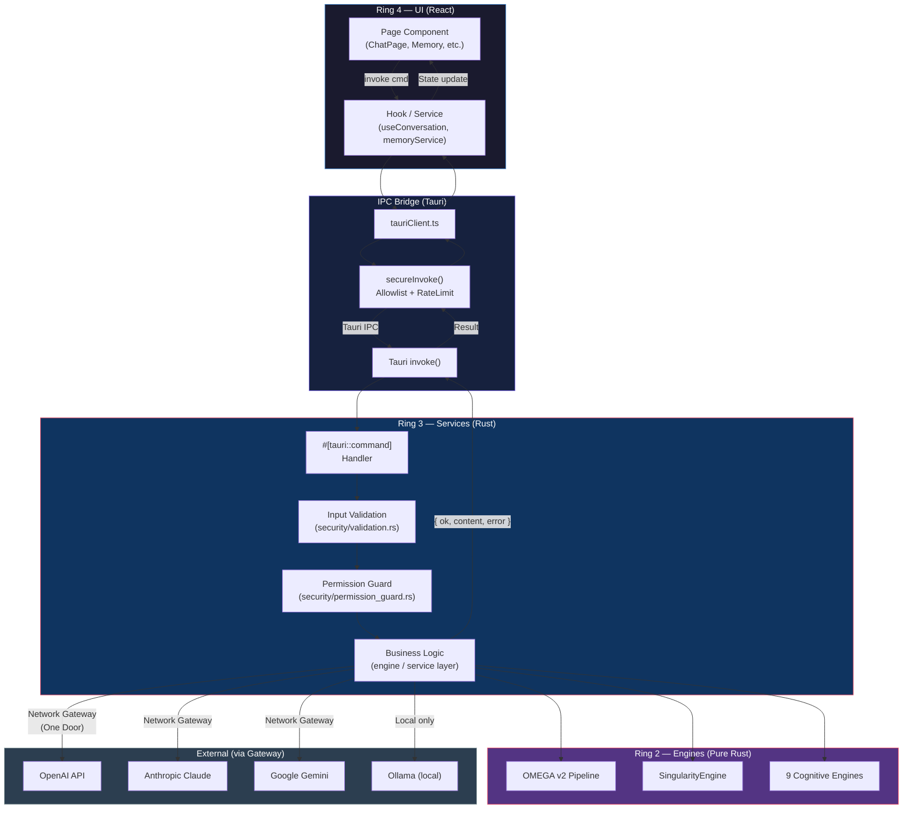

---

## 5. Endpoint Workflows

### 5.1 Chat / Conversation

**Commands:** `conversation_generate`, `create_new_conversation`, `conversation_reset`, `delete_conversation`, `conversation_health_check`, `conversation_memory_stats`, `chat_get_providers_status`, `chat_mode_change`, `chat_mode_sync`, `load_conversation_history`, `list_restorable_conversations`, `report_chat_error`

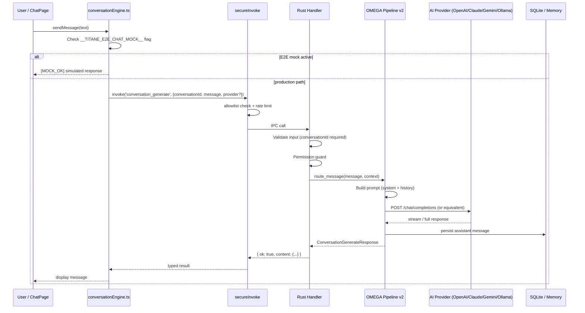

**Payload — `conversation_generate`:**

```typescript
// Request
{ conversationId: string; message: string; provider?: "openai"|"claude"|"gemini"|"copilot"|"ollama"; temperature?: number; maxTokens?: number; systemPrompt?: string }

// Response
{ id: string; conversationId: string; role: "assistant"; content: string; timestamp: string; provider: string; tokens: { prompt: number; completion: number; total: number }; metadata?: { model: string; finishReason: string } }
```

**Provider fallback chain:** `OpenAI → Claude → Gemini → Ollama (local) → error`

---

### 5.2 Memory & State

**Commands:** `memory_get_state`, `memory_save_state`, `memory_store`, `memory_search`, `memory_scan`, `memory_prune`, `memory_grow`, `memory_synthesize`, `memory_evolve_full`, `memory_save_entry`, `memory_get_entry`, `memory_get_all_keys`, `memory_save_chat_interaction`, `clear_all_memory`, `clear_memory_cache`, `reset_memory`, `get_memory_state`, `persistent_memory_read`, `persistent_memory_write_entry`, `persistent_memory_get_context`, `persistent_memory_get_stats`, `persistent_memory_export`

```mermaid
flowchart LR
    subgraph Frontend["Frontend"]
        MS["memoryService.ts"]
        PM["PersistentMemory\nService"]
    end

    subgraph IPC["IPC Bridge"]
        SI["secureInvoke"]
    end

    subgraph Rust["Rust Memory Layer"]
        MC["MemoryCommands\n(commands/memory_commands.rs)"]
        STM["Short-Term\nMemory (STM)"]
        MTM["Mid-Term\nMemory (MTM)"]
        LTM["Long-Term\nMemory (LTM)"]
        VS["Vector Store\n(embeddings)"]
        DB["SQLite\n(persistence layer)"]
    end

    MS -->|memory_get_state| SI
    MS -->|memory_store / memory_save_entry| SI
    MS -->|memory_search| SI
    PM -->|persistent_memory_read/write| SI
    SI --> MC
    MC --> STM
    MC --> MTM
    MC --> LTM
    MC --> VS
    STM & MTM & LTM & VS --> DB
    DB -->|{ ok, content }| MC
    MC -->|Result| SI
    SI --> MS

    style Frontend fill:#1a1a2e,stroke:#4a90d9,color:#fff
    style IPC fill:#16213e,stroke:#7b68ee,color:#fff
    style Rust fill:#0f3460,stroke:#e94560,color:#fff
```

**Memory tiers:**

| Tier | Duration | Capacity | Use |
|------|----------|----------|-----|
| STM | Session | ~50 items | Active context window |
| MTM | Days | ~500 items | Recent interaction history |
| LTM | Permanent | Unlimited | Persistent knowledge base |
| Vector Store | Permanent | Unlimited | Semantic search embeddings |

---

### 5.3 AutoHeal / SelfHeal

**Commands:** `autoheal_init_cognitive`, `autoheal_init_narrative`, `autoheal_init_tts`, `autoheal_clear_narrative`, `autoheal_clear_pipeline`, `autoheal_clear_tts_queue`, `autoheal_reset_cognitive`, `autoheal_reset_adaptive`, `autoheal_resync_state`, `autoheal_rebuild_memory_index`, `autoheal_start_pipeline`, `autoheal_stop_pipeline`, `autoheal_reload_avatar`, `autoheal_resync_lipsync`, `autoheal_start_avatar`, `autoheal_stop_avatar`, `autoheal_validate_memory`, `selfheal_get_health`, `selfheal_get_state`, `selfheal_get_prediction`, `selfheal_force_evaluation`, `selfheal_mini_audit`, `selfheal_rebuild_memory`, `selfheal_regenerate_config`, `selfheal_repair_json`, `selfheal_reset_state`, `selfheal_restart_module`, `selfheal_restart_process`, `selfheal_restart_worker`, `selfheal_save_profile`, `selfheal_switch_provider`, `selfheal_sync_state`, `selfheal_sync_with_singularity`, `selfheal_isolate_module`, `selfheal_clear_cache`

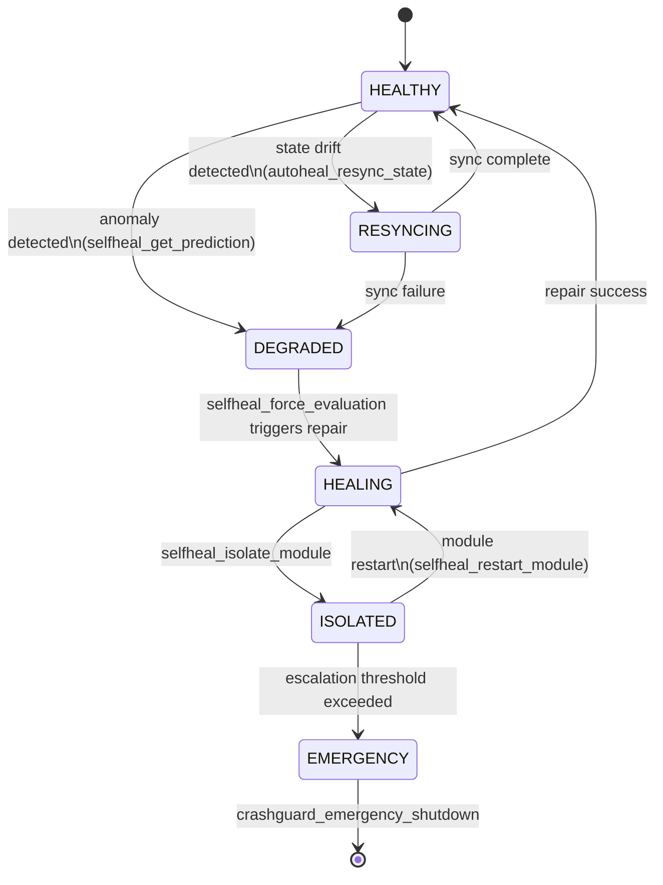

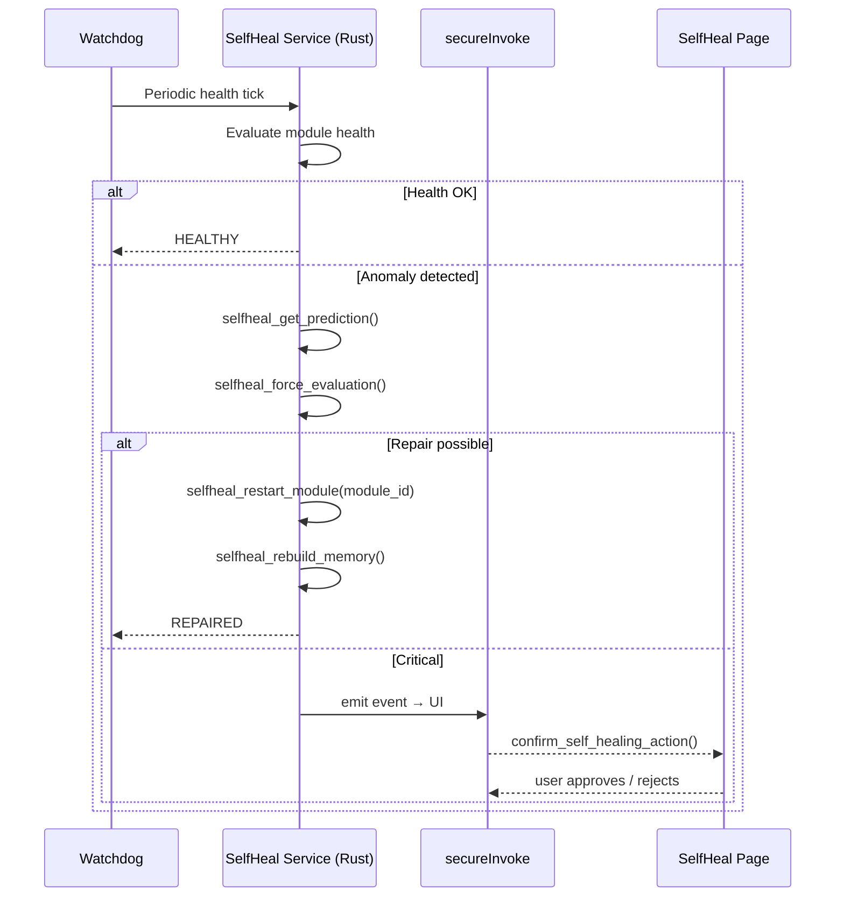

---

### 5.4 CrashGuard & Emergency

**Commands:** `crashguard_clear_memory`, `crashguard_detect_threats`, `crashguard_emergency_rollback`, `crashguard_emergency_shutdown`, `crashguard_kill_thread`, `crashguard_reset_pipeline`, `crashguard_restart_module`, `confirm_self_healing_action`, `reject_self_healing_action`

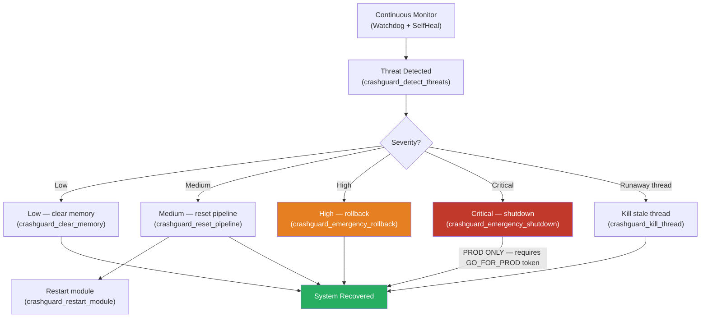

---

### 5.5 Audio / Voice / TTS

**Commands:** `start_recording`, `stop_recording`, `cancel_recording`, `send_audio_chunk`, `test_microphone`, `get_audio_input_devices`, `get_audio_output_devices`, `set_audio_input_device`, `set_audio_output_device`, `get_audio_device_config`, `save_audio_device_config`, `transcribe_audio`, `stt_transcribe`, `start_whisper_streaming`, `stop_whisper_streaming`, `is_recording`, `tts_speak`, `tts_stop`, `speak`, `stop_speaking`, `is_speaking`, `pause_speaking`, `resume_speaking`, `calibrate_titane_voice`, `test_tts`, `vad_configure`, `vad_get_state`, `vad_process_frame`, `vad_reset`, `vad_test`, `autoheal_init_tts`, `autoheal_clear_tts_queue`, `autoheal_resync_lipsync`

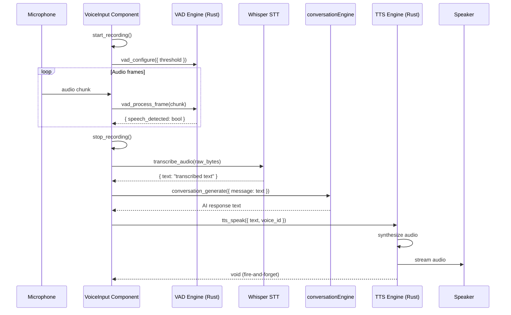

---

### 5.6 Cloud & Configuration

**Commands:** `cloud_init`, `cloud_get_status`, `cloud_sync_push`, `cloud_sync_pull`, `cloud_backup_vault`, `cloud_restore_vault`, `cloud_list_backups`, `cloud_get_devices`, `cloud_remove_device`, `cloud_verify_integrity`, `cloud_get_sync_history`, `cloud_update_config`, `cloud_auto_heal`, `cp_get_ai_config`, `cp_set_ai_config`, `cp_get_design_config`, `cp_set_design_config`, `cp_get_modules_status`, `cp_get_network_config`, `cp_set_network_config`, `cp_get_security_config`, `cp_set_security_config`, `cp_check_for_updates`, `cp_install_update`, `cp_toggle_module`, `save_config_preset`, `load_config_preset`, `delete_config_preset`, `list_config_presets`, `get_all_configs`, `export_config`, `import_config`, `update_runtime_config`, `get_runtime_config`

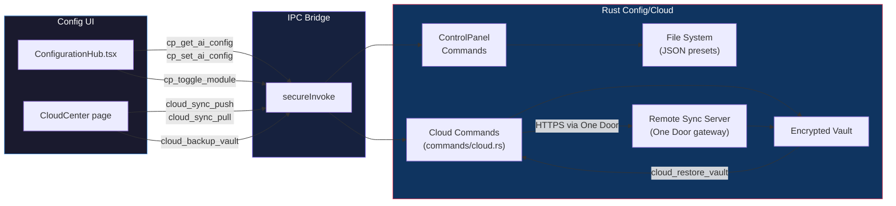

---

### 5.7 Engines & Monitoring

**Commands:** `engine_init`, `engine_stop`, `engine_tick`, `engine_metrics`, `engine_health`, `engine_modules`, `engine_get_singularity_state`, `engine_singularity_reset`, `engines_monitoring_get_dashboard`, `engines_monitoring_get_health`, `engines_monitoring_get_metrics`, `engines_get_dashboard`, `get_system_health`, `get_system_metrics`, `get_system_info`, `get_system_status`, `get_engines_status`, `get_engine_health`, `get_cpu_metrics`, `get_dashboard_metrics`, `orchestration_get_unified_state`, `orchestration_get_cognitive_state`, `orchestrator_init`, `orchestrator_run_cycle`, `orchestrator_set_mode`, `orchestrator_get_state`, `orchestrator_get_metrics`, `one_core_get_state`, `one_core_get_metrics`, `one_core_execute_command`, `one_core_run_diagnostic`, `one_core_force_sync`

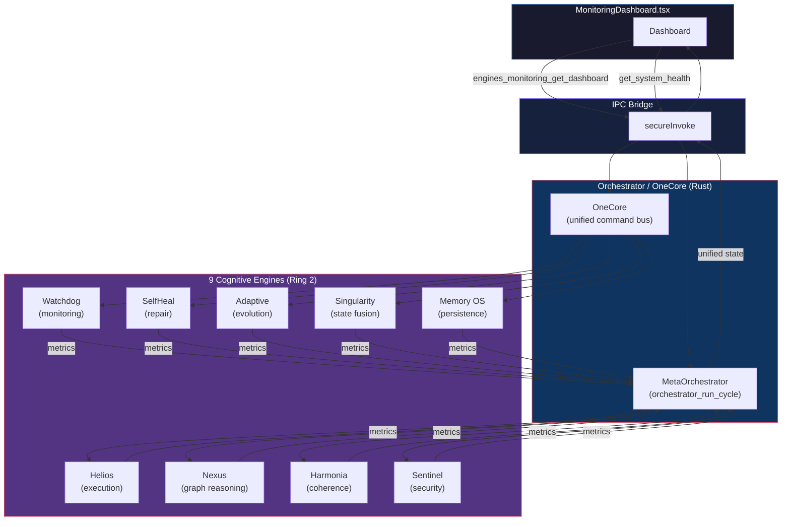

---

### 5.8 Security & Governance

**Commands:** `run_hardening_selftest`, `secure_list_files`, `secure_store_key`, `toggle_safe_mode`, `export_security_log` (via `sc_introspection_generate`), `qa_run_security_audit`, `qa_get_hardening_config`, `qa_update_hardening_config`, `get_backend_version`, `health_check`, `ping`

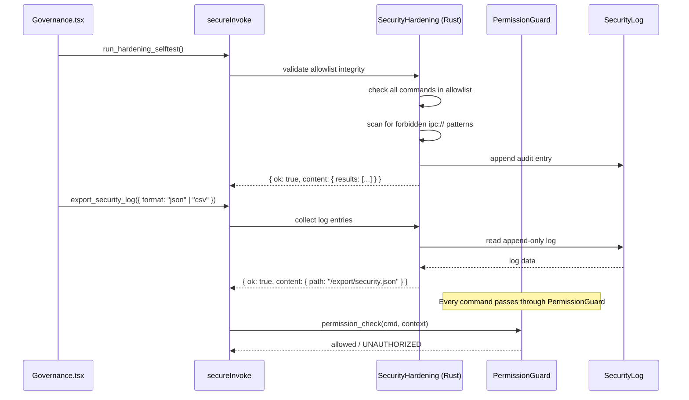

---

### 5.9 DevTools & Diagnostics

**Commands:** `devtools_enable`, `devtools_disable`, `devtools_status`, `devtools_analyze`, `devtools_debug_clear`, `devtools_debug_last`, `devtools_debug_stats`, `devtools_memory_stats`, `devtools_memory_health`, `devtools_memory_search`, `devtools_knn`, `dev_get_logs`, `dev_run_command`, `dev_apply_patch`, `dev_inspect_file`, `clear_logs`, `clear_system_logs`, `get_logs`, `get_system_logs`, `write_log`, `sc_run_quick_diagnostics`, `sc_run_full_diagnostics`, `sc_get_diagnostic_status`, `sc_introspection_generate`, `sc_introspection_preview`, `sc_introspection_auto_fix`, `sc_introspection_quick_scan`, `sc_introspection_full_scan`, `sc_get_logs`, `sc_get_log_stats`, `sc_add_log`, `sc_clear_logs`, `introspection_scan`, `analyze_bundle_size`, `execute_shell_command`, `hybrid_analyze_code`, `engines_devmode_enable`, `engines_devmode_disable`, `engines_devmode_get_state`, `engines_devmode_validate_patch`, `engines_devmode_apply_patch`, `engines_devmode_preview`, `engines_devmode_rollback`, `engines_devmode_get_history`

```mermaid
flowchart TD
    subgraph DevUI["DevPage / TotalDevPage / SystemCenter"]
        DevPage["DevPage.tsx"]
        SC["SystemCenter"]
        TDev["TotalDevPage.tsx"]
    end

    subgraph IPC["IPC Bridge"]
        SI["secureInvoke"]
    end

    subgraph DevBackend["DevTools Rust Backend"]
        DT["DevTools Commands\n(devtools/api.rs)"]
        Diag["Diagnostics\n(system_center/diagnostics.rs)"]
        DevMode["EnginesDevMode\n(engines devmode commands)"]
        Logs["Log System\n(sc_get_logs, dev_get_logs)"]
    end

    DevPage -->|devtools_analyze\ndev_run_command| SI
    SC -->|sc_run_full_diagnostics\nsc_introspection_generate| SI
    TDev -->|engines_devmode_apply_patch\nengines_devmode_rollback| SI
    SI --> DT
    SI --> Diag
    SI --> DevMode
    DT --> Logs
    Diag --> Logs
    Logs -->|{ ok, content: LogEntry[] }| SI
    SI --> DevUI

    style DevUI fill:#1a1a2e,stroke:#4a90d9,color:#fff
    style IPC fill:#16213e,stroke:#7b68ee,color:#fff
    style DevBackend fill:#0f3460,stroke:#e94560,color:#fff
```

---

### 5.10 Identity & Singularity

**Commands:** `identity_get_matrix`, `identity_get_personality_snapshot`, `identity_list_voice_profiles`, `identity_get_active_voice_profile`, `identity_get_current_tone`, `identity_get_current_mode`, `identity_get_available_modes`, `identity_get_active_rules`, `identity_get_coherence_score`, `identity_set_matrix`, `identity_set_mode`, `identity_set_active_voice_profile`, `identity_enable_rule`, `identity_disable_rule`, `singularity_get_full_state`, `singularity_check_coherence`, `singularity_get_global_coherence`, `singularity_load_state`, `singularity_save_state`, `singularity_self_check`, `singularity_update_adaptive`, `singularity_update_cognitive`, `singularity_update_full_state`, `singularity_update_meta`, `singularity_update_physical`, `singularity_update_symbolic`, `singularity_autonomy_heal`, `toggle_singularity`

```mermaid
flowchart LR
    subgraph UI["TitanePage / Settings"]
        TP["TitanePage.tsx"]
        SS["Settings.tsx"]
    end

    subgraph IPC["IPC"]
        SI["secureInvoke"]
    end

    subgraph SingEngine["Singularity Engine (Rust)"]
        SE["SingularityEngine\n(singularity/core.rs)"]
        States["5 State Vectors:\nphysical | cognitive\nsymbolic | adaptive | meta"]
        Coherence["Coherence Check\n(singularity/coherence.rs)"]
        Identity["Identity Commands\n(identity/commands.rs)"]
    end

    TP -->|singularity_get_full_state| SI
    SS -->|identity_set_mode| SI
    SI --> SE
    SI --> Identity
    SE --> States
    SE --> Coherence
    States & Coherence -->|state snapshot| SE
    SE -->|{ ok, content: SingularityState }| SI
    SI --> TP & SS

    style UI fill:#1a1a2e,stroke:#4a90d9,color:#fff
    style IPC fill:#16213e,stroke:#7b68ee,color:#fff
    style SingEngine fill:#533483,stroke:#e94560,color:#fff
```

---

### 5.11 Avatar & Multimodal

**Commands:** `autoheal_reload_avatar`, `autoheal_start_avatar`, `autoheal_stop_avatar`, `autoheal_resync_lipsync`, `avatar_selftest` (via `meta_selftest_all`), `fullbody_advance_frame`, `fusion_animate_avatar`, `fusion_process_lipsync`, `fusion_prepare_tts`, `camera_start`, `multimodal_*` (multimodal/commands.rs)

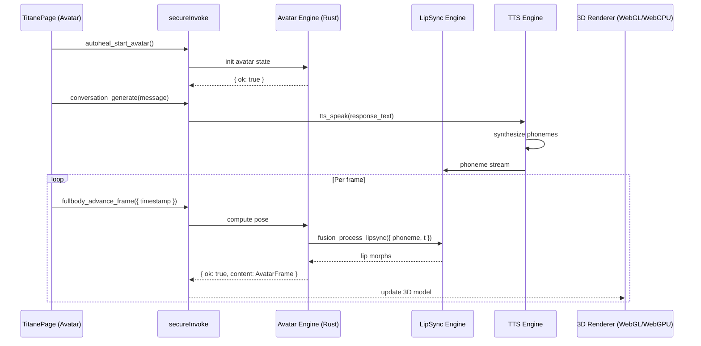

---

### 5.12 Onboarding & Setup

**Commands:** `is_onboarding_complete`, `complete_onboarding`, `reset_onboarding`, `get_onboarding_preferences`, `ai_check_ollama_status`, `ai_scan_local_models`, `ai_set_local_model`, `ai_status`, `ping_gemini`, `ping_ollama`

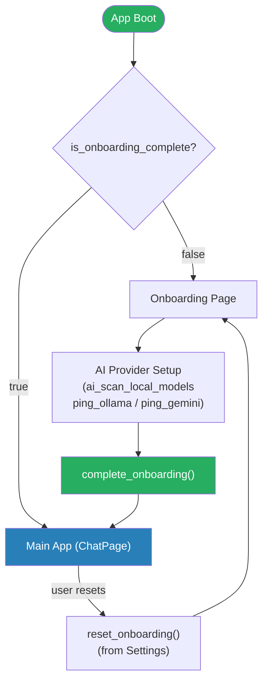

---

## 6. Full Endpoint Registry

> Canonical source: `src/lib/tauriCommands.ts` — 280+ entries.

### 6.1 Category Summary

| Category | Command Count | Key Files |
|----------|---------------|-----------|
| Chat / Conversation | 12 | `conversation_engine/commands.rs`, `commands/chat.rs` |
| Memory & State | 22 | `commands/memory_commands.rs`, `commands/persistent_memory.rs` |
| AutoHeal | 16 | `singularity_fusion/auto_heal.rs`, `selfheal/` |
| SelfHeal | 19 | `commands/self_healing_commands.rs` |
| CrashGuard | 9 | `singularity_fusion/crash_guard.rs` |
| Audio / Voice / TTS | 24 | `audio/commands.rs`, `commands/whisper_commands.rs` |
| Cloud / Config | 33 | `cloud/commands.rs`, `config/mod.rs` |
| Engines / Monitoring | 28 | `commands/engine_commands.rs`, `commands/orchestration_center.rs` |
| Security / Governance | 11 | `security/commands.rs`, `security/hardening.rs` |
| DevTools / Diagnostics | 35 | `devtools/`, `system_center/` |
| Identity / Singularity | 27 | `identity/commands.rs`, `singularity/` |
| Avatar / Multimodal | 14 | `avatar/`, `multimodal/commands.rs` |
| Onboarding / Setup | 10 | `onboarding/mod.rs`, `ai/api.rs` |
| Misc / Utility | 30+ | `commands/core_system.rs`, `time_commands.rs`, etc. |

### 6.2 High-Traffic Endpoints

| Command | Caller | Avg calls/session |
|---------|--------|-------------------|
| `conversation_generate` | `conversationEngine.ts` | >200 |
| `memory_get_state` | `memoryService.ts` | >100 |
| `singularity_get_full_state` | `singularityService.ts` | >100 |
| `avatar_advance_lip_sync` (via fusion) | `Avatar3D.tsx` | >500 (per frame) |
| `get_system_health` | `MonitoringDashboard.tsx` | ~60 |
| `add_timeline_event` | `timelineService.ts` | ~50 |

### 6.3 VOID Commands (fire-and-forget, return `()`)

Commands that return void — no awaited response needed:

- All `set_*`, `update_*`, `delete_*`, `clear_*` commands (~100 total)
- `complete_onboarding`, `autoheal_clear_pipeline`, `tts_stop`
- `crashguard_emergency_shutdown`, `engine_stop`, `toggle_singularity`

### 6.4 Deprecated / Orphaned Commands

| Command | Status | Replacement |
|---------|--------|-------------|
| `chat_send_message` | **Removed v27.0.5** | `conversation_generate` |
| `memory_compactor_*` | Orphaned (no frontend callers) | deprecated |
| Some `cycle_engine_*` | Disabled | — |
| `VOICE_START_RECORDING` | **Removed** | `start_recording` |

---

## 7. Error Model & Retry Policy

### 7.1 Error Types (Rust)

```rust
// src-tauri/src/error.rs
pub enum TitaneError {
    Internal(String),     // 500 — retry with backoff
    InvalidInput(String), // 400 — do not retry
    NotFound(String),     // 404 — do not retry
    Unauthorized(String), // 401 — prompt user for API key
    RateLimited(String),  // 429 — retry after delay
    ExternalApi(String),  // 502 — fallback to next provider
    Timeout(String),      // 504 — retry once
    Database(String),     // 500 — maybe retry (transient)
    Io(String),           // 500 — maybe retry (transient)
    // + 14 more variants
}
```

### 7.2 Frontend Error Class

```typescript
// src/lib/security.ts
class TitaneError extends Error {
  code: string;      // "INVALID_INPUT", "RATE_LIMITED", etc.
  message: string;
  details?: unknown;
}
```

### 7.3 Retry Matrix

| Error Code | Retry? | Strategy |
|------------|--------|----------|
| `INTERNAL_ERROR` | ✅ | Exponential backoff (3 attempts) |
| `INVALID_INPUT` | ❌ | Fix input |
| `NOT_FOUND` | ❌ | — |
| `UNAUTHORIZED` | ❌ | Prompt user for API key |
| `RATE_LIMITED` | ✅ | Wait retry-after header |
| `TIMEOUT` | ✅ | Retry once |
| `EXTERNAL_API_ERROR` | ✅ | Fallback chain (OpenAI → Claude → Gemini → Ollama) |
| `DATABASE_ERROR` | ⚠️ | Retry once if transient |

---

## 8. Known Gaps & Open Issues

| ID | Area | Description | Priority |
|----|------|-------------|----------|
| G-001 | Rust CI | `OmegaConversationBridge::new` 3rd arg fix pending real CI (AH-0171 BLOCKED_APPROVAL_GATE) | P0 |
| G-002 | E2E | Boot/E2E BLOCKED — unblock requires owner to approve PR CI workflows → rust.yml exit 0 | P0 |
| G-003 | Mock in PROD | `window.__TITANE_E2E_CHAT_MOCK__` flag present in production code paths | P1 |
| G-004 | P3 Structural Cert | `chat-provider-decision-certification.spec.ts` uses `generateSimulatedMeta()` — NOT real E2E | P1 |
| G-005 | MANIFEST.json | Schema mismatch: `certified-deploy.sh` writes `deployment.version`, `g9-release-seal.sh` reads root `.version` | P1 |
| G-006 | Orphaned commands | `memory_compactor_*`, some `cycle_engine_*` registered but no frontend callers | P2 |
| G-007 | Gates (G1/G2/G3) | Previously used `rg` with no grep fallback — fixed 2026-03-14. Monitor for regressions | P2 |
| G-008 | VOID commands | ~100 fire-and-forget commands have no error surfacing to UI (silent failures) | P2 |

---

## 9. Rollback & Recovery Procedures

### 9.1 IPC Contract Rollback

```bash
# Revert tauriCommands.ts to last known good
git restore -- src/lib/tauriCommands.ts src/lib/tauriClient.ts src/lib/security.ts

# Revert Rust handlers
git restore -- src-tauri/src/commands/ src-tauri/src/main.rs
```

### 9.2 Architecture Invariant Restore

```bash
# Restore instruction layers
git restore -- .github/copilot-instructions.md .github/instructions/titane.instructions.md

# Restore agents / prompts
git restore -- .github/prompts .github/agents src/AGENTS.md src-tauri/AGENTS.md

# Restore governance scripts
git restore -- scripts/verify governance
```

### 9.3 Gate Verification After Rollback

```bash
bash scripts/verify_instructions.sh
bash scripts/autoheal/detect_recurrence.sh
```

Expected output: `PASS=20 FAIL=0` and `G_AH_RECURRENCE_GUARD_PASS`.

---

*Document generated by Copilot R&D Handoff session — 2026-03-22*  
*Source truth: `src/lib/tauriCommands.ts` (280+ commands), `docs/backend/IPC_CONTRACT.md` v26.2.0, `docs/ARCHITECTURE_RINGS.md` v24.2.0*
