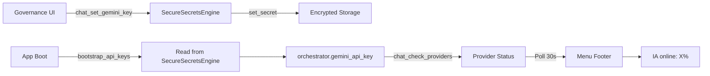

# 🔍 Diagnostic: Footer Menu ne s'affiche pas

## Statut actuel
- ✅ Runtime Tauri actif (PID: 658734)
- ✅ Vite frontend actif (:5173)
- ✅ Code v27 FIX compilé (chat_check_providers lit SecureSecretsEngine)
- ❓ Footer Menu invisible

## Causes possibles

### 1. Menu Collapsé (le plus probable)
**Symptôme:** Le footer ne s'affiche QUE si le menu est déplié

**Solution:**
- Clique sur le bouton toggle en haut du menu (☰) pour le déplier
- Le footer devrait apparaître en bas du menu avec "IA online: X%"

### 2. React State non initialisé
**Symptôme:** `aiStatus.percent` reste `null`

**Vérification DevTools:**
```javascript
// F12 → Console
await window.__TAURI__.core.invoke('chat_check_providers')
```

**Résultat attendu:**
```json
[
  {
    "provider": "openai",
    "available": false,
    "error": "API key not configured"
  },
  {
    "provider": "anthropic",
    "available": false,
    "error": "API key not configured"
  },
  {
    "provider": "gemini",
    "available": true,
    "latency_ms": 234
  },
  {
    "provider": "ollama",
    "available": false,
    "error": "Ollama probe disabled"
  }
]
```

Si tu as entré une clé Gemini valide, `gemini.available` devrait être `true`.

### 3. Clés API non chargées au boot
**Symptôme:** SecureSecretsEngine a les clés mais orchestrator ne les lit pas

**Vérification:**
1. Va dans Governance Center → Secrets
2. Vérifie que le statut affiche "✅ Clé configurée"
3. Sauvegarde à nouveau la clé (au cas où)
4. Attends 30 secondes (le Menu poll toutes les 30s)

### 4. CSS cache le footer
**Vérification DevTools:**
```javascript
// F12 → Elements
// Chercher dans l'arbre DOM:
document.querySelector('.menu-footer')
```

Si `null` → Le menu est collapsed  
Si existe → Vérifier les styles CSS appliqués

## 🧪 Test manuel étape par étape

### Étape 1: Vérifier le menu
1. Ouvre l'app TITANE (devrait être déjà ouverte)
2. Regarde le menu à gauche
3. **Est-il plié ou déplié ?**
   - Plié: Icônes seulement, pas de texte
   - Déplié: Icônes + Texte descriptif

### Étape 2: Déplier le menu (si nécessaire)
1. Clique sur le bouton ☰ en haut du menu
2. Le menu devrait s'élargir
3. **Le footer devrait apparaître en bas !**

### Étape 3: Vérifier le texte du footer
**Attendu selon tes clés:**
- Si aucune clé: `IA online: indisponible`
- Si 1 clé valide: `IA online: 25% (1/4)`
- Si 2 clés valides: `IA online: 50% (2/4)`
- Si 3 clés valides: `IA online: 75% (3/4)`
- Si 4 providers OK: `IA online: 100% (4/4)` ✅

### Étape 4: Si toujours rien
1. Ouvre DevTools (F12)
2. Console → Tape:
```javascript
// Vérifier l'état React du Menu
window.__REACT_DEVTOOLS__ 
// Si installé, inspecter le composant <Menu>
// Vérifier state: aiStatus
```

3. Si `aiStatus.percent === null`:
   - L'appel à `chat_check_providers` a échoué
   - Vérifie la console pour les erreurs

4. Si `aiStatus.percent === 0`:
   - Aucun provider n'est disponible
   - Les clés ne sont pas reconnues ❌

## 🔧 Actions correctives

### Si percent === null (erreur IPC)
```bash
# Relancer le runtime
pkill titane-infinity
pnpm run dev:tauri
```

### Si percent === 0 (clés non reconnues)
1. Vérifie que mes modifications sont compilées:
```bash
grep -n "v27 FIX" src-tauri/src/overdrive/chat_orchestrator.rs
# Devrait retourner 3 lignes (207, 209, 1483)
```

2. Vérifie les logs du runtime:
```bash
# Dans l'app, regarde les logs Rust
# Devrait contenir: "✅ Chat orchestrator: API keys bootstrapped"
```

3. Si toujours KO, force un rechargement:
   - Governance Center → Secrets
   - Re-sauvegarde ta clé Gemini
   - Attends 30s
   - Vérifie le footer

## 📊 État attendu v27 FIX



**Flux correct:**
1. ✅ Tu entres la clé dans Governance
2. ✅ Elle est stockée dans SecureSecretsEngine (encrypted)
3. ✅ Au boot, `bootstrap_api_keys` la charge dans l'orchestrator
4. ✅ `chat_check_providers` lit depuis l'orchestrator
5. ✅ Menu poll et affiche le %

**Si tu ne vois rien:**
→ Étape 2 non effectuée (menu collapsed) OU  
→ Étape 3 échouée (bootstrap non exécuté) OU  
→ Étape 4 échouée (clé invalide)

---

**Prochaine action:**
1. Vérifie si le menu est collapsed
2. Déplie-le avec ☰
3. Observe le footer
4. Rapporte ce que tu vois !
