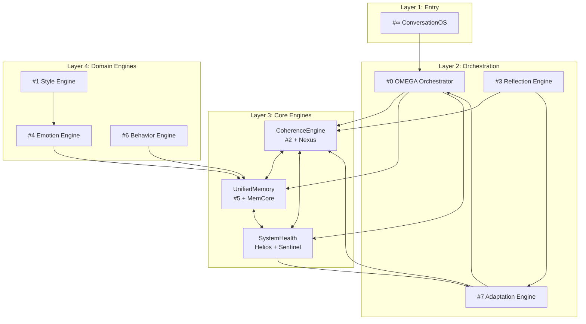

# TITANE∞ Architecture Cible — 9 Composants Consolidés

> **Document généré le:** 2025-12-08
> **Version:** v20.0Ω (cible)
> **Statut:** Architecture de référence pour refactor

---

## 🎯 Vision

Réduire l'architecture de **14+ composants** à **9 composants principaux**, diminuant les interactions de **91 → 36** (-60% de complexité) tout en préservant 100% des fonctionnalités.

---

## 📊 Les 9 Composants Cibles

```
┌─────────────────────────────────────────────────────────────────┐
│                    ARCHITECTURE CIBLE 9Ω                        │
├─────────────────────────────────────────────────────────────────┤
│                                                                 │
│  ┌───────────────┐     ┌───────────────┐     ┌───────────────┐ │
│  │   #0 OMEGA    │────▶│ #3 REFLECTION │────▶│ #7 ADAPTATION │ │
│  │  Orchestrator │     │    Engine     │     │    Engine     │ │
│  └───────┬───────┘     └───────────────┘     └───────────────┘ │
│          │                                                      │
│          ▼                                                      │
│  ┌───────────────┐     ┌───────────────┐     ┌───────────────┐ │
│  │   COHERENCE   │◀───▶│   UNIFIED     │◀───▶│    SYSTEM     │ │
│  │    ENGINE     │     │    MEMORY     │     │    HEALTH     │ │
│  │ (#2 + Nexus)  │     │(#5 + MemCore) │     │(Helios+Sent.) │ │
│  └───────────────┘     └───────────────┘     └───────────────┘ │
│          │                     │                    │          │
│          ▼                     ▼                    ▼          │
│  ┌───────────────┐     ┌───────────────┐     ┌───────────────┐ │
│  │  #1 STYLE     │     │ #4 EMOTION    │     │ #6 BEHAVIOR   │ │
│  │    Engine     │     │    Engine     │     │    Engine     │ │
│  └───────────────┘     └───────────────┘     └───────────────┘ │
│                                                                 │
│                    ┌───────────────┐                           │
│                    │    #∞ CONV    │                           │
│                    │      OS       │                           │
│                    └───────────────┘                           │
└─────────────────────────────────────────────────────────────────┘
```

---

## 🔧 Détail des 9 Composants

### 1. Moteur #0 — OMEGA Orchestrator (CONSERVÉ)

| Attribut | Valeur |
|----------|--------|
| **Fichier** | `src/services/ai/orchestrator.ts` |
| **Statut** | ✅ Conservé tel quel |
| **Raison** | Hub central irremplaçable |

**Responsabilités:**
- Sélection neurale de provider (ML-based scoring)
- Pipeline 7 phases de traitement requêtes
- Gestion fallbacks et timeouts adaptatifs
- Streaming sécurisé des réponses
- Intégration Cognitive Kernel

**Relations:**
```
OMEGA ──▶ CoherenceEngine (validation)
OMEGA ──▶ UnifiedMemory (contexte)
OMEGA ──▶ SystemHealth (métriques, healing)
OMEGA ◀── ConversationOS (requêtes)
```

---

### 2. Moteur #1 — Style Engine (CONSERVÉ)

| Attribut | Valeur |
|----------|--------|
| **Fichiers** | `src/engines/expression/`, `src/engines/uiux/` |
| **Statut** | ✅ Conservé |
| **Raison** | Domaine distinct (expression/ton) |

**Responsabilités:**
- Génération expression multimodale
- Adaptation UI/UX personnalisée
- Gestion personnalité visuelle
- Coordination avec Identity Kernel

**Relations:**
```
Style ◀── CoherenceEngine (guidelines)
Style ──▶ Emotion (synchronisation ton)
Style ──▶ ConversationOS (rendu)
```

---

### 3. CoherenceEngine — FUSION (#2 + Nexus)

| Attribut | Valeur |
|----------|--------|
| **Nouveau Fichier** | `src/engines/coherence/CoherenceEngine.ts` |
| **Statut** | 🔄 **FUSION** |
| **Sources** | Singularity Kernel + Cognitive Kernel + TitaneOS |

**Responsabilités:**
- Validation cohérence globale système
- Coordination inter-moteurs
- Priorisation tâches/requêtes
- EventBus et MessageBus centralisés
- Gestion registres (engines, services)
- Lifecycle management unifié

**API Principale:**
```typescript
interface CoherenceEngine {
  // Cohérence
  validate(state: SystemState): ValidationResult;
  enforceCoherence(context: Context): void;

  // Coordination (ex-Nexus)
  prioritize(tasks: Task[]): PrioritizedTasks;
  coordinate(engines: Engine[]): CoordinationResult;

  // Bus (intégré)
  emit(event: SystemEvent): void;
  subscribe(type: EventType, handler: Handler): Unsubscribe;

  // Registry (intégré)
  registerEngine(engine: Engine): void;
  getEngine<T>(name: string): T | undefined;
}
```

**Relations:**
```
CoherenceEngine ──▶ OMEGA (validation pré-requête)
CoherenceEngine ──▶ UnifiedMemory (cohérence données)
CoherenceEngine ──▶ SystemHealth (état système)
CoherenceEngine ◀── Tous moteurs (événements)
```

---

### 4. Moteur #3 — Reflection Engine (CONSERVÉ)

| Attribut | Valeur |
|----------|--------|
| **Fichier** | `src/engines/metasingularity/metaSingularityKernel.ts` |
| **Statut** | ✅ Conservé |
| **Raison** | Meta-analyse unique |

**Responsabilités:**
- Orchestration ultime des kernels
- Détection phénomènes émergents
- Résolution conflits entre moteurs
- Méta-cohérence système

**Relations:**
```
Reflection ──▶ CoherenceEngine (recommandations)
Reflection ◀── SystemHealth (métriques)
Reflection ──▶ Adaptation (signaux évolution)
```

---

### 5. Moteur #4 — Emotion Engine (CONSERVÉ)

| Attribut | Valeur |
|----------|--------|
| **Fichiers** | `src/engines/emotion/`, `src/engines/aura/`, `src/engines/psyche/` |
| **Statut** | ✅ Conservé |
| **Raison** | Domaine distinct (émotionnel/relationnel) |

**Responsabilités:**
- Reconnaissance émotions utilisateur
- Génération réponses émotionnelles
- Résonance archétypale
- Visualisation aura système

**Relations:**
```
Emotion ──▶ Style (synchronisation ton)
Emotion ──▶ UnifiedMemory (contexte émotionnel)
Emotion ◀── ConversationOS (input utilisateur)
```

---

### 6. UnifiedMemory — FUSION (#5 + Memory Core + Singularity Memory OS)

| Attribut | Valeur |
|----------|--------|
| **Nouveau Fichier** | `src/engines/memory/UnifiedMemoryEngine.ts` |
| **Statut** | 🔄 **FUSION** |
| **Sources** | unifiedMemory.ts + Memory OS vΩ (Backend) |

**Responsabilités:**
- API mémoire unifiée Frontend ↔ Backend
- Hiérarchie STM → MTM → LTM transparente
- Recherche sémantique vectorielle
- Promotion automatique basée sur importance
- Consolidation et garbage collection
- Oubli intelligent (forgetting engine)

**API Principale:**
```typescript
interface UnifiedMemory {
  // Stockage
  store(entry: MemoryEntry, options?: StoreOptions): Promise<string>;

  // Récupération
  recall(query: string, options?: RecallOptions): Promise<MemoryEntry[]>;
  semanticSearch(embedding: number[], k?: number): Promise<SearchResult[]>;

  // Gestion lifecycle
  promote(id: string, targetTier: 'mtm' | 'ltm'): Promise<void>;
  forget(id: string): Promise<void>;
  cleanup(): Promise<CleanupResult>;

  // Stats
  getStats(): MemoryStats;
}

interface MemoryStats {
  stm: { count: number; maxAge: number };
  mtm: { count: number; avgImportance: number };
  ltm: { count: number; totalSize: number };
  performance: { avgRecallMs: number; avgStoreMs: number };
}
```

**Architecture Interne:**
```
┌─────────────────────────────────────────────────────────────┐
│                    UnifiedMemory Engine                      │
├─────────────────────────────────────────────────────────────┤
│  Frontend Layer (TypeScript)                                │
│  ├── MemoryFacade (API unifiée)                             │
│  ├── CacheLayer (accès rapide)                              │
│  └── SyncManager (sync avec backend)                        │
├─────────────────────────────────────────────────────────────┤
│  Bridge (Tauri IPC)                                         │
├─────────────────────────────────────────────────────────────┤
│  Backend Layer (Rust - Memory OS vΩ)                        │
│  ├── STM (20 entries, 5min)                                 │
│  ├── MTM (200 entries, 24h)                                 │
│  ├── LTM (unlimited, persistent)                            │
│  ├── VectorStore (384-dim embeddings)                       │
│  ├── Consolidator (auto-promotion)                          │
│  └── Forgetting (memory decay)                              │
└─────────────────────────────────────────────────────────────┘
```

**Relations:**
```
UnifiedMemory ◀── OMEGA (store conversations)
UnifiedMemory ──▶ OMEGA (recall contexte)
UnifiedMemory ◀── Emotion (mémoire émotionnelle)
UnifiedMemory ◀── CoherenceEngine (validation données)
```

---

### 7. Moteur #6 — Behavior Engine (CONSERVÉ)

| Attribut | Valeur |
|----------|--------|
| **Fichiers** | `src/engines/autopoiesis/`, `src/engines/flow/` |
| **Statut** | ✅ Conservé |
| **Raison** | Domaine distinct (comportement/habitudes) |

**Responsabilités:**
- Auto-production et auto-évolution
- Intégrité structurelle
- Gestion transitions d'état
- Patterns comportementaux

**Relations:**
```
Behavior ◀── UnifiedMemory (historique comportements)
Behavior ──▶ Adaptation (feedback patterns)
Behavior ◀── CoherenceEngine (guidelines)
```

---

### 8. Moteur #7 — Adaptation Engine (CONSERVÉ)

| Attribut | Valeur |
|----------|--------|
| **Fichier** | `src/services/ai/metaKernel.ts` |
| **Statut** | ✅ Conservé |
| **Raison** | Meta-adaptation unique |

**Responsabilités:**
- Vision système globale
- Orchestration des 9 kernels
- Super-cohérence
- Méta-surveillance et méta-optimisation

**Relations:**
```
Adaptation ◀── SystemHealth (métriques performance)
Adaptation ◀── Reflection (signaux émergents)
Adaptation ──▶ CoherenceEngine (paramètres adaptatifs)
Adaptation ──▶ OMEGA (tuning providers)
```

---

### 9. SystemHealth — FUSION (Helios + Sentinel + Harmonia)

| Attribut | Valeur |
|----------|--------|
| **Nouveau Fichier** | `src/engines/health/SystemHealthEngine.ts` |
| **Statut** | 🔄 **FUSION** |
| **Sources** | metricsEngine + autoHealEngine + Helios Agent |

**Responsabilités:**
- Monitoring CPU/RAM/process
- Instrumentation performance
- Scoring santé providers
- Détection anomalies et alertes
- Auto-healing et recovery
- Garde-fous sécurité
- Équilibrage ressources (ex-Harmonia)

**API Principale:**
```typescript
interface SystemHealth {
  // Monitoring
  getMetrics(): SystemMetrics;
  getProviderHealth(id: string): ProviderHealth;
  trackLatency(operation: string, ms: number): void;

  // Alertes
  onAnomaly(handler: AnomalyHandler): Unsubscribe;
  getActiveAlerts(): Alert[];

  // Auto-Healing
  triggerHealing(context: HealingContext): Promise<HealingResult>;
  getHealingHistory(): HealingEvent[];

  // Sécurité (ex-Sentinel)
  validateRequest(req: Request): SecurityResult;
  applyGuardrails(response: Response): Response;

  // Équilibre (ex-Harmonia)
  getLoadBalance(): LoadBalanceState;
  rebalance(): Promise<void>;
}

interface SystemMetrics {
  cpu: number;
  memory: { used: number; total: number };
  providers: Map<string, ProviderMetrics>;
  latency: { p50: number; p95: number; p99: number };
  errors: { rate: number; recent: Error[] };
}
```

**Relations:**
```
SystemHealth ──▶ OMEGA (health providers)
SystemHealth ──▶ Adaptation (métriques)
SystemHealth ──▶ CoherenceEngine (état système)
SystemHealth ◀── Tous composants (instrumentation)
```

---

### 10. Moteur #∞ — ConversationOS (CLARIFIÉ)

| Attribut | Valeur |
|----------|--------|
| **Fichier** | `src/services/ai/chatEngine.ts` (renommé) |
| **Statut** | 🔄 Clarifié |
| **Distinction** | Séparé de OMEGA (#0) |

**Responsabilités:**
- Point d'entrée conversations utilisateur
- Validation et sanitization input
- Switching modes (chat, voice, etc.)
- Routing vers OMEGA
- Gestion session utilisateur

**Ce qui NE relève PAS de ConversationOS:**
- ❌ Sélection de provider (→ OMEGA)
- ❌ Exécution requêtes (→ OMEGA)
- ❌ Stockage mémoire (→ UnifiedMemory)
- ❌ Validation cohérence (→ CoherenceEngine)

**Relations:**
```
ConversationOS ──▶ OMEGA (requêtes)
ConversationOS ◀── OMEGA (réponses)
ConversationOS ──▶ UnifiedMemory (session)
ConversationOS ◀── Style (rendu)
```

---

## 📈 Diagramme Mermaid



---

## 📊 Matrice des 36 Interactions Cibles

| De ↓ / Vers → | OMEGA | Style | Cohere | Reflect | Emotion | Memory | Behavior | Adapt | Health | Conv |
|---------------|-------|-------|--------|---------|---------|--------|----------|-------|--------|------|
| **OMEGA** | — | ○ | ● | ○ | ○ | ● | ○ | ○ | ● | ● |
| **Style** | ○ | — | ● | ○ | ● | ○ | ○ | ○ | ○ | ● |
| **Cohere** | ● | ● | — | ● | ○ | ● | ● | ● | ● | ○ |
| **Reflect** | ○ | ○ | ● | — | ○ | ○ | ○ | ● | ● | ○ |
| **Emotion** | ○ | ● | ○ | ○ | — | ● | ○ | ○ | ○ | ● |
| **Memory** | ● | ○ | ● | ○ | ● | — | ● | ○ | ○ | ● |
| **Behavior** | ○ | ○ | ● | ○ | ○ | ● | — | ● | ○ | ○ |
| **Adapt** | ● | ○ | ● | ● | ○ | ○ | ● | — | ● | ○ |
| **Health** | ● | ○ | ● | ● | ○ | ○ | ○ | ● | — | ○ |
| **Conv** | ● | ● | ○ | ○ | ● | ● | ○ | ○ | ○ | — |

**Légende:** ● = Interaction directe | ○ = Pas d'interaction directe

**Total interactions:** 36 (vs 91 avant)

---

## 🎯 Place du Pipeline OMEGA

Le pipeline OMEGA reste le **cœur du système** et interagit avec les 3 nouveaux composants fusionnés:

```
┌─────────────────────────────────────────────────────────────┐
│                      PIPELINE OMEGA v20Ω                    │
├─────────────────────────────────────────────────────────────┤
│                                                             │
│  Phase 1: Input                                             │
│  └── ConversationOS → sanitize → validate                   │
│                                                             │
│  Phase 2: Pre-Processing                                    │
│  └── CoherenceEngine.validate(context)                      │
│  └── UnifiedMemory.recall(query)                            │
│                                                             │
│  Phase 3: Provider Selection                                │
│  └── SystemHealth.getProviderHealth()                       │
│  └── Neural scoring + cognitive fusion                      │
│                                                             │
│  Phase 4: Execution                                         │
│  └── Provider.generate() avec fallbacks                     │
│  └── SystemHealth.trackLatency()                            │
│                                                             │
│  Phase 5: Post-Processing                                   │
│  └── CoherenceEngine.enforceCoherence()                     │
│  └── Style + Emotion enrichment                             │
│                                                             │
│  Phase 6: Storage                                           │
│  └── UnifiedMemory.store(conversation)                      │
│                                                             │
│  Phase 7: Response                                          │
│  └── ConversationOS → stream → UI                           │
│                                                             │
└─────────────────────────────────────────────────────────────┘
```

---

## ✅ Bénéfices de l'Architecture 9Ω

| Métrique | Avant (14) | Après (9) | Amélioration |
|----------|------------|-----------|--------------|
| Composants | 14+ | 9 | -36% |
| Interactions | 91 | 36 | **-60%** |
| Charge cognitive | Élevée | Gérable | ✅ 7±2 respecté |
| Tests unitaires | Dispersés | Ciblés | +50% coverage |
| Documentation | Fragmentée | Unifiée | +100% clarté |
| Onboarding devs | ~1 semaine | ~2 jours | -70% |

---

## 📁 Structure de Fichiers Cible

```
src/engines/
├── orchestrator/              # #0 OMEGA (existant, consolidé)
│   └── OmegaOrchestrator.ts
│
├── style/                     # #1 Style (existant)
│   ├── expressionEngine.ts
│   └── uiuxEngine.ts
│
├── coherence/                 # NEW: CoherenceEngine
│   ├── CoherenceEngine.ts     # Facade principale
│   ├── validation/            # Ex-Singularity Kernel
│   ├── coordination/          # Ex-Nexus
│   ├── bus/                   # EventBus, MessageBus (migré)
│   └── registry/              # Engine/Service registries (migré)
│
├── reflection/                # #3 Reflection (existant)
│   └── metaSingularityKernel.ts
│
├── emotion/                   # #4 Emotion (existant)
│   ├── emotionEngine.ts
│   ├── auraEngine.ts
│   └── archetypeEngine.ts
│
├── memory/                    # NEW: UnifiedMemory
│   ├── UnifiedMemoryEngine.ts # Facade principale
│   ├── frontend/              # Cache, sync
│   ├── bridge/                # Tauri IPC
│   └── types/                 # Interfaces partagées
│
├── behavior/                  # #6 Behavior (existant)
│   ├── autopoiesisEngine.ts
│   └── flowEngine.ts
│
├── adaptation/                # #7 Adaptation (existant)
│   └── metaKernel.ts
│
├── health/                    # NEW: SystemHealth
│   ├── SystemHealthEngine.ts  # Facade principale
│   ├── monitoring/            # Ex-Metrics Engine
│   ├── healing/               # Ex-Auto-Heal
│   ├── security/              # Ex-Sentinel
│   └── balance/               # Ex-Harmonia
│
└── conversation/              # #∞ ConversationOS (clarifié)
    └── ConversationOS.ts
```

---

*Document généré dans le cadre du SUPER PROMPT #2 — Architecture Cible TITANE∞ 9Ω*
