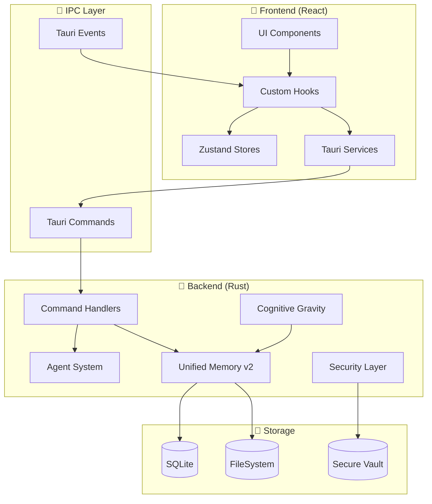

# 🗺️ CARTE DU SYSTÈME TITANE∞

**Date:** 2026-01-02  
**Version:** 26.2.3  
**Commit:** 65de8fb8cdf9b1a3348569190bda440b03516ebf  
**Auditeur:** Cline AI Agent

---

## 📊 ENVIRONNEMENT TECHNIQUE

| Composant | Version | Rôle |
|-----------|---------|------|
| **Node.js** | v20.19.6 | Runtime JavaScript |
| **NPM** | 11.7.0 | Package Manager (secondaire) |
| **PNPM** | 9.0.0 | Package Manager (principal) |
| **Cargo** | 1.91.1 | Build System Rust |
| **Rustc** | 1.91.1 | Compilateur Rust |
| **Tauri** | 2.9.6 | Framework Desktop |
| **React** | 19.2.3 | UI Framework |
| **TypeScript** | 5.9.3 | Typage statique |
| **Vite** | 6.4.1 | Bundler |

---

## 🏗️ ARBORESCENCE SYNTHÉTIQUE

```
TITANE_INFINITY/
├── 📁 src/                        # Frontend React/TypeScript
│   ├── 📄 main.tsx                # Entry point React (35KB)
│   ├── 📄 App.tsx                 # Composant principal (49KB)
│   ├── 📄 router.tsx              # Configuration routes
│   ├── 📁 components/             # 47 sous-dossiers composants
│   ├── 📁 pages/                  # Pages/vues
│   ├── 📁 features/               # 22 modules métier
│   ├── 📁 engines/                # 26 moteurs cognitifs
│   ├── 📁 cognitive/              # Système cognitif
│   ├── 📁 hooks/                  # Custom React hooks
│   ├── 📁 stores/                 # State management (Zustand)
│   ├── 📁 services/               # Services externes
│   ├── 📁 types/                  # Types TypeScript
│   ├── 📁 lib/                    # Librairies internes
│   ├── 📁 core/                   # 30 modules core
│   ├── 📁 modules/                # 14 modules applicatifs
│   ├── 📁 design-system/          # Design tokens & CSS
│   ├── 📁 themes/                 # Thèmes (Rubis, Saphir, etc.)
│   ├── 📁 i18n/                   # Internationalisation
│   ├── 📁 a11y/                   # Accessibilité
│   ├── 📁 security/               # Sécurité frontend
│   └── 📁 __tests__/              # Tests unitaires
│
├── 📁 src-tauri/                  # Backend Rust/Tauri
│   ├── 📄 Cargo.toml              # Dépendances Rust
│   ├── 📄 tauri.conf.json         # Config Tauri (src-tauri/tauri.conf.json; base; overlay via runtime/*)
│   ├── 📁 src/                    # 103 modules Rust
│   │   ├── 📄 main.rs             # Entry point Tauri
│   │   ├── 📁 agent_system/       # Système d'agents
│   │   ├── 📁 unified_memory_v2/  # Mémoire unifiée
│   │   ├── 📁 cognitive_gravity/  # Gravité cognitive
│   │   ├── 📁 security/           # Sécurité backend
│   │   ├── 📁 watchdog/           # Monitoring
│   │   └── 📁 kernel/             # Noyau système
│   ├── 📁 capabilities/           # Permissions Tauri
│   ├── 📁 memory/                 # Persistance mémoire
│   ├── 📁 vault/                  # Stockage sécurisé
│   ├── 📁 runtime/                # Runtime builds
│   └── 📁 tests/                  # Tests Rust
│
├── 📁 .github/                    # CI/CD & Automation
│   ├── 📁 workflows/              # GitHub Actions (5 fichiers)
│   ├── 📁 copilot-agents/         # Agents Copilot
│   ├── 📁 copilot-xs/             # Copilot XS config
│   └── 📁 instructions/           # Instructions IA
│
├── 📁 docs/                       # Documentation
├── 📁 e2e/                        # Tests E2E (Playwright)
├── 📁 scripts/                    # Scripts utilitaires
├── 📁 config/                     # Configurations
└── 📁 .clinerules/                # Hooks Cline CLI
```

---

## 🚀 ENTRY POINTS

### Frontend (React)

```
index.html
    └── src/main.tsx              # ReactDOM.createRoot()
        └── src/App.tsx           # ThemeProvider + BrowserRouter
            └── AppRouter         # Routes + AppShell
                └── Pages         # Dashboard, Chat, etc.
```

### Backend (Tauri/Rust)

```
src-tauri/src/main.rs             # tauri::Builder
    ├── invoke handlers           # Commandes IPC
    ├── event listeners           # Events système
    └── plugin setup              # Plugins Tauri
```

---

## 🔄 DATAFLOW HAUT NIVEAU



---

## 📋 ROUTES PRINCIPALES (v25.4.0+)

| Route | Module | Description |
|-------|--------|-------------|
| `/chat` | ChatPage | Chat IA Multi-Provider |
| `/titane` | TitanePage | Cœur système (fusion EVO) |
| `/time` | TimePage | Centre temporel (3 modules) |
| `/stats` | StatsPage | Statistiques moteurs (4 modules) |
| `/admin` | AdminPage | Administration (7 modules) |
| `/dev` | DevPage | Développement (4 modules) |

**60+ routes obsolètes** redirigées vers les modules unifiés.

---

## 🧪 TESTS & QUALITÉ

| Type | Framework | Couverture |
|------|-----------|------------|
| **Unit Tests React** | Vitest 4.0 | 97.9% (2276/2322) |
| **Unit Tests Rust** | cargo test | 100% (4294/4294) |
| **E2E Tests** | Playwright | 65 scénarios |
| **Lint JS/TS** | ESLint 8.57 | Actif |
| **Format** | Prettier 3.7 | Actif |
| **Lint Rust** | Clippy | Actif |

---

## ⚙️ SCRIPTS NPM CLÉS

| Script | Action |
|--------|--------|
| `pnpm dev` | Lance Tauri dev mode |
| `pnpm build` | Build Vite production |
| `pnpm test` | Tests Vitest |
| `pnpm test:rust` | Tests Cargo |
| `pnpm lint` | ESLint check |
| `pnpm verify` | Vérification complète |
| `./titane.sh health` | Health check système |

---

## 🔐 CONFIGURATION SÉCURITÉ (DEV MODE)

| Paramètre | Valeur | Impact |
|-----------|--------|--------|
| Rate Limiter | 10000 req/min | Désactivé pour dev |
| Sandbox | disabled | Pas de restrictions |
| Max Agents | 5000 | Scalabilité haute |
| Memory Limit | 4096 MB | Large capacité |
| Timeout | 600s | Tolérance erreurs |

---

## 📦 DÉPENDANCES CRITIQUES

### Frontend (package.json)

| Dépendance | Version | Rôle |
|------------|---------|------|
| `@tauri-apps/api` | 2.9.1 | API Tauri |
| `@tanstack/react-query` | 5.90.12 | Data fetching |
| `zustand` | 5.0.9 | State management |
| `zod` | 4.2.1 | Validation schemas |
| `framer-motion` | 12.23.26 | Animations |
| `react-router-dom` | 7.11.0 | Routing |

### Backend (Cargo.toml)

| Dépendance | Rôle |
|------------|------|
| `tauri` | Framework principal |
| `serde` | Serialization |
| `tokio` | Async runtime |
| `rusqlite` | SQLite bindings |

---

## 🎯 HYPOTHÈSES VÉRIFIÉES

| Hypothèse | Statut | Source |
|-----------|--------|--------|
| Mode Tauri-only actif | ✅ | src-tauri/tauri.conf.json: `tauri://localhost` |
| React 19 stable | ✅ | package.json: `^19.2.3` |
| TypeScript strict | ✅ | tsconfig.json |
| Tests > 95% | ✅ | 97.9% React, 100% Rust |
| 0 erreurs compilation | ✅ | cargo check: 0 errors |
| Zustand pour state | ✅ | src/stores/ |

---

## ⚠️ POINTS D'ATTENTION IDENTIFIÉS

1. **28 dépendances obsolètes** - Mises à jour à planifier
2. **Build stable manquant** - Pas d'AppImage dans runtime/stable/
3. **Formateur auto** - Supprime parfois `default_task_timeout_ms`
4. **46 tests skipped** - À investiguer

---

## 📍 FICHIERS CRITIQUES À AUDITER

| Fichier | Priorité | Raison |
|---------|----------|--------|
| `src/main.tsx` | P0 | Entry point |
| `src/App.tsx` | P0 | Router + providers |
| `src-tauri/src/main.rs` | P0 | Backend entry |
| `src-tauri/tauri.conf.json` | P0 | Config Tauri |
| `src/services/tauri/` | P1 | IPC layer |
| `src-tauri/src/security/` | P1 | Sécurité |
| `.github/workflows/` | P1 | CI/CD |

---

**Généré le:** 2026-01-02 23:39  
**Par:** Cline AI Agent  
**Phase:** 0 - Cartographie Système
