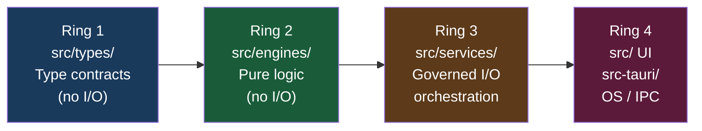
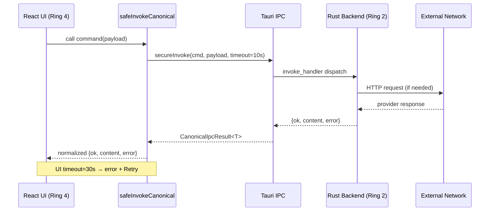
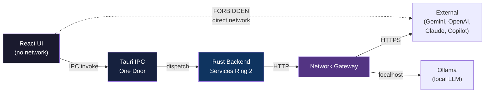

# TITANE∞ — Architecture (EN)

**Version:** 33.0.0  
**Status:** QUALIFIED  
**Date:** 2026-05-03

> See also: `docs/canon/ARCHITECTURE_TRUTH.md` (canon), `docs/MAP_ARCHITECTURE_4RING.md`, `docs/IPC_CONTRACT.md`

---

## 4-Ring model

TITANE∞ uses a **4-Ring** architectural model to separate responsibilities.

```
Ring 1 — Type contracts      [src/types/]
Ring 2 — Pure logic          [src/engines/]
Ring 3 — Governed I/O        [src/services/]
Ring 4 — UI + OS/IPC         [src/ UI + src-tauri/]
```



### Import rules

- **No inverse imports** — a ring cannot import from an outer ring
- Ring 1 → no external dependencies
- Ring 2 → may import Ring 1 only
- Ring 3 → may import Ring 1 and Ring 2
- Ring 4 → may import all rings

**Status:** QUALIFIED — verified by `test:architecture` and `scripts/verify/`

---

## Frontend (Ring 4 — UI)

| Component | Technology | Version |
|---|---|---|
| UI Framework | React | 18.x |
| Language | TypeScript | 5.5 (strict) |
| Build | Vite | 6.x |
| State | Hooks + Context API | — |
| Backend communication | Tauri IPC | v2 |

**Directory:** `src/`

### UI pages (v33.0.0 baseline)

| Page | Route | Tabs |
|---|---|---|
| TitanePage | `/titane` | 💬 Chat, 📊 Vue, 📷 Vision, 🧬 Identité, 💾 Mémoire, ⚡ XP, 🌱 Transform & Évo, 🔀 Symbiose |
| EvoPage | `/evo` | 5 tabs |

> **v30 Fusion note:** The `memory-evolution` tab was merged into `tab=transformation`. Routes `/memory-evolution` and `/memory-evo` redirect to `/titane?tab=transformation`.

---

## Backend (Ring 4 — OS/IPC)

| Component | Technology | Notes |
|---|---|---|
| Runtime | Tauri v2 | Desktop application only |
| Backend language | Rust 2021 | `src-tauri/src/` |
| IPC serialization | JSON via serde | — |
| Concurrency model | Arc<Mutex<T>> | — |
| Error handling | Result<T, E> | No uncontrolled panics |

**Directory:** `src-tauri/`

### Core backend modules (Ring 2)

| Module | Location | Description |
|---|---|---|
| Conversation Engine OMEGA | `src-tauri/src/conversation_engine/` | v19.5.2 — main AI pipeline |
| Chat Orchestrator | `src-tauri/src/overdrive/chat_orchestrator.rs` | v21 + R04 — Multi-provider routing |
| Voice Engine | `src-tauri/src/overdrive/voice_engine.rs` | TTS + VAD |
| Avatar Engine | `src-tauri/src/avatar/` | v23 + FullBody |
| Auth OS | `src-tauri/src/auth/` | Authentication |
| Audio Engine | `src-tauri/src/audio/` | TTS + VAD + Capture |
| Secure Commands | `src-tauri/src/secure_commands.rs` | AES-256-GCM |
| Unified Memory | `src-tauri/src/engines/unified_memory/` | STM/MTM/LTM |

---

## IPC contract

All frontend → backend communication follows this contract:

```typescript
// Standard IPC response
{
  ok: boolean,
  content?: string,
  error?: {
    code: string,
    message: string,
    recoverable: boolean
  },
  meta?: {
    correlationId: string,
    provider: string,
    latencyMs: number
  }
}
```

**Canonical wrapper:** `src/utils/invoke.ts` — `safeInvokeCanonical<T>(cmd, payload, timeoutMs)`  
**Security transport:** `src/lib/security` — `secureInvoke`  
**Type:** `CanonicalIpcResult<T> { ok, content, error }`

**Contract rules:**
- `ok: false` on any error — never silent
- UI timeout: 30 seconds → error + "Retry" button
- Tauri allowlist (`src-tauri/allowlist.whitelist.stable.json`) controls which commands are exposed

**Source:** `docs/IPC_CONTRACT.md` (PROVEN)



---

## Network policy (One Door)

**Cardinal rule:** no direct network access from the UI layer.

```
UI → Tauri IPC → Services (Ring 3) → Network Gateway → External provider
```



| Domain | Network access | Path |
|---|---|---|
| Frontend (React) | FORBIDDEN | — |
| httpClient.ts | DISABLED (browser) | — |
| Ollama (local) | Backend only | `ai::ollama` |
| Gemini | Backend only | `commands::chat_generate_commands::chat_generate_gemini` |
| OpenAI | Backend only | `commands::chat_generate_commands::chat_generate_openai` |
| Claude | Backend only | `commands::chat_generate_commands::chat_generate_claude` |
| Copilot | Backend only | `commands::copilot_commands` |
| Web Research | Backend — STUB only | `web_research_commands::web_research` |

- **Online-first governed** — network connectivity required for cloud providers
- **Mandatory local fallback** — activates when cloud providers are unavailable
- Verification gates: `pnpm run verify:online-first` · `pnpm run verify:network-guard`

---

## Managed states (Tauri .manage())

At startup (`main.rs`) the following states are registered:

```
AppState (SecurityManager) · SingularityCortexState · OrchestratorState
SecureSecretsEngine · CopilotState · ChatOrchestratorState
HeliosCore · MemoryCore · AvatarEngineGlobal
AutoFixState · AutoHealState · CrashGuardState · PerformanceState · UnifiedPipelineState
FrontendStateStore · IdentityEngineState · AIChatState (Legacy bridge)
ExpFusionState · SingularityEngine · Option1DbAppState
ConversationEngineState (OMEGA) · PersistentMemoryState
```

---

## Diagrams

- **Canon source:** `docs/canon/ARCHITECTURE_TRUTH.md`
- 4-Ring mapping: `docs/MAP_ARCHITECTURE_4RING.md`
- Mermaid overview: `docs/MAP_MERMAID_OVERVIEW.md`
- Network surfaces: `docs/MAP_SURFACES_NETWORK.md`
- IPC commands: `docs/MAP_IPC_COMMANDS.md`

---

*French documentation: [docs/dev/fr/architecture.md](../fr/architecture.md)*
