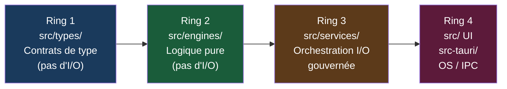
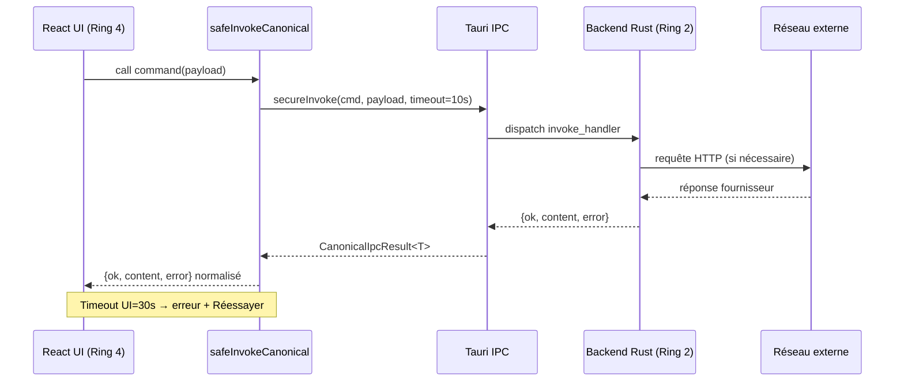
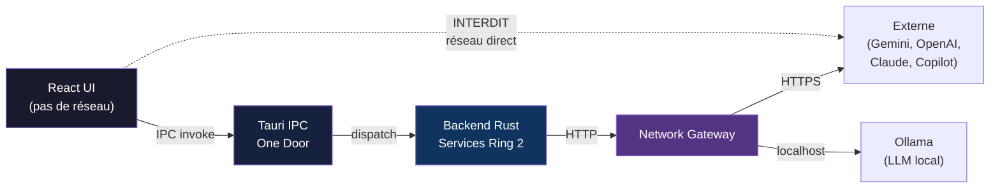

# TITANE∞ — Architecture (FR)

**Version :** 33.0.0  
**Statut :** QUALIFIED  
**Date :** 2026-05-03

> Voir aussi : `docs/canon/ARCHITECTURE_TRUTH.md` (canon), `docs/MAP_ARCHITECTURE_4RING.md`, `docs/IPC_CONTRACT.md`

---

## Modèle 4-Ring

TITANE∞ utilise un modèle d'architecture à **4 anneaux** (rings) pour séparer les responsabilités.

```
Ring 1 — Contrats de type      [src/types/]
Ring 2 — Logique pure          [src/engines/]
Ring 3 — Orchestration I/O     [src/services/]
Ring 4 — UI + OS/IPC           [src/ UI + src-tauri/]
```



### Règles d'importation

- **Pas d'importation inverse** : un ring ne peut pas importer d'un ring extérieur
- Ring 1 → aucune dépendance extérieure
- Ring 2 → peut importer Ring 1 uniquement
- Ring 3 → peut importer Ring 1 et Ring 2
- Ring 4 → peut importer tous les rings

**Statut :** QUALIFIED — vérifié par `test:architecture` et `scripts/verify/`

---

## Frontend (Ring 4 — UI)

| Composant | Technologie | Version |
|---|---|---|
| Framework UI | React | 18.x |
| Langage | TypeScript | 5.5 (strict) |
| Build | Vite | 6.x |
| État | Hooks + Context API | — |
| Communication backend | Tauri IPC | v2 |

**Répertoire :** `src/`

### Pages UI (baseline v33.0.0)

| Page | Route | Onglets |
|---|---|---|
| TitanePage | `/titane` | 💬 Chat, 📊 Vue, 📷 Vision, 🧬 Identité, 💾 Mémoire, ⚡ XP, 🌱 Transform & Évo, 🔀 Symbiose |
| EvoPage | `/evo` | 5 onglets |

> **Note fusion v30 :** L'onglet `memory-evolution` a été fusionné dans `tab=transformation`. Les routes `/memory-evolution` et `/memory-evo` redirigent vers `/titane?tab=transformation`.

---

## Backend (Ring 4 — OS/IPC)

| Composant | Technologie | Notes |
|---|---|---|
| Runtime | Tauri v2 | Application desktop uniquement |
| Langage backend | Rust 2021 | `src-tauri/src/` |
| Sérialisation IPC | JSON via serde | — |
| Modèle de concurrence | Arc<Mutex<T>> | — |
| Gestion des erreurs | Result<T, E> | Jamais de panic non contrôlé |

**Répertoire :** `src-tauri/`

### Modules backend principaux (Ring 2)

| Module | Emplacement | Description |
|---|---|---|
| Conversation Engine OMEGA | `src-tauri/src/conversation_engine/` | v19.5.2 — pipeline IA principal |
| Chat Orchestrator | `src-tauri/src/overdrive/chat_orchestrator.rs` | v21 + R04 — routage multi-provider |
| Voice Engine | `src-tauri/src/overdrive/voice_engine.rs` | TTS + VAD |
| Avatar Engine | `src-tauri/src/avatar/` | v23 + FullBody |
| Auth OS | `src-tauri/src/auth/` | Authentification |
| Audio Engine | `src-tauri/src/audio/` | TTS + VAD + Capture |
| Secure Commands | `src-tauri/src/secure_commands.rs` | AES-256-GCM |
| Unified Memory | `src-tauri/src/engines/unified_memory/` | STM/MTM/LTM |

---

## Contrat IPC

Toutes les communications frontend → backend suivent ce contrat :

```typescript
// Réponse IPC standard
{
  ok: boolean,
  content?: string,
  error?: {
    code: string,
    message: string,
    recoverable: boolean
  },
  meta?: {
    correlationId: string,
    provider: string,
    latencyMs: number
  }
}
```

**Wrapper canonique :** `src/utils/invoke.ts` — `safeInvokeCanonical<T>(cmd, payload, timeoutMs)`  
**Transport sécurisé :** `src/lib/security` — `secureInvoke`  
**Type :** `CanonicalIpcResult<T> { ok, content, error }`

**Règles du contrat :**
- `ok: false` sur toute erreur — jamais de silence
- Timeout UI : 30 secondes → erreur + bouton "Réessayer"
- L'allowlist Tauri (`src-tauri/allowlist.whitelist.stable.json`) contrôle quelles commandes sont exposées

**Source :** `docs/IPC_CONTRACT.md` (PROVEN)



---

## Politique réseau (One Door)

**Règle cardinale :** aucun accès réseau direct depuis la couche UI.

```
UI → IPC Tauri → Services (Ring 3) → Network Gateway → Fournisseur externe
```



| Domaine | Accès réseau | Chemin |
|---|---|---|
| Frontend (React) | INTERDIT | — |
| httpClient.ts | DÉSACTIVÉ (browser) | — |
| Ollama (local) | Backend uniquement | `ai::ollama` |
| Gemini | Backend uniquement | `commands::chat_generate_commands::chat_generate_gemini` |
| OpenAI | Backend uniquement | `commands::chat_generate_commands::chat_generate_openai` |
| Claude | Backend uniquement | `commands::chat_generate_commands::chat_generate_claude` |
| Copilot | Backend uniquement | `commands::copilot_commands` |
| Web Research | Backend — STUB uniquement | `web_research_commands::web_research` |

- **Online-first gouverné** — connectivité réseau requise pour les fournisseurs cloud
- **Fallback local obligatoire** — s'active si les fournisseurs cloud sont indisponibles
- Gates de vérification : `pnpm run verify:online-first` · `pnpm run verify:network-guard`

---

## Diagrammes

- **Source canonique :** `docs/canon/ARCHITECTURE_TRUTH.md`
- Mapping 4-Ring : `docs/MAP_ARCHITECTURE_4RING.md`
- Vue Mermaid d'ensemble : `docs/MAP_MERMAID_OVERVIEW.md`
- Surfaces réseau : `docs/MAP_SURFACES_NETWORK.md`
- Commandes IPC : `docs/MAP_IPC_COMMANDS.md`

---

*Documentation en anglais : [docs/dev/en/architecture.md](../en/architecture.md)*
