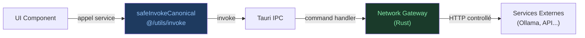
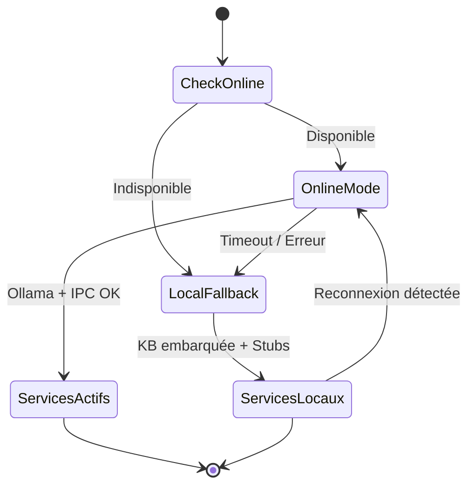
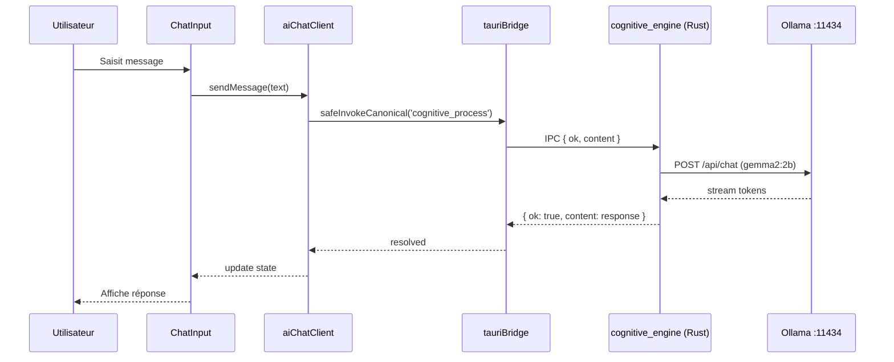
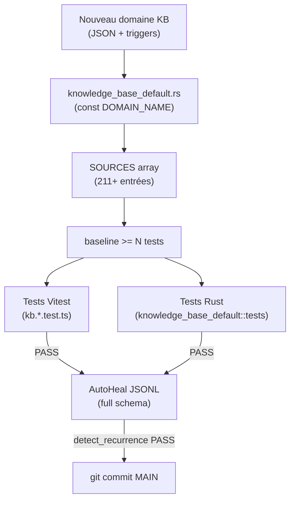
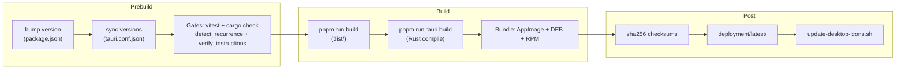
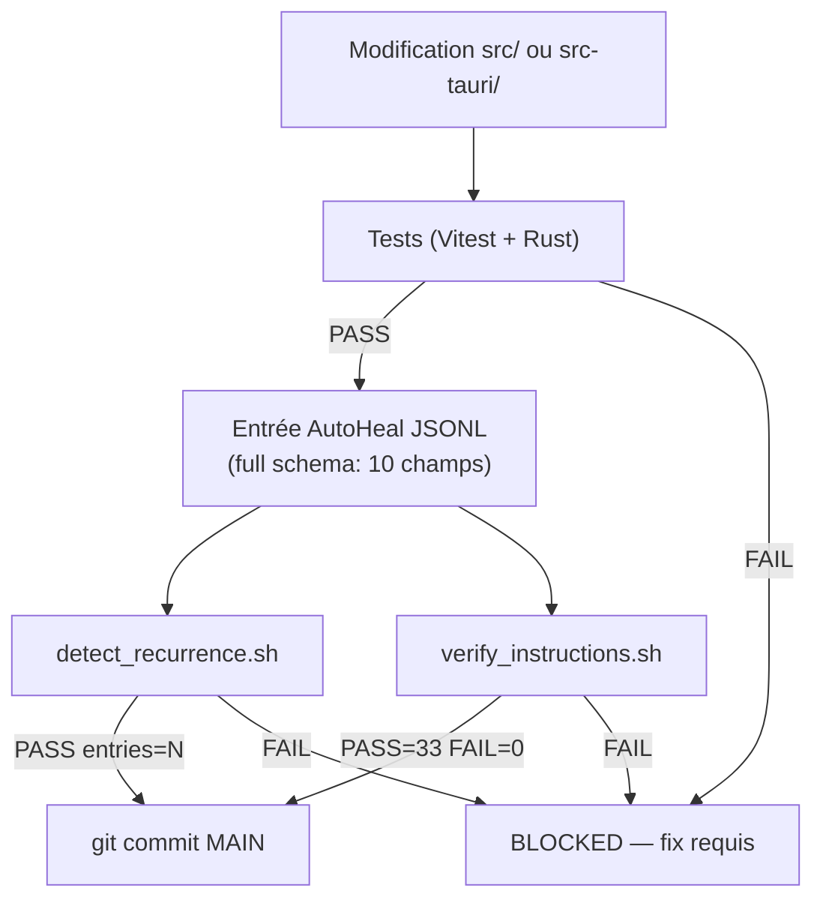

# TITANE∞ — Architecture Diagrams

Diagrammes Mermaid de l'architecture TITANE∞ v31.2.

---

## 1. Architecture 4-Ring

```mermaid
graph TD
    subgraph Ring4["Ring 4 — UI (React)"]
        UI_COMP[Components / Pages]
        UI_HOOKS[Hooks]
        UI_STORES[Zustand Stores]
    end

    subgraph Ring3["Ring 3 — Services Frontend"]
        SERVICES[Services métier]
        ENGINES[Engines frontend]
        CONTEXTS[Contexts React]
        INVOKE["@/utils/invoke<br/>(ONE DOOR)"]
    end

    subgraph Ring2["Ring 2 — IPC Layer"]
        TAURI_CMD[Tauri Commands<br/>#[tauri::command]]
        IPC_CONTRACT["{ok, content, error}"]
    end

    subgraph Ring1["Ring 1 — Backend Rust"]
        RUST_SERVICES[Services Rust]
        KB[Knowledge Base<br/>211+ domaines]
        OPERATORS[Operators<br/>browser/desktop/IDE]
        NETWORK[Network Gateway]
    end

    UI_COMP --> UI_HOOKS
    UI_HOOKS --> SERVICES
    UI_HOOKS --> ENGINES
    UI_COMP --> CONTEXTS
    SERVICES --> INVOKE
    ENGINES --> INVOKE
    INVOKE -->|IPC| TAURI_CMD
    TAURI_CMD --> IPC_CONTRACT
    IPC_CONTRACT --> RUST_SERVICES
    RUST_SERVICES --> KB
    RUST_SERVICES --> OPERATORS
    RUST_SERVICES --> NETWORK
```

---

## 2. One Door — Flux réseau



> Rule 5 — Aucun accès réseau direct depuis le frontend.

---

## 3. Online-first avec fallback local (Rule 7)



---

## 4. Flux de conversation IA



---

## 5. Knowledge Base — Pipeline d'enrichissement



---

## 6. Build & Release Pipeline



---

## 7. Gouvernance AutoHeal


