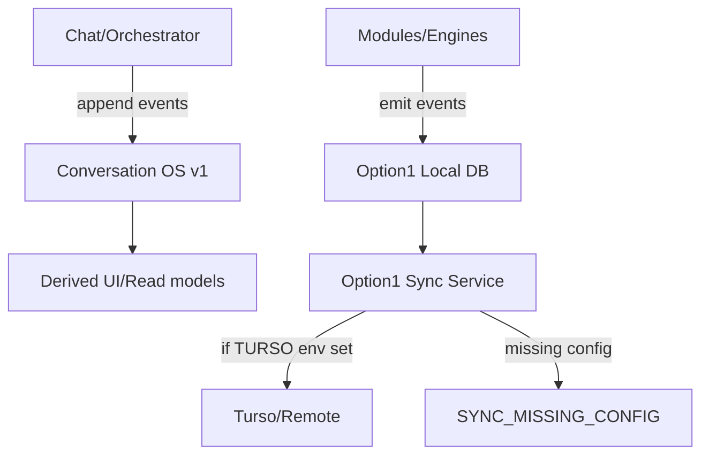
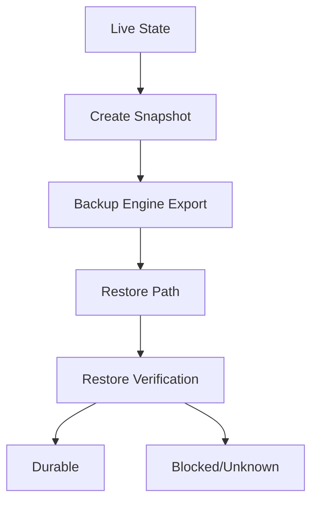
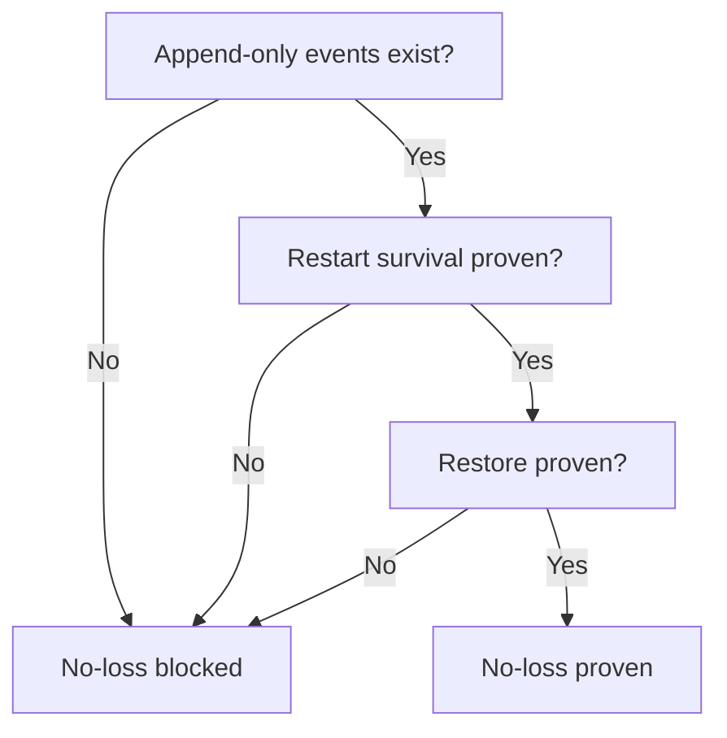

# LOCAL_PERSISTENCE_SPINE_SPEC

## 1. Purpose and scope
Define the canonical **local persistence spine** for TITANE∞ (chat/orchestrator/memory/modules) with append‑only truth, durable storage, and explicit sync/restore semantics. This is **local‑first** and **pre‑control‑plane**.

## 2. Canonical local store
- **Conversation OS v1 event store**: SQLite `conversation_os_v1.db` (append‑only events/snapshots/provider decisions/sources/failures).
- **Option1 local libsql store**: `option1_libsql_local.db` (events/snapshots/kv + sync meta) used for sync.
- **Memory Vault**: encrypted vault `vault/encrypted` storing `memory_files_db`.
- **LTM disk**: unified_memory LTM `.mem` files (disk persisted), index derived.
- **Backup engine**: archives under `TITANE_INFINITY/persistence` (export/restore).
- **Competing path**: MemoryOSConfig default `./data/memory/ltm` (must be reconciled).

## 3. Append-only truth model
- Conversation OS v1 tables are append‑only with SHA256; no update/delete in runtime paths.
- Option1 **events** table is append‑only; **snapshots** use upsert (not append‑only).
- Memory Vault uses overwrite semantics; canonical but not append‑only.
- Backups are immutable artifacts once exported.

## 4. Chat / orchestrator / module sync contract
- Chat/orchestrator writes through Conversation OS v1 (`persist_conversation_os_artifacts_with_path`).
- Provider decisions and sources append to Conversation OS v1 tables.
- Memory snapshots append when `CONVOS_MEMORY_SNAPSHOTS=true`.
- Modules/engines should either write through Option1 events or emit canonical events; any direct writes outside these must be mapped.
- Sync completion: Option1SyncService `sync_now` requires `TURSO_DATABASE_URL` + `TURSO_AUTH_TOKEN`, otherwise `SYNC_MISSING_CONFIG` and last_sync_ok=false.
- Failure semantics: no silent success; failures are explicit.

## 5. STM / MTM / LTM boundaries
- STM/MTM in memory (UnifiedMemory).
- LTM on disk at unified_memory LTM path; index derived.
- MemoryOSConfig default path differs; treat as **competing** until reconciled.

## 6. Derived vs canonical surfaces
- `data/cognitive/semantic_memory.db` is derived (index/search).
- UI dashboards, summaries, and derived snapshots are **not** canonical.
- `memory/backup/*.json.backup` are backup artifacts, not canon.

## 7. Snapshot / restore rules
- BackupEngine exports to `TITANE_INFINITY/persistence`.
- SnapshotManager is in‑memory metadata only; not canonical persistence.
- Restore proof required to claim durability.

## 8. No‑loss proof rule
No‑loss is proven only if append‑only events exist **and** restart survival + restore are verified. Otherwise, must report BLOCKED.

## 9. Autoheal update rule
Append a rule only with reproducible signature + bounded fix; never hide loss. If no safe rule: `NO_AUTOHEAL_UPDATE_NEEDED`.

## 10. Mermaid summary

### 10.1 Local persistence spine
```mermaid
flowchart TD
  U[User/Assistant Turns] --> C[Conversation OS v1 DB]
  C --> E[Events (append-only)]
  C --> S[Snapshots (append-only)]
  C --> P[Provider Decisions]
  C --> So[Sources]
  M[Memory Vault\nvault/encrypted] --> MV[MemoryDatabase]
  L[LTM Disk\nunified_memory/ltm] --> LI[LTM Index (derived)]
  O[Option1 Local DB\noption1_libsql_local.db] --> OE[Option1 events]
  O --> OS[Option1 snapshots (upsert)]
  C --> B[Backup Engine\nTITANE_INFINITY/persistence]
  M --> B
  L --> B
```

### 10.2 Chat / orchestrator / module sync flow


### 10.3 Snapshot / restore lifecycle


### 10.4 No‑loss verification


## 11. Mapping summary
Canonical sources: Conversation OS v1 DB, Option1 local DB, Memory Vault, unified_memory LTM. Derived surfaces are explicitly non‑canonical. Proof scenarios remain blocked until runtime execution.

## 12. Registry append rule
Append to `registry/proofpack-index.jsonl` when this lock produces a proof pack.

## 13. Reopen / escalation rule
If canonical persistence requires a redesign beyond bounded mapping/spec, switch to triage.

## 14. Rollback rule
`git restore -- docs/governance/LOCAL_PERSISTENCE_SPINE_SPEC.md`
