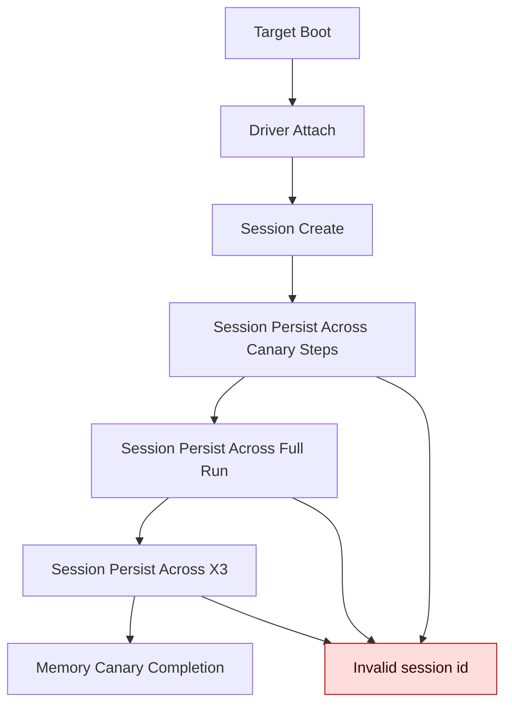
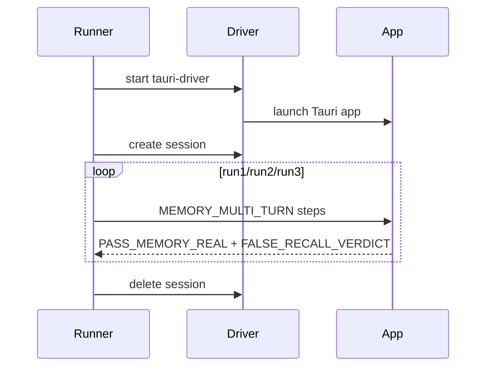
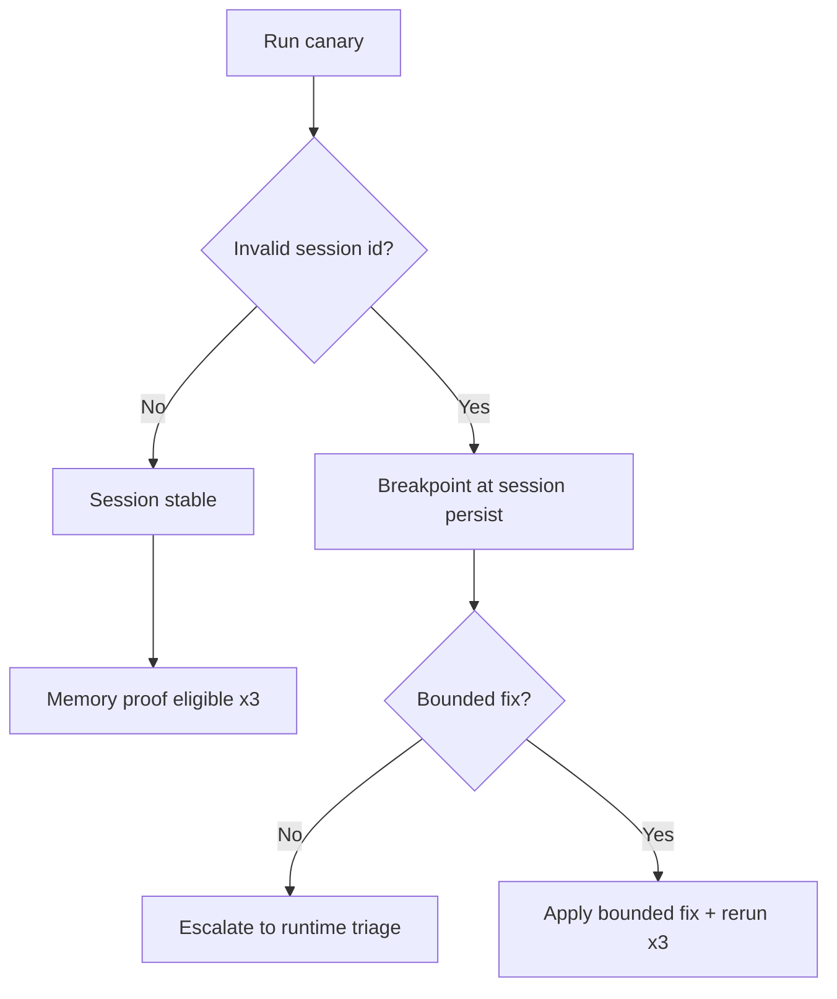

# RUNTIME_SESSION_STABILITY_SPEC

## 1. Purpose and scope
Define minimal runtime-session stability requirements for the **active Tauri target** so the memory canary can complete **x3** without session collapse. This is **pre-memory-seal** and not a desktop architecture redesign.

## 2. Active target and same-canary rule
- Target: Tauri desktop (embedded assets), WDIO/wry harness.
- Canary: `scripts/e2e/run-memory-chat-proof-ui.sh` with `TITANE_PROOF_SCENARIO=MEMORY_MULTI_TURN`.
- Rule: same target, same canary; no silent scenario or harness changes.

## 3. Session stability chain
- TARGET_BOOT -> DRIVER_ATTACH -> SESSION_CREATE -> SESSION_PERSIST_STEP -> SESSION_PERSIST_RUN -> SESSION_PERSIST_X3 -> CANARY_COMPLETE.

## 4. Breakpoint vocabulary
- BREAK_AT_TARGET_BOOT
- BREAK_AT_DRIVER_ATTACH
- BREAK_AT_SESSION_CREATE
- BREAK_AT_SESSION_PERSIST_STEP
- BREAK_AT_SESSION_PERSIST_RUN
- BREAK_AT_SESSION_PERSIST_X3
- BREAK_AT_CANARY_COMPLETION
- TARGET_MISMATCH
- UNKNOWN

## 5. Minimal fix rules
Only bounded, reversible stabilizations (no WRY/desktop architecture redesign, no provider/memory changes).

## 6. Autoheal update rule
- Append one rule only when a reproducible signature exists and the fix class is identified.
- Never suppress evidence or inflate retries.
- If no safe rule is justified: `NO_AUTOHEAL_UPDATE_NEEDED`.

## 7. Mermaid summary

### 7.1 Session stability flow

### 7.2 Canary execution lifecycle

### 7.3 Breakpoint decision

## 8. Mapping summary
- Owners: WDIO/wry harness (driver + session lifecycle), Tauri app runtime (target), `scripts/e2e/run-memory-chat-proof-ui.sh` (canary).
- Evidence sources: `reports/tauri_memory_e2e/<timestamp>/wdio-memory-chat-proof-ui.log` and `tauri-driver.log`.
- Current state: x3 runs with `MEMORY_PROOF_VERDICT=PASS_MEMORY_REAL` and no `invalid session id`.

## 9. Registry append rule
Append to `registry/proofpack-index.jsonl` when a new proof pack is created for this lock. Include timestamp, HEAD, lock name, verdict, surfaces, and proof pack path.

## 10. x3 seal condition
Memory canary seal requires three consecutive runs that complete without invalid session id or page crash and report `PASS_MEMORY_REAL`.

## 11. Escalation rule
If stability requires changes beyond small harness/attach stabilization, stop and triage.

## 12. Rollback rule
To revert this spec: `git restore -- docs/governance/RUNTIME_SESSION_STABILITY_SPEC.md`.
