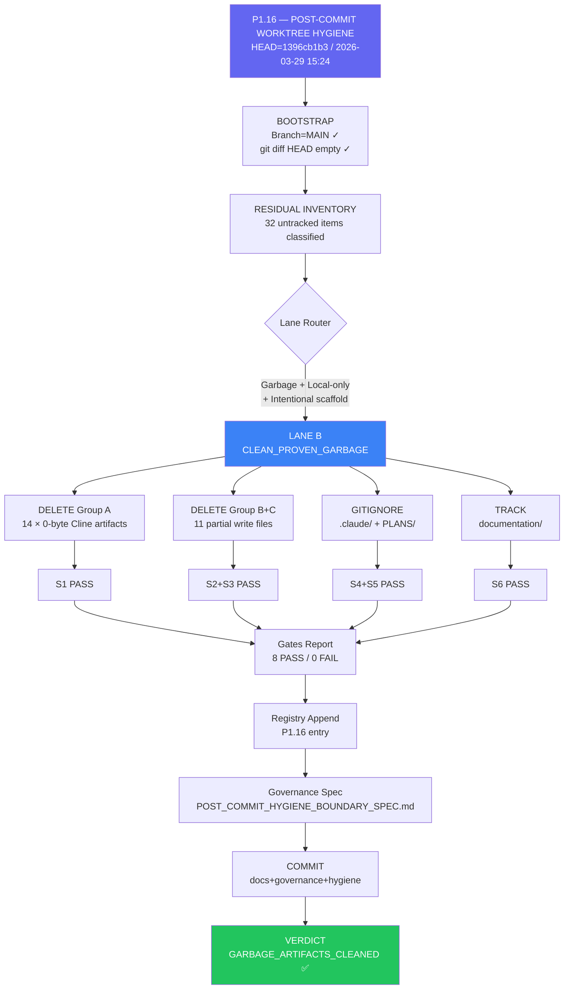

# P1.16 — MERMAID CHAIN DIAGRAM



---

## P1.14–P1.16 Full Chain

```mermaid
timeline
    title TITANE∞ Proof Chain 2026-03-29
    13:12 : P1.14 — EXTERNAL_SYNC_BLOCKED_ENV
    13:40 : P1.14b — EXTERNAL_SYNC_BLOCKED_ENV
    14:04 : P1.14c — EXTERNAL_SYNC_BLOCKED_ENV
    14:26 : P1.14d — EXTERNAL_SYNC_BLOCKED_ENV (terminal)
    14:38 : P1.15 — EXTERNAL_SYNC_BLOCKED_ENV (chain CLOSED)
    15:24 : P1.16 — GARBAGE_ARTIFACTS_CLEANED ✅
```
