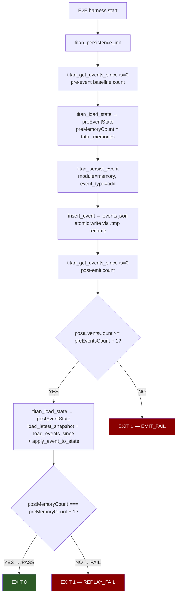
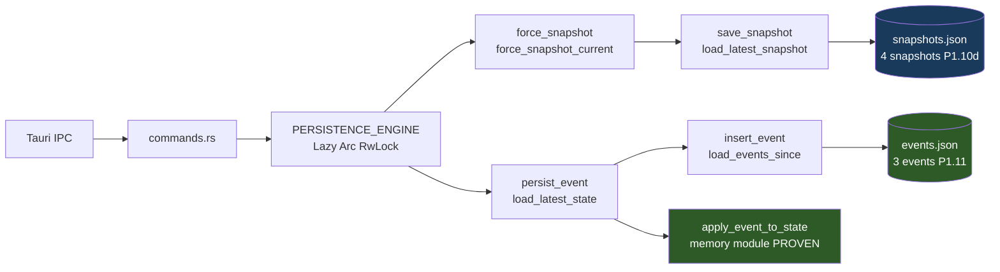
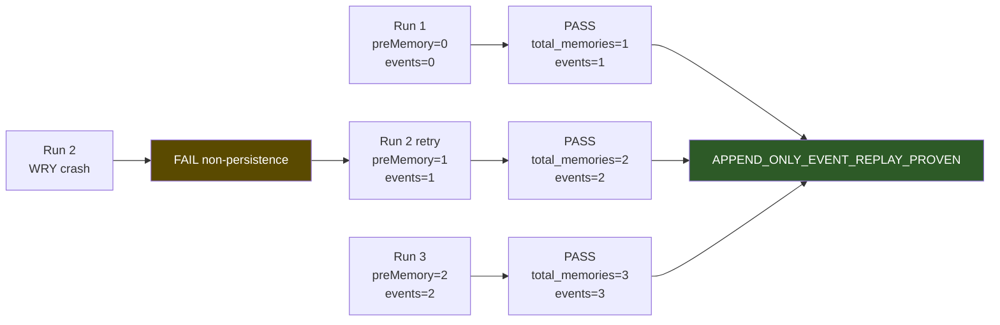
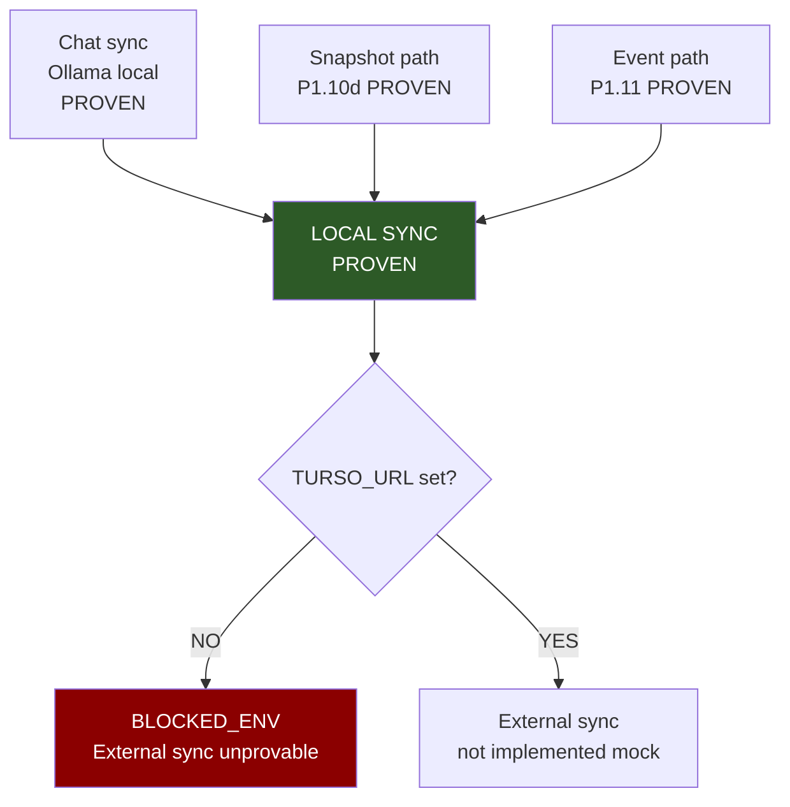

# MERMAID

## Event append + replay proof flow (runtime-proven P1.11)

## Full local persistence stack (proven components P1.10d + P1.11)

## X3 monotonic proof

## Sync boundary (local vs external)

