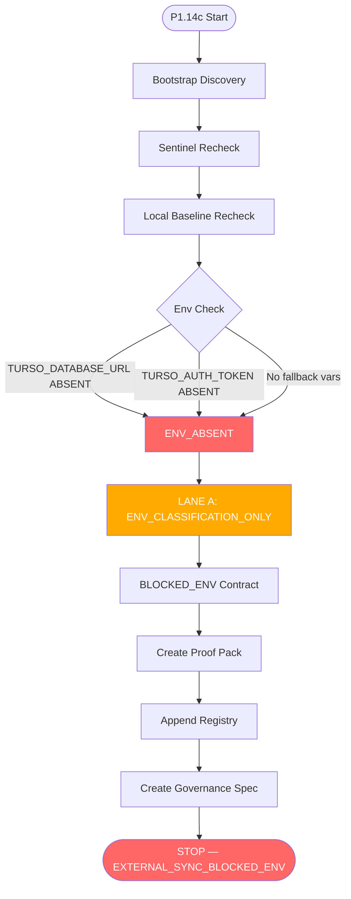
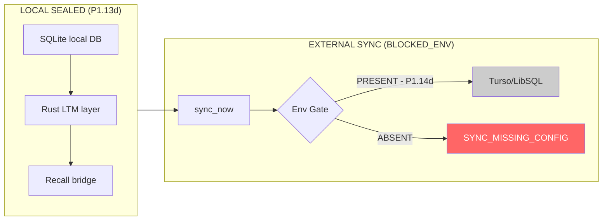
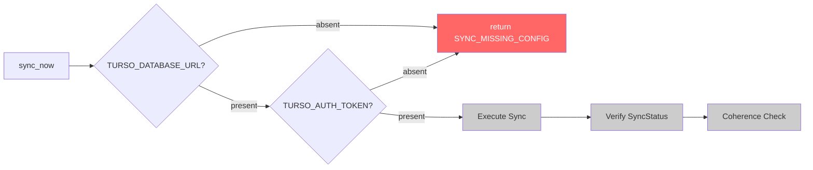

# P1.14c — MERMAID

## External Sync Runtime State (P1.14c)

```mermaid
flowchart TD
    START([P1.14c Start]) --> BS[Bootstrap Discovery]
    BS --> SC[Sentinel Recheck]
    SC --> LB[Local Baseline Recheck]
    LB --> ENV{Env Check}

    ENV -->|TURSO_DATABASE_URL ABSENT| EA[ENV_ABSENT]
    ENV -->|TURSO_AUTH_TOKEN ABSENT| EA
    ENV -->|No fallback vars| EA

    EA --> LANE_A[LANE A: ENV_CLASSIFICATION_ONLY]
    LANE_A --> BC[BLOCKED_ENV Contract]
    BC --> PP[Create Proof Pack]
    PP --> RS[Append Registry]
    RS --> GS[Create Governance Spec]
    GS --> STOP([STOP — EXTERNAL_SYNC_BLOCKED_ENV])

    style EA fill:#f66,color:#fff
    style STOP fill:#f66,color:#fff
    style LANE_A fill:#fa0,color:#fff
```

---

## Local Sealed Boundary

```mermaid
flowchart LR
    subgraph LOCAL ["LOCAL SEALED (P1.13d)"]
        direction TB
        LS[SQLite local DB]
        LTM[Rust LTM layer]
        RC[Recall bridge]
        LS --> LTM --> RC
    end

    subgraph EXTERNAL ["EXTERNAL SYNC (BLOCKED_ENV)"]
        direction TB
        SN[sync_now]
        EG{Env Gate}
        TU[Turso/LibSQL]
        SN --> EG
        EG -->|ABSENT| SMC[SYNC_MISSING_CONFIG]
        EG -->|PRESENT - P1.14d| TU
    end

    LOCAL --> SN

    style SMC fill:#f66,color:#fff
    style TU fill:#ccc,color:#333
```

---

## BLOCKED_ENV Gate Detail

```mermaid
flowchart LR
    sync_now --> check_url{TURSO_DATABASE_URL?}
    check_url -->|absent| BLOCKED[return SYNC_MISSING_CONFIG]
    check_url -->|present| check_token{TURSO_AUTH_TOKEN?}
    check_token -->|absent| BLOCKED
    check_token -->|present| EXEC[Execute Sync]
    EXEC --> VERIFY[Verify SyncStatus]
    VERIFY --> COHERENCE[Coherence Check]

    style BLOCKED fill:#f66,color:#fff
    style EXEC fill:#ccc,color:#333
    style VERIFY fill:#ccc,color:#333
    style COHERENCE fill:#ccc,color:#333
```

---

Note: Grey nodes are deferred to P1.14d when env is available.
