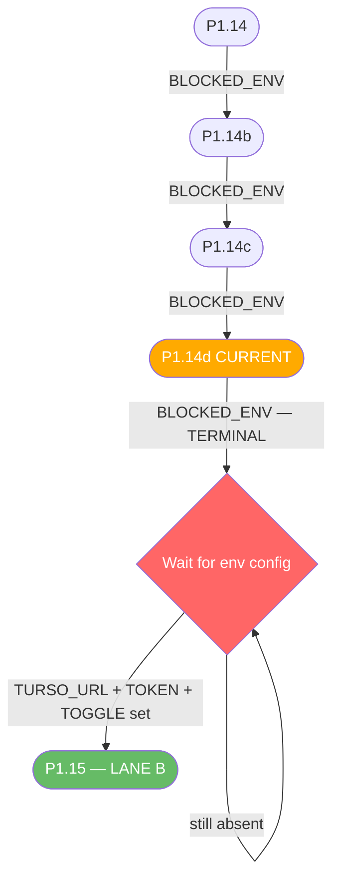
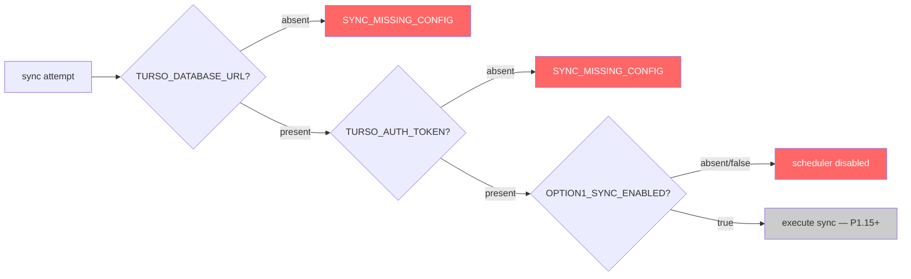
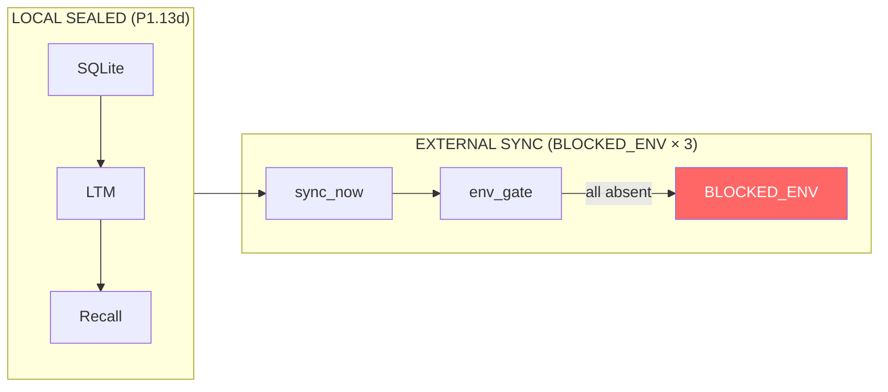

# P1.14d — MERMAID

## P1.14 Chain State

```mermaid
flowchart TD
    P114([P1.14]) -->|BLOCKED_ENV| P114b([P1.14b])
    P114b -->|BLOCKED_ENV| P114c([P1.14c])
    P114c -->|BLOCKED_ENV| P114d([P1.14d CURRENT])
    P114d -->|BLOCKED_ENV — TERMINAL| WAIT{Wait for env config}
    WAIT -->|TURSO_URL + TOKEN + TOGGLE set| P115([P1.15 — LANE B])
    WAIT -->|still absent| WAIT

    style P114d fill:#fa0,color:#fff
    style WAIT fill:#f66,color:#fff
    style P115 fill:#6b6,color:#fff
```

---

## Three-Gate Env Block (P1.14d)

```mermaid
flowchart LR
    A[sync attempt] --> G1{TURSO_DATABASE_URL?}
    G1 -->|absent| BLOCK1[SYNC_MISSING_CONFIG]
    G1 -->|present| G2{TURSO_AUTH_TOKEN?}
    G2 -->|absent| BLOCK2[SYNC_MISSING_CONFIG]
    G2 -->|present| G3{OPTION1_SYNC_ENABLED?}
    G3 -->|absent/false| BLOCK3[scheduler disabled]
    G3 -->|true| EXEC[execute sync — P1.15+]

    style BLOCK1 fill:#f66,color:#fff
    style BLOCK2 fill:#f66,color:#fff
    style BLOCK3 fill:#f66,color:#fff
    style EXEC fill:#ccc,color:#333
```

---

## Local Sealed vs External Blocked

```mermaid
flowchart LR
    subgraph LOCAL ["LOCAL SEALED (P1.13d)"]
        SQLite --> LTM --> Recall
    end
    subgraph EXTERNAL ["EXTERNAL SYNC (BLOCKED_ENV × 3)"]
        sync_now --> env_gate
        env_gate -->|all absent| BLOCKED[BLOCKED_ENV]
    end
    LOCAL --> sync_now
    style BLOCKED fill:#f66,color:#fff
```
