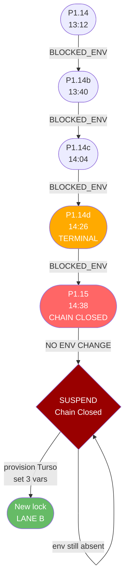
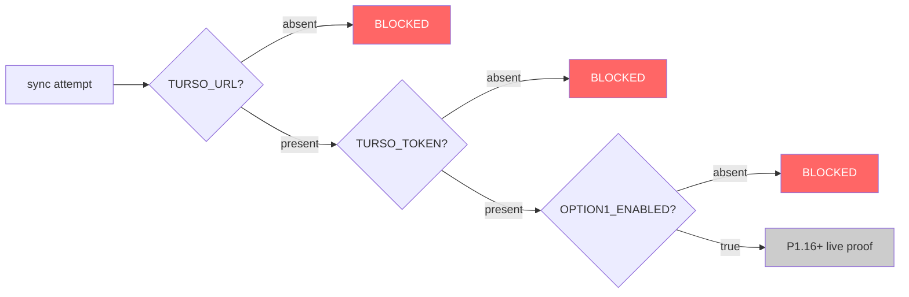

# P1.15 — MERMAID

## Complete P1.14–P1.15 Chain

```mermaid
flowchart TD
    P114([P1.14\n13:12]) -->|BLOCKED_ENV| P114b([P1.14b\n13:40])
    P114b -->|BLOCKED_ENV| P114c([P1.14c\n14:04])
    P114c -->|BLOCKED_ENV| P114d([P1.14d\n14:26\nTERMINAL])
    P114d -->|BLOCKED_ENV| P115([P1.15\n14:38\nCHAIN CLOSED])
    P115 -->|NO ENV CHANGE| SUSPEND{SUSPEND\nChain Closed}
    SUSPEND -->|provision Turso\nset 3 vars| NEXT([New lock\nLANE B])
    SUSPEND -->|env still absent| SUSPEND

    style P114d fill:#fa0,color:#fff
    style P115 fill:#f66,color:#fff
    style SUSPEND fill:#900,color:#fff
    style NEXT fill:#6b6,color:#fff
```

---

## 3-Gate Block (stable)

```mermaid
flowchart LR
    A[sync attempt] --> G1{TURSO_URL?} -->|absent| B1[BLOCKED]
    G1 -->|present| G2{TURSO_TOKEN?} -->|absent| B2[BLOCKED]
    G2 -->|present| G3{OPTION1_ENABLED?} -->|absent| B3[BLOCKED]
    G3 -->|true| EXEC[P1.16+ live proof]
    style B1 fill:#f66,color:#fff
    style B2 fill:#f66,color:#fff
    style B3 fill:#f66,color:#fff
    style EXEC fill:#ccc,color:#333
```
