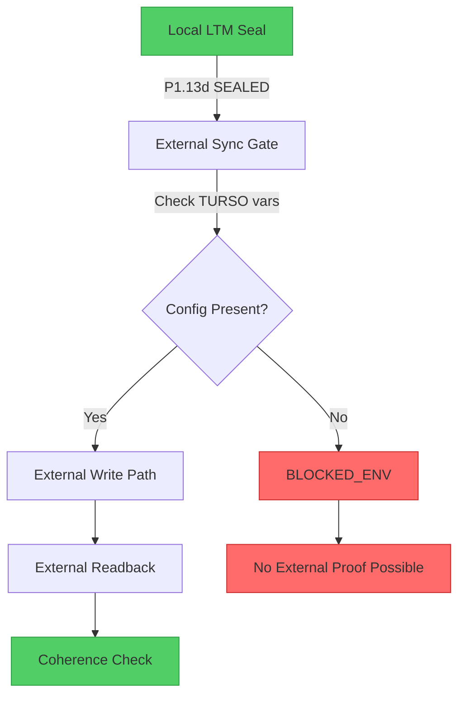

# MERMAID

## External Sync Boundary Diagram

## Current State

- **Local LTM**: SEALED ✅
- **External Sync Gate**: BLOCKED_ENV ❌
- **TURSO_DATABASE_URL**: ABSENT
- **TURSO_AUTH_TOKEN**: ABSENT
- **External Write**: NOT_EXECUTED
- **External Readback**: NOT_EXECUTED
- **Coherence**: NOT_EXECUTED