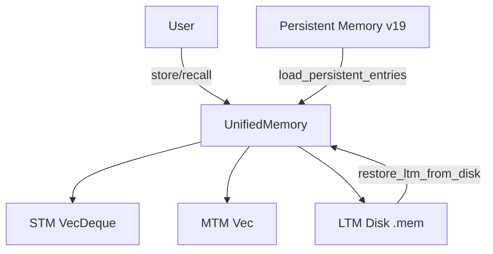
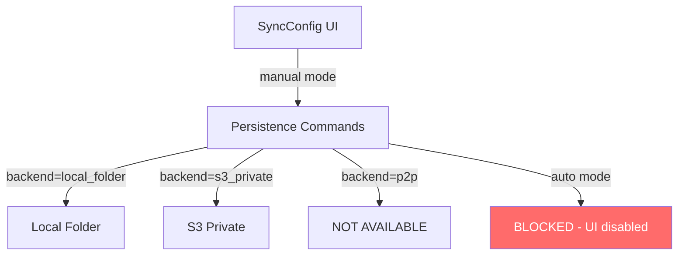
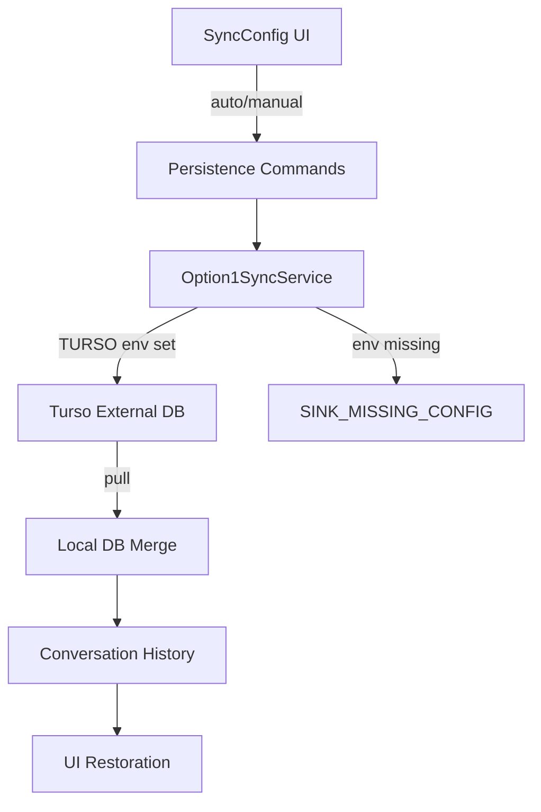
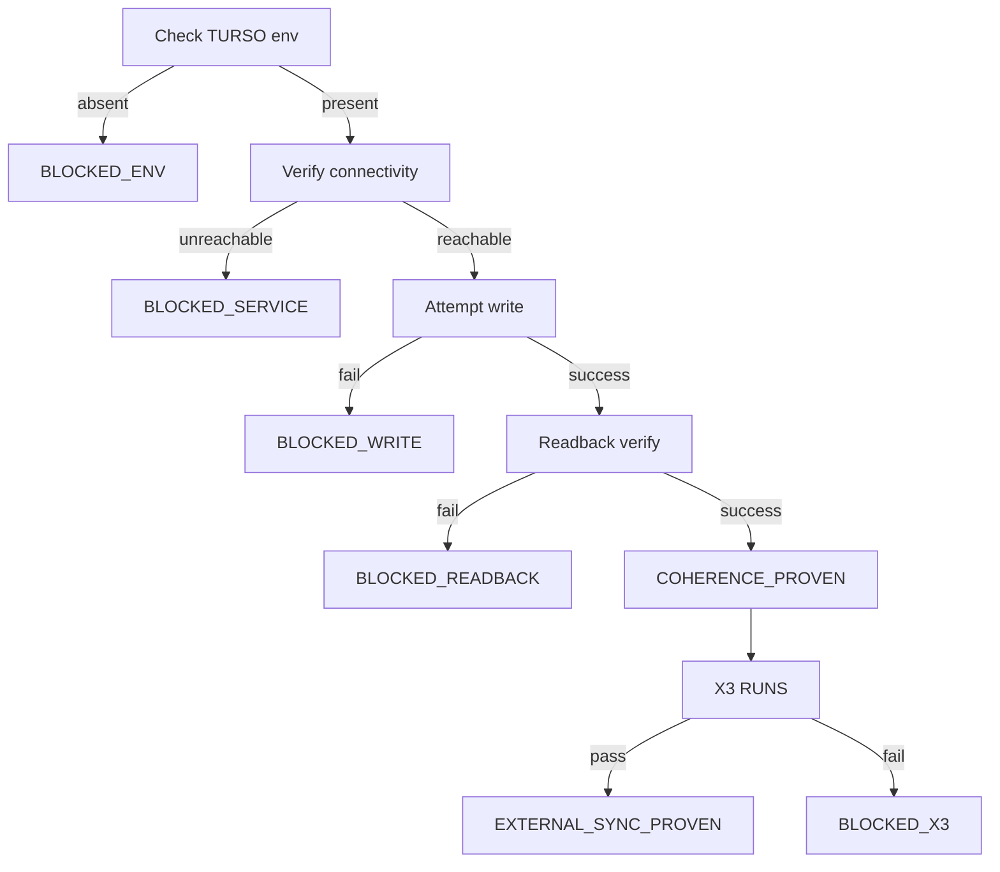

# 11_MERMAID

## Local Sealed Boundary

```mermaid
flowchart TD
    U[User] -->|store/recall| UM[UnifiedMemory]
    UM --> STM[STM VecDeque]
    UM --> MTM[MTM Vec]
    UM --> LTM[LTM Disk .mem]
    LTM -->|restore_ltm_from_disk| UM
    PM[Persistent Memory v19] -->|load_persistent_entries| UM
```

## External Sync Boundary (Current State)

```mermaid
flowchart TD
    S[SyncConfig UI] -->|manual mode| P[Persistence Commands]
    P -->|backend=local_folder| LF[Local Folder]
    P -->|backend=s3_private| S3[S3 Private]
    P -->|backend=p2p| NA[NOT AVAILABLE]
    P -->|auto mode| BL[BLOCKED - UI disabled]
    
    style BL fill:#ff6b6b,color:#fff
```

## External Sync Boundary (When Configured)

```mermaid
flowchart TD
    S[SyncConfig UI] -->|auto/manual| P[Persistence Commands]
    P --> OSS[Option1SyncService]
    OSS -->|TURSO env set| TDB[Turso External DB]
    OSS -->|env missing| SM[SINK_MISSING_CONFIG]
    
    TDB -->|pull| LB[Local DB Merge]
    LB --> CH[Conversation History]
    CH --> UI[UI Restoration]
```

## Readiness Path

```mermaid
flowchart TD
    A[Check TURSO env] -->|absent| B[BLOCKED_ENV]
    A -->|present| C[Verify connectivity]
    C -->|unreachable| D[BLOCKED_SERVICE]
    C -->|reachable| E[Attempt write]
    E -->|fail| F[BLOCKED_WRITE]
    E -->|success| G[Readback verify]
    G -->|fail| H[BLOCKED_READBACK]
    G -->|success| I[COHERENCE_PROVEN]
    I --> X3[X3 RUNS]
    X3 -->|pass| J[EXTERNAL_SYNC_PROVEN]
    X3 -->|fail| K[BLOCKED_X3]
```
