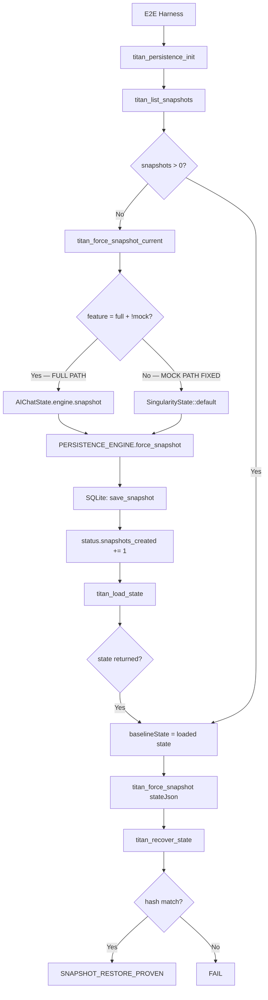
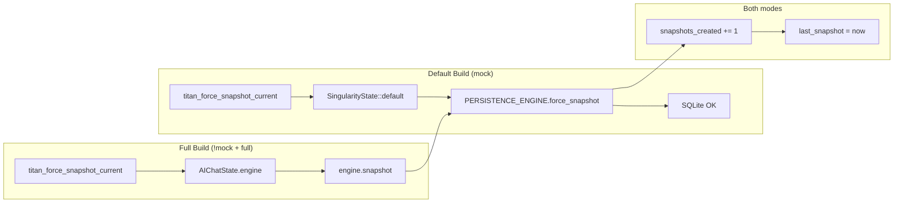

# MERMAID

## Snapshot Emission Flow (after fix)

```mermaid
flowchart TD
    A[E2E Harness] --> B[titan_persistence_init]
    B --> C[titan_list_snapshots]
    C --> D{snapshots > 0?}
    D -->|No| E[titan_force_snapshot_current]
    E --> F{feature = full + !mock?}
    F -->|Yes — FULL PATH| G[AIChatState.engine.snapshot]
    F -->|No — MOCK PATH FIXED| H[SingularityState::default]
    G --> I[PERSISTENCE_ENGINE.force_snapshot]
    H --> I
    I --> J[SQLite: save_snapshot]
    J --> K[status.snapshots_created += 1]
    K --> L[titan_load_state]
    L --> M{state returned?}
    M -->|Yes| N[baselineState = loaded state]
    D -->|Yes| N
    N --> O[titan_force_snapshot stateJson]
    O --> P[titan_recover_state]
    P --> Q{hash match?}
    Q -->|Yes| R[SNAPSHOT_RESTORE_PROVEN]
    Q -->|No| S[FAIL]
```

## Feature Gate Diagram

```mermaid
graph LR
    subgraph "Default Build (mock)"
        M1[titan_force_snapshot_current] --> M2[SingularityState::default]
        M2 --> M3[PERSISTENCE_ENGINE.force_snapshot]
        M3 --> M4[SQLite OK]
    end
    subgraph "Full Build (!mock + full)"
        F1[titan_force_snapshot_current] --> F2[AIChatState.engine]
        F2 --> F3[engine.snapshot]
        F3 --> M3
    end
    subgraph "Both modes"
        M3 --> X1[snapshots_created += 1]
        X1 --> X2[last_snapshot = now]
    end
```

## Status: Updated — reflects current post-fix runtime truth
