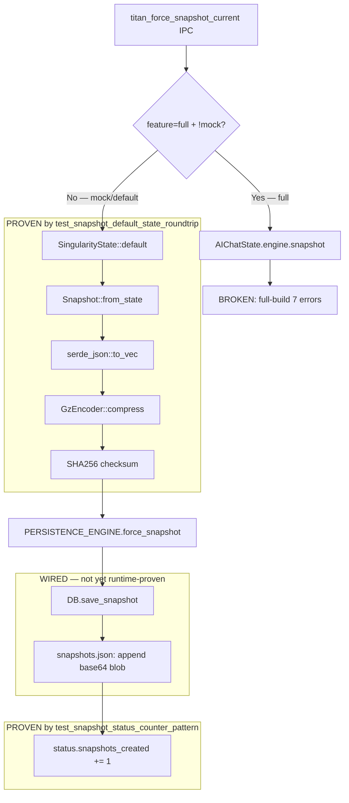
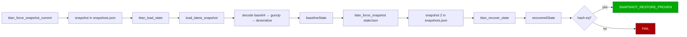

# MERMAID

## Proof Chain — Snapshot Emission (mock mode, PROVEN)

```mermaid
flowchart TD
    A[titan_force_snapshot_current IPC] --> B{feature=full + !mock?}
    B -->|No — mock/default| C[SingularityState::default]
    B -->|Yes — full| D[AIChatState.engine.snapshot]
    D --> E[BROKEN: full-build 7 errors]
    C --> F[Snapshot::from_state]
    F --> G[serde_json::to_vec]
    G --> H[GzEncoder::compress]
    H --> I[SHA256 checksum]
    I --> J[PERSISTENCE_ENGINE.force_snapshot]
    J --> K[DB.save_snapshot]
    K --> L[snapshots.json: append base64 blob]
    L --> M[status.snapshots_created += 1]

    subgraph "PROVEN by test_snapshot_default_state_roundtrip"
        C
        F
        G
        H
        I
    end

    subgraph "PROVEN by test_snapshot_status_counter_pattern"
        M
    end

    subgraph "WIRED — not yet runtime-proven"
        K
        L
    end
```

## Restore Flow (WIRED, not yet runtime-proven)

```mermaid
flowchart LR
    A[titan_force_snapshot_current] --> B[snapshot in snapshots.json]
    B --> C[titan_load_state]
    C --> D[load_latest_snapshot]
    D --> E[decode base64 → gunzip → deserialize]
    E --> F[baselineState]
    F --> G[titan_force_snapshot stateJson]
    G --> H[snapshot 2 in snapshots.json]
    H --> I[titan_recover_state]
    I --> J[recoveredState]
    J --> K{hash eq?}
    K -->|yes| L[SNAPSHOT_RESTORE_PROVEN]
    K -->|no| M[FAIL]

    style L fill:#0a0,color:#fff
    style M fill:#a00,color:#fff
```

## Status: Updated — reflects post-fix + proof-test runtime truth
