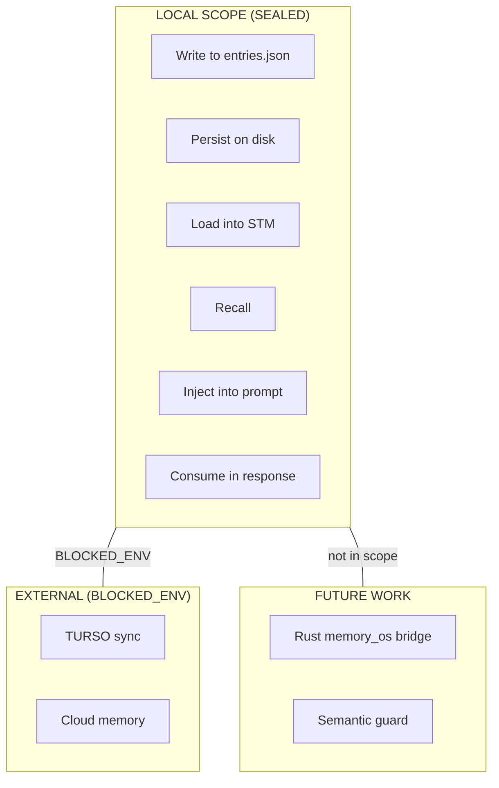
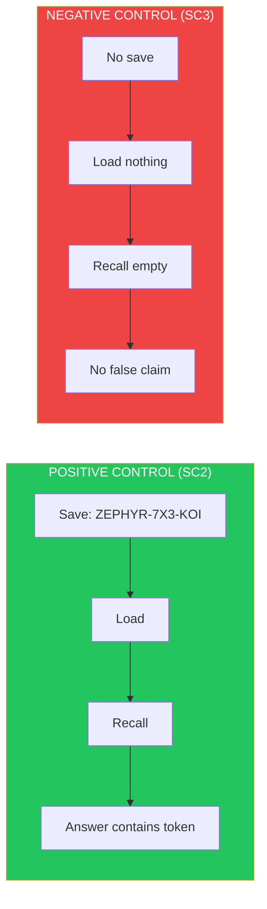

# MERMAID — LOCAL LTM SEAL CHAIN

## Local LTM Seal Chain (Proven)

```mermaid
flowchart LR
    A[User: Memorise fact] --> B[persist_explicit_memory_write_facts]
    B --> C[entries.json on disk]
    C --> D[load_persistent_entries]
    D --> E[UnifiedMemory STM]
    E --> F[unified_memory.recall]
    F --> G[MEMORY_CONTEXT injection]
    G --> H[conversation_generate]
    H --> I[Response metadata: memoryRecallIds]
    
    style A fill:#4a9eff,color:#fff
    style C fill:#22c55e,color:#fff
    style E fill:#22c55e,color:#fff
    style F fill:#22c55e,color:#fff
    style G fill:#22c55e,color:#fff
    style I fill:#22c55e,color:#fff
```

## Local vs External Boundary

```mermaid
flowchart TB
    subgraph LOCAL["LOCAL SCOPE (SEALED)"]
        W[Write to entries.json]
        P[Persist on disk]
        L[Load into STM]
        R[Recall]
        I[Inject into prompt]
        C[Consume in response]
    end
    
    subgraph EXTERNAL["EXTERNAL (BLOCKED_ENV)"]
        T[TURSO sync]
        Cloud[Cloud memory]
    end
    
    subgraph FUTURE["FUTURE WORK"]
        Rust[Rust memory_os bridge]
        Sem[Semantic guard]
    end
    
    LOCAL ---|BLOCKED_ENV| EXTERNAL
    LOCAL ---|not in scope| FUTURE
```

## Positive/Negative Control

```mermaid
flowchart LR
    subgraph POSITIVE["POSITIVE CONTROL (SC2)"]
        S[Save: ZEPHYR-7X3-KOI] --> L[Load] --> R[Recall] --> A[Answer contains token]
    end
    
    subgraph NEGATIVE["NEGATIVE CONTROL (SC3)"]
        N[No save] --> NL[Load nothing] --> NR[Recall empty] --> NA[No false claim]
    end
    
    style POSITIVE fill:#22c55e,color:#fff
    style NEGATIVE fill:#ef4444,color:#fff
```
