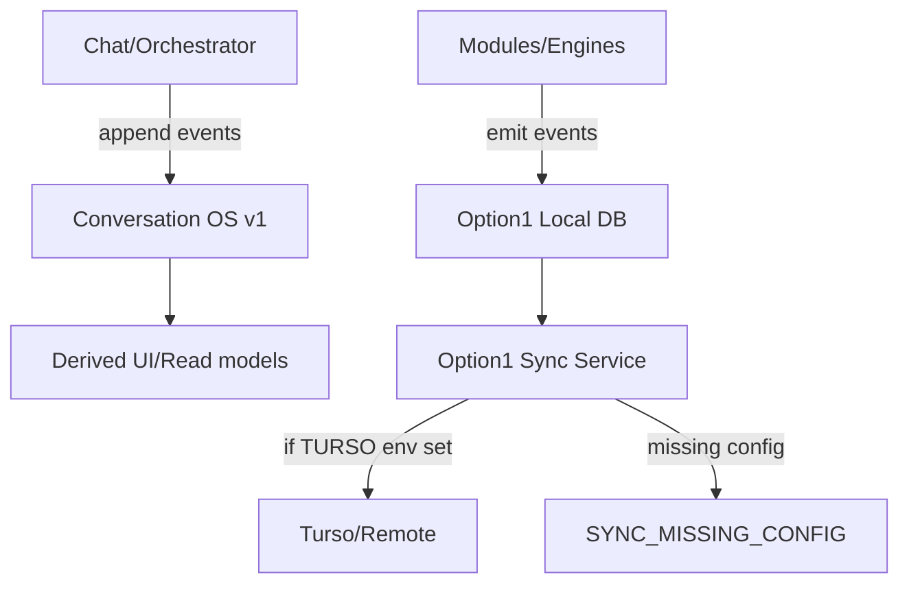
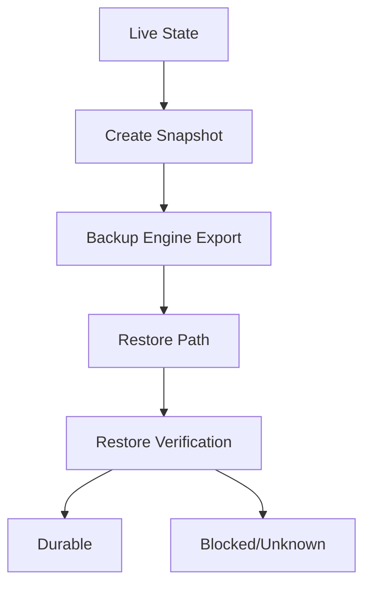
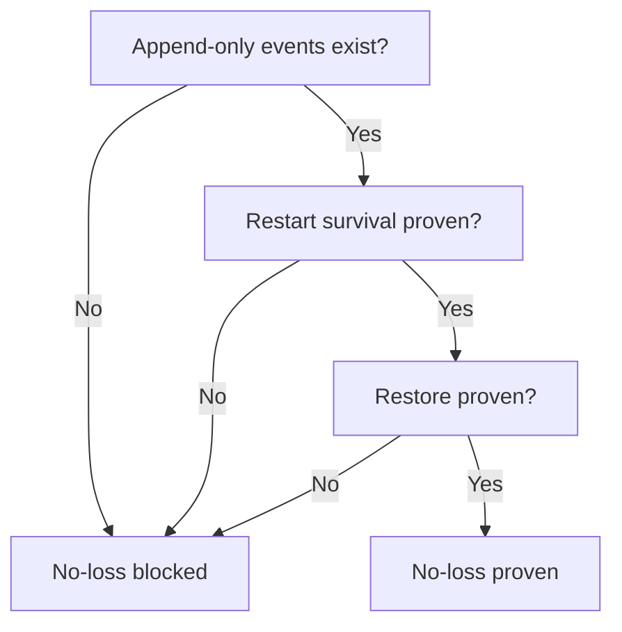

# MERMAID

## Local persistence spine
```mermaid
flowchart TD
  U[User/Assistant Turns] --> C[Conversation OS v1 DB]
  C --> E[Events (append-only)]
  C --> S[Snapshots (append-only)]
  C --> P[Provider Decisions]
  C --> So[Sources]
  M[Memory Vault\nvault/encrypted] --> MV[MemoryDatabase]
  L[LTM Disk\nunified_memory/ltm] --> LI[LTM Index (derived)]
  O[Option1 Local DB\noption1_libsql_local.db] --> OE[Option1 events]
  O --> OS[Option1 snapshots (upsert)]
  C --> B[Backup Engine\nTITANE_INFINITY/persistence]
  M --> B
  L --> B
```

## Chat/orchestrator/module sync flow


## Snapshot/restore lifecycle


## No-loss verification decision

