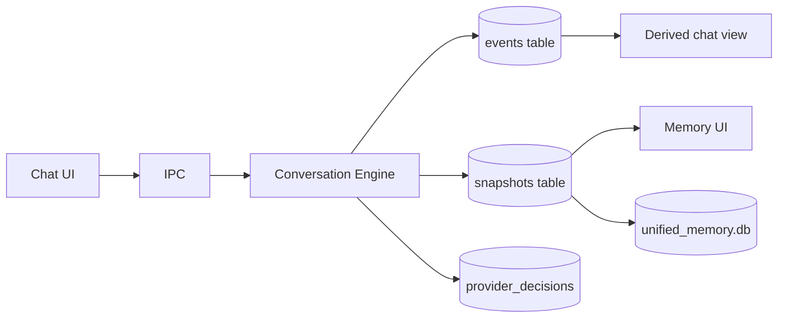
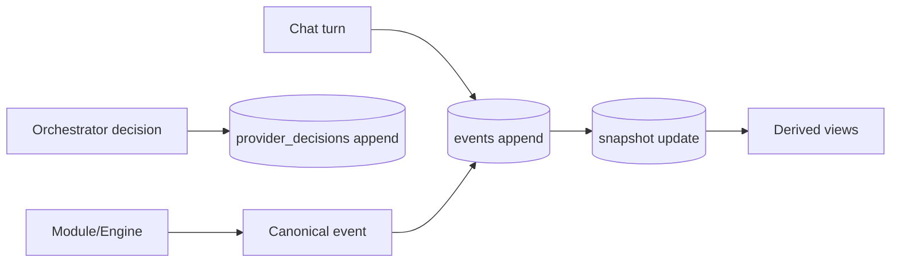
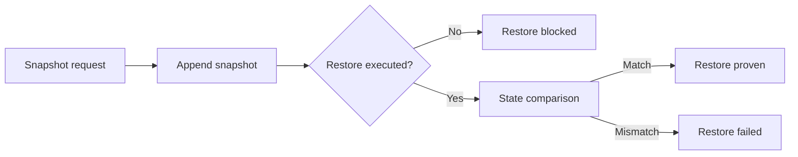
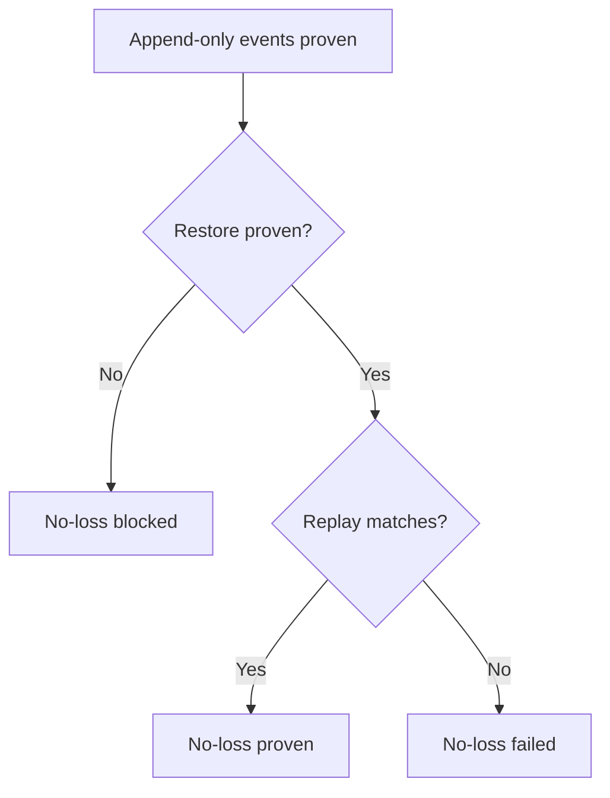

# LOCAL_PERSISTENCE_RUNTIME_PROOF_SPEC

## 1. Purpose and scope
This spec defines runtime proof for the local persistence spine on the active Tauri desktop target.
It is not a control-plane redesign and does not claim release-level sealing.

## 2. Active target and runtime proof boundary
- Target: Tauri desktop (wry), embedded assets, local Ollama lane.
- Canonical store resolution order: TITANE_CONVOS_DB_PATH -> XDG_DATA_HOME -> HOME -> data_local_dir.
- Runtime proof boundary: write -> append -> snapshot -> restart survival -> restore -> no-loss.

## 3. Canonical local store runtime truth
- Canonical runtime store: /home/titane-os/.local/share/TITANE_INFINITY/runtime/memory/conversation_os_v1.db
- Repo fallback exists at runtime/memory/conversation_os_v1.db but is not the active runtime store.

## 4. Append-only runtime truth
- events table is the append-only truth stream for chat turns.
- snapshots and provider_decisions append per request cycle.
- JSON files under ~/.local/share/TITANE_INFINITY/persistence are present but empty in this cycle and not canonical.

## 5. Chat / orchestrator / module runtime sync contract
- Chat: user_message + assistant_message must append to events.
- Orchestrator: decision payload must append to provider_decisions.
- Modules/engines: must emit canonical events or write through canonical paths; no parallel truth paths.
- Completion: event append + snapshot update + derived view update.
- Failure semantics: missing config or append failure must surface explicitly.

## 6. STM / MTM / LTM runtime persistence boundaries
- STM/MTM: events + snapshots in conversation_os_v1.db.
- LTM: unified_memory.db is derived; empty in this runtime proof.
- LTM remains non-canonical unless proven with runtime writes.

## 7. Snapshot / restore runtime proof rules
- Snapshot proof requires entry in snapshots table and consistent recovery.
- Restore proof requires a restart boundary and state comparison.
- If restore is not executable, mark BLOCKED and do not claim no-loss.
- Status (2026-03-28): restore/no-loss/sync closure not yet proven; restore path blocked (no runtime harness); sync config missing (TURSO).

## 8. No-loss proof rule
- No-loss is proven only if append-only events + snapshot restore + replay produce the same state.
- Partial evidence is not a seal.

## 9. Autoheal update rule
- Add a rule only if a bounded, reproducible persistence/sync signature is observed.
- Never hide data loss or suppress failed append/restore events.

## 10. Mermaid summary

## 11. Mapping summary
- Local persistence runtime spine map in proof pack.
- Sync ownership runtime matrix in proof pack.
- Canonical vs derived surfaces map in proof pack.
- Snapshot/restore and no-loss proof maps in proof pack.

## 12. Registry append rule
Append a new proof-pack entry to registry/proofpack-index.jsonl when this runtime proof pack is produced.

## 13. Reopen / escalation rule
Escalate to triage if restore/no-loss requires broad subsystem redesign.

## 14. Rollback rule
Rollback spec changes with: git restore -- docs/governance/LOCAL_PERSISTENCE_RUNTIME_PROOF_SPEC.md
