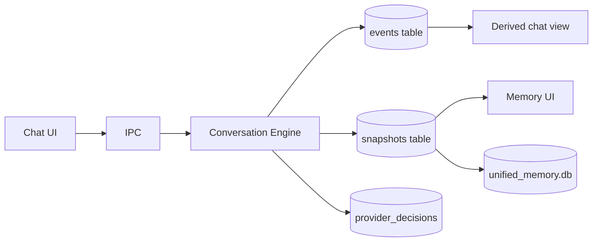
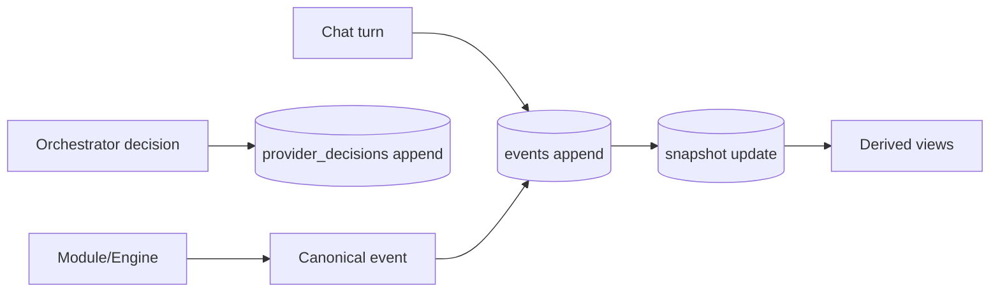
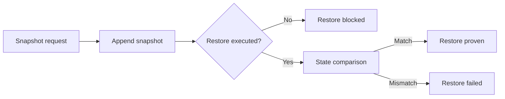
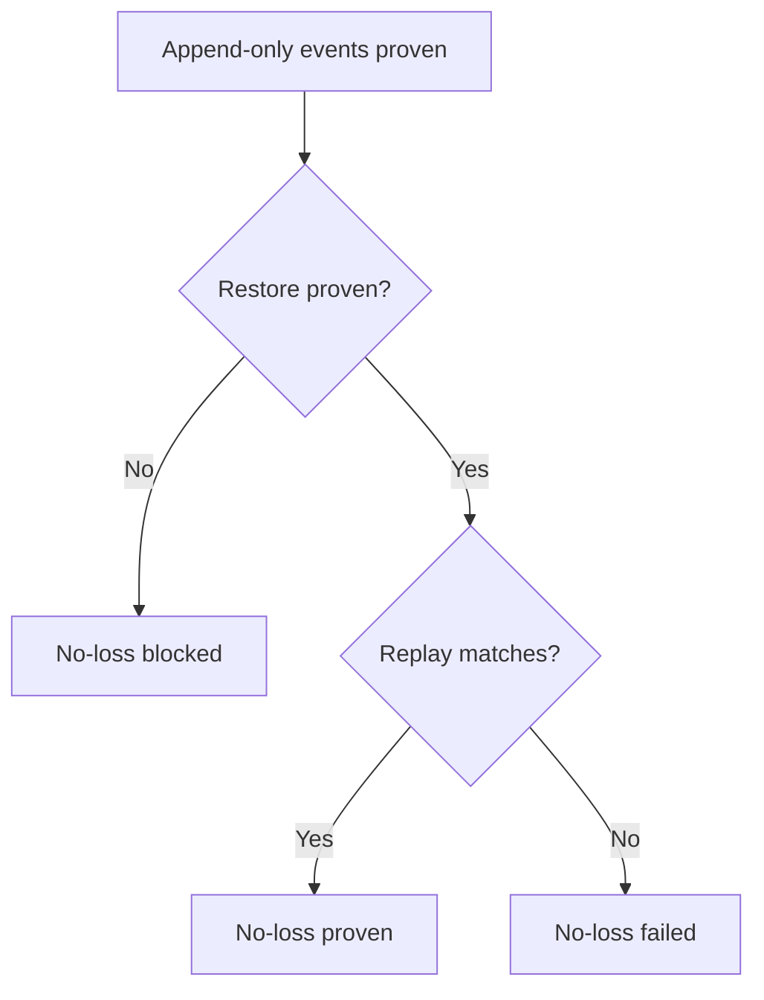
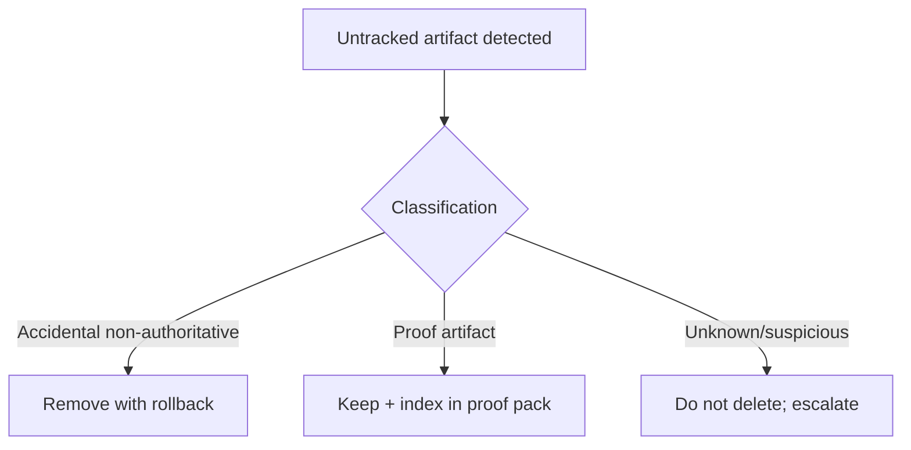

# MERMAID

```mermaid
flowchart LR
  UI[Chat UI] --> IPC[IPC]
  IPC --> CE[Conversation Engine]
  CE --> EV[(events table)]
  CE --> SNAP[(snapshots table)]
  CE --> PD[(provider_decisions)]
  EV --> VIEW[Derived chat view]
  SNAP --> MEMUI[Memory UI]
  SNAP --> LTM[(unified_memory.db)]
```

```mermaid
flowchart LR
  CHAT[Chat turn] --> EV2[(events append)]
  ORCH[Orchestrator decision] --> PD2[(provider_decisions append)]
  MOD[Module/Engine] --> EVT[Canonical event]
  EVT --> EV2
  EV2 --> SNAP2[(snapshot update)]
  SNAP2 --> VIEW2[Derived views]
```

```mermaid
flowchart LR
  START[Snapshot request] --> CREATE[Append snapshot]
  CREATE --> RESTORE{Restore executed?}
  RESTORE -->|No| BLOCKED[Restore blocked]
  RESTORE -->|Yes| CHECK[State comparison]
  CHECK -->|Match| OK[Restore proven]
  CHECK -->|Mismatch| FAIL[Restore failed]
```

```mermaid
flowchart TD
  A[Append-only events proven] --> B{Restore proven?}
  B -->|No| NL_BLOCK[No-loss blocked]
  B -->|Yes| C{Replay matches?}
  C -->|Yes| NL_OK[No-loss proven]
  C -->|No| NL_FAIL[No-loss failed]
```

```mermaid
flowchart TD
  DETECT[Untracked artifact detected] --> CLASSIFY{Classification}
  CLASSIFY -->|Accidental non-authoritative| REMOVE[Remove with rollback]
  CLASSIFY -->|Proof artifact| KEEP[Keep + index in proof pack]
  CLASSIFY -->|Unknown/suspicious| HOLD[Do not delete; escalate]
```
