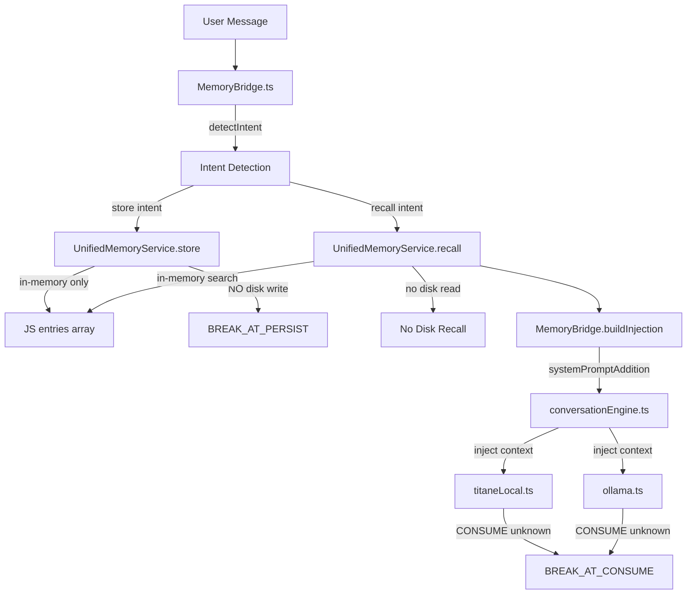
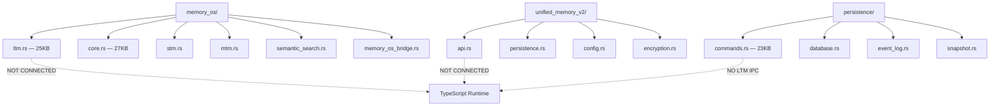
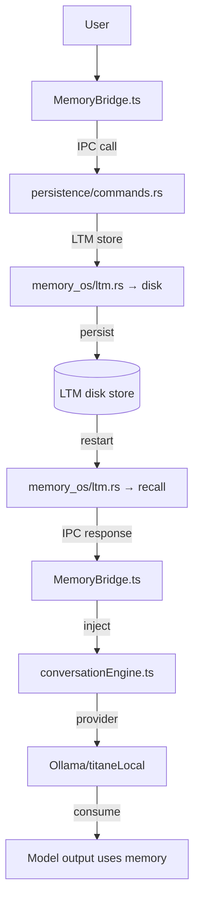

# MERMAID — P1.13

## LTM Runtime Path (Current — BROKEN at PERSIST)



## Rust LTM Modules (EXIST but NOT WIRED)



## Correct LTM Path (Not Yet Built)



## External Sync (BLOCKED_ENV)

```mermaid
flowchart TD
  REQ[Sync Request] --> CFG{TURSO config?}
  CFG -->|No| BLOCKED[BLOCKED_ENV]
  CFG -->|Yes| SYNC[Option1SyncService]
  SYNC -->|sync_now| TURSO[Turso Remote]
  BLOCKED -->|TURSO_DATABASE_URL missing| ENV1[NOT SET]
  BLOCKED -->|TURSO_AUTH_TOKEN missing| ENV2[NOT SET]