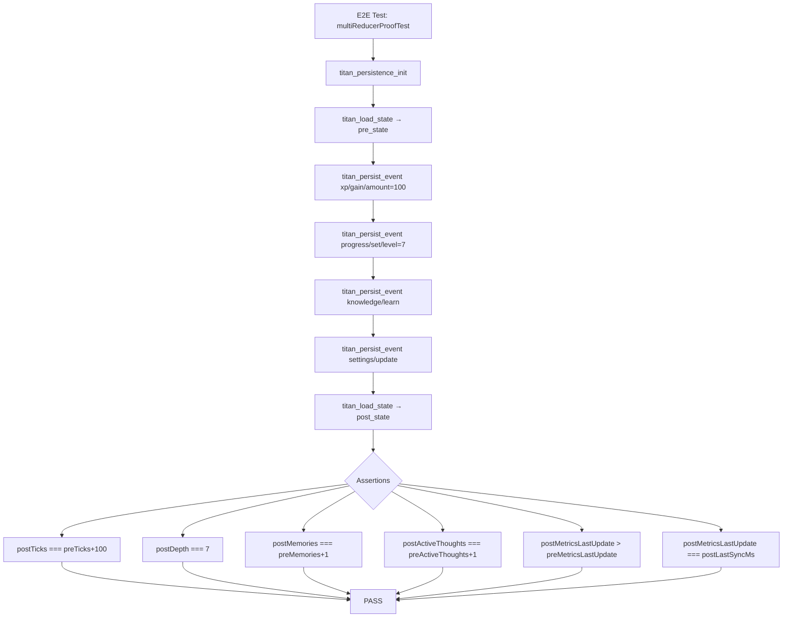
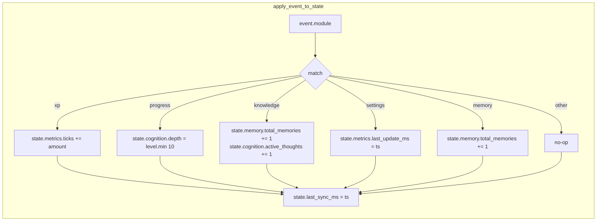
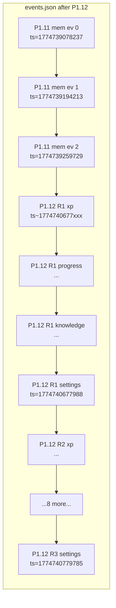

# MERMAID — P1.12

## Multi-reducer event replay flow

```mermaid
flowchart TD
    A[E2E Test: multiReducerProofTest] --> B[titan_persistence_init]
    B --> C[titan_load_state → pre_state]
    C --> D[titan_persist_event xp/gain/amount=100]
    D --> E[titan_persist_event progress/set/level=7]
    E --> F[titan_persist_event knowledge/learn]
    F --> G[titan_persist_event settings/update]
    G --> H[titan_load_state → post_state]
    H --> I{Assertions}
    I --> J[postTicks === preTicks+100]
    I --> K[postDepth === 7]
    I --> L[postMemories === preMemories+1]
    I --> M[postActiveThoughts === preActiveThoughts+1]
    I --> N[postMetricsLastUpdate > preMetricsLastUpdate]
    I --> O[postMetricsLastUpdate === postLastSyncMs]
    J & K & L & M & N & O --> P[PASS]
```

## Reducer dispatch flow (inside apply_event_to_state)

```mermaid
flowchart LR
    subgraph dispatch [apply_event_to_state]
        A[event.module] --> B{match}
        B --> |"xp"| C[state.metrics.ticks += amount]
        B --> |"progress"| D[state.cognition.depth = level.min 10]
        B --> |"knowledge"| E[state.memory.total_memories += 1\nstate.cognition.active_thoughts += 1]
        B --> |"settings"| F[state.metrics.last_update_ms = ts]
        B --> |"memory"| G[state.memory.total_memories += 1]
        B --> |other| H[no-op]
        C & D & E & F & G & H --> I[state.last_sync_ms = ts]
    end
```

## Cross-run accumulation

```mermaid
graph LR
    subgraph events_json [events.json after P1.12]
        E0[P1.11 mem ev 0\nts=1774739078237]
        E1[P1.11 mem ev 1\nts=1774739194213]
        E2[P1.11 mem ev 2\nts=1774739259729]
        E3[P1.12 R1 xp\nts~1774740677xxx]
        E4[P1.12 R1 progress\n...]
        E5[P1.12 R1 knowledge\n...]
        E6[P1.12 R1 settings\nts=1774740677988]
        E7[P1.12 R2 xp\n...]
        E8[...8 more...]
        E9[P1.12 R3 settings\nts=1774740779785]
    end
    E0 --> E1 --> E2 --> E3 --> E4 --> E5 --> E6 --> E7 --> E8 --> E9
```
