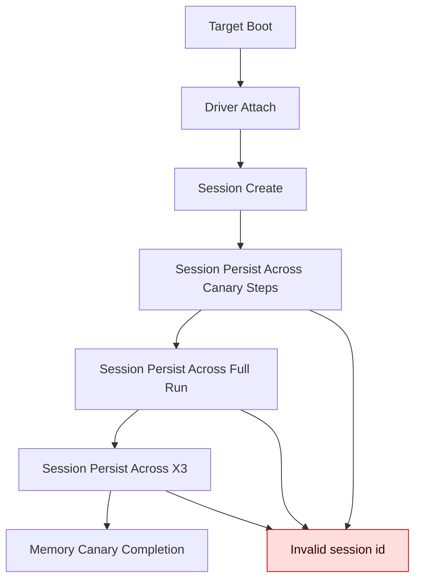
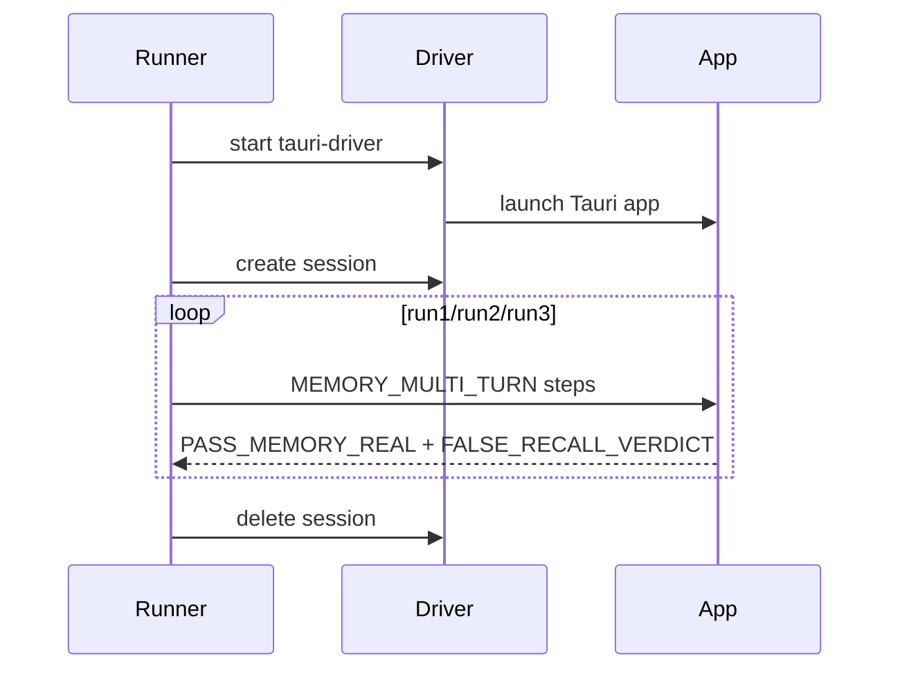
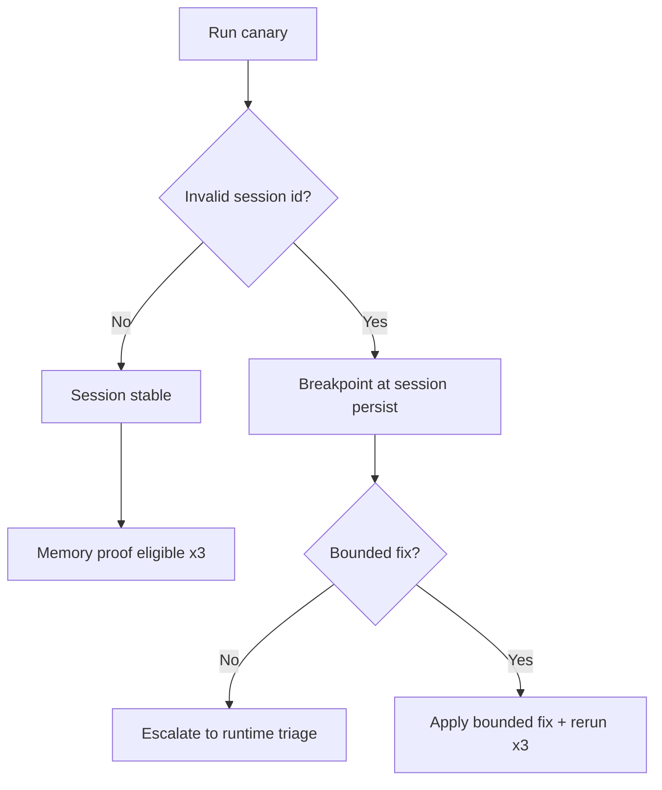

# MERMAID

## Session stability flow

```mermaid
flowchart TD
  A[Target Boot] --> B[Driver Attach]
  B --> C[Session Create]
  C --> D[Session Persist Across Canary Steps]
  D --> E[Session Persist Across Full Run]
  E --> F[Session Persist Across X3]
  F --> G[Memory Canary Completion]
  D --> X[Invalid session id]:::fail
  E --> X
  F --> X
  classDef fail fill:#ffdddd,stroke:#cc0000,color:#330000;
```

## Canary execution lifecycle

```mermaid
sequenceDiagram
  participant Runner
  participant Driver
  participant App
  Runner->>Driver: start tauri-driver
  Driver->>App: launch Tauri app
  Runner->>Driver: create session
  loop run1/run2/run3
    Runner->>App: MEMORY_MULTI_TURN steps
    App-->>Runner: PASS_MEMORY_REAL + FALSE_RECALL_VERDICT
  end
  Runner->>Driver: delete session
```

## Breakpoint decision

```mermaid
flowchart TD
  S[Run canary] --> Q{Invalid session id?}
  Q -- No --> P[Session stable]
  P --> M[Memory proof eligible x3]
  Q -- Yes --> B[Breakpoint at session persist]
  B --> F{Bounded fix?}
  F -- No --> Triage[Escalate to runtime triage]
  F -- Yes --> Fix[Apply bounded fix + rerun x3]
```
