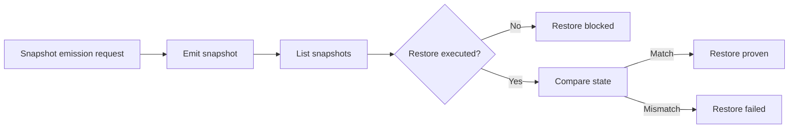
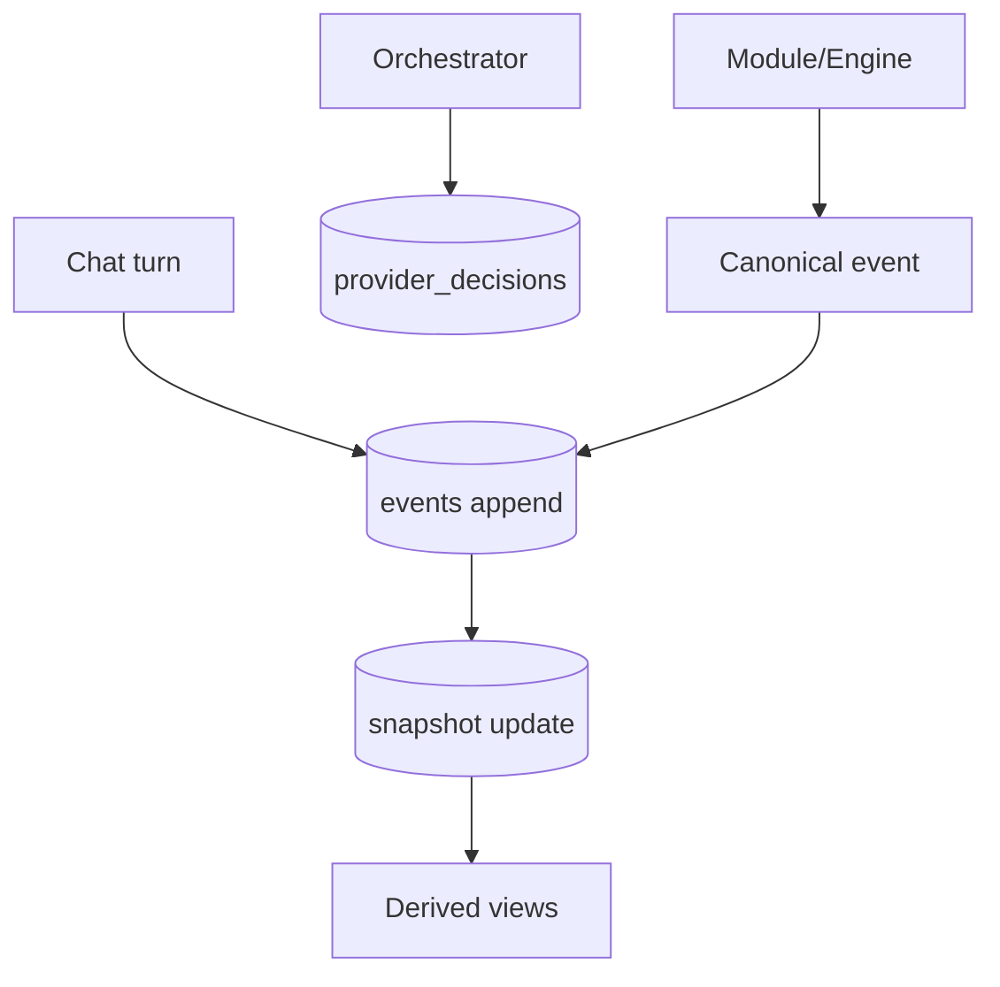
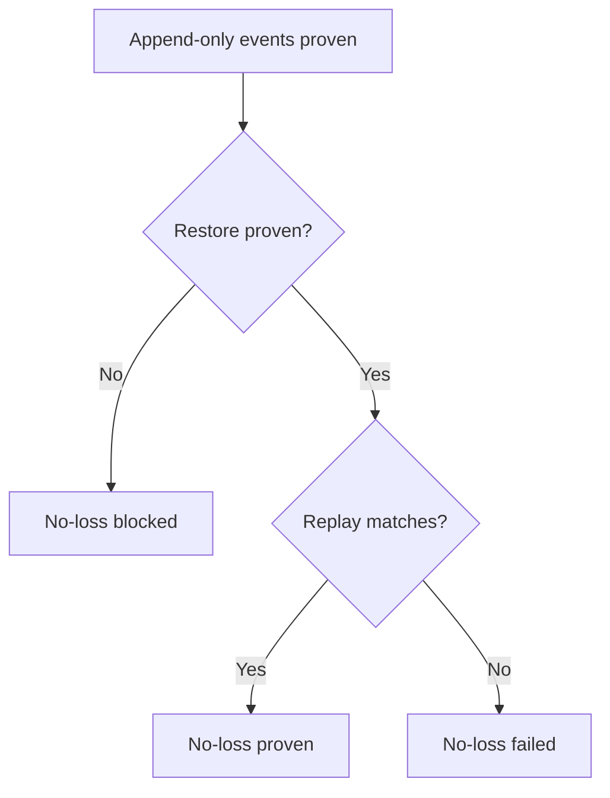
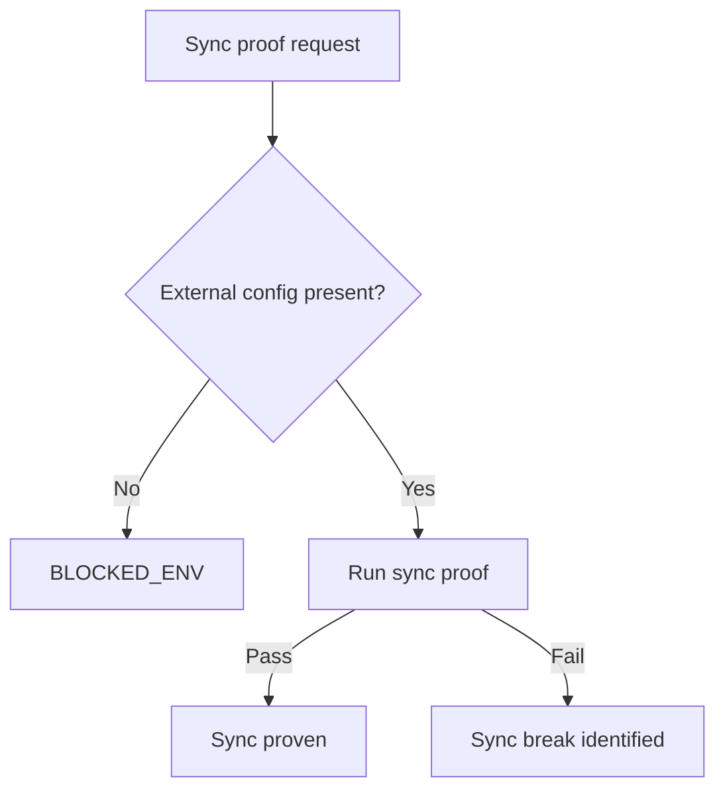

# MERMAID

## Snapshot emission → restore lifecycle

```mermaid
flowchart LR
  REQ[Snapshot emission request] --> EMIT[Emit snapshot]
  EMIT --> LIST[List snapshots]
  LIST --> RESTORE{Restore executed?}
  RESTORE -->|No| BLOCKED[Restore blocked]
  RESTORE -->|Yes| COMPARE[Compare state]
  COMPARE -->|Match| OK[Restore proven]
  COMPARE -->|Mismatch| FAIL[Restore failed]
```

## Chat / orchestrator / module sync flow

```mermaid
flowchart TD
  CHAT[Chat turn] --> EV[(events append)]
  ORCH[Orchestrator] --> PD[(provider_decisions)]
  MOD[Module/Engine] --> EVT[Canonical event]
  EVT --> EV
  EV --> SNAP[(snapshot update)]
  SNAP --> VIEW[Derived views]
```

## No-loss decision path

```mermaid
flowchart TD
  A[Append-only events proven] --> B{Restore proven?}
  B -->|No| NL_BLOCK[No-loss blocked]
  B -->|Yes| C{Replay matches?}
  C -->|Yes| NL_OK[No-loss proven]
  C -->|No| NL_FAIL[No-loss failed]
```

## External sync classification

```mermaid
flowchart TD
  START[Sync proof request] --> CFG{External config present?}
  CFG -->|No| BLOCKED[BLOCKED_ENV]
  CFG -->|Yes| PROOF[Run sync proof]
  PROOF -->|Pass| OK[Sync proven]
  PROOF -->|Fail| BREAK[Sync break identified]
```
