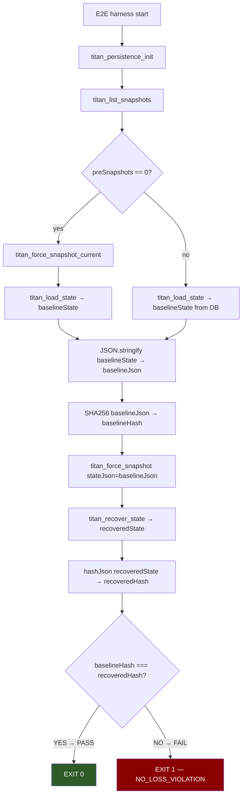
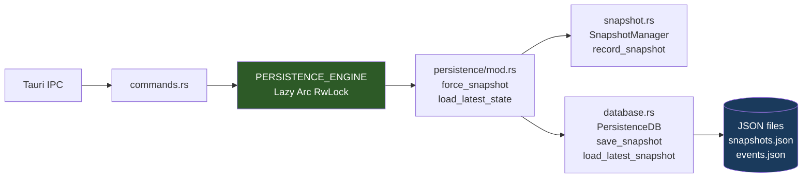
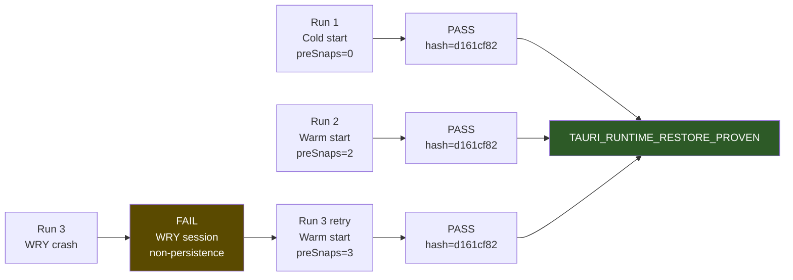

# MERMAID

## Restore proof flow (runtime-proven path)

```mermaid
flowchart TD
    A[E2E harness start] --> B[titan_persistence_init]
    B --> C[titan_list_snapshots]
    C --> D{preSnapshots == 0?}
    D -- yes --> E[titan_force_snapshot_current]
    E --> F[titan_load_state → baselineState]
    D -- no --> G[titan_load_state → baselineState from DB]
    F --> H[JSON.stringify baselineState → baselineJson]
    G --> H
    H --> I[SHA256 baselineJson → baselineHash]
    I --> J[titan_force_snapshot stateJson=baselineJson]
    J --> K[titan_recover_state → recoveredState]
    K --> L[hashJson recoveredState → recoveredHash]
    L --> M{baselineHash === recoveredHash?}
    M -- YES → PASS --> N[EXIT 0]
    M -- NO → FAIL --> O[EXIT 1 — NO_LOSS_VIOLATION]

    style N fill:#2d5a27,color:#fff
    style O fill:#8b0000,color:#fff
```

## Persistence layer architecture (proven components)

```mermaid
flowchart LR
    IPC[Tauri IPC] --> CMD[commands.rs]
    CMD --> ENG[PERSISTENCE_ENGINE\nLazy Arc RwLock]
    ENG --> MOD[persistence/mod.rs\nforce_snapshot\nload_latest_state]
    MOD --> SNAP[snapshot.rs\nSnapshotManager\nrecord_snapshot]
    MOD --> DB[database.rs\nPersistenceDB\nsave_snapshot\nload_latest_snapshot]
    DB --> FS[(JSON files\nsnapshots.json\nevents.json)]

    style FS fill:#1a3a5c,color:#fff
    style ENG fill:#2d5a27,color:#fff
```

## Run outcomes (X3)

```mermaid
flowchart LR
    R1[Run 1\nCold start\npreSnaps=0] --> P1[PASS\nhash=d161cf82]
    R2[Run 2\nWarm start\npreSnaps=2] --> P2[PASS\nhash=d161cf82]
    R3[Run 3\nWRY crash] --> F1[FAIL\nWRY session\nnon-persistence]
    F1 --> R3R[Run 3 retry\nWarm start\npreSnaps=3]
    R3R --> P3[PASS\nhash=d161cf82]
    P1 --> V[TAURI_RUNTIME_RESTORE_PROVEN]
    P2 --> V
    P3 --> V

    style V fill:#2d5a27,color:#fff
    style F1 fill:#5a4a00,color:#fff
```
